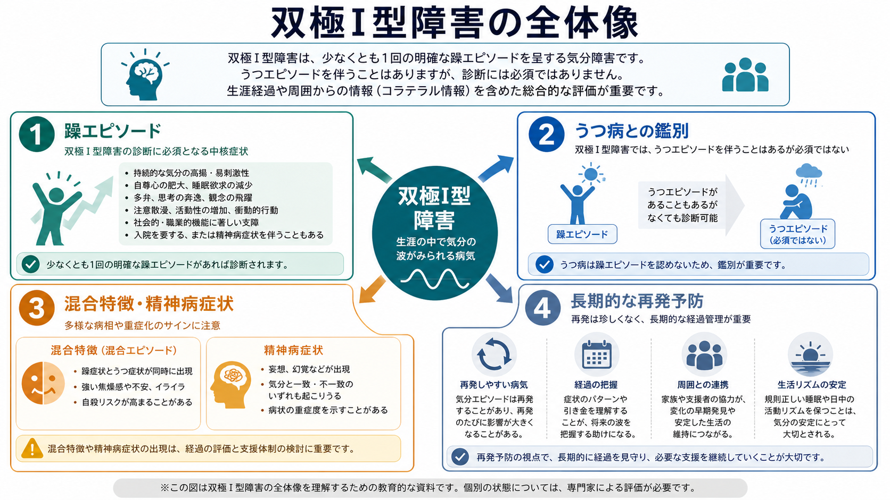
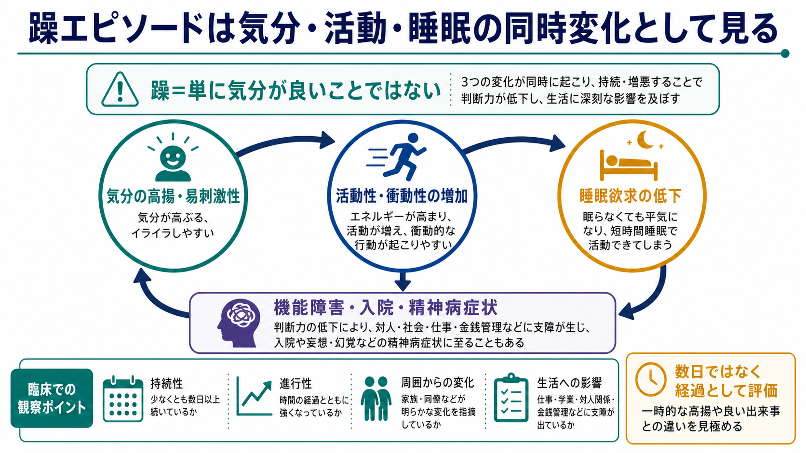
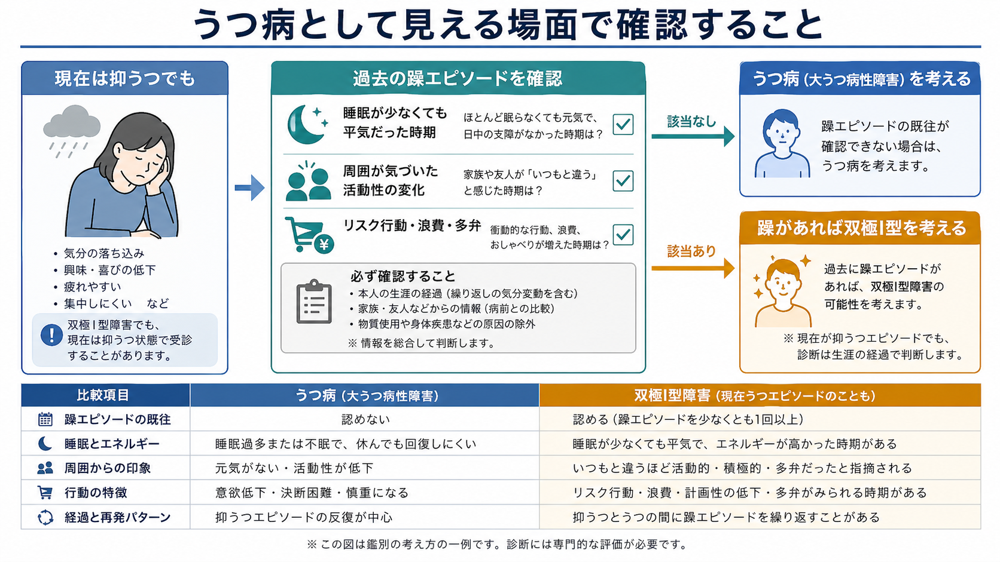

# 双極I型障害とは何か

## 要点

- 双極I型障害は、少なくとも1回の明確な躁エピソードを中核に診断される[[双極性障害とは何か|双極性障害]]である。大うつ病エピソードはしばしば起こるが、診断に必須ではない [1][2]。
- 躁エピソードは「気分が良い」だけではなく、気分、活動性、睡眠欲求、判断、対人・社会機能が同時に変化する状態である [2][3]。
- [[うつ病とは何か|うつ病]]として受診している時点だけを見ると見落とされやすい。鑑別では、過去の躁エピソード、周囲から見た活動性の変化、物質・身体疾患・薬剤の影響を確認する [4][5]。
- 治療や支援は急性躁、双極性うつ、維持療法、心理社会的支援、身体健康管理を含む長期的な計画として考える必要がある [4][5]。

## この記事で答える問い

この記事では、双極I型障害を「うつ病と似て見えることがあるが、躁エピソードの有無で診断上の意味が大きく変わる疾患」として説明する。主な問いは次の3つである。

1. 双極I型障害は、[[双極II型障害とは何か|双極II型障害]]やうつ病と何が違うのか。
2. 躁エピソードは、どのような症状の組み合わせとして理解すればよいのか。
3. うつ病として見える場面で、何を確認すると双極I型障害の見落としを減らせるのか。

## まず結論

双極I型障害を理解する最短の道は、「現在の気分」ではなく「生涯のエピソードの履歴」を見ることである。現在は抑うつ状態でも、過去に明確な躁エピソードがあれば、診断上はうつ病ではなく双極I型障害を考える。逆に、気分の波がある、怒りっぽい、元気な時期がある、というだけでは十分ではない。躁エピソードは、通常の性格や一時的な高揚を超えて、睡眠欲求の低下、活動性の増加、多弁、観念奔逸、誇大的な自信、注意散漫、リスク行動などがまとまって出現し、機能障害、入院、または精神病症状を伴いうる状態である [2][3]。

## 背景

双極性障害は、躁・軽躁・抑うつエピソードが時間経過の中で現れる気分障害群である。双極I型障害は、その中でも閾値を満たす躁エピソードがある型として位置づけられる [1][2]。国際的な疫学研究では、双極I型障害の生涯有病率はおよそ0.6%と推定され、双極スペクトラム全体ではより広い範囲の人が影響を受ける [6]。

臨床的に重要なのは、双極I型障害が最初から「躁」として見えるとは限らない点である。抑うつ、不安、不眠、身体症状、仕事や学業の不調として現れ、本人も周囲も「うつ病」と理解することがある。双極性障害では抑うつ症状の負担が大きく、うつ病との鑑別は診断上の中心問題になる [7][8]。

## 基本概念

### 双極I型障害

双極I型障害は、少なくとも1回の躁エピソードを必要とする。DSM-5 系の整理では、躁エピソードは持続的な気分高揚または易刺激性と、活動性・エネルギーの増加が少なくとも1週間続くか、入院を要するほど重い場合に考える。あわせて、誇大性、睡眠欲求の低下、多弁、観念奔逸、注意散漫、目標指向性活動の増加、浪費や危険運転などのリスク行動が評価される [2]。

ICD-11 でも、双極I型障害は1回以上の躁エピソードまたは混合エピソードにより定義され、典型的には躁・混合エピソードとうつエピソードが交代しながら経過すると説明される [1]。ここで重要なのは、抑うつエピソードが「よくある」が「必須ではない」という点である。

### 躁エピソードと軽躁エピソード

躁と軽躁は連続的に見えるが、診断上は重症度が異なる。軽躁では気分や活動性の変化は明らかでも、著しい社会的・職業的機能障害、入院、精神病症状は通常伴わない。精神病症状があれば軽躁ではなく躁として扱う [2]。この違いが、双極I型障害と[[双極II型障害とは何か|双極II型障害]]を分ける。

### うつ病との違い

抑うつエピソードだけを切り取ると、双極I型障害のうつ状態と[[うつ病とは何か|大うつ病性障害]]のうつ状態は似ている。診断を分けるのは、現在の抑うつ症状の見た目ではなく、過去に躁エピソードがあったかどうかである [8]。

| 観点 | 双極I型障害 | うつ病 |
|---|---|---|
| 中核 | 躁エピソードの既往 | 抑うつエピソード |
| 抑うつ | よくみられるが診断に必須ではない | 診断の中心 |
| 活動性の上昇 | 躁エピソードとして明確な機能変化を伴う | 通常は診断要件ではない |
| 鑑別の鍵 | 生涯経過、家族・周囲からの情報、物質・身体疾患の除外 | 抑うつ症状の持続・重症度・機能障害 |

## 仕組み

双極I型障害の「仕組み」は、単一の原因で説明できない。遺伝的脆弱性、睡眠・概日リズム、ストレス、報酬系、認知制御、物質使用、身体疾患、社会的文脈が相互に関わると考えられる [7]。ただし、この記事で最も重視する実践的な見方は、躁エピソードを次の3つの同時変化として捉えることである。

1つ目は、気分の変化である。高揚だけでなく、怒りっぽさ、焦燥、過敏さとして現れることがある。2つ目は、活動性と衝動性の変化である。話し続ける、予定を詰め込む、仕事や計画を急に広げる、浪費や性的リスク行動が増えるなど、本人の普段からの変化として観察される。3つ目は、睡眠欲求の低下である。単なる不眠ではなく、短時間睡眠でも平気で活動できてしまう状態が重要である [2][3]。

この3つが重なると、本人にとっては「調子が良い」「頭が回る」「自分は大丈夫」と感じられても、周囲にはいつもと違う多弁、強引な意思決定、対人摩擦、金銭管理の破綻として見えることがある。病識が低下しやすい点も、本人の自己申告だけでは見落としやすい理由になる [3][4]。

## 図解

うつ病との鑑別では、現在の抑うつ症状から始めるのではなく、過去のエピソードを時間軸で確認する。

確認したいのは、次のような「本人の普段からの変化」である。

- 眠らなくても平気で、活動量が増えた時期があったか。
- 家族、友人、同僚から「いつもと違う」「話が止まらない」「危なっかしい」と言われた時期があったか。
- その時期に浪費、性的リスク、無謀な運転、過大な計画、対人トラブルが増えたか。
- その変化は物質使用、薬剤、甲状腺疾患などの身体的要因で説明できないか。
- 精神病症状が気分エピソードとどう時間的に関係していたか。必要に応じて[[統合失調感情障害とは何か]]や[[統合失調症とは何か]]との鑑別を考える。

## 臨床・研究との接続

NICE は、成人が抑うつでプライマリケアを受診した場合、過去の過活動や脱抑制行動を尋ね、4日以上続いた場合には専門的評価を考えるよう推奨している [4]。また、疑い例の評価では、気分エピソード、行動変化、エピソード間症状、再発パターン、家族歴、社会機能、身体・精神の併存症、薬剤や副作用、治療歴を含む包括的評価と、家族・介護者からの補足情報が重視される [4]。

CANMAT/ISBD ガイドラインも、双極性障害は抑うつ発症が多く、軽躁・躁の時期に本人が援助を求めにくいこと、併存症が多いことから診断が遅れやすいと整理している。特に大うつ病性障害として誤診されることが多く、抑うつ症状だけでなく、発症年齢、エピソード数、家族歴、非定型的な抑うつ症状、精神病症状、混合特徴などを総合して評価する必要がある [5]。

治療については、個別の薬剤選択や用量をこの記事で指示することはしない。教育・研究目的の一般論としては、急性躁、双極性うつ、維持療法では推奨される薬物療法や心理社会的介入が異なり、長期的な再発予防、睡眠・生活リズム、身体健康、家族や支援者との協働が重要になる [4][5]。抗うつ薬単独で躁または軽躁が出現した場合の対応など、うつ病としての治療と双極性障害としての治療では発想が異なる点にも注意が必要である [4][5]。

研究面では、双極I型障害は単に症状名で定義されるだけでなく、発症年齢、再発、認知機能、併存症、身体疾患、社会機能、治療反応性を含む異質性の高い疾患群として扱われる [7][8]。客観的バイオマーカーだけで診断できる段階にはなく、現時点では丁寧な経過評価と行動観察が中心である [8]。

## よくある誤解

### 誤解1: 双極I型障害は「気分屋」のこと

日常的な気分の変わりやすさだけでは双極I型障害とはいえない。診断上問題になるのは、本人の普段から明らかに逸脱した気分・活動性・睡眠・判断の変化が、一定期間続き、機能障害やリスクを生むエピソードである [2][3]。

### 誤解2: 躁は必ず楽しい状態である

躁は高揚感として現れることもあるが、易刺激性、怒りっぽさ、焦燥、攻撃性として現れることもある。本人は苦痛よりも万能感や正当性を感じ、周囲が先に異変に気づくことがある [3]。

### 誤解3: うつ状態なら双極I型障害ではない

双極I型障害の人が抑うつ状態で受診することは珍しくない。過去の躁エピソードがあれば、現在の抑うつ症状だけでうつ病と判断するのは不十分である [4][8]。

### 誤解4: 質問紙だけで鑑別できる

質問紙は補助にはなりうるが、NICE は成人のプライマリケアで双極性障害を同定する目的で質問紙だけを用いることを推奨していない [4]。診断では、経過、機能変化、家族・周囲からの情報、物質・身体疾患の評価が必要である。

## 関連ノート

- [[双極性障害とは何か]]
- [[双極II型障害とは何か]]
- [[気分循環性障害とは何か]]
- [[うつ病とは何か]]
- [[非定型うつ病とは何か]]
- [[精神病性うつ病とは何か]]
- [[統合失調感情障害とは何か]]
- [[物質誘発性精神病とは何か]]
- [[薬剤性精神病とは何か]]

MOC 更新候補:

- [[MOC｜精神医学]]
- [[MOC｜症候学]]
- [[MOC｜総論・診断・面接]]
- [[MOC｜臨床実践・治療]]

## 理解チェック

1. 双極I型障害の診断で、抑うつエピソードよりも決定的に重要なエピソードは何か。
2. 「眠れない」と「睡眠欲求が低下している」は、臨床的にどのように違うか。
3. うつ病として受診している人に、過去の躁エピソードを確認するためにはどのような情報源が役立つか。
4. 精神病症状がある場合、[[統合失調症とは何か|統合失調症]]や[[統合失調感情障害とは何か|統合失調感情障害]]との鑑別で何を時間軸として見るべきか。

## 未解決問題

- 双極I型障害とうつ病を、初回抑うつエピソードの段階で高精度に区別する客観的指標はまだ確立していない。
- 混合特徴、併存する不安症・物質使用症、発達特性、睡眠リズムの乱れがある場合、エピソード境界の評価は難しくなる。
- 治療反応性や再発リスクを個別に予測するモデルは研究が進んでいるが、日常臨床で単独の判断根拠にできる段階ではない。

## 参考文献

[1] World Health Organization. ICD-11 for Mortality and Morbidity Statistics: 6A60 Bipolar type I disorder. https://icd.who.int/browse/2025-01/mms/en#1456478153

[2] Jain A, Mitra P. Bipolar Disorder. *StatPearls*. NCBI Bookshelf. Updated 2023. https://www.ncbi.nlm.nih.gov/books/NBK558998/

[3] National Institute of Mental Health. Bipolar Disorder. https://www.nimh.nih.gov/health/publications/bipolar-disorder

[4] National Institute for Health and Care Excellence. Bipolar disorder: assessment and management. NICE guideline CG185. Last updated 2025-09-02. https://www.nice.org.uk/guidance/cg185

[5] Yatham LN, Kennedy SH, Parikh SV, et al. Canadian Network for Mood and Anxiety Treatments and International Society for Bipolar Disorders 2018 guidelines for the management of patients with bipolar disorder. *Bipolar Disorders*. 2018;20(2):97-170. https://doi.org/10.1111/bdi.12609

[6] Merikangas KR, Jin R, He JP, et al. Prevalence and correlates of bipolar spectrum disorder in the World Mental Health Survey Initiative. *Archives of General Psychiatry*. 2011;68(3):241-251. https://doi.org/10.1001/archgenpsychiatry.2011.12

[7] McIntyre RS, Berk M, Brietzke E, et al. Bipolar disorders. *The Lancet*. 2020;396(10265):1841-1856. https://doi.org/10.1016/S0140-6736(20)31544-0

[8] Phillips ML, Kupfer DJ. Bipolar disorder diagnosis: challenges and future directions. *The Lancet*. 2013;381(9878):1663-1671. https://doi.org/10.1016/S0140-6736(13)60989-7
