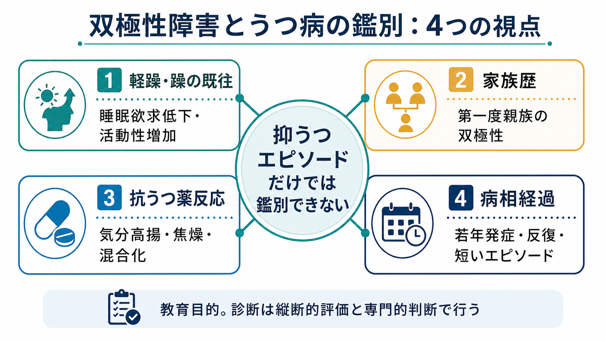
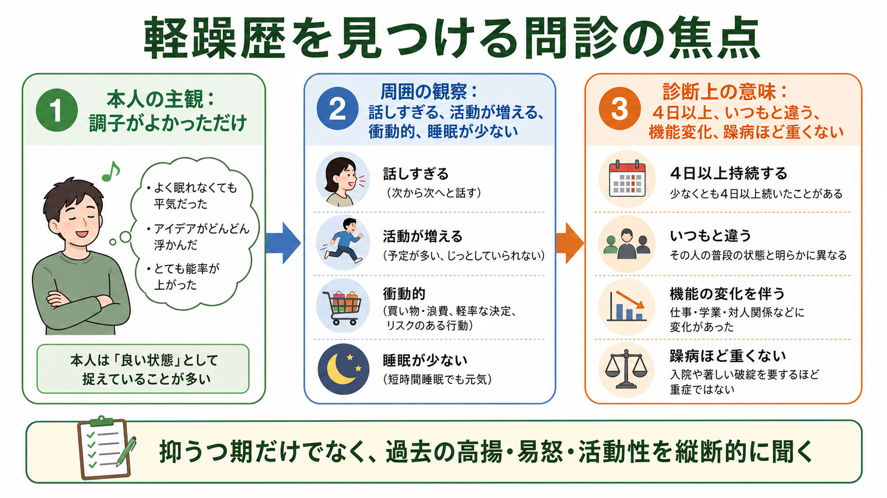

# 双極性障害とうつ病はどう鑑別するのか

## 要点

- 抑うつエピソードの症状だけで、[[双極性障害とは何か|双極性障害]]とうつ病を安定して見分けることは難しい。鍵は、過去の[[軽躁病エピソードとは何か|軽躁病エピソード]]・[[躁病エピソードとは何か|躁病エピソード]]、家族歴、抗うつ薬反応、病相経過を縦断的に統合することである[1][2]。
- 双極I型では躁病エピソードがあれば診断上の分岐点になる。双極II型では軽躁が本人には「調子がよかった時期」と記憶されやすく、周囲からの情報が重要になる[1][2]。
- 双極性を疑う手がかりには、若年発症、反復エピソード、短い抑うつエピソード、混合症状、精神病症状、精神運動制止、第一度親族の双極性障害、抗うつ薬による高揚・焦燥・混合化などがある[5][6][7][8]。
- ただし、個々の手がかりは診断を単独で決めない。この記事は教育・研究目的の整理であり、個別の診断や治療指示ではない。

## この記事で答える問い

1. 抑うつ状態で受診した人に、なぜ双極性障害の確認が必要なのか。
2. 軽躁歴・家族歴・抗うつ薬反応・病相経過を、どのように鑑別に使うのか。
3. 「うつ病らしい症状」と「双極性を疑う手がかり」をどう統合するのか。
4. 鑑別で起こりやすい誤解は何か。

## まず結論

双極性障害とうつ病の鑑別は、「いま抑うつ症状があるか」ではなく、「これまでの気分エピソードが単極性の抑うつだけで説明できるか」を問う作業である。現在の抑うつ症状が、悲哀、興味低下、睡眠・食欲変化、罪責感、希死念慮などを含む点は[[うつ病とは何か]]と重なる。したがって、現在症状だけを横断的に見ても、双極性うつ病と単極性うつ病はしばしば似て見える[5][6]。

鑑別の中心は、過去に「いつもと違う高揚または易怒」「活動性増加」「睡眠欲求低下」「話しすぎ」「考えが速い」「浪費・性的逸脱・無謀な行動」などが、持続的なエピソードとしてあったかを確認することである[1][2]。加えて、家族歴、抗うつ薬での気分高揚や焦燥、反復性・若年発症・短い病相といった経過を重ねると、診断仮説の確度が上がる。

## 背景

双極性障害は、躁病・軽躁病・抑うつエピソードを含む気分障害である。実臨床では、初回受診時に抑うつ症状だけが前景に立つことが多く、本人も軽躁期を病的な変化として語らないことがある。そのため、[[精神科初診で何を確認するべきか|初診評価]]では、抑うつの重症度だけでなく、これまでの気分変化の全体像を聞く必要がある[2][3]。

NICE は、双極性障害が疑われる場合、気分、過活動や脱抑制、エピソード間の症状、誘因、再発パターン、家族歴、治療歴、身体合併症、薬剤、社会機能を含む包括的評価を推奨している[2]。これは[[現病歴はどのように構造化するべきか|現病歴の構造化]]そのものであり、単発の症状チェックではなく、人生史の中で病相を並べる作業である。

## 基本概念

### 単極性うつ病

ここでいううつ病は、躁病または軽躁病エピソードを伴わない抑うつ障害を指す。大うつ病エピソードでは、抑うつ気分、興味・喜びの低下、睡眠・食欲変化、精神運動変化、疲労感、罪責感、集中困難、希死念慮などが一定期間持続し、生活機能を損なう[1]。

### 双極性うつ病

双極性うつ病とは、双極性障害の経過中に現れる抑うつエピソードである。抑うつ期だけを見ると単極性うつ病に似るが、過去または将来に躁病・軽躁病がある点が異なる。[[双極性障害とは何か]]で扱うように、双極I型では躁病エピソードが、双極II型では軽躁病エピソードと大うつ病エピソードが診断上の中核になる[1][3]。

### 軽躁は「よい時期」として語られやすい

軽躁は、入院や著しい社会的破綻を伴わないことがある。そのため本人は「元気だった」「仕事が進んだ」「眠らなくても平気だった」と肯定的に語ることがある。しかし、周囲から見ると、話が止まらない、怒りっぽい、衝動的な出費が増える、対人トラブルが増える、活動が過剰になるなど、普段と違う変化として観察されることがある[1][2]。

## 仕組み

### 1. 軽躁歴を探す

最も重要なのは、躁病または軽躁病の既往を確認することである。質問は「躁状態になったことがありますか」だけでは不十分である。本人がその言葉を知らない、あるいは病的と認識していないことがあるからである。

実際には、次のように具体化して聞く。

| 観点 | 聞き方の例 | 双極性を疑う所見 |
|---|---|---|
| 睡眠 | 「ほとんど眠らなくても平気な時期はありましたか」 | 睡眠不足ではなく、睡眠欲求そのものが低い |
| 活動性 | 「急に予定や仕事を増やした時期はありますか」 | 普段より明らかに活動的で、周囲も変化に気づく |
| 気分 | 「気分が高すぎる、または怒りっぽすぎる時期はありましたか」 | 高揚だけでなく易怒性も含める |
| 衝動性 | 「浪費、性行動、運転、投資、けんかが増えた時期はありますか」 | 本人や周囲に不利益が残る |
| 周囲の反応 | 「家族や友人から心配されたことはありますか」 | 本人より周囲の観察が有用なことがある |

### 2. 家族歴を見る

双極性障害には家族集積性がある。第一度親族に双極性障害、躁病・軽躁病らしいエピソード、反復する入院、リチウムなど気分安定薬の使用歴がある場合、診断仮説は変わりうる[2][4]。ただし、家族歴がないから双極性障害を否定できるわけではない。家族内で診断名が共有されていない、治療歴が不明、アルコールや対人トラブルとして語られている場合もある。

### 3. 抗うつ薬反応を見る

抗うつ薬で気分が高揚する、眠らなくても活動できる、焦燥・易怒性・衝動性が増す、混合状態のように抑うつと賦活が同時に出る場合、双極性を疑う手がかりになる[7][8]。ISBD タスクフォースは、双極性障害における抗うつ薬使用では躁転・軽躁転・混合状態への移行が重要な安全性課題であると整理している[8]。

一方で、抗うつ薬が効かなかった、あるいは一時的に効いたという情報だけで双極性障害とは言えない。[[治療抵抗性うつ病とは何か|治療抵抗性うつ病]]、服薬量・期間の不足、併存症、睡眠、物質使用、身体疾患、心理社会的ストレスでも治療反応は変わる。大切なのは「反応の有無」より、「高揚・混合化・急な不安定化があったか」である。

### 4. 病相経過を見る

双極性を疑う経過として、若年発症、抑うつエピソードの反復、短いエピソード、急速交代、産後発症、季節性、混合症状、精神病症状、精神運動制止、強い機能低下などが挙げられる[5][6][7]。Leonpacher らの大規模解析では、双極I型と大うつ病を分ける特徴として、妄想、精神運動制止、強い機能障害、混合症状の多さ、エピソード数の多さ、短いエピソード長、うつ病治療後に「high」を経験した歴史が示された[7]。

このような特徴は確率を動かす情報であって、診断を機械的に決める基準ではない。[[鑑別診断とは何か]]で重要なのは、所見を足し算するだけでなく、時間軸と代替説明を検討することである。

## 図解

図1は、鑑別の全体像を「軽躁・躁の既往」「家族歴」「抗うつ薬反応」「病相経過」の4視点に整理している。抑うつ症状そのものではなく、エピソードの縦断的な配置を見ることが要点である。

図2は、軽躁歴を拾うための問診焦点を示している。本人の主観では「調子がよかっただけ」と語られる時期でも、周囲から見ると睡眠欲求低下、活動性増加、脱抑制、易怒性として現れる場合がある。

図3は、単極性うつ病を支持しやすい情報と、双極性を疑う情報を比較している。実際の評価では、どちらか一方の列に完全に分かれることは少ないため、暫定診断を経過に応じて見直す姿勢が必要である。

## 臨床・研究との接続

臨床では、双極性障害を見逃すと、抗うつ薬単剤で気分不安定化や躁転・軽躁転を招く可能性がある。一方で、双極性障害と過剰診断すると、うつ病として有効な治療機会を狭めることがある。したがって、診断は「一回で確定するラベル」ではなく、治療歴、家族歴、生活機能、睡眠、物質使用、自殺リスクを含めて更新する作業である[2][3][8]。

研究では、双極性うつ病と単極性うつ病の差異は、症状プロフィール、経過、遺伝、神経生物学、治療反応の複数レベルで検討されてきた[5][6]。ただし、個人レベルで使える単一のバイオマーカーは確立していない。[[双極性障害は情動ネットワークの異常として説明できるのか]]や[[セロトニン仮説はうつ病をどこまで説明できるのか]]のような神経生物学的説明は有用だが、診断実務ではまず病歴の質が重要である。

安全面では、抑うつが強い場合には[[自殺リスク評価では何を聞くべきか|自殺リスク評価]]が不可欠である。双極性障害では抑うつ期の負担が大きく、混合症状や衝動性が加わるとリスク評価の焦点が変わる。診断名の確定より先に、安全確保、睡眠、物質使用、家族・支援者との連携を確認する必要がある。

## よくある誤解

### 「抑うつが主症状なら、うつ病でよい」

誤りである。双極性障害でも抑うつ期が長く、本人が最も困る症状が抑うつであることは多い[4]。抑うつが主訴であることは、双極性障害を否定しない。

### 「軽躁は楽な状態なので病気ではない」

軽躁期に主観的な快調感があっても、睡眠欲求低下、過活動、易怒性、衝動性、対人トラブル、後の抑うつ悪化につながることがある。軽躁は「本人が困っているか」だけでなく、「普段と違う持続的変化か」「機能やリスクがどう変わったか」で見る。

### 「家族歴がなければ双極性障害ではない」

家族歴は重要な手がかりだが、陰性でも除外にはならない。家族の診断が不明、本人が知らない、症状が別の言葉で語られていることがある。

### 「抗うつ薬が効かなければ双極性障害である」

抗うつ薬の不十分な反応は、双極性障害以外でも起こる。鑑別で注目するのは、抗うつ薬で高揚、焦燥、混合化、急速な気分変動が生じたか、またその時期・用量・併用薬・物質使用・睡眠不足がどう関わったかである[8]。

## 関連ノート

- [[うつ病とは何か]]
- [[双極性障害とは何か]]
- [[軽躁病エピソードとは何か]]
- [[躁病エピソードとは何か]]
- [[軽躁状態とは何か]]
- [[非定型うつ病とは何か]]
- [[メランコリー型うつ病とは何か]]
- [[治療抵抗性うつ病とは何か]]
- [[難治性双極性障害とは何か]]
- [[急速交代型双極性障害とは何か]]
- [[精神科初診で何を確認するべきか]]
- [[現病歴はどのように構造化するべきか]]
- [[鑑別診断とは何か]]
- [[自殺リスク評価では何を聞くべきか]]

MOC更新候補：`content/00_MOC/MOC｜精神医学.md`、`content/00_MOC/MOC｜総論・診断・面接.md`、`content/00_MOC/MOC｜臨床実践・治療.md`。並列ジョブとの衝突を避けるため、この記事では MOC 本体は更新しない。

今後の作成候補：双極性うつ病とは何か、抗うつ薬誘発性躁転とは何か、混合特徴とは何か、気分障害の家族歴はどう聞くか。

## 理解チェック

1. 現在の抑うつ症状だけで、双極性うつ病と単極性うつ病を見分けにくい理由は何か。
2. 軽躁歴を聞くとき、「気分が高かったですか」だけでは不十分な理由は何か。
3. 家族歴、抗うつ薬反応、病相経過は、それぞれどのように診断仮説を変えるか。
4. 抗うつ薬が効かなかったことと、抗うつ薬で高揚・混合化したことは、なぜ意味が違うのか。
5. 診断を一回で固定せず、縦断的に見直す必要があるのはなぜか。

## 参考文献

[1] American Psychiatric Association. (2022). *Diagnostic and Statistical Manual of Mental Disorders, Fifth Edition, Text Revision (DSM-5-TR)*. American Psychiatric Association Publishing. https://doi.org/10.1176/appi.books.9780890425787

[2] National Institute for Health and Care Excellence. (2025). *Bipolar disorder: assessment and management* (NICE Clinical Guideline CG185, last updated 2 September 2025). https://www.nice.org.uk/guidance/cg185

[3] Yatham, L. N., Kennedy, S. H., Parikh, S. V., et al. (2018). Canadian Network for Mood and Anxiety Treatments (CANMAT) and International Society for Bipolar Disorders (ISBD) 2018 guidelines for the management of patients with bipolar disorder. *Bipolar Disorders*, 20(2), 97-170. https://doi.org/10.1111/bdi.12609

[4] McIntyre, R. S., Alda, M., Baldessarini, R. J., et al. (2022). The clinical characterization of the adult patient with bipolar disorder aimed at personalization of management. *World Psychiatry*, 21(3), 364-387. https://doi.org/10.1002/wps.20997

[5] Mitchell, P. B., Goodwin, G. M., Johnson, G. F., & Hirschfeld, R. M. A. (2008). Diagnostic guidelines for bipolar depression: A probabilistic approach. *Bipolar Disorders*, 10(1 Pt 2), 144-152. https://doi.org/10.1111/j.1399-5618.2007.00559.x

[6] Cuellar, A. K., Johnson, S. L., & Winters, R. (2005). Distinctions between bipolar and unipolar depression. *Clinical Psychology Review*, 25(3), 307-339. https://doi.org/10.1016/j.cpr.2004.12.002

[7] Leonpacher, A. K., Liebers, D., Pirooznia, M., et al. (2015). Distinguishing bipolar from unipolar depression: The importance of clinical symptoms and illness features. *Psychological Medicine*, 45(11), 2437-2446. https://doi.org/10.1017/S0033291715000446

[8] Pacchiarotti, I., Bond, D. J., Baldessarini, R. J., et al. (2013). The International Society for Bipolar Disorders (ISBD) task force report on antidepressant use in bipolar disorders. *American Journal of Psychiatry*, 170(11), 1249-1262. https://doi.org/10.1176/appi.ajp.2013.13020185

## 未解決問題

- 双極性うつ病と単極性うつ病を個人レベルで識別できる、実用的なバイオマーカーやデジタル指標はまだ十分に確立していない。
- 軽躁歴の自己報告、家族からの情報、構造化面接、気分記録をどのように組み合わせると診断遅延を最も減らせるかは、臨床現場ごとの検討が必要である。
- 抗うつ薬反応を、薬理作用、自然経過、プラセボ反応、睡眠不足、物質使用、心理社会的イベントからどう切り分けるかは、依然として難しい。
