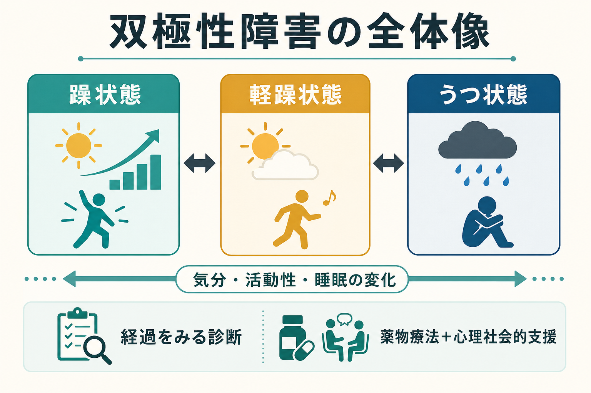
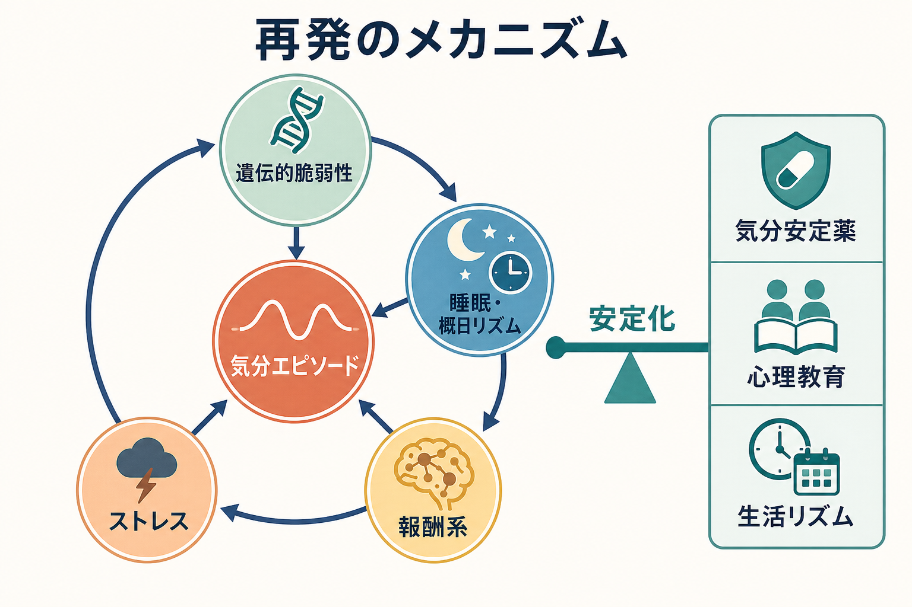
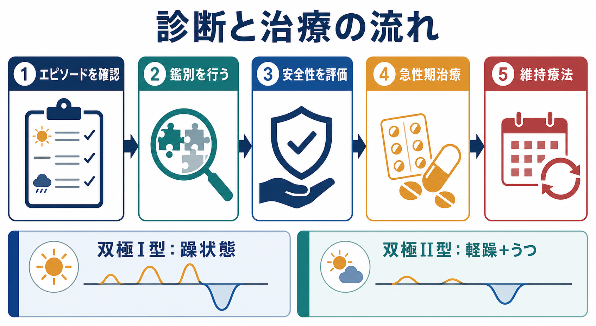

# 双極性障害とは何か

## 要点

- 双極性障害は、躁状態、軽躁状態、うつ状態が時間をおいて出現する[[うつ病とは何か|気分障害]]であり、単なる「気分の波」ではなく、睡眠、活動性、判断、対人関係、職業機能、自殺リスクに影響する疾患である[1][2]。
- 診断の中心は、現在の症状だけでなく、過去の躁・軽躁エピソードを丁寧に確認することである。うつ状態だけを見ていると、単極性うつ病として見落とされやすい[2][3]。
- 治療は、急性期の躁・うつを抑える治療と、再発を減らす維持療法を分けて考える。薬物療法に加えて、心理教育、睡眠・生活リズムの安定、家族・職場との調整が重要になる[3][4]。
- 研究上は、遺伝的脆弱性、情動・報酬系、概日リズム、ストレス反応、炎症や神経可塑性などが相互作用する多因子モデルとして理解される[5][6]。

## この記事で答える問い

1. 双極性障害は、うつ病や「性格的な気分変動」と何が違うのか。
2. 躁状態、軽躁状態、うつ状態はどのように見分けるのか。
3. 治療では、急性期治療と維持療法をどう分けて考えるのか。
4. 再発予防のために、薬物療法以外に何が重要なのか。

## まず結論

双極性障害は、「高揚した気分がある病気」ではなく、気分、活動性、睡眠、思考速度、衝動性、リスク判断がまとまって変化するエピソード性の疾患である。双極I型では明確な躁状態があり、双極II型では軽躁状態とうつ状態が組み合わさる。臨床上は、うつ状態で受診することが多いため、「過去に眠らなくても平気で活動的だった時期」「普段より話し続けた時期」「浪費・性的逸脱・無謀な行動が増えた時期」を聞き落とさないことが重要である[2][3]。

## 背景

双極性障害は、慢性的に同じ症状が続くというより、エピソードと寛解を繰り返す疾患として理解される。患者本人は「うつの時だけ困る」と感じている場合もあるが、軽躁期にはむしろ調子がよく見えることがあり、病的変化として認識されにくい。家族や同僚から見ると、睡眠時間の短縮、過活動、易怒性、浪費、対人トラブルが先に目立つこともある[1][2]。

双極性障害の診断では、[[DSMとICDは何が違うのか|DSMやICD]]の分類だけでなく、時間経過の把握が不可欠である。ある1日の気分だけで判断するのではなく、数日から数週間のまとまりとして症状が続いたか、機能障害や入院、安全上の問題があったか、物質使用や身体疾患で説明できないかを確認する[2][3]。

## 基本概念

### 躁状態

躁状態では、気分高揚または易怒性に加えて、活動性やエネルギーの増加が目立つ。典型的には、睡眠欲求の低下、多弁、観念奔逸、注意散漫、目標志向活動の増加、浪費や危険運転などのリスク行動がみられる。重症では、精神病症状、著しい社会的機能障害、入院が必要な状態を伴う[2][3]。

### 軽躁状態

軽躁状態は、躁状態よりも軽いが、本人の通常の状態とは明らかに違う持続的な変化である。本人には「頭が冴える」「仕事が進む」と感じられることがあるため、病的なエピソードとして語られにくい。しかし、睡眠不足、対人摩擦、衝動的意思決定が積み重なると、その後のうつ状態や生活上の損失につながる[2][3]。

### 双極性うつ状態

双極性障害のうつ状態は、見た目だけでは単極性うつ病と区別しにくい。診断上の鍵は、現在の抑うつ症状そのものよりも、過去の躁・軽躁エピソード、家族歴、発症年齢、再発パターン、抗うつ薬での気分高揚や不安定化の既往などを総合する点にある[2][4]。

## 仕組み

双極性障害の原因を一つに還元することはできない。現在の理解では、遺伝的脆弱性の上に、睡眠・概日リズム、報酬系、ストレス、薬物・アルコール、生活イベントが重なり、気分エピソードの発症しやすさが変化すると考えられている[5][6]。

特に[[概日リズムの乱れは精神疾患にどう関わるのか|概日リズム]]と[[睡眠障害とは何か|睡眠]]は臨床的に重要である。睡眠時間の短縮は躁・軽躁エピソードの前触れになることがあり、逆に生活リズムを安定させる介入は再発予防の基盤になる[4][5]。また、報酬に対する反応性や目標追求の過剰な活性化は、躁・軽躁期の過活動や衝動性と結びつけて研究されている[5]。

## 図解

上の図は、双極性障害を「遺伝か環境か」の二分法ではなく、脆弱性、睡眠・概日リズム、報酬系、ストレス、気分エピソードが相互に影響する循環として整理したものである。ここで重要なのは、治療が単に症状を抑えるだけでなく、循環を安定化させる方向に働くという点である。

診断と治療の実務では、まずエピソードの極性を確認し、次に鑑別診断と安全性評価を行い、その上で急性期治療と維持療法を分けて計画する。

## 臨床・研究との接続

### 診断

臨床面接では、現在の抑うつ症状だけでなく、過去の「いつもと違う活動性の上昇」を具体的に聞く。たとえば、睡眠時間、仕事量、会話量、浪費、性的行動、怒りっぽさ、対人トラブル、警察・職場・家族との問題、入院歴を時系列で確認する。本人の記憶や評価だけでは不十分な場合があり、可能であれば家族などからの情報も重要になる[2][3]。

鑑別では、単極性うつ病、ADHD、境界性パーソナリティ特性、物質使用、甲状腺疾患、薬剤性の気分変化、統合失調感情障害などを考える。特に注意すべきなのは、うつ状態で抗うつ薬だけが開始され、その後に躁転や急速交代が問題になるケースである。治療選択は診断の不確実性を含めて慎重に考える必要がある[3][4]。

### 治療

急性躁状態では、気分安定薬や抗精神病薬が中心になり、重症度、精神病症状、自傷他害リスク、身体合併症、妊娠可能性、薬剤相互作用を考慮して選択する。双極性うつ状態では、単極性うつ病と同じ発想で抗うつ薬を単独使用するのではなく、双極性障害に対する有効性と気分不安定化リスクを踏まえて治療を組み立てる[3][4]。

維持療法では、再発回数、過去に有効だった薬剤、副作用、腎機能・甲状腺機能、妊娠計画、服薬継続のしやすさを考える。リチウムは古典的な気分安定薬であり、再発予防に加えて自殺リスク低下との関連がメタ解析で示されているが、血中濃度、腎機能、甲状腺機能などのモニタリングが必要である[4][7]。

薬物療法だけでなく、[[心理教育とは何か|心理教育]]、睡眠・生活リズムの安定、家族介入、早期警告サインの共有、服薬継続を支える支援は、再発予防の中核である[4][8]。これは[[再発予防計画とは何か|再発予防計画]]として、本人が安定している時期に作っておくと実用性が高い。

### 安全性

双極性障害では、うつ状態、混合特徴、物質使用、衝動性、過去の自殺企図が重なると自殺リスクが高くなる。したがって、診断名の確認だけでなく、[[自殺リスク評価では何を聞くべきか|自殺リスク評価]]、睡眠、焦燥、希死念慮、手段へのアクセス、家族・支援者との連絡体制を確認する必要がある[1][7]。この記事は教育・研究目的の整理であり、個別の診断や治療指示ではない。

## よくある誤解

### 「気分の上がり下がりが激しい人」は全員、双極性障害である

双極性障害では、気分だけでなく、活動性、睡眠、思考速度、行動、機能障害がエピソードとしてまとまって変化する。短時間の感情反応や対人場面での揺れだけでは診断できない[2][3]。

### 軽躁は困っていなければ問題ではない

軽躁期は本人にとって快適に感じられることがある。しかし、睡眠不足、過活動、浪費、対人摩擦が後から問題化し、うつ状態や再発リスクにつながることがある。軽躁を「能力が上がった状態」とだけ見ると、再発予防の機会を逃しやすい[2][4]。

### うつ状態だけ治療すればよい

双極性障害では、うつ状態の軽減だけでなく、躁・軽躁、混合状態、再発周期、生活リズム、服薬継続を含めて治療する。うつ症状だけを単独で追うと、気分の不安定化を見落とすことがある[3][4]。

### 薬を飲んでいれば心理社会的支援は不要である

薬物療法は中心的だが、心理教育、家族支援、睡眠リズムの安定、ストレス管理、早期警告サインの共有は再発予防に関わる。特に本人が軽躁を病的変化として認識しにくい場合、周囲と共有された計画が役立つ[4][8]。

## 関連ノート

- [[双極性障害は情動ネットワークの異常として説明できるのか]]
- [[うつ病とは何か]]
- [[DSMとICDは何が違うのか]]
- [[睡眠障害とは何か]]
- [[概日リズムの乱れは精神疾患にどう関わるのか]]
- [[心理教育とは何か]]
- [[再発予防計画とは何か]]
- [[自殺リスク評価では何を聞くべきか]]

## MOC更新候補

- `content/00_MOC/` 配下の精神医学、疾患・症候群、気分障害に相当する MOC があれば、バッチ統合時に本記事へのリンクを追加する。
- 並列実行中の競合を避けるため、このタスクでは MOC 本体は更新しない。

## 理解チェック

1. 双極性障害の診断で、現在のうつ症状だけでなく過去の軽躁・躁エピソードを確認する理由は何か。
2. 躁状態と軽躁状態の違いを、重症度、機能障害、入院の必要性という観点から説明できるか。
3. 双極性うつ状態で、抗うつ薬単独使用に慎重になる理由は何か。
4. 再発予防計画に、睡眠、生活リズム、家族・支援者、早期警告サインを入れる理由は何か。

## 未解決問題

- 双極性障害の生物学的サブタイプを、臨床で使える精度で同定するバイオマーカーはまだ確立していない。
- 双極性うつ状態に対する最適な治療選択は、躁転リスク、併存症、過去の反応性によって個別化が必要であり、一つの標準手順に還元しにくい。
- デジタル表現型、睡眠計測、活動量、スマートフォン利用データを用いた再発予測は有望だが、プライバシー、偽陽性、臨床実装の課題が残る。

## 参考文献

[1] National Institute of Mental Health. (2024). *Bipolar Disorder*. https://www.nimh.nih.gov/health/topics/bipolar-disorder

[2] National Institute for Health and Care Excellence. (2025). *Bipolar disorder: assessment and management (CG185)*. https://www.nice.org.uk/guidance/cg185

[3] Merck Manual Professional Edition. (2025). *Bipolar Disorders*. https://www.merckmanuals.com/professional/psychiatric-disorders/mood-disorders/bipolar-disorders

[4] Yatham, L. N., Kennedy, S. H., Parikh, S. V., et al. (2018). Canadian Network for Mood and Anxiety Treatments and International Society for Bipolar Disorders 2018 guidelines for the management of patients with bipolar disorder. *Bipolar Disorders*, 20(2), 97-170. https://doi.org/10.1111/bdi.12609

[5] Vieta, E., Berk, M., Schulze, T. G., et al. (2018). Bipolar disorders. *Nature Reviews Disease Primers*, 4, 18008. https://doi.org/10.1038/nrdp.2018.8

[6] Mullins, N., Forstner, A. J., O'Connell, K. S., et al. (2021). Genome-wide association study of more than 40,000 bipolar disorder cases provides new insights into the underlying biology. *Nature Genetics*, 53, 817-829. https://doi.org/10.1038/s41588-021-00857-4

[7] Cipriani, A., Hawton, K., Stockton, S., & Geddes, J. R. (2013). Lithium in the prevention of suicide in mood disorders: updated systematic review and meta-analysis. *BMJ*, 346, f3646. https://doi.org/10.1136/bmj.f3646

[8] Miklowitz, D. J., & Scott, J. (2009). Psychosocial treatments for bipolar disorder: cost-effectiveness, mediating mechanisms, and future directions. *Bipolar Disorders*, 11(Suppl 2), 110-122. https://doi.org/10.1111/j.1399-5618.2009.00715.x
