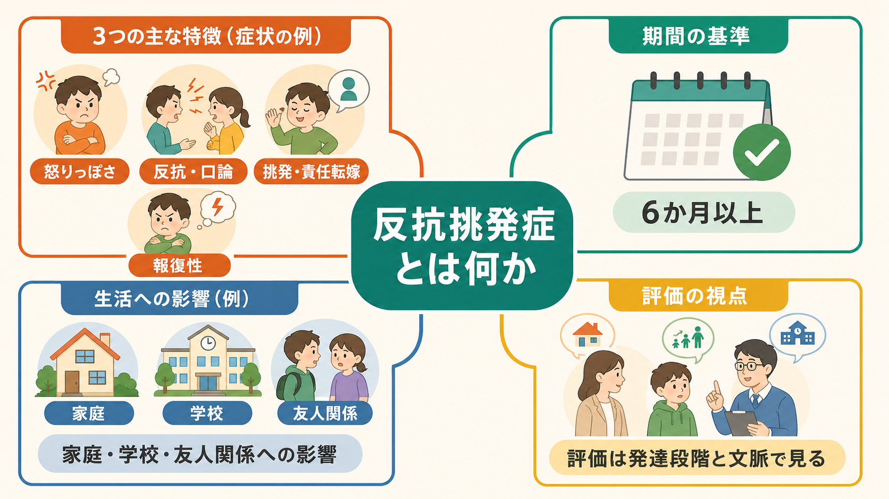
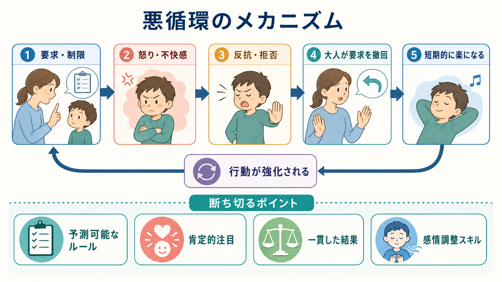
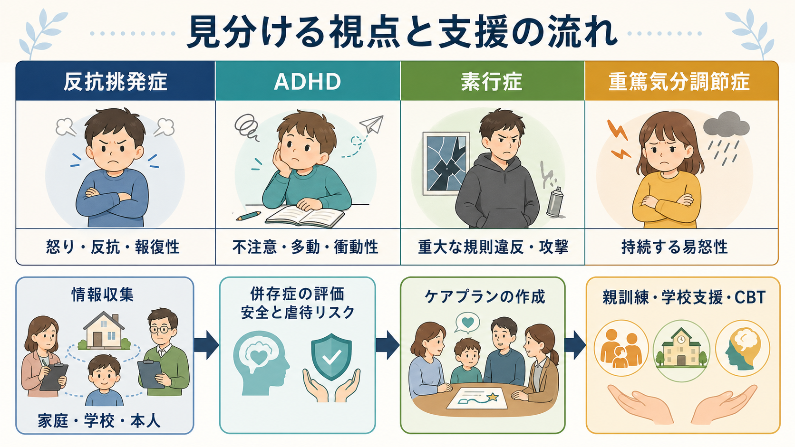

# 反抗挑発症とは何か

## 要点

- 反抗挑発症（oppositional defiant disorder; ODD）は、怒りっぽさ、口論・反抗、挑発的行動、責任転嫁、報復性が発達段階から見て過度に持続し、家庭・学校・友人関係などの機能を損なう状態である[1][2]。
- DSM-5-TR に基づく説明では、症状は「怒りっぽい/易怒的気分」「口論的/反抗的行動」「報復性」に分けられ、少なくとも6か月以上、きょうだい以外にも向けられる頻度と文脈が問題になる[1]。
- 「育て方が悪い」「わざと困らせている」と短絡する疾患ではない。子どもの気質、情動調整、注意・衝動性、家族・学校環境、ストレス、虐待やいじめ、併存症が相互に影響する[1][3][4]。
- 支援の中心は、親訓練、学校での一貫した対応、問題解決・感情調整スキル、併存症の評価である。薬物療法は ODD そのものを単独で消す治療というより、ADHD、気分症、不安症など併存症への治療として検討されることが多い[1][2][3]。

## この記事で答える問い

1. 反抗挑発症は、通常の反抗期や一時的なわがままと何が違うのか。
2. なぜ「怒り」「口論」「拒否」が悪循環として続くのか。
3. [[発達障害群とは何か]]、[[不安症群とは何か]]、[[大うつ病性障害とは何か]]、[[双極性障害とは何か]]、[[PTSDとは何か]]とはどう見分けるのか。
4. 臨床や研究では、どのような評価・支援につなげるのか。

## まず結論

反抗挑発症は「性格が悪い子ども」というラベルではなく、怒りや不快感を調整しにくい状態と、要求・制限をめぐる対人相互作用が長期化したときに見えてくる行動症候群である。診断上は、症状の種類だけでなく、年齢相応性、頻度、6か月以上の持続、きょうだい以外への広がり、生活機能への影響、他の精神疾患や環境要因でよりよく説明されないかを確認する[1]。

重要なのは、反抗を「罰で抑え込む」ことではない。子どもが何に反応して怒るのか、大人側の要求や撤回がどのように行動を強化しているのか、学校・家庭で予測可能なルールと肯定的注目をどう作るのかを評価する。NICE は、反抗挑発症または素行症のリスク・診断がある3-11歳の子どもの保護者に、社会学習モデルに基づく親訓練を提示している[3]。

## 背景

子どもや青年が、疲労、空腹、ストレス、発達上の自立欲求によって口答えや拒否を示すことは珍しくない。AACAP は、2-3歳頃や思春期初期の反抗は発達上よく見られるが、同年齢・同発達水準の子どもと比べて頻繁で一貫しており、家庭・学校・社会生活に支障を及ぼすときに臨床的問題になると説明している[2]。

反抗挑発症は、破壊的行動症群の中で、重大な他害・窃盗・器物損壊を中心とする素行症よりも、権威者との対立、怒りっぽさ、反抗、挑発、報復性が前景に立つ。NICE の一般向け説明でも、反抗挑発症は比較的年少の子どもで多く、素行症より反社会的行動の重症度が低く、養育者への口論や不服従が中心になりやすいとされる[3]。

## 基本概念

### 症状の3領域

DSM-5-TR に沿った臨床説明では、反抗挑発症の症状は次の3領域に分けられる[1]。

| 領域 | 例 | 評価で見ること |
|---|---|---|
| 怒りっぽい/易怒的気分 | かんしゃく、いらだちやすさ、怒り・恨み | 気分症、不安、睡眠、トラウマ、家庭・学校ストレスとの関係 |
| 口論的/反抗的行動 | 大人との口論、規則拒否、わざと相手をいらだたせる、責任転嫁 | ADHD の衝動性、理解力、要求水準、相互作用の悪循環 |
| 報復性 | 意地悪、仕返し、恨みを晴らそうとする行動 | 素行症、いじめ、虐待、対人関係の安全性 |

診断上は、症状が単に存在するだけでなく、少なくとも6か月以上、発達段階から見て過度で、本人または周囲に苦痛や機能障害をもたらす必要がある。5歳未満では多くの日に、5歳以上では週1回以上を目安に頻度を評価する説明が用いられる[1]。ただし、これは自己診断用のチェックリストではなく、臨床評価では本人、保護者、学校など複数情報源から文脈を確認する。

### 重症度

DSM-5-TR の説明では、症状が出る場面数によって重症度を考える。家庭だけなら軽度、家庭と学校など2場面なら中等度、3場面以上なら重度という整理である[1]。この分類は、子どもの「悪さ」を測るものではなく、支援をどの場面に広げる必要があるかを判断するための実用的な見取り図である。

## 仕組み

### 強制的相互作用の悪循環

反抗挑発症の維持機序として重要なのは、要求や制限をめぐる短期的な「楽さ」が、長期的に反抗行動を強めることである。たとえば、保護者が宿題や片づけを求め、子どもが怒る。大人が衝突を避けるために要求を撤回すると、その瞬間は双方の不快感が下がる。しかし子どもにとっては「強く拒否すれば要求が消える」、大人にとっては「要求を下げれば衝突が終わる」という学習が進む。これが繰り返されると、次の要求場面で怒りと拒否がさらに起こりやすくなる[1][4]。

この説明は、親を責めるためのものではない。NICE は、保護者が責められている・スティグマ化されていると感じうることを明示し、親訓練を提供するときはその目的と理由を直接説明するよう勧めている[3]。臨床的には、誰が悪いかではなく、どの反応が行動を強化し、どこで別の反応に置き換えられるかを見る。

### 情動調整と発達特性

反抗挑発症は一枚岩ではない。研究では、反抗挑発症の症状を「易怒性」「頑固/反抗」「意地悪/報復性」などの下位次元に分けると、将来のリスクが異なる可能性が示されている。Stringaris と Goodman の縦断研究では、易怒性は後の抑うつ・不安、頑固/反抗は ADHD や素行症、意地悪/報復性は素行上の問題と関連するという区別が報告された[5]。この見方は、同じ「反抗」に見えても、情動調整の問題、注意・衝動性の問題、対人攻撃性の問題が混在しうることを示す。

ADHD の不注意・多動・衝動性があると、指示を聞き逃す、待てない、先に動いて叱られる、修正指示に過敏に反応する、という連鎖が生じやすい。[[発達障害群とは何か]]や[[神経発達の異常は精神疾患にどう関わるのか]]との接点はここにある。反抗的に見える行動が、理解困難、感覚過敏、言語発達、実行機能、睡眠不足、トラウマ反応から生じている場合もあるため、行動だけを切り取って判断しない。

## 図解

3枚目の図は、鑑別と支援の流れをまとめたものである。画像内の「ADHD」「素行症」「重篤気分調節症」は代表例であり、実際の評価では不安、抑うつ、双極性障害、PTSD、物質使用、学習困難、虐待・いじめ、家庭内暴力も確認する[1][3]。

## 臨床・研究との接続

### 評価

評価では、本人だけでなく、保護者、教師、場合によっては福祉・医療・司法関係者から情報を集める。NICE は、家庭・学校・仲間関係での機能、養育の質、過去・現在の精神・身体疾患、ADHD や自閉スペクトラム症などの神経発達症、抑うつ・PTSD・双極性障害などの併存症、虐待や搾取、自傷・他害リスクを包括的に評価することを推奨している[3]。

臨床で使われる尺度には、Strengths and Difficulties Questionnaire、Child Behavior Checklist、Conners 系尺度、Eyberg Child Behavior Inventory などがある[1][3]。尺度は診断を自動化するものではなく、複数場面の行動を見落とさないための補助線である。

### 支援

支援は多層的に組む。中心になるのは、保護者が一貫したルール、肯定的注目、予測可能な結果を使えるようにする親訓練である。Cochrane 系レビューでは、3-12歳の行動問題に対する行動療法的・認知行動療法的な集団親プログラムが、短期的に子どもの行動問題、保護者のメンタルヘルス、肯定的養育スキルを改善することが示された[6]。NICE も、反抗挑発症または素行症の子ども・リスク児に対して、社会学習モデルに基づく親訓練を推奨している[3]。

子ども本人への支援では、感情の名前づけ、怒りの身体サインへの気づき、問題解決、認知行動療法的スキル、友人関係の練習が使われる[2][4]。親マネジメント訓練に子ども向け集団 CBT を上乗せする試みもあり、どの子どもにどの組み合わせが有効かは長期追跡を含めて検討されている[8]。学校では、課題を小さく分ける、指示を明確にする、成功場面を増やす、叱責を公開処刑にしない、家庭と学校で対応を共有することが重要になる。

薬物療法は、反抗挑発症の中核症状だけを標的にする第一選択ではない。併存する ADHD、[[不安症群とは何か]]、[[大うつ病性障害とは何か]]、[[双極性障害とは何か]]などがある場合、その疾患の標準的評価と治療が検討される[1][2]。この記事は教育・研究目的の概説であり、個別の診断や治療選択は専門家による評価に基づく。

## よくある誤解

### 「反抗期なら放っておけばよい」

発達上の反抗と、反抗挑発症は同じではない。発達上の反抗は状況依存的で、生活機能への影響が限られ、関係修復も起こりやすい。一方、反抗挑発症では頻度、持続、複数場面、本人や周囲の苦痛、学業・家庭・友人関係への影響が問題になる[1][2]。

### 「厳しく叱れば治る」

一貫した境界設定は重要だが、強い叱責や威圧だけでは、怒りと対立の悪循環を強めることがある。支援では、ルールを少数で明確にし、望ましい行動に注目し、結果を予測可能にし、大人側もエスカレーションを避ける[3][6]。

### 「反抗挑発症は必ず素行症になる」

反抗挑発症と素行症は関連するが、同一ではない。反抗挑発症があるすべての子どもが素行症に進むわけではなく、近年の説明では、将来の気分症・不安症・物質使用・行動症のリスクを広く評価する必要がある[1][5]。

### 「本人だけを治療すればよい」

本人の感情調整スキルは重要だが、反抗挑発症では家庭、学校、仲間関係、併存症、保護者の疲弊、社会的ストレスを含む評価が必要である。AACAP の practice parameter も、診断と治療は個人・家族・社会的介入を含む多面的なものになりやすいと述べている[4]。

## 関連ノート

- [[発達障害群とは何か]]
- [[神経発達の異常は精神疾患にどう関わるのか]]
- [[不安症群とは何か]]
- [[大うつ病性障害とは何か]]
- [[双極性障害とは何か]]
- [[PTSDとは何か]]
- [[適応障害とは何か]]

MOC 更新候補: `content/00_MOC/` 配下の精神医学・児童青年精神医学・神経発達症関連 MOC。並列生成ジョブとの競合を避けるため、本記事では MOC 本体は更新しない。

## 理解チェック

1. 反抗挑発症を評価するとき、なぜ「6か月以上」「発達段階」「複数場面」「機能障害」を確認する必要があるか。
2. 大人が要求を撤回すると、短期的には衝突が下がるのに、長期的にはなぜ反抗が強化されうるか。
3. 易怒性が中心の子どもと、衝動性・不注意が中心の子どもでは、評価すべき併存症や支援方針はどう変わるか。
4. 親訓練を「親の責任追及」ではなく「相互作用を変える支援」として説明するには、どのような言い方がよいか。

## 参考文献

[1] Mars JA, Aggarwal A, Marwaha R. *Oppositional Defiant Disorder*. StatPearls. Last updated 2024-10-29. https://www.ncbi.nlm.nih.gov/books/NBK557443/

[2] American Academy of Child and Adolescent Psychiatry. *Oppositional Defiant Disorder*. Facts for Families No. 72. Reviewed January 2019. https://www.aacap.org/AACAP/Families_and_Youth/Facts_for_Families/FFF-Guide/Children-With-Oppositional-Defiant-Disorder-072.aspx

[3] National Institute for Health and Care Excellence. *Antisocial behaviour and conduct disorders in children and young people: recognition and management*. Clinical guideline CG158. Published 2013-03-27, last updated 2017-04-19. https://www.nice.org.uk/guidance/cg158

[4] Steiner H, Remsing L, Work Group on Quality Issues. Practice parameter for the assessment and treatment of children and adolescents with oppositional defiant disorder. *Journal of the American Academy of Child & Adolescent Psychiatry*. 2007;46(1):126-141. https://doi.org/10.1097/01.chi.0000246060.62706.af

[5] Stringaris A, Goodman R. Longitudinal outcome of youth oppositionality: irritable, headstrong, and hurtful behaviors have distinctive predictions. *Journal of the American Academy of Child & Adolescent Psychiatry*. 2009;48(4):404-412. https://doi.org/10.1097/CHI.0b013e3181984f30

[6] Furlong M, McGilloway S, Bywater T, Hutchings J, Smith SM, Donnelly M. Behavioural and cognitive-behavioural group-based parenting programmes for early-onset conduct problems in children aged 3 to 12 years. *Cochrane Database of Systematic Reviews*. 2012;2:CD008225. https://doi.org/10.1002/14651858.CD008225.pub2

[7] Dretzke J, Frew E, Davenport C, et al. The effectiveness and cost-effectiveness of parent training/education programmes for the treatment of conduct disorder, including oppositional defiant disorder, in children. *Health Technology Assessment*. 2005;9(50):1-233. https://doi.org/10.3310/hta9500

[8] Helander M, Enebrink P, Hellner C, Ahlen J. Parent Management Training Combined with Group-CBT Compared to Parent Management Training Only for Oppositional Defiant Disorder Symptoms: 2-Year Follow-Up of a Randomized Controlled Trial. *Child Psychiatry & Human Development*. 2023;54(4):1112-1126. https://doi.org/10.1007/s10578-021-01306-3

## 未解決問題

- 反抗挑発症の下位次元を、日常臨床でどの程度まで個別化支援に反映できるか。
- デジタル親訓練、学校ベース介入、家族療法をどの順序・強度で組み合わせると長期転帰が改善するか。
- 文化差、学校制度、貧困、虐待・いじめ経験が、診断率と支援アクセスにどのように影響するか。
