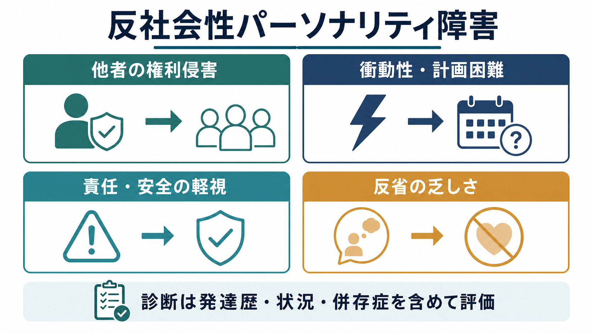
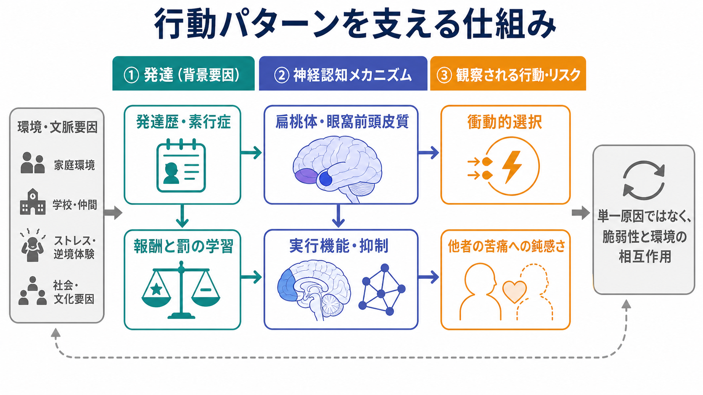
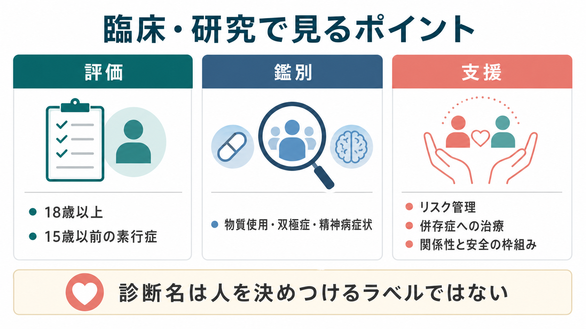

# 反社会性パーソナリティ障害とは何か

## 要点

- 反社会性パーソナリティ障害（antisocial personality disorder; ASPD）は、他者の権利を軽視・侵害する行動が持続し、欺き、衝動性、攻撃性、無責任、安全軽視、反省の乏しさなどとして現れる状態である[1]。
- DSM 系の診断では、成人期だけの行動ではなく、15歳以前に[[素行症とは何か]]に相当する行動パターンがあったこと、18歳以上であること、統合失調症や双極症の経過中だけでは説明できないことが重視される[1]。
- ICD-11 では「反社会性パーソナリティ障害」という単一カテゴリーより、パーソナリティ障害の重症度と、非社会性・脱抑制などの特性領域を組み合わせて記述する方向に整理されている[2]。
- 仕組みは単一原因ではなく、遺伝的脆弱性、発達歴、養育・社会環境、報酬と罰の学習、情動反応、[[衝動性とは何か]]、[[実行機能とは何か]]などが相互作用する[1][5][6]。
- 臨床では、診断名を「危険人物」というラベルにしないこと、同時に被害リスク・自傷他害リスク・物質使用・身体合併症を軽視しないことが重要である[3][4]。

## この記事で答える問い

1. 反社会性パーソナリティ障害は、どのような行動パターンを指すのか。
2. 「衝動的」「冷淡」「犯罪的」といった言葉だけで説明してよいのか。
3. 発達歴、素行症、物質使用、双極症、精神病症状とはどう鑑別するのか。
4. 神経認知研究は、報酬・罰の学習、共感、実行機能について何を示しているのか。
5. 支援では何を目標にし、どこに限界があるのか。

## まず結論

反社会性パーソナリティ障害は、単発の非行、怒りっぽさ、犯罪歴そのものではない。中心にあるのは、他者の権利や安全を軽視する行動が長期にわたり反復され、本人の生活、対人関係、職業、法的問題、周囲の安全に影響しているというパターンである[1]。

ただし、この診断名は人の価値を決めるラベルではない。臨床上は、発達歴、現在の環境、併存する[[物質使用障害とは何か]]、気分症状、精神病症状、[[ADHDとは何か]]、外傷歴、神経疾患、社会的困難を含めて評価する。診断名だけで将来の暴力や犯罪を機械的に予測することはできず、リスク評価では具体的な行動、状況、保護因子を見なければならない[3][8]。

## 背景

ASPD は、DSM 系では B 群パーソナリティ障害に含まれ、反復する法・規範違反、欺き、衝動性、易怒性・攻撃性、無謀さ、無責任、良心の呵責の乏しさが中核的な評価項目になる[1]。一般人口での有病率はおおむね数％とされ、男性で多く報告され、司法・矯正領域、物質使用障害、ホームレス状態などでは高率にみられる[1]。

NICE ガイドラインは、ASPD を医療、社会ケア、物質使用サービス、刑事司法システムをまたぐ課題として扱い、怒り、苦痛、不安、抑うつ、反社会的行動、再犯リスクを含む実践的管理を重視している[3]。つまり ASPD は、診断面接だけで完結する概念ではなく、生活環境、支援関係、安全管理、制度との接点を含む臨床・社会的問題である。

## 基本概念

### 中核となる行動パターン

ASPD の評価で見るのは、「性格が悪いか」ではなく、行動の反復性、持続性、発達的連続性、被害の具体性である。典型的には、次のような領域を横断して確認する[1]。

| 領域 | 例 | 評価で見る点 |
|---|---|---|
| 規範・法の軽視 | 反復する違法行為、社会的ルール違反 | 単発か、長期パターンか |
| 欺き・操作 | 嘘、偽名、詐取、利用 | 利得、関係性、被害の有無 |
| 衝動性 | 計画困難、短期報酬への偏り | [[衝動性とは何か]]、物質使用、躁状態との関係 |
| 攻撃性 | けんか、暴力、威嚇 | 反応的攻撃か、道具的攻撃か |
| 安全軽視 | 無謀運転、危険行為 | 自他の安全への影響 |
| 無責任 | 仕事・金銭・養育責任の放棄 | 能力、環境、意図、併存症 |
| 反省の乏しさ | 被害の軽視、正当化 | 認知的理解と情動的関心の違い |

この表は診断を自己判定するためのものではない。医療・司法・福祉の文脈では、本人の語りだけでなく、生活史、家族や支援者からの情報、記録、現在の安全リスクを合わせて検討する。

### 素行症との連続性

ASPD は成人の診断であり、DSM 系では 15歳以前に[[素行症とは何か]]に相当する行動があったことが条件になる[1]。素行症から ASPD へ進む人もいるが、すべての子どもがそうなるわけではない。発達研究では、早発型、青年期限定型、冷淡・非情特性を伴う群、怒り調整困難を伴う群など、複数の経路が区別される[6]。

重要なのは、「子どもの問題行動＝将来のASPD」と短絡しないことである。早期支援の目的は、将来を決めつけることではなく、家庭・学校・地域での安全、学習、感情調整、対人スキル、養育支援を通じて悪循環を弱めることである。

### ICD-11 での位置づけ

ICD-11 は、従来型のパーソナリティ障害名を単純に並べるのではなく、パーソナリティ障害の重症度と、目立つ特性領域を組み合わせて記述する。非社会性（dissociality）は、他者の権利や感情への軽視、自己中心性、共感の乏しさ、操作性、搾取性、攻撃性などを含む特性領域として説明される[2]。また、特性領域は単独診断ではなく、パーソナリティ障害またはパーソナリティ困難と組み合わせて使う点が強調される[2]。

この発想は、ASPD を「ある・なし」だけで扱うより、重症度、脱抑制、否定的感情、境界性パターン、社会機能の障害を合わせて見る臨床実践に近い。

## 仕組み

### 報酬と罰の学習

ASPD に関連する行動は、単に「ルールを知らない」ことでは説明しにくい。多くの場合、短期的な報酬が強く、罰や長期的損失から行動を修正しにくいことが問題になる。これは、[[リスク下の意思決定はどのように行われるのか]]、[[遅延割引とは何か]]、報酬予測、罰への感受性、失敗からの学習と関係する。

心理学的には、反応的攻撃と道具的攻撃を区別すると理解しやすい。反応的攻撃は脅威、侮辱、欲求不満への急性反応として生じやすい。一方、道具的攻撃は目的達成の手段として使われる。Blair の神経認知モデルは、この区別を踏まえ、扁桃体、眼窩前頭皮質、腹内側前頭前野などが、恐怖・苦痛手がかり、罰学習、価値表象、意思決定に関わる可能性を論じている[5]。

### 情動反応と共感

ASPD とサイコパシーは重なる部分があるが同一ではない。ASPD は主に反社会的行動のパターンを記述する診断であり、サイコパシーは冷淡さ、表面的魅力、情動の浅さ、操作性などを含む構成概念として扱われることが多い[1][5]。

研究では、他者の苦痛や恐怖への反応、罰学習、報酬価値の更新に関わる神経回路の違いが検討されてきた。Blair のレビューは、サイコパシーにおいて扁桃体の強化学習機能と腹内側前頭前野の価値表象の障害が重要である可能性を示している[5]。ただし、これらは集団レベルの研究知見であり、個人を脳画像だけで診断したり、責任能力や将来行動を断定したりする根拠にはならない。

### 前頭前野と実行機能

神経画像研究のメタ解析では、反社会的・暴力的・サイコパシー傾向をもつ集団で、前頭前野の構造・機能低下が報告されている。特に眼窩前頭皮質、前部帯状皮質、背外側前頭前野が関与する可能性が示されている[7]。これらの領域は、価値評価、抑制、エラー検出、社会的意思決定と関係する。

とはいえ、前頭前野の差異は「反社会性の原因が脳にある」と単純化するためのものではない。脳、発達、学習、環境、物質使用、外傷、社会的ストレスは相互に影響し合う。臨床的には、神経機能の説明を、本人の責任を消すためにも、責任を過剰に固定するためにも使わない慎重さが必要である。

## 図解

上の図は、ASPD を「悪意」や「犯罪性」だけでなく、発達歴、報酬・罰の学習、情動反応、実行機能、環境要因の相互作用として見るための概念図である。特に重要なのは、次の3点である。

1. 発達歴は重要だが、運命ではない。
2. 神経認知メカニズムは説明の一部であり、診断や予測を単独で担うものではない。
3. 支援では、性格を直接変えることより、具体的行動、リスク、併存症、生活機能を扱う。

## 臨床・研究との接続

### 評価

評価では、まず現在の問題行動だけでなく、幼少期からの経過を時系列で整理する。確認する項目は、素行症に相当する行動、学校・家庭での機能、暴力や搾取の有無、物質使用、気分エピソード、精神病症状、頭部外傷や神経疾患、社会的孤立、生活困窮、被害・加害の双方のリスクである[1][3]。

ASPD だけでは幻覚や妄想を説明しない。精神病症状がある場合は[[統合失調症とは何か]]、物質誘発性精神病、気分症状を伴う精神病性障害などを評価する。衝動性や注意困難が目立つ場合も、[[ADHDとは何か]]や物質使用、睡眠不足、躁状態、認知機能障害を区別する。

### 支援

Cochrane レビューは、ASPD に対する心理社会的介入のエビデンスは限られており、特定の心理療法を強く推奨または否定できるだけの質の高い根拠は十分でないと結論している[4]。NICE も、個別の診断名だけに焦点を当てるより、併存する物質使用、怒り、抑うつ、不安、危機対応、社会的問題、司法・福祉との連携を重視する[3]。

したがって現実的な支援目標は、次のように設定される。

- [[物質使用障害とは何か]]、抑うつ、不安、外傷関連症状など治療可能な併存症を評価する。
- 暴力、自傷、搾取、性的リスク、無謀運転、服薬乱用など、具体的リスクを行動単位で扱う。
- 境界設定、危機時の連絡手順、金銭・住居・就労・法的問題への支援を明確化する。
- 治療関係では、過度な対立、救済幻想、操作性への巻き込まれを避け、予測可能で一貫した枠組みを保つ。

### 研究

研究では、ASPD を一枚岩として扱う限界が意識されている。反社会的行動には、早発型と青年期限定型、冷淡・非情特性を伴う群、怒り調整困難を伴う群、物質使用が主に駆動する群、社会的逆境が大きい群などがありうる[6]。今後は、行動診断、発達経路、神経認知指標、環境要因、介入反応性を組み合わせた次元的理解が重要になる。

## よくある誤解

### 誤解1: 反社会性パーソナリティ障害は「犯罪者」と同じである

同じではない。犯罪歴があってもASPDとは限らず、ASPD があってもすべての人が重大犯罪を行うわけではない。診断では、行動の持続性、発達歴、対人・職業・社会機能への影響、他の疾患や状況で説明できるかを評価する[1]。

### 誤解2: 反省しない人は全員ASPDである

反省の乏しさは一要素だが、それだけでは診断にならない。文化、発達段階、防衛、知的能力、トラウマ、物質使用、躁状態、認知症、頭部外傷などでも、責任理解や感情表出は変化する。

### 誤解3: 治療できないなら支援しても意味がない

ASPD の中核特性を短期に変える確実な治療は限られるが、支援の意味がないわけではない。物質使用、抑うつ、不安、住居、就労、暴力リスク、危機対応を扱うことで、本人と周囲の安全、生活機能、再発・再犯リスクの低減に寄与しうる[3][4]。

### 誤解4: 脳の違いが見つかれば責任はなくなる

神経画像や神経心理学は、集団差やメカニズム仮説を示す研究手段であり、個人の責任、診断、将来行動を単独で決めるものではない[7]。臨床・司法では、脳の説明と行動責任、安全確保、支援可能性を分けて考える必要がある。

## 関連ノート

- [[素行症とは何か]]
- [[衝動性とは何か]]
- [[実行機能とは何か]]
- [[行動抑制システムとは何か]]
- [[リスク下の意思決定はどのように行われるのか]]
- [[遅延割引とは何か]]
- [[物質使用障害とは何か]]
- [[ADHDとは何か]]
- [[統合失調症とは何か]]
- [[鑑別診断とは何か]]

## MOC更新候補

- `content/00_MOC/` 配下に精神医学、パーソナリティ障害、司法精神医学、衝動性・行動制御に関する MOC がある場合、本記事へのリンク追加候補。
- 並列生成ジョブとの競合を避けるため、この時点では MOC 本体は更新しない。

## 理解チェック

1. ASPD の評価で、成人期の行動だけでなく 15歳以前の素行症状を確認するのはなぜか。
2. ASPD とサイコパシーは、どの点で重なり、どの点で異なるか。
3. 物質使用、躁状態、精神病症状がある場合、ASPD の診断を急がずに何を確認すべきか。
4. 神経画像研究の知見を、個人の診断や危険性予測にそのまま使えない理由は何か。
5. ASPD への支援で、治療可能な併存症と安全管理を分けて考える利点は何か。

## 未解決問題

- ASPD の下位群を、発達経路、冷淡・非情特性、衝動性、物質使用、社会的逆境でどう分けると介入に役立つのか。
- 心理療法、リスク管理、物質使用治療、就労・住居支援を組み合わせた包括的介入の長期効果はどこまで示せるのか。
- 神経認知指標を、スティグマや過剰予測を避けながら臨床支援に接続する方法は何か。
- 被害者保護、本人支援、治療同盟、司法的責任をどのように両立させるか。

## 参考文献

[1] Fisher KA, Torrico TJ, Hany M. Antisocial Personality Disorder. *StatPearls*. Updated 2024 Feb 29. NCBI Bookshelf. https://www.ncbi.nlm.nih.gov/books/NBK546673/

[2] World Health Organization. ICD-11 MMS: 6D11.2 Dissociality in personality disorder or personality difficulty. https://icd.who.int/browse/2025-01/mms/en#1913158855

[3] National Institute for Health and Care Excellence. *Antisocial personality disorder: prevention and management*. NICE Clinical Guideline CG77. https://www.ncbi.nlm.nih.gov/books/n/nicecg77guid/

[4] Gibbon S, Khalifa NR, Cheung NH-Y, Völlm BA, McCarthy L. Psychological interventions for antisocial personality disorder. *Cochrane Database of Systematic Reviews*. 2020;9:CD007668. https://doi.org/10.1002/14651858.CD007668.pub3

[5] Blair RJR. Psychopathy: cognitive and neural dysfunction. *Dialogues in Clinical Neuroscience*. 2013;15(2):181-190. https://pmc.ncbi.nlm.nih.gov/articles/PMC3811089/

[6] Pardini D, Frick PJ. Multiple developmental pathways to conduct disorder: current conceptualizations and clinical implications. *Journal of the Canadian Academy of Child and Adolescent Psychiatry*. 2013;22(1):20-25. https://pmc.ncbi.nlm.nih.gov/articles/PMC3565711/

[7] Yang Y, Raine A. Prefrontal structural and functional brain imaging findings in antisocial, violent, and psychopathic individuals: a meta-analysis. *Psychiatry Research: Neuroimaging*. 2009;174(2):81-88. https://doi.org/10.1016/j.pscychresns.2009.03.012

[8] Lowenstein J, Purvis C, Rose K. A systematic review on the relationship between antisocial, borderline and narcissistic personality disorder diagnostic traits and risk of violence to others in a clinical and forensic sample. *Borderline Personality Disorder and Emotion Dysregulation*. 2016;3:14. https://doi.org/10.1186/s40479-016-0046-0
