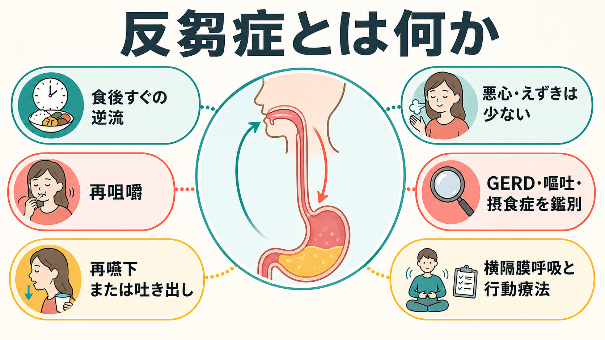
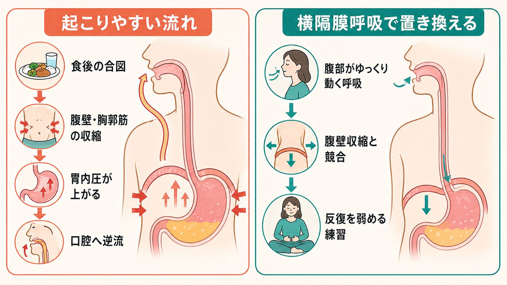
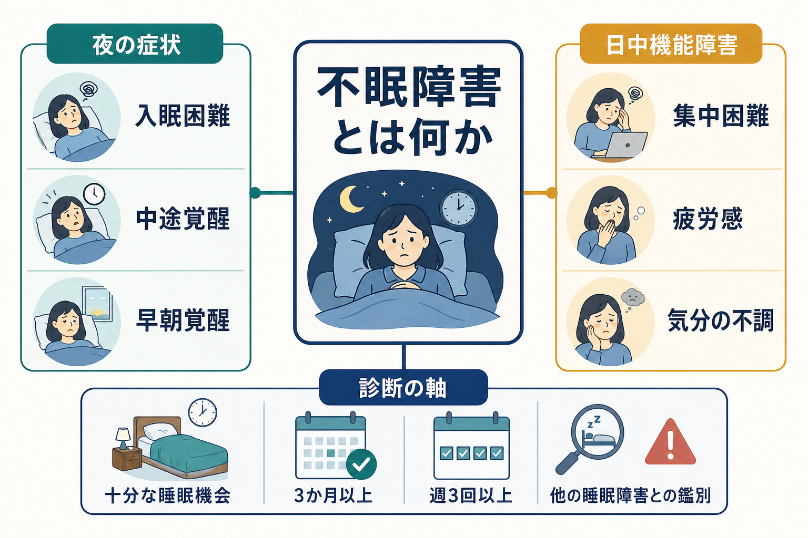

# 反芻症とは何か

## 要点

- 反芻症は、食後まもなく食物が口腔へ戻り、再咀嚼、再嚥下、または吐き出しが反復する状態である。
- Rome IV では「反芻症候群」として腸脳相関疾患に、DSM-5-TR では摂食・食行動関連の「反芻障害」として位置づけられる[1][2][3]。
- 典型例では悪心や強い嘔吐反射を伴わず、胃食道逆流症、嘔吐症、摂食症、消化管閉塞などとの[[鑑別診断とは何か|鑑別]]が重要になる[1][2][4]。
- 機序としては、食後の腹壁・胸郭筋の収縮、胃内圧上昇、食道括約筋のゆるみが重なり、食物が逆行しやすくなるという説明が使われる[2][4]。
- 支援では、疾患理解を助ける[[心理教育とは何か|心理教育]]、横隔膜呼吸、習慣逆転、認知行動療法、必要に応じた消化器・精神科・心理職の連携が中心になる[4][5][6]。

## この記事で答える問い

1. 反芻症とは、どのような症状のまとまりなのか。
2. 胃食道逆流症、嘔吐、摂食症とは何が違うのか。
3. 食後の腹壁収縮と横隔膜呼吸は、どのように理解されているのか。
4. 研究・臨床では、どのような評価と支援が問題になるのか。

## まず結論

反芻症とは、「食べたものが意図せず、または半自動的に口の中へ戻り、それを噛み直す、飲み込む、または吐き出す」ことが反復する状態である。単なる胃もたれ、嘔吐、逆流性食道炎、わざとの吐き戻しと同一視すると見落とされやすい。Rome IV の成人基準では、最近食べた食物の反復的逆流と、その後の吐き出し・再咀嚼・再嚥下、そして「吐き気を伴うえずきに先行されない」ことが中心になる[1]。

ただし、反芻症は「本人の性格」や「だらしなさ」ではない。多くの場合、食後の身体感覚、腹壁・胸郭筋の収縮、学習された反応、ストレス、恥や回避、併存する身体疾患・精神症状が重なって維持される。したがって、[[生物心理社会モデルとは何か|生物心理社会モデル]]で、身体機序、行動学習、生活文脈を同時に見る必要がある。

## 背景

「反芻」は、もともと食物を戻して噛み直す動物の消化行動を指す言葉である。しかし人間の反芻症は、生理的な消化行動ではなく、苦痛、栄養問題、社会的困難、羞恥、医療機関受診の長期化につながりうる症状群である[4]。

分類上は二つの顔をもつ。消化器領域では、反芻症候群は機能性消化管疾患、現在の表現では「腸脳相関疾患」の一つとして扱われる。精神医学領域では、反芻障害は摂食・食行動に関わる障害として扱われる[2][3]。この二重の位置づけは混乱の原因にもなるが、逆に言えば、消化管運動、身体感覚、習慣化した行動、食行動、情動、対人文脈を統合して考える入口にもなる。

## 基本概念

### 典型的な症状

反芻症では、食後すぐ、しばしば数分から十数分以内に、最近食べた内容物が口腔へ戻る。戻った食物は、酸味が強くなる前の「まだ食物として分かる」状態であることが多く、本人は再び噛んで飲み込む、または吐き出す[1][2]。Rome IV では、成人の場合、症状が直近3か月にわたり、発症が診断の6か月以上前であることが基準に含まれる[1]。

DSM-5-TR 系の整理では、少なくとも1か月にわたる反復的な吐き戻し、他の消化器疾患や摂食症でよりよく説明されないこと、別の精神疾患や神経発達症がある場合でも臨床的注意を要するほど重いことが重視される[3]。ICD-11 でも、rumination-regurgitation disorder は摂食・食行動症群に置かれ、反復的な食物の吐き戻しが他の医学的状態で十分説明されないことが中心になる[7]。

### 何と区別するか

反芻症は、次の状態と重なって見える。

| 似ている状態 | 反芻症との違いの見方 |
|---|---|
| 胃食道逆流症 | 胸やけ、酸逆流、夜間症状、酸性内容物、内視鏡所見、酸抑制薬への反応を含めて評価する。反芻症では食後早期の反復逆流と再咀嚼が目立つことがある。 |
| 嘔吐 | 嘔吐は悪心、えずき、腹部の強い不快感を伴いやすい。反芻症では「努力感の少ない逆流」が中心になりやすい[1][4]。 |
| 神経性過食症などの摂食症 | 体重・体形への強いとらわれ、代償行動、過食エピソードの有無を評価する。反芻症と摂食症が併存する可能性もある。 |
| 消化管閉塞・狭窄・運動障害 | 嚥下困難、体重減少、出血、疼痛、神経筋疾患などの所見があれば身体医学的評価が優先される[5]。 |

このため、反芻症の説明は「反芻症らしいか」だけでなく、「何を除外し、何を併存として扱うか」を含む。これは[[精神科診断における除外診断とは何か|除外診断]]と[[身体合併症は精神科診療でなぜ重要なのか|身体合併症評価]]の両方に関わる。

## 仕組み

反芻症の中心機序としてよく説明されるのは、食事を合図にして腹壁・胸郭筋の収縮が起こり、胃内圧が上がり、食道括約筋のゆるみと組み合わさって、胃内容物が口側へ戻るという流れである[2][4]。本人はこの腹壁収縮を明確に自覚していないこともある。

高解像度食道内圧検査やインピーダンス検査では、食後の胃内圧上昇と近位食道まで届く逆流イベントが確認されることがある[2][5]。ただし、すべての人に特殊検査が必要という意味ではない。多くの臨床場面では、症状の時間経過、食事との関係、悪心・えずきの有無、体重変化、嚥下困難、摂食症状、身体疾患の可能性を丁寧に聞くことが出発点になる[4][5]。

横隔膜呼吸は、この腹壁収縮に対する「競合反応」として理解される。ゆっくりした腹式の呼吸を練習することで、食後の腹壁収縮を置き換え、胃内圧上昇と逆流の連鎖を弱める狙いがある[2][5]。ただし、横隔膜呼吸だけで十分でない人もおり、その場合は症状を誘発する状況、羞恥、回避、身体感覚への恐怖、体重・体形への関心、ストレス対処などを扱う認知行動的介入が検討される[4][6]。

## 図解

下の図は、反芻症を他の状態と見分けるときの視点をまとめたものである。これは自己診断用の表ではなく、臨床評価で何を分けて見るかを理解するための整理である。

## 臨床・研究との接続

### 評価

評価では、まず「いつ、何が、どのように戻るのか」を具体的に聞く。食後何分で始まるか、食物が未消化に近いか、酸味があるか、悪心やえずきがあるか、睡眠中に起こるか、体重減少や脱水があるか、嚥下困難や出血があるかを確認する。Mayo Clinic などの臨床情報でも、病歴聴取と行動観察が診断の中心になり、必要に応じて内視鏡、胃排出検査、高解像度食道内圧・インピーダンス検査が使われると説明されている[5]。

精神医学的には、反芻症を[[精神疾患とは何か|精神疾患]]のラベルだけで閉じないことが重要である。症状が恥ずかしくて語られにくい、食事場面を避ける、体重・体形への関心と絡む、発達特性や不安・抑うつと併存する、家族や学校・職場の食事場面で困難が出る、といった生活機能の評価が必要になる。

### 支援

支援の第一歩は、症状を「危険な謎」や「本人の怠慢」として扱わず、反芻症という説明枠を共有することである。教育的説明、横隔膜呼吸、食後の練習、バイオフィードバック、習慣逆転、認知行動療法が中心的に扱われる[4][5][6]。

Murray らの批判的レビューは、反芻症が見落とされやすく、診断・機序・治療についてなお合意が十分でない部分がある一方で、臨床歴に基づく評価と横隔膜呼吸を中心とした介入を推奨している[4]。また、成人を対象にした小規模な proof-of-concept 試験では、横隔膜呼吸に加えて、気づきの訓練、自己モニタリング、曝露、苦痛耐性、代替的な自己鎮静などを含む認知行動療法プロトコルが、症状軽減と受容可能性の点で有望と報告された。ただし、サンプルは小さく、無作為化比較試験による検証が今後の課題である[6]。

## よくある誤解

### 「ただの胃酸逆流である」

胃食道逆流症と重なることはあるが、反芻症は食後早期の反復的な食物逆流、再咀嚼・再嚥下・吐き出し、悪心やえずきの少なさという特徴をもつ。酸抑制薬で説明しきれない逆流症状では、反芻症を考える必要がある[2][4]。

### 「わざと吐いているだけである」

反芻症では、本人が完全に意図しているというより、食事を合図にした半自動的な身体反応・習慣として起こることが多い。羞恥や秘密化があるため、「わざと」と決めつけると評価と支援から遠ざかる。

### 「精神科だけ、消化器だけで完結する」

反芻症は、摂食・食行動、消化管運動、身体感覚、行動学習、心理社会的要因が交差する。したがって、消化器内科、精神科、心理職、栄養、看護、家族支援が必要に応じて連携する領域である。これは[[精神科におけるチーム医療とは何か|チーム医療]]の典型例でもある。

## 関連ノート

- [[精神疾患とは何か]]
- [[DSMとICDは何が違うのか]]
- [[鑑別診断とは何か]]
- [[精神科診断における除外診断とは何か]]
- [[身体合併症は精神科診療でなぜ重要なのか]]
- [[心理教育とは何か]]
- [[生物心理社会モデルとは何か]]
- [[食欲と体重変化から何がわかるのか]]

### 関連ノート候補

- 「摂食症とは何か」
- 「胃食道逆流症と精神医学」
- 「腸脳相関とは何か」
- 「横隔膜呼吸とは何か」
- 「習慣逆転法とは何か」

### MOC更新候補

- `content/00_MOC/MOC｜精神医学.md`
- 摂食症、腸脳相関、身体症状、心理社会的介入に関する MOC が整備された場合の入口候補

## 理解チェック

1. 反芻症で重要な「逆流」と、一般的な嘔吐はどの点で違うか。
2. Rome IV の反芻症候群と DSM-5-TR の反芻障害は、なぜ同じ現象を異なる領域から見ていると言えるか。
3. 横隔膜呼吸が「競合反応」と呼ばれる理由は何か。
4. 反芻症を疑うとき、どのような身体疾患・摂食症状を鑑別に入れるべきか。
5. 反芻症を「わざと」と決めつけることには、どのような臨床的リスクがあるか。

## 未解決問題

- 反芻症の中で、胃食道逆流を契機とする二次性反芻、げっぷ関連の反芻、食行動・情動調整と結びつく反芻をどのように層別化するか。
- 横隔膜呼吸、バイオフィードバック、認知行動療法、薬物療法補助のどの組み合わせが、どの患者群に最も適するか。
- 小児、発達特性のある人、摂食症併存例、消化器疾患併存例で、標準的評価と介入をどのように調整するか。
- 羞恥や秘密化のために受診しにくい人へ、どのような説明とアクセス経路が有効か。

## 参考文献

[1] Rome Foundation. Rome IV Criteria: B4 Rumination Syndrome. https://theromefoundation.org/rome-iv/rome-iv-criteria/

[2] Kusnik, A., & Goosenberg, E. (2026). Rumination Disorder. *StatPearls*. NCBI Bookshelf. Last Update: March 23, 2026. https://www.ncbi.nlm.nih.gov/books/NBK576404/

[3] Merck Manual Professional Edition. Rumination Disorder. Reviewed/Revised Aug 2025; Modified Sept 2025. https://www.merckmanuals.com/professional/psychiatric-disorders/feeding-and-eating-disorders/rumination-disorder

[4] Murray, H. B., et al. (2019). Diagnosis and Treatment of Rumination Syndrome: A Critical Review. *American Journal of Gastroenterology*, 114(4), 562-578. https://doi.org/10.14309/ajg.0000000000000060

[5] Mayo Clinic. Rumination syndrome: Diagnosis and treatment. https://www.mayoclinic.org/diseases-conditions/rumination-syndrome/diagnosis-treatment/drc-20377333

[6] Murray, H. B., et al. (2021). Comprehensive Cognitive-Behavioral Interventions Augment Diaphragmatic Breathing for Rumination Syndrome: A Proof-of-Concept Trial. *Digestive Diseases and Sciences*, 66, 3461-3469. https://doi.org/10.1007/s10620-020-06685-6

[7] World Health Organization. ICD-11 for Mortality and Morbidity Statistics: 6B85 Rumination-regurgitation disorder. https://icd.who.int/browse/2025-01/mms/en#1205760590
