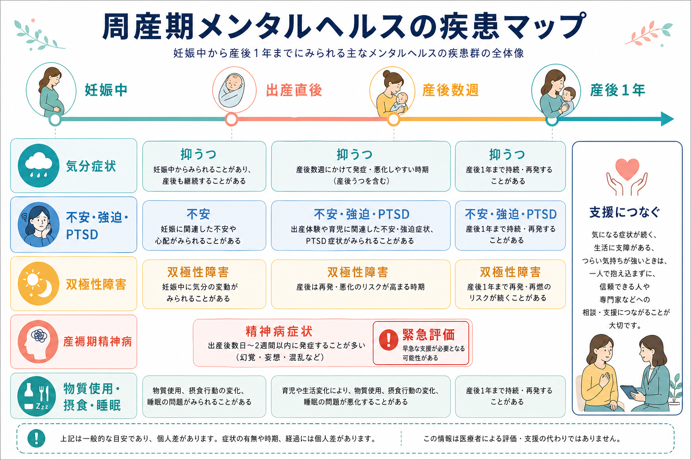
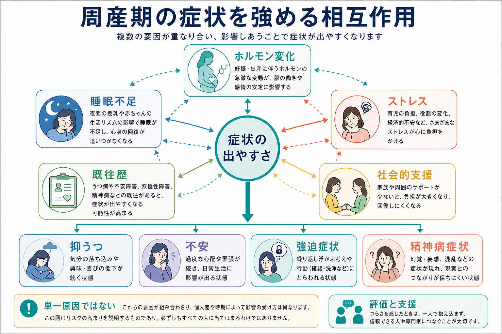
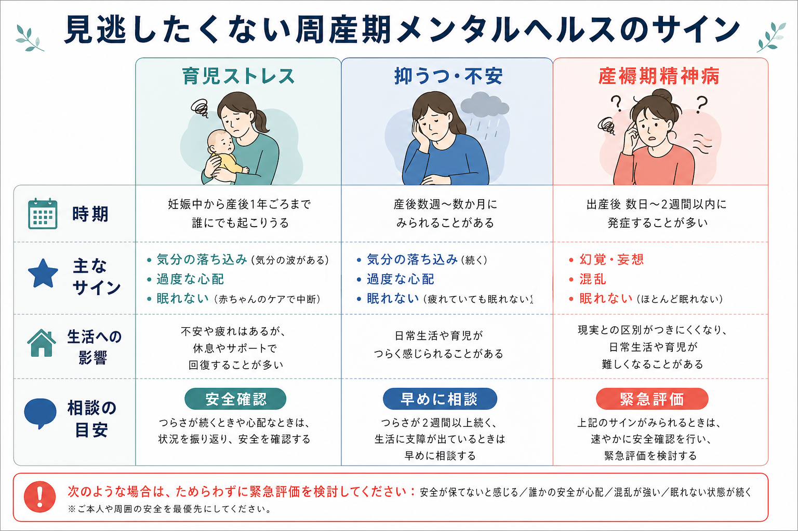

# 周産期メンタルヘルスの疾患には何があるのか

## 要点

- 周産期メンタルヘルスは、妊娠中から産後1年ごろまでに新たに生じる、または既存疾患が再燃・悪化する精神健康上の問題を扱う領域である。ACOG や NICE は、抑うつ、不安症、双極性障害、精神病症状、自殺リスク、摂食障害、物質使用などを、周産期ケアの中で系統的に評価する対象としている[1][3]。
- 最も頻度が高いのは抑うつと不安であり、NICE は妊娠中に抑うつ約12%、不安約13%、産後1年では抑うつ・不安が15-20%にみられると整理している[3]。
- 産後数日から数週に急速に現れる幻覚、妄想、混乱、躁状態、ほとんど眠れない状態は、[[産褥期精神病とは何か|産褥期精神病]]や躁病・混合状態を疑う重要なサインであり、産後うつ病と同じ枠でゆっくり経過観察してよい状態ではない[5][6]。
- 周産期の疾患は、ホルモン変化だけで説明できない。睡眠不足、身体回復、乳児ケア、既往歴、双極性障害への脆弱性、トラウマ、暴力、貧困、社会的孤立、支援資源へのアクセスが重なって症状の出やすさを変える[1][4]。
- 本稿は教育・研究目的の整理であり、個別の診断や治療指示ではない。安全が保てない、希死念慮がある、乳児への危害が心配、混乱や幻覚・妄想がある場合は、速やかな専門的評価が必要である。

## この記事で答える問い

1. 周産期メンタルヘルスでは、どのような疾患・症状群を考えるのか。
2. 妊娠中、出産直後、産後数週、産後1年という時期で、見え方はどう変わるのか。
3. 抑うつ、不安、双極性障害、産褥期精神病はどこで重なり、どこで区別するのか。
4. 臨床・研究では、なぜ「疾患名」だけでなく、安全、生活機能、母子関係、支援体制を同時にみるのか。

## まず結論

周産期メンタルヘルスの疾患は、ひとことで「産後うつ」とまとめるより、少なくとも次の層に分けて考えると見通しがよい。

| 層 | 代表的な状態 | 見るべきポイント |
|---|---|---|
| 気分症状 | [[産後うつ病とは何か|産後うつ病]]、大うつ病エピソード、抑うつを伴う適応反応 | 気分の落ち込み、興味・喜びの低下、罪悪感、疲労、睡眠、希死念慮、育児への影響 |
| 不安・強迫・トラウマ | [[不安症群とは何か|不安症群]]、パニック症、全般不安症、強迫症状、出産体験に関連するPTSD | 過度な心配、確認、侵入思考、回避、過覚醒、出産体験の再体験 |
| 双極スペクトラム | [[双極性障害とは何か|双極性障害]]、躁病・軽躁病、混合性特徴 | 眠らなくても活動できる、易怒性、高揚、浪費・衝動、抑うつ治療前の双極性評価 |
| 精神病症状 | 産褥期精神病、精神病性うつ病、躁病に伴う精神病症状 | 幻覚、妄想、混乱、まとまりにくい行動、安全確認、緊急評価 |
| 併存・背景要因 | 摂食障害、物質使用障害、睡眠障害、身体疾患、DV・トラウマ | 身体状態、育児環境、支援不足、社会的リスク、乳児への影響 |

DSM-5 以降の「周産期発症」指定は、気分エピソードが妊娠中または出産後4週以内に始まる場合に用いられるが、臨床・公衆衛生では産後1年までを広く追跡することが多い[7]。したがって、分類上の指定と、支援上の「周産期」は完全には同じではない。

## 背景

妊娠・出産・産後は、身体的変化、睡眠の断片化、家族役割の変化、乳児ケア、授乳、就労・経済面の変化が短期間に重なる時期である。WHO は、周産期メンタルヘルスを母子保健サービスに統合し、スティグマの少ない環境で症状を見つけ、地域文脈に合った支援につなぐことを重視している[4]。

重要なのは、周産期の精神症状を「母親としての能力」や「気持ちの弱さ」と混同しないことである。多くの症状は、通常の育児ストレスと連続的に見えるが、持続、重症度、生活機能の低下、安全リスク、精神病症状の有無によって臨床的意味が変わる。ACOG は、妊娠中から産後にかけて標準化された尺度で抑うつ・不安を評価し、スクリーニングだけで終わらせず、診断評価、治療、フォローアップにつなげる体制を求めている[1]。

## 基本概念

### 周産期抑うつ

周産期抑うつは、妊娠中または産後に現れる抑うつ症状・大うつ病エピソードを含む。[[大うつ病性障害とは何か|大うつ病性障害]]と同じく、気分の落ち込み、興味・喜びの低下、疲労、睡眠や食欲の変化、集中困難、罪悪感、希死念慮などが問題になる。ただし周産期では、乳児のケア、授乳、夜間対応、身体回復が症状の表れ方を変えるため、「疲れているだけ」と「支援や治療を要する抑うつ」を丁寧に分ける必要がある[1][3]。

### 周産期不安・強迫症状・PTSD

不安は周産期に非常によくみられる。過度な心配、パニック発作、健康不安、乳児の安全確認、出産体験の再体験、回避、過覚醒として現れることがある。NICE は、周産期の不安症にパニック症、全般不安症、強迫症、PTSD、出産恐怖などが含まれ、抑うつと併存しやすいと整理している[3]。強迫症状では、本人が望まない侵入思考が強い苦痛を伴って現れることがあり、精神病性の妄想や命令性幻聴とは評価の仕方が異なる。

### 双極性障害と産後の再燃

[[双極I型障害とは何か|双極I型障害]]や[[双極II型障害とは何か|双極II型障害]]では、産後に再燃・初発のリスクが高まる。産後に抑うつとして見えていても、過去の軽躁、躁病、混合性特徴を確認しないまま抗うつ治療だけを進めると、躁転や混合状態を見落とす可能性がある。ACOG も、抑うつ・不安への薬物療法を始める前に双極性障害のスクリーニングを行うことを推奨している[1]。

### 産褥期精神病

産褥期精神病は、出産後数日から数週に急速に現れる精神科救急に近い状態である。幻覚、妄想、混乱、まとまりにくい行動、著しい不眠、躁状態、抑うつ、乳児に関する奇妙で切迫した確信などが組み合わさることがある。頻度は低いが、産後うつ病より緊急性が高く、本人と乳児の安全評価を最優先する[5][6]。

## 仕組み

周産期メンタルヘルスの仕組みは、単一の生物学的原因ではなく、複数要因の相互作用として捉えるのが現実的である。

第一に、妊娠・出産に伴う内分泌変化、免疫変化、概日リズムの乱れが、気分調節や睡眠覚醒に影響する。産褥期精神病のレビューでは、内分泌、免疫、概日リズムの急激な変化が、双極スペクトラムの脆弱性をもつ人で精神病・躁症状を誘発しうると整理されている[6]。

第二に、睡眠不足は症状の増幅因子である。夜間授乳、乳児の泣き、身体痛、生活リズムの崩れは、抑うつ、不安、易怒性、混合状態、躁状態の評価を難しくする。とくに双極性障害では睡眠遮断が再燃の引き金になりうるため、「眠れない」の内容を、疲れているのに眠れないのか、眠らなくても活動できるのかに分ける必要がある。

第三に、社会的文脈が強く影響する。パートナーや家族の支援、経済的安定、住居、移住、暴力、孤立、文化的スティグマ、医療アクセスは、症状の発見と回復の両方に関わる。WHO は、母子保健の通常サービスの中でメンタルヘルスを扱うことで、支援への接続を早め、本人が安全に困難を話せる環境を作ることを重視している[4]。

## 図解

次の図は、通常の育児ストレス、抑うつ・不安、産褥期精神病を大まかに比較したものである。境界は機械的ではないが、急速な悪化、混乱、幻覚・妄想、ほとんど眠れない状態、安全が保てない感じは、早い段階で専門的評価につなげる目安になる。

## 臨床・研究との接続

臨床では、疾患名だけでなく、発症時期、既往歴、現在の安全、乳児ケア、睡眠、支援体制を同時に確認する。ACOG は、抑うつ・不安のスクリーニング、双極性障害の確認、自傷・自殺に関する肯定回答があった場合の即時評価を重視している[1]。NICE も、自傷、希死念慮、乳児や他者へのリスク、物質使用、DV、社会的孤立を含めたリスク評価を推奨している[3]。

研究では、自己記入尺度による有症状率と、構造化面接による診断率が一致しないことに注意が必要である。スクリーニングは「困っている人を拾い上げる」ために有用だが、診断そのものではない。また、周産期研究では、妊娠中発症と産後発症、産後4週以内と産後1年以内、抑うつ単独と双極スペクトラム、精神病症状の有無を分けないと、異なる病態が混ざる。

治療や支援については、本稿では詳細な薬物選択を扱わない。ACOG の治療ガイドラインは、抑うつ、不安症、双極性障害、急性精神病について、妊娠・授乳中のリスクとベネフィットを個別に検討する必要を強調している[2]。実践上は、心理社会的支援、心理療法、薬物療法、睡眠確保、家族支援、産科・小児科・精神科の連携が組み合わされる。

## よくある誤解

### 誤解1: 周産期メンタルヘルスは産後うつだけを指す

実際には、抑うつだけでなく、不安症、強迫症状、PTSD、双極性障害、産褥期精神病、摂食障害、物質使用、睡眠障害、自殺リスクなどを含む。産後うつは重要だが、それだけに絞ると、躁状態や精神病症状を見落とす。

### 誤解2: 産後に気分が揺れるのはすべて正常な範囲である

軽い気分の揺れは多くの人に起こるが、症状が持続する、生活機能が落ちる、眠れない状態が続く、希死念慮がある、乳児への危害が心配、幻覚・妄想・混乱がある場合は、通常の範囲として片づけない。

### 誤解3: 乳児への侵入思考があれば、ただちに危険である

強迫症状では、本人が望まない侵入思考が強い苦痛を伴い、むしろ回避や確認を増やすことがある。一方、精神病症状では、妄想的確信、命令性幻聴、現実検討の低下、混乱が問題になる。両者は評価と対応が異なるため、内容だけでなく、本人の苦痛、確信度、行動、現実検討、安全をみる必要がある[1][3]。

### 誤解4: 支援を求めることは親としての失敗である

支援を求めることは、本人と乳児の安全を守る行動である。WHO は、スティグマの少ない母子保健サービスの中で、メンタルヘルスの困難を話せる環境を整えることを推奨している[4]。

## 関連ノート

- [[産後うつ病とは何か]]
- [[産褥期精神病とは何か]]
- [[不安症群とは何か]]
- [[強迫症とは何か]]
- [[PTSDとは何か]]
- [[双極性障害とは何か]]
- [[躁病エピソードとは何か]]
- [[精神病性うつ病とは何か]]
- [[自殺リスク評価では何を聞くべきか]]
- [[睡眠覚醒障害群とは何か]]

MOC更新候補: `content/00_MOC/` 配下の精神医学・周産期メンタルヘルス関連MOCに、本記事と上記関連ノートをまとめて接続する。

## 理解チェック

1. 周産期メンタルヘルスを「産後うつ」だけで説明すると、どのような状態を見落としやすいか。
2. 産褥期精神病を疑うサインには何があるか。
3. 抑うつ・不安の評価前後で、双極性障害の既往や軽躁症状を確認する理由は何か。
4. スクリーニング尺度の陽性と診断は、なぜ同じではないのか。
5. 支援体制、睡眠、DV、経済的困難は、なぜ疾患分類とは別に確認する必要があるのか。

## 参考文献

[1] American College of Obstetricians and Gynecologists. (2023). *Screening and Diagnosis of Mental Health Conditions During Pregnancy and Postpartum: ACOG Clinical Practice Guideline No. 4*. Obstetrics & Gynecology, 141(6), 1232-1261. https://www.acog.org/clinical/clinical-guidance/clinical-practice-guideline/articles/2023/06/screening-and-diagnosis-of-mental-health-conditions-during-pregnancy-and-postpartum

[2] American College of Obstetricians and Gynecologists. (2023). *Treatment and Management of Mental Health Conditions During Pregnancy and Postpartum: ACOG Clinical Practice Guideline No. 5*. Obstetrics & Gynecology, 141(6), 1262-1288. https://doi.org/10.1097/AOG.0000000000005202

[3] National Institute for Health and Care Excellence. (2014, updated 2020). *Antenatal and postnatal mental health: clinical management and service guidance (CG192)*. https://www.nice.org.uk/guidance/cg192

[4] World Health Organization. (2022). *WHO guide for integration of perinatal mental health in maternal and child health services*. https://www.who.int/publications/i/item/9789240057142

[5] Sit, D., Rothschild, A. J., & Wisner, K. L. (2006). A review of postpartum psychosis. *Journal of Women's Health*, 15(4), 352-368. https://doi.org/10.1089/jwh.2006.15.352

[6] Bergink, V., Rasgon, N., & Wisner, K. L. (2016). Postpartum psychosis: madness, mania, and melancholia in motherhood. *American Journal of Psychiatry*, 173(12), 1179-1188. https://doi.org/10.1176/appi.ajp.2016.16040454

[7] Sharma, V., & Mazmanian, D. (2014). The DSM-5 peripartum specifier: prospects and pitfalls. *Archives of Women's Mental Health*, 17, 171-173. https://doi.org/10.1007/s00737-013-0406-3

[8] Howard, L. M., Molyneaux, E., Dennis, C.-L., Rochat, T., Stein, A., & Milgrom, J. (2014). Non-psychotic mental disorders in the perinatal period. *The Lancet*, 384(9956), 1775-1788. https://doi.org/10.1016/S0140-6736(14)61276-9

## 未解決問題

- 周産期の疾患分類を、DSM/ICD の発症時期指定と、産後1年までの臨床支援単位のどちらに合わせるべきか。
- 侵入思考、強迫症状、精神病症状、乳児への危害リスクを、短時間の母子保健面接でどこまで精度よく見分けられるか。
- 睡眠確保、家族支援、母子同室/分離、授乳支援、薬物療法をどのように組み合わせると、本人と乳児の双方に最もよいアウトカムをもたらすか。
