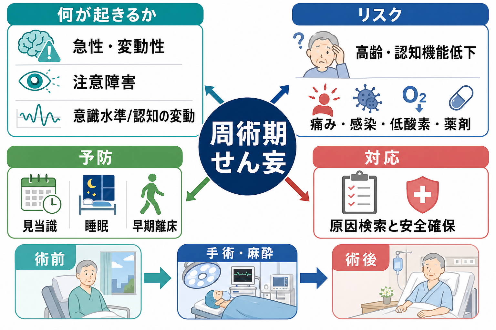
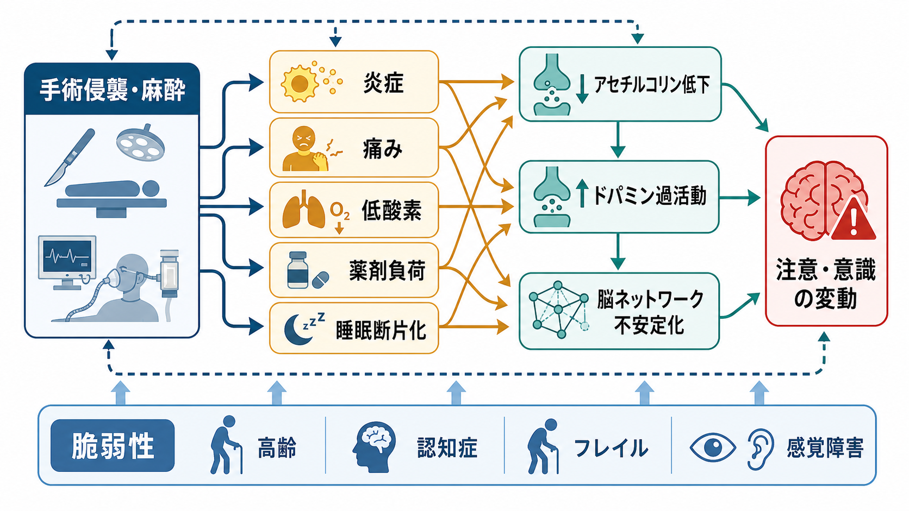
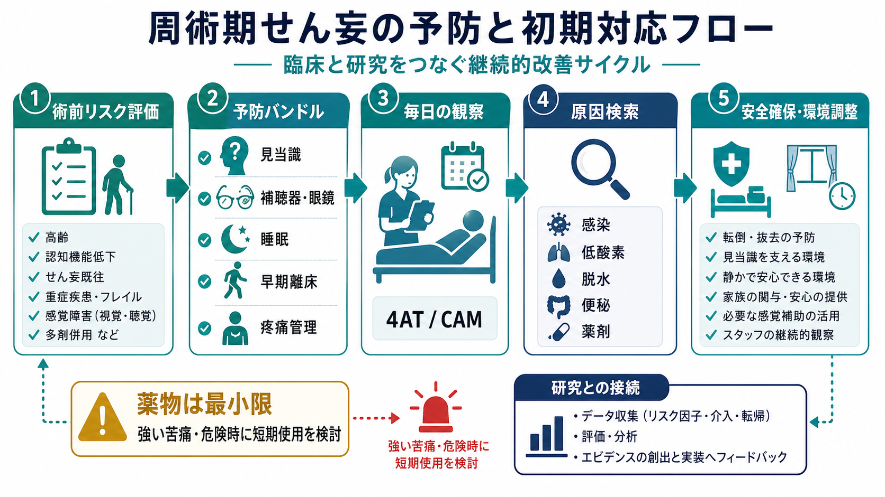

# 周術期せん妄とは何か

## 要点

- 周術期せん妄は、手術・麻酔・術後合併症などを背景に、数時間から数日の単位で出現し、日内で変動する注意と意識・認知の障害である。
- 高齢、既存の[[認知症とは何か]]、[[アルツハイマー型認知症とは何か]]、[[レビー小体型認知症とは何か]]、感覚障害、フレイル、多剤併用は「脆弱性」を高め、疼痛、感染、低酸素、脱水、便秘、睡眠断片化、抗コリン薬や鎮静薬などが誘因になる。
- 予防の中心は、単一薬剤ではなく、見当識づけ、睡眠、早期離床、疼痛管理、補聴器・眼鏡、脱水・便秘・低酸素・感染・薬剤負荷への対応を組み合わせる多要素介入である。
- 発症時は、まず「せん妄を起こした原因」を探し、安全確保と環境調整を行う。薬物療法は、強い苦痛や危険があり非薬物的対応だけでは不十分な場合に、短期・最小限で検討される。

## この記事で答える問い

1. 周術期せん妄は、通常の不安、寝ぼけ、[[認知症とは何か]]と何が違うのか。
2. 手術・麻酔のあと、なぜ注意や意識が急に変動するのか。
3. 予防と対応では、何を優先して考えるべきか。

## まず結論

周術期せん妄は、「手術後に一時的に混乱すること」だけを指す軽いラベルではない。DSM-5 のせん妄概念では、注意と意識の障害、短時間での発症、日内変動、記憶・見当識・言語・知覚などの認知変化、身体疾患・薬剤・中毒/離脱などの生理学的原因との関連が重視される[1]。周術期では、この生理学的原因が手術侵襲、麻酔、疼痛、炎症、低酸素、感染、薬剤、睡眠断片化、環境変化として重なりやすい。

したがって対応の基本は、「落ち着かせる薬を出す」より先に、急性の脳機能不全として原因を探し、環境を整え、患者の見当識・睡眠・感覚入力・活動性・疼痛を支えることである。NICE は、入院時のリスク評価、日々の観察、4AT や CAM-ICU/ICDSC などによる評価、多要素予防、原因検索、再見当識づけを推奨している[2]。

## 背景

せん妄は高齢入院患者で多く、術後には手術の種類や患者背景によって頻度が大きく変わる。2025年の米国大規模コホートでは、65歳以上の主要非心臓手術入院 5,530,054 件のうち、コード化された術後せん妄は 3.6% だったが、術後せん妄は死亡または重大合併症、30日死亡、非自宅退院と強く関連していた[3]。この 3.6% は診療録・請求データに基づく値であり、臨床的には過少検出の可能性がある。

研究上は、麻酔・手術に関連する認知変化を「周術期神経認知障害」という上位概念で整理する提案があり、その中で術後せん妄は急性イベントとして位置づけられる[4]。遅れて残る認知低下や長期の認知障害とは連続する面を持つが、せん妄は急性・変動性・注意障害を中核とする点で区別される。

## 基本概念

### 急性・変動性

せん妄では、昨日までの状態から急に変わったか、1日の中でよくなったり悪くなったりするかが重要である。眠そう、反応が遅い、話が通じにくい、点滴や尿道カテーテルを抜こうとする、夜間だけ幻視が強い、といった変化はすべて評価対象になる。活動性が高い「過活動型」だけでなく、静かで眠そうに見える「低活動型」も見逃されやすい[2]。

### 注意の障害

中心症状は記憶力低下そのものではなく、注意を向け、保ち、切り替える力の障害である。会話の途中で話題を追えない、指示が入らない、検査やリハビリに集中できないといった形で現れる。[[せん妄と認知症はどう違うのか]]で整理されるように、認知症は慢性的な認知機能低下を主軸とするのに対し、せん妄は急性で変動する注意・意識の障害を主軸にする。

### 「術後の不穏」だけではない

周術期せん妄は、興奮や不穏が目立つケースだけではない。低活動型では、患者は静かで、眠そうで、食事や離床が進まず、単に「疲れている」と見なされることがある。NICE も、引きこもり、反応の遅さ、活動性低下、食欲低下などの低活動型サインに注意するよう述べている[2]。

## 仕組み

周術期せん妄は単一の原因で起こるというより、「脆弱な脳」に「急性の身体負荷」が重なることで起こる。高齢、既存の認知症、脳血管障害、[[不眠障害とは何か]]、感覚障害、多剤併用などは予備力を下げる。そこへ、手術侵襲による炎症、疼痛、低酸素、感染、脱水、便秘、尿閉、睡眠断片化、薬剤負荷が加わる。

機序としては、末梢炎症が血液脳関門やミクログリア活性化を介して神経炎症を増幅する経路、アセチルコリン低下とドパミン過活動を含む神経伝達の不均衡、睡眠覚醒リズムの破綻、前頭頭頂ネットワークや注意ネットワークの不安定化が想定されている[5]。ただし、これらは患者ごとに同じ重みで働くわけではなく、研究上もまだ統合モデルの検証が続いている。

## 図解

周術期せん妄を実務的に見ると、以下の 3 層に分けると理解しやすい。

| 層 | 見るもの | 例 |
|---|---|---|
| 脆弱性 | せん妄を起こしやすい土台 | 高齢、認知症、フレイル、感覚障害、多剤併用 |
| 誘因 | 周術期に加わる急性負荷 | 疼痛、感染、低酸素、脱水、便秘、尿閉、薬剤、睡眠断片化 |
| 表現型 | 観察される変化 | 注意障害、見当識障害、幻視、睡眠覚醒リズムの乱れ、過活動/低活動 |

この層を分けると、「せん妄が出たから鎮静する」ではなく、「どの誘因を減らせるか」「どの脆弱性を補えるか」という実装可能な問いに変えられる。

## 臨床・研究との接続

### リスク評価

術前からのリスク評価では、年齢、既存の認知機能低下、重症疾患、股関節骨折などが基本的なリスクとして扱われる[2]。実際の周術期では、これにフレイル、感覚障害、多剤併用、アルコール使用、睡眠障害、既往のせん妄、手術侵襲の大きさなどを重ねて考える。

### 予防

予防の中核は多要素介入である。NICE は、見当識づけ、脱水・便秘、低酸素、感染、早期離床、疼痛、薬剤レビュー、栄養、感覚障害、睡眠を個別に評価し、必要に応じて組み合わせて介入することを推奨している[2]。米国老年医学会の術後せん妄ガイドラインも、高齢手術患者では非薬物的な多要素予防と、発症時の原因検索・安全確保を中心に置く[8]。多要素非薬物的介入のメタ解析でも、せん妄発生の低下が示されており、転倒の減少にも関連していた[6]。

### 早期発見

CAM は非精神科臨床家がせん妄を同定するために開発された評価法であり、急性発症・変動性、注意障害、思考のまとまりのなさ、意識水準の変化を組み合わせて評価する[7]。NICE は 2023 年更新で、一般病棟などでは 4AT、術後回復室や集中治療領域では CAM-ICU または ICDSC の使用を推奨している[2]。評価尺度は診断を助けるが、背景情報、家族からのベースライン情報、身体診察、検査を置き換えるものではない。

### 初期対応

発症時には、感染、低酸素、低血圧、脱水、電解質異常、低血糖、貧血、尿閉、便秘、疼痛、薬剤、離脱、睡眠不足、環境変化などを確認する。安全確保は必要だが、身体拘束や過鎮静は転倒、誤嚥、廃用、せん妄遷延につながりうるため、環境調整、家族の関与、眼鏡・補聴器、明るさ、時計・カレンダー、昼夜リズム、早期離床を優先する。

薬物療法は、せん妄そのものを治す第一選択ではない。NICE は、苦痛が強い、または本人・他者への危険があり、言語的・非言語的な鎮静化が不十分な場合に、短期のハロペリドールを慎重に検討するとしているが、心臓・神経学的副作用、とくにパーキンソン病やレビー小体型認知症では注意が必要である[2]。これは個別処方の指示ではなく、臨床判断でリスクと利益を評価する枠組みである。

## よくある誤解

### 「麻酔が残っているだけ」

麻酔薬の影響は重要だが、術後せん妄をそれだけに帰すと、感染、低酸素、疼痛、尿閉、便秘、薬剤相互作用などを見逃す。時間経過と変動性、注意障害、身体状態の変化を合わせてみる必要がある。

### 「暴れる人だけがせん妄」

低活動型せん妄は、静かで眠そうに見えるため見逃されやすい。反応の遅さ、食事や離床の低下、会話の追えなさ、日中の傾眠も重要なサインである[2]。

### 「薬で眠らせればよい」

過鎮静は評価を難しくし、呼吸抑制、転倒、誤嚥、廃用を悪化させうる。まず原因検索、疼痛と身体合併症の管理、環境調整、見当識づけ、睡眠保護を行い、薬物は限定的な役割として考える。

### 「認知症なら仕方ない」

認知症は強いリスク因子だが、せん妄は予防・軽減できる部分がある。[[レビー小体型認知症とは何か]]やパーキンソン病関連の認知症では抗精神病薬への過敏性も問題になるため、むしろ早期発見と非薬物的対応が重要になる。

## 関連ノート

- [[せん妄とは何か]]
- [[せん妄と認知症はどう違うのか]]
- [[認知症とは何か]]
- [[アルツハイマー型認知症とは何か]]
- [[レビー小体型認知症とは何か]]
- [[不眠障害とは何か]]
- [[抗コリン性せん妄とは何か]]
- [[薬剤性精神病とは何か]]
- [[器質性精神病とは何か]]

## MOC更新候補

- `content/00_MOC/` 配下の精神医学・症候学・高齢者医療関連 MOC に追加候補。
- 並列ジョブとの競合を避けるため、本記事作成時点では MOC ファイルを直接更新していない。

## 理解チェック

1. 周術期せん妄で「急性・変動性」と「注意障害」が重要なのはなぜか。
2. 低活動型せん妄が見逃されやすい理由は何か。
3. 予防バンドルに、見当識、睡眠、早期離床、補聴器・眼鏡、疼痛管理、薬剤レビューが含まれる理由を説明できるか。
4. 発症時に、薬物療法より先に確認すべき身体要因を 5 つ挙げられるか。

## 未解決問題

- どの患者に、どの予防バンドル要素をどの強度で届けると最も効果的かは、手術種別や施設体制によって異なる。
- 神経炎症、神経伝達、睡眠覚醒リズム、脳ネットワーク変化を統合するバイオマーカーは、まだ臨床で標準化されていない。
- 術後せん妄と長期の認知機能低下の因果関係は、共通脆弱性、手術侵襲、せん妄そのものの影響を分けて検証する必要がある。

## 参考文献

[1] MacLullich, A. M. J., et al. (2014). The DSM-5 criteria, level of arousal and delirium diagnosis: inclusiveness is safer. *BMC Medicine*, 12, 141. https://doi.org/10.1186/s12916-014-0141-2

[2] National Institute for Health and Care Excellence. (2010, updated 2023). *Delirium: prevention, diagnosis and management in hospital and long-term care* (CG103). https://www.nice.org.uk/guidance/CG103

[3] Lander, H. L., et al. (2025). Postoperative Delirium in Older Adults Undergoing Noncardiac Surgery. *JAMA Network Open*, 8(7), e2519467. https://doi.org/10.1001/jamanetworkopen.2025.19467

[4] Evered, L., Silbert, B., Knopman, D. S., et al. (2018). Recommendations for the nomenclature of cognitive change associated with anaesthesia and surgery-2018. *British Journal of Anaesthesia*, 121(5), 1005-1012. https://doi.org/10.1016/j.bja.2017.11.087

[5] Xiao, M. Z., Liu, C. X., Zhou, L. G., Yang, Y., & Wang, Y. (2023). Postoperative delirium, neuroinflammation, and influencing factors of postoperative delirium: A review. *Medicine*, 102(8), e32991. https://doi.org/10.1097/MD.0000000000032991

[6] Hshieh, T. T., Yue, J., Oh, E., et al. (2015). Effectiveness of multicomponent nonpharmacological delirium interventions: a meta-analysis. *JAMA Internal Medicine*, 175(4), 512-520. https://doi.org/10.1001/jamainternmed.2014.7779

[7] Inouye, S. K., van Dyck, C. H., Alessi, C. A., Balkin, S., Siegal, A. P., & Horwitz, R. I. (1990). Clarifying confusion: the confusion assessment method. A new method for detection of delirium. *Annals of Internal Medicine*, 113(12), 941-948. https://doi.org/10.7326/0003-4819-113-12-941

[8] American Geriatrics Society Expert Panel on Postoperative Delirium in Older Adults. (2015). American Geriatrics Society abstracted clinical practice guideline for postoperative delirium in older adults. *Journal of the American Geriatrics Society*, 63(1), 142-150. https://doi.org/10.1111/jgs.13281
