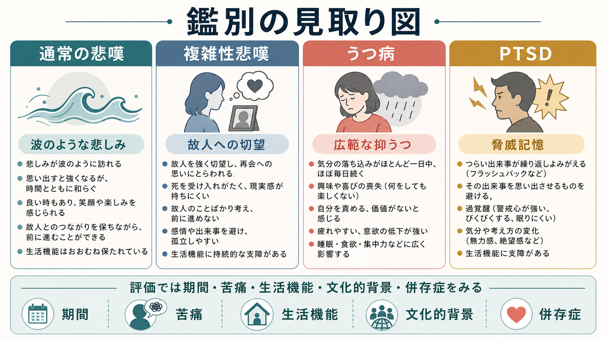
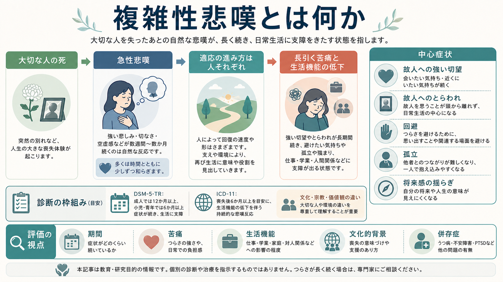
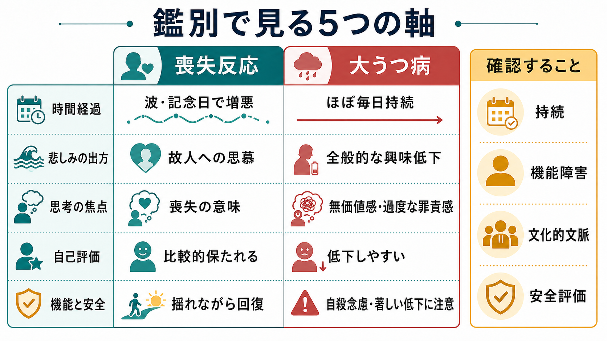

# 喪失反応と大うつ病はどう違うのか

## 要点

- 喪失反応は、重要な人や役割を失ったあとに生じる悲しみ、思慕、怒り、罪悪感、孤独、身体的不調を含む反応であり、それ自体は病気とは限らない。
- 大うつ病エピソードでは、抑うつ気分または興味・喜びの低下がほぼ毎日続き、睡眠、食欲、疲労、集中困難、無価値感、希死念慮などがまとまって生活機能を障害する[1][2]。
- 鑑別では「悲しいかどうか」ではなく、悲しみの出方、思考の焦点、自己評価、機能障害、自殺念慮、精神病症状、文化的文脈を見る。
- 喪失反応、大うつ病、遷延性悲嘆症は重なりうる。喪失が引き金でも、大うつ病エピソードが成立することがある[3][4]。
- この記事は教育・研究目的の整理であり、個別の診断や治療指示ではない。自殺念慮、強い絶望、精神病症状、著しいセルフネグレクトがある場合は、臨床的な安全評価を優先する。

## この記事で答える問い

1. 喪失反応と大うつ病エピソードは、どの臨床的特徴で区別するのか。
2. 「喪失があったから正常」「悲しんでいるからうつ病」と単純化できない理由は何か。
3. 遷延性悲嘆症は、大うつ病とどう違うのか。
4. 精神科面接では、どの順序で安全性と鑑別を確認するのか。

## まず結論

喪失反応では、悲しみはしばしば波のように来る。故人、失った関係、失った役割、記念日、思い出の場所などに触れたときに強まり、時間とともに少しずつ間隔が空くことがある。悲しみの中にも、短時間の安堵、笑い、他者とのつながり、故人への温かい記憶が混じりうる[3]。

大うつ病では、気分の落ち込みや興味・喜びの低下がより持続的で、喪失対象に限らず生活全体へ広がりやすい。自己評価は「大切な人を失ってつらい」から、「自分には価値がない」「生きている意味がない」という全般的な無価値感へ傾きやすい。睡眠、食欲、疲労、集中、精神運動、希死念慮がまとまって変化し、機能障害を伴う点も重要である[1][2]。

ただし、両者は排他的ではない。喪失反応の中に大うつ病が併存することも、喪失後に大うつ病が発症することもある。したがって鑑別は、「正常か病気か」を一回で判定する作業ではなく、時間経過、症状の質、生活機能、安全性、文化的文脈を反復して評価する作業である[2][4]。

## 背景

精神医学では長く、死別直後の抑うつ症状をどこまで大うつ病として扱うかが議論されてきた。DSM-5 以降は、喪失の文脈だけで大うつ病を除外するのではなく、症状の質、重症度、持続、機能障害、安全性を見て判断する方向が明確になった[1]。この点は、[[DSMとICDは何が違うのか|DSMとICD]]が単なる病名リストではなく、臨床記述と分類の枠組みであることとも関係する。

一方で、喪失反応を安易に病理化することにも注意が必要である。死別、離別、失職、病気による役割喪失などは、強い苦痛を伴っても、人間の生活史の中で起こりうる反応である。喪失後の悲しみには、文化、宗教、家族関係、葬送儀礼、故人との関係性、突然死か予期された死か、支援の有無が深く関わる[3][5]。

## 基本概念

### 喪失反応

喪失反応とは、大切な対象を失ったあとに生じる情動、認知、身体、行動の変化である。死別に限らず、健康、仕事、住まい、親密な関係、将来像、身体機能の喪失でも起こる。中心には「失ったものへの思慕」「現実を受け入れにくい感じ」「生活の再編成」がある。

急性悲嘆では、泣く、ぼんやりする、故人のことばかり考える、眠れない、食欲が落ちる、人に会いたくないなど、大うつ病と重なる症状が出る。Zisook と Shear は、通常の悲嘆でも情動・認知・社会・行動面の混乱が幅広く起こり、初期には強い苦痛が波として現れると整理している[3]。

### 大うつ病エピソード

大うつ病エピソードは、抑うつ気分または興味・喜びの低下を中核に、少なくとも同じ期間に複数の症状がまとまり、臨床的苦痛または社会的・職業的機能障害を起こす状態である[1][2]。典型的には、[[抑うつ気分とは何か|抑うつ気分]]、興味・喜びの低下、[[睡眠障害とは何か|睡眠障害]]、[[食欲低下とは何か|食欲や体重の変化]]、疲労、集中困難、精神運動制止または焦燥、無価値感・過度な罪責感、希死念慮が問題になる。

重要なのは、症状数だけで診断しないことである。NICE は、うつ病を評価するとき、症状数だけに頼らず、重症度、既往歴、持続、経過、機能障害、エピソードの長さを含めた包括的評価を推奨している[2]。

### 遷延性悲嘆症

遷延性悲嘆症は、喪失後の悲嘆が長期にわたり、強い思慕や故人へのとらわれ、回避、意味喪失、孤独、生活機能低下を伴う状態である。DSM-5-TR では成人で死別から少なくとも12か月、小児・青年で少なくとも6か月が経過していることが診断上の目安になる[5]。ICD-11 では、少なくとも6か月を最小の目安としつつ、その人の社会的・文化的・宗教的規範を明らかに超える悲嘆であることを重視する[6]。

遷延性悲嘆症は、大うつ病と同じではない。焦点は「自己全体の無価値」よりも、「故人への強い希求」「死の事実へのとらわれ」「喪失を想起させる状況の回避」「故人なしの生活への再関与困難」に置かれる[5][7]。

## 仕組み

喪失後の反応は、単一の「悲しみスイッチ」では説明できない。少なくとも、次の三つの過程が重なる。

第一に、愛着対象を失ったことへの分離苦痛である。故人や失った対象を探す、思い出す、近づきたいと感じる反応は、関係の重要性を反映する。通常の悲嘆では、この思慕が波として起こりながら、少しずつ生活の中に統合される[3]。

第二に、現実検討と意味づけの過程である。「本当に失ったのか」「なぜ起きたのか」「これからどう生きるのか」という問いは、喪失後の心理的再編成に関わる。急性期には信じられなさや怒りが強くても、それだけで病的とは言えない。

第三に、抑うつエピソードとしての全般化である。悲しみが喪失対象を越えて生活全体へ広がり、自己価値の低下、喜びの広範な喪失、著しい疲労、睡眠・食欲変化、希死念慮がまとまると、大うつ病として評価する必要が高まる[1][2]。

## 図解

下の図は、鑑別で見る軸を要約したものである。実際の面接では、表のどちらかに機械的に分類するのではなく、各軸の混ざり方を見る。

| 観点 | 喪失反応で目立ちやすい特徴 | 大うつ病で目立ちやすい特徴 |
|---|---|---|
| 時間経過 | 波があり、記念日や想起刺激で強まる | ほぼ毎日、持続的に落ち込む |
| 悲しみの焦点 | 故人・失った対象への思慕、会いたさ | 生活全体への興味低下、喜びの低下 |
| 自己評価 | 「もっとできたかもしれない」はあっても自己全体の価値は保たれやすい | 無価値感、過度または妄想的な罪責感 |
| ポジティブ感情 | 短い笑い、安堵、温かい記憶が混じりうる | 喜びや自己肯定的感情を感じにくい |
| 安全性 | 死者に会いたい気持ちはありうるが、具体的自殺意図とは区別する | 希死念慮、自殺念慮、計画、手段へのアクセスを必ず確認する |

## 臨床・研究との接続

臨床では、まず安全を確認する。自殺念慮、計画、意図、手段へのアクセス、過去の企図、物質使用、強い不眠、精神病症状、セルフネグレクトを確認する。NICE は、うつ病の人には自殺念慮と意図を直接尋ねることを推奨している[2]。この評価は、[[MSEで思考内容をどう評価するか]]や[[自殺念慮と自殺企図は何が違うのか]]と接続する。

次に、経過を時系列で見る。喪失の時期、初期反応、少し楽になる時間があるか、生活機能が戻っている領域があるか、記念日や場所で増悪するか、症状が喪失対象を越えて全般化しているかを確認する。急性期の強い悲嘆は、数日から数週間で単純に消えるとは限らない。重要なのは、固定化しているのか、揺れながら統合へ向かっているのかである[3]。

さらに、鑑別診断を広く取る。双極症の抑うつ相、物質使用、薬剤、身体疾患、認知症、せん妄、PTSD、適応反応症、遷延性悲嘆症が関わることがある。特に気分高揚・活動性増加の既往があれば、[[軽躁状態とは何か|軽躁状態]]を確認する。急性の意識変動や注意障害があれば、[[せん妄とは何か|せん妄]]を優先する。

研究面では、悲嘆とうつ病を同じ尺度だけで測ると、重なりと差異が見えにくい。悲嘆特有の思慕、回避、故人へのとらわれを測る尺度と、うつ病の気分・認知・身体症状を測る尺度を分けて考える必要がある。Prigerson らの研究は、遷延性悲嘆症の基準が、持続する苦痛と機能不全の高リスク群を識別しうることを示した[7]。一方で、文化的に長い喪の期間が期待される場合、それを直ちに病理化しない慎重さも必要である[6]。

## よくある誤解

### 誤解1: 喪失が理由なら、うつ病とは診断しない

喪失は大うつ病の引き金になりうる。喪失後であっても、持続的な抑うつ、広範な興味低下、無価値感、精神病症状、自殺念慮、著しい機能低下があれば、大うつ病エピソードとして評価する必要がある[1][2]。

### 誤解2: 悲しみが長い人は、すべて遷延性悲嘆症である

悲嘆の期間は文化、宗教、関係性、喪失の状況によって大きく異なる。ICD-11 は、期間だけでなく、その人の文化的・宗教的規範を明らかに超えるか、生活機能を有意に障害しているかを重視する[6]。

### 誤解3: 泣いていないなら悲嘆は軽い

悲嘆の表現は人によって違う。泣く人もいれば、仕事や手続きに没頭する人、身体症状として出る人、家族の前では感情を出さない人もいる。表情だけで軽重を決めず、主観的苦痛、生活機能、支援、文化的背景を確認する。

### 誤解4: 「死んだ人に会いたい」はすべて自殺念慮である

死者に会いたい、同じ場所に行きたいという思いは悲嘆の中で語られうる。ただし、具体的な自殺方法、計画、意図、準備行動、手段へのアクセスがあるかは別に確認する必要がある。ここを曖昧にせず、[[希死念慮とは何か]]や自殺念慮としての切迫度を評価する。

## 関連ノート

- [[抑うつ気分とは何か]]
- [[鑑別診断とは何か]]
- [[DSMとICDは何が違うのか]]
- [[精神科初診で何を確認するべきか]]
- [[精神状態診察MSEとは何か]]
- [[MSEで思考内容をどう評価するか]]
- [[希死念慮とは何か]]
- [[自殺念慮と自殺企図は何が違うのか]]
- [[精神科で生活機能をどう評価するか]]

## MOC更新候補

- `content/00_MOC/MOC_精神医学.md` がある場合、このノートを「気分症」「鑑別診断」「悲嘆・喪失」の項目に追加する候補。
- 並列生成ジョブとの競合を避けるため、このターンでは MOC 本体は更新しない。

## 理解チェック

1. 喪失反応の悲しみが「波のように来る」とは、臨床面接ではどのような質問で確認できるか。
2. 大うつ病を疑うとき、悲しみの強さ以外に必ず見るべき症状は何か。
3. 「故人に会いたい」と「自殺念慮」を区別するには、どの追加質問が必要か。
4. 遷延性悲嘆症を判断するとき、期間だけでなく文化的文脈を見るべき理由は何か。

## 未解決問題

- 喪失反応、大うつ病、遷延性悲嘆症を、臨床現場で短時間にどこまで信頼性高く分けられるか。
- 文化的な喪の規範と診断基準の境界を、国際比較研究でどのように扱うべきか。
- 喪失後早期の強い悲嘆のうち、どの特徴が後の遷延性悲嘆症や大うつ病を最もよく予測するか。
- 悲嘆への支援とうつ病治療を、併存例でどの順序・強度で組み合わせるべきか。

## 参考文献

[1] American Psychiatric Association. (2022). *Diagnostic and Statistical Manual of Mental Disorders* (5th ed., text rev.; DSM-5-TR). American Psychiatric Association Publishing. https://doi.org/10.1176/appi.books.9780890425787

[2] National Institute for Health and Care Excellence. (2022). *Depression in adults: treatment and management* (NICE guideline NG222). https://www.nice.org.uk/guidance/ng222/chapter/Recommendations

[3] Zisook, S., & Shear, K. (2009). Grief and bereavement: What psychiatrists need to know. *World Psychiatry, 8*(2), 67-74. https://doi.org/10.1002/j.2051-5545.2009.tb00217.x

[4] American Psychiatric Association. (n.d.). Prolonged Grief Disorder. *Psychiatry.org*. Retrieved April 28, 2026, from https://www.psychiatry.org/patients-families/prolonged-grief-disorder

[5] Shear, M. K. (2015). Clinical practice: Complicated grief. *New England Journal of Medicine, 372*(2), 153-160. https://doi.org/10.1056/NEJMcp1315618

[6] World Health Organization. (2025). *ICD-11 for Mortality and Morbidity Statistics: 6B42 Prolonged grief disorder*. https://icd.who.int/browse/2025-01/mms/en#1183832314

[7] Prigerson, H. G., Horowitz, M. J., Jacobs, S. C., Parkes, C. M., Aslan, M., Goodkin, K., et al. (2009). Prolonged grief disorder: Psychometric validation of criteria proposed for DSM-V and ICD-11. *PLoS Medicine, 6*(8), e1000121. https://doi.org/10.1371/journal.pmed.1000121

## 更新ログ

- 2026-04-28: 初版作成。喪失反応、大うつ病エピソード、遷延性悲嘆症の鑑別を整理し、画像3点を追加。
