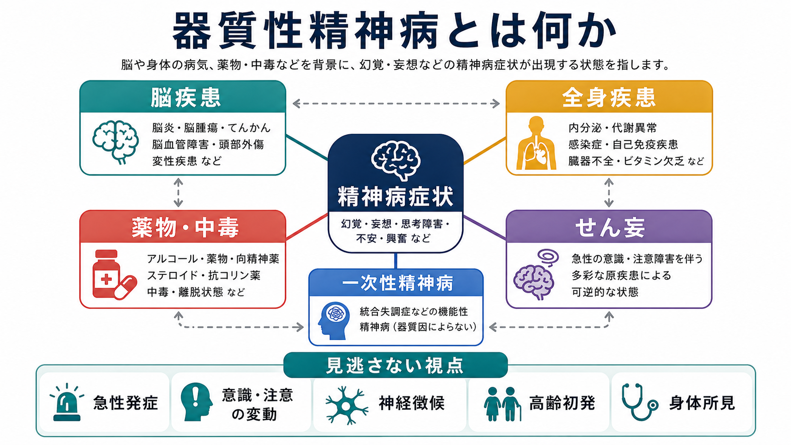
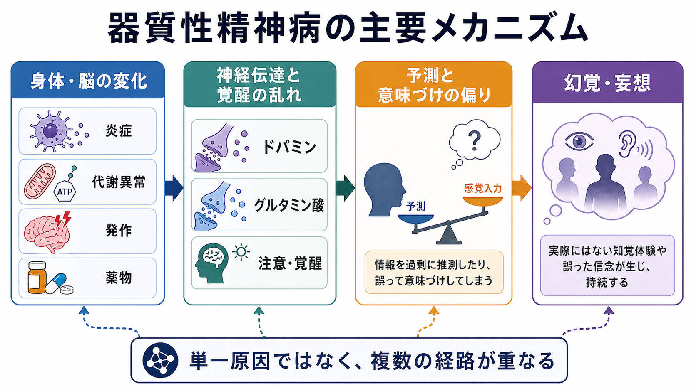
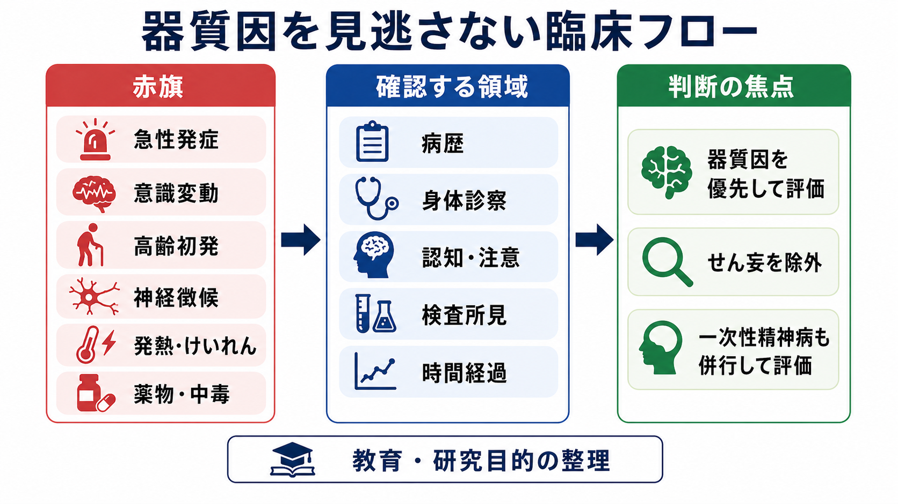

# 器質性精神病とは何か

## 要点

- 器質性精神病とは、[[脳・神経科学|脳]]や身体疾患、薬物・中毒、代謝異常などを背景に、幻覚・妄想・思考のまとまりにくさなどの精神病症状が前景化する状態を指す臨床的な見方である。ICD-11 では「他に分類される疾患による二次性精神病症候群」という発想が置かれ、DSM-5-TR でも「他の医学的疾患による精神病性障害」が区別される[1][2]。
- 重要なのは、「器質性」か「一次性」かを一回で決め切ることではなく、[[精神科診断における除外診断とは何か|除外診断]]を固定した手続きではなく更新可能な仮説として扱うことである。[[統合失調症とは何か|統合失調症]]や[[初回エピソード精神病とは何か|初回エピソード精神病]]を考える場合でも、身体疾患・薬物・[[せん妄とは何か|せん妄]]を同時に評価する必要がある[3][7]。
- 急性発症、意識・注意の変動、高齢初発、神経徴候、発熱・けいれん、頭部外傷、薬物・中毒、身体所見の変化は、器質因を優先して考える赤旗になる[3][4][5]。
- 本記事は教育・研究目的の概説であり、個別の診断や治療指示ではない。

## この記事で答える問い

1. 器質性精神病とは、一次性の精神病やせん妄と何が違うのか。
2. どのような身体・神経・薬物要因が、精神病症状として現れるのか。
3. 見逃しを減らすために、どのような赤旗と評価軸を持てばよいのか。
4. 臨床と研究では、この概念をどのように扱うべきか。

## まず結論

器質性精神病は、精神病症状を「心の病気か身体の病気か」という二分法で分けるためのラベルではない。むしろ、幻覚や妄想の背後に、脳炎、てんかん、脳腫瘍、脳血管障害、認知症、内分泌・代謝異常、感染症、自己免疫疾患、薬物・中毒、離脱などの可逆的または進行性の原因が隠れていないかを問い直すための臨床的な視点である[1][3][8]。

一次性精神病と器質性精神病は、実際には排他的とは限らない。もともと精神病性障害の脆弱性がある人に身体疾患や薬物が加わることもあれば、身体疾患が最初は精神症状だけに見えることもある。そのため、診断名だけで思考を止めず、時間経過、意識・注意、身体所見、神経学的所見、薬物歴、検査所見を組み合わせて、仮説を更新していくことが中心になる[3][7]。

## 背景

精神病症状というと、幻聴、被害妄想、関係妄想、思考のまとまりにくさがすぐに想起される。しかし、これらは特定の疾患に固有の現象ではない。脳の炎症、代謝異常、睡眠覚醒リズムの破綻、薬物の作用、神経変性、てんかん発作、自己免疫性脳炎なども、知覚や信念形成の異常として表面化しうる[3][5][6]。

この点で、器質性精神病は[[統合失調症の陽性症状とは何か|陽性症状]]の有無だけでは判断できない。むしろ「なぜこの時期に、なぜこの経過で、なぜこの人に出たのか」を問う。たとえば高齢で初発した幻視、数時間から数日の意識変動を伴う妄想、発熱やけいれん後の幻覚、急な薬剤変更後の精神症状は、一次性精神病だけで説明する前に、器質因や[[物質誘発性精神病とは何か|物質誘発性精神病]]、[[薬剤性精神病とは何か|薬剤性精神病]]を考える必要がある[3][4][8]。

## 基本概念

### 器質性という語の注意点

「器質性」は、脳や身体に何らかの病態があるという含意を持つが、現代の精神医学では少し注意が必要な語である。一次性精神病にも神経発達、神経伝達、脳ネットワークの変化は関わる。したがって「器質性」は「脳に原因がある病気」で、「非器質性」は「脳と関係ない病気」という意味ではない。

実用上は、器質性精神病を「通常の精神病性障害として説明する前に、特定の身体疾患、神経疾患、薬物・中毒、離脱、代謝異常などでよりよく説明できないかを検討すべき状態」と捉えるとよい。ICD-11 と DSM-5-TR はいずれも、精神病症状が他の医学的状態や物質の直接的な影響として理解される場合を、一次性の精神病性障害と区別する枠組みを持つ[1][2]。

### せん妄との関係

器質性精神病とせん妄は重なるが、同じではない。[[せん妄とは何か|せん妄]]では、急性発症、日内変動、注意障害、意識水準や覚醒の変動が中核になる。幻覚や妄想が目立つこともあるが、評価の軸は「精神病症状があるか」よりも、「注意と意識が変動しているか」である[4]。

一方、器質性精神病という言い方は、せん妄を含みうる広い臨床的視点であり、せん妄ほど明瞭な意識変動がない場合にも用いられる。たとえば自己免疫性脳炎、側頭葉てんかん、パーキンソン病関連の精神病、内分泌疾患、薬剤性精神病では、経過のある時点で精神病症状が前景化し、せん妄だけでは捉えきれないことがある[3][5][6]。

### 一次性精神病との関係

一次性精神病は、身体疾患や物質だけでは十分に説明できない精神病性障害を指す。[[統合失調症とは何か|統合失調症]]、統合失調感情障害、妄想性障害、短期精神病性障害などがここに含まれる。しかし実際の診療では、一次性精神病と器質因の影響はしばしば併存する。

たとえば、統合失調症の人が感染症や脱水でせん妄を起こすこともある。薬物使用が一次性精神病のリスクや再発を高めることもある。逆に、自己免疫性脳炎やてんかんが最初は[[急性一過性精神病性障害とは何か|急性精神病]]のように見えることもある。このため、鑑別は一度きりではなく、経過観察と再評価を含むプロセスとして扱う必要がある[3][5][7]。

## 仕組み

器質性精神病のメカニズムは単一ではない。少なくとも、次の経路が重なりうる。

1. 脳の炎症や自己免疫反応により、シナプス伝達やネットワーク同期が乱れる。
2. 代謝異常、低酸素、感染、内分泌異常により、覚醒・注意・記憶の統合が崩れる。
3. 薬物や離脱により、ドパミン、グルタミン酸、GABA、アセチルコリンなどのバランスが変わる。
4. てんかん、脳腫瘍、脳血管障害、神経変性疾患により、局所ネットワークと広域ネットワークの情報処理が変化する。

これらは最終的に、知覚入力の重みづけ、予測、意味づけ、信念更新の偏りとして現れうる。[[予測処理とは何か|予測処理]]の言葉でいえば、感覚入力と事前信念のバランスが崩れ、曖昧な刺激に過剰な意味が付与されたり、内的な表象が外界由来の知覚として経験されたりする。これは[[ドパミン仮説は統合失調症をどこまで説明できるのか|ドパミン]]や[[グルタミン酸仮説は統合失調症をどう説明するのか|グルタミン酸]]の説明と接続できるが、器質性精神病では炎症、代謝、発作、薬物、睡眠覚醒の乱れなどが同時に働く点が重要である[3][5][6][8]。

## 図解

1枚目の概念地図は、器質性精神病を「脳疾患」「全身疾患」「薬物・中毒」「せん妄」「一次性精神病」との関係で整理している。2枚目は、身体・脳の変化が神経伝達と覚醒の乱れを通じて、予測や意味づけの偏り、幻覚・妄想につながる流れを示す。3枚目は、赤旗、確認する領域、判断の焦点を分け、見逃しを減らすための臨床的な観察軸をまとめている。

## 臨床・研究との接続

### 臨床で見る赤旗

器質性精神病を疑う赤旗は、症状名そのものよりも経過と文脈に現れる。

| 観察軸 | 器質因を考える手がかり |
|---|---|
| 発症時期 | 数時間から数日で急に変化する、高齢で初発する、発熱・けいれん・頭部外傷後に出る |
| 意識・注意 | 覚醒が揺れる、注意が続かない、日内変動が大きい |
| 神経徴候 | けいれん、失語、片麻痺、歩行障害、眼球運動異常、頭痛、髄膜刺激症状 |
| 身体所見 | 発熱、脱水、低酸素、血圧異常、内分泌・代謝異常を示す所見 |
| 薬物・中毒 | 新規薬剤、増量・減量、アルコールやベンゾジアゼピン離脱、覚醒剤、大麻、抗コリン薬、ステロイド |
| 経過 | 通常の精神病性障害としては非典型、治療反応が乏しい、認知機能が急に低下する |

自己免疫性脳炎では、精神症状が初発に近い形で現れることがある。けいれん、意識障害、異常運動、自律神経症状、急速な認知機能低下、抗精神病薬への過敏性などは、自己免疫性の背景を考える重要な手がかりになる[5][6]。

### 評価の考え方

評価では、病歴、身体診察、神経学的診察、薬物・物質使用歴、認知・注意の評価、必要に応じた血液検査、尿検査、画像検査、脳波、髄液検査などが、仮説に応じて選ばれる。検査は「全員に同じセットを行う」ものではなく、発症様式と赤旗から、見逃すと重大な原因を優先して考えるための手段である[3][7][8]。

このとき、[[認知機能低下はどのように評価するのか|認知機能低下]]、[[意識障害とは何か|意識障害]]、[[注意障害とは何か|注意障害]]を丁寧に見ることが重要になる。精神病症状の内容が派手でも、注意が保てるか、見当識が保たれるか、覚醒が揺れるか、会話の一貫性が時間帯で変動するかを観察することで、せん妄や身体疾患の可能性を拾いやすくなる[4]。

### 研究での扱い

研究では、器質性精神病はしばしば除外基準として扱われる。しかし、それだけでは重要な問題を見落とす。精神病症状は、神経免疫、代謝、薬理、神経変性、発達脆弱性、社会的ストレスが重なった結果としても生じるため、器質性と一次性を硬く分けるより、どの経路がどの症状次元に寄与するかを検討するほうが有用な場合がある。

たとえば自己免疫性脳炎や物質誘発性精神病の研究は、「精神病症状がどのように生まれるか」を理解する自然実験に近い側面を持つ。そこでは、診断カテゴリだけでなく、炎症マーカー、抗体、脳波、画像、認知機能、薬物曝露、時間経過を合わせて見る必要がある[5][6][8]。

## よくある誤解

### 「検査で異常がなければ器質性ではない」

誤りである。初期検査で異常が見つからないことは、器質因がないことを直ちに意味しない。検査は仮説に依存し、時間経過で所見が変化することもある。逆に、軽微な画像所見や検査異常があっても、それが精神病症状の原因とは限らない。重要なのは、症状、経過、身体所見、検査を対応づけることである。

### 「意識が清明なら身体疾患は関係ない」

誤りである。せん妄では注意・意識の変動が重要だが、器質性精神病のすべてが明瞭な意識障害を伴うわけではない。自己免疫性脳炎、てんかん、内分泌疾患、薬剤性精神病などでは、ある時点で意識が比較的保たれて見えることもある[3][5][6]。

### 「一次性精神病と診断されたら、器質因はもう考えなくてよい」

誤りである。一次性精神病の人にも、感染、脱水、薬剤変更、物質使用、睡眠不足、内分泌異常、神経疾患は起こりうる。診断名は経過を理解するための仮説であり、新しい身体所見や急な変化があれば再評価が必要である[7][8]。

### 「器質性という言葉は、精神疾患を否定する言葉である」

誤りである。器質性精神病という視点は、精神疾患を軽視するためではなく、見逃すと重大な身体・神経疾患を拾い上げるための補助線である。精神医学的な支援と身体医学的な評価は対立せず、同時に必要になる。

## 関連ノート

- [[初回エピソード精神病とは何か]]
- [[統合失調症とは何か]]
- [[統合失調症の陽性症状とは何か]]
- [[物質誘発性精神病とは何か]]
- [[薬剤性精神病とは何か]]
- [[せん妄とは何か]]
- [[意識障害とは何か]]
- [[注意障害とは何か]]
- [[精神科診断における除外診断とは何か]]
- [[予測処理とは何か]]
- [[ドパミン仮説は統合失調症をどこまで説明できるのか]]
- [[グルタミン酸仮説は統合失調症をどう説明するのか]]

### MOC 更新候補

- [[MOC｜精神医学]]
- [[MOC｜症候学]]
- [[MOC｜総論・診断・面接]]
- [[MOC｜神経科学と精神疾患]]

## 理解チェック

1. 器質性精神病とせん妄は、どの点で重なり、どの点で異なるか。
2. 高齢初発の幻視、急性発症、注意の変動、神経徴候があるとき、なぜ一次性精神病だけで説明しないほうがよいのか。
3. 「器質性」と「一次性」を二分法としてではなく、仮説更新の枠組みとして扱う利点は何か。
4. 自己免疫性脳炎や薬剤性精神病が、精神病症状のメカニズム研究に示唆することは何か。

## 未解決問題

- 精神病症状のうち、どの特徴が器質因をもっともよく予測するのかは、原因疾患ごとに異なる。
- 自己免疫性精神病、自己免疫性脳炎、一次性精神病の境界は、抗体検査、画像、脳波、臨床経過を含めてもなお不確実性が残る。
- 研究では、器質因を単に除外するだけでなく、炎症、代謝、薬物、神経変性、発達脆弱性を横断的に測定する設計が必要である。
- 臨床では、過剰検査を避けつつ重大な原因を見逃さないための、実用的なリスク層別化が課題である。

## 参考文献

[1] World Health Organization. *ICD-11 for Mortality and Morbidity Statistics: Mental, behavioural or neurodevelopmental disorders*. https://icd.who.int/browse/2025-01/mms/en

[2] American Psychiatric Association. *Diagnostic and Statistical Manual of Mental Disorders, Fifth Edition, Text Revision (DSM-5-TR)*. 2022. https://www.appi.org/Products/DSM-Library/Diagnostic-and-Statistical-Manual-of-Mental-Disorders-DSM-5-TR

[3] Keshavan MS, Kaneko Y. Secondary psychoses: an update. *World Psychiatry*. 2013;12(1):4-15. https://pmc.ncbi.nlm.nih.gov/articles/PMC3619167/

[4] National Institute for Health and Care Excellence. *Delirium: prevention, diagnosis and management in hospital and long-term care (CG103)*. https://www.nice.org.uk/guidance/cg103

[5] Herken J, Prüss H. Red Flags: Clinical Signs for Identifying Autoimmune Encephalitis in Psychiatric Patients. *Frontiers in Psychiatry*. 2017;8:25. https://pmc.ncbi.nlm.nih.gov/articles/PMC5311041/

[6] Pollak TA, Lennox BR, Müller S, et al. Autoimmune psychosis: an international consensus on an approach to the diagnosis and management of psychosis of suspected autoimmune origin. *The Lancet Psychiatry*. 2020;7(1):93-108. https://doi.org/10.1016/S2215-0366(19)30290-1

[7] National Institute for Health and Care Excellence. *Psychosis and schizophrenia in adults: prevention and management (CG178)*. https://www.nice.org.uk/guidance/cg178

[8] Calabrese J, Al Khalili Y. Psychosis. *StatPearls*. Last updated May 1, 2023. https://www.ncbi.nlm.nih.gov/books/NBK546579/
