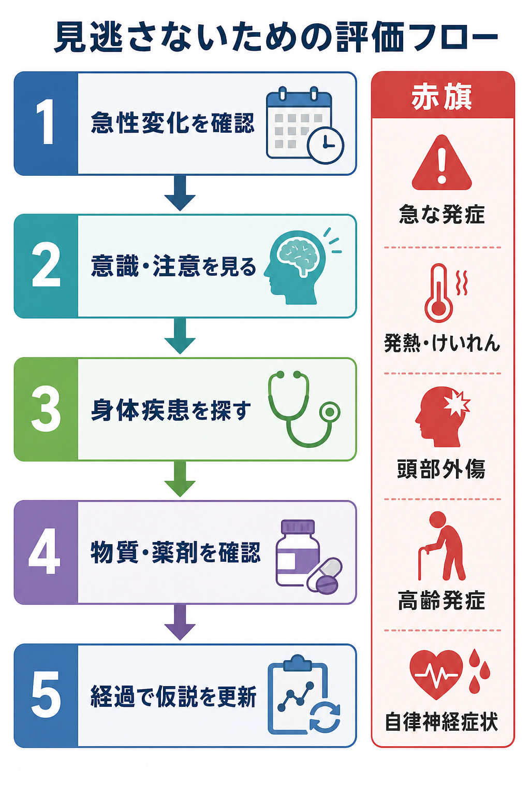
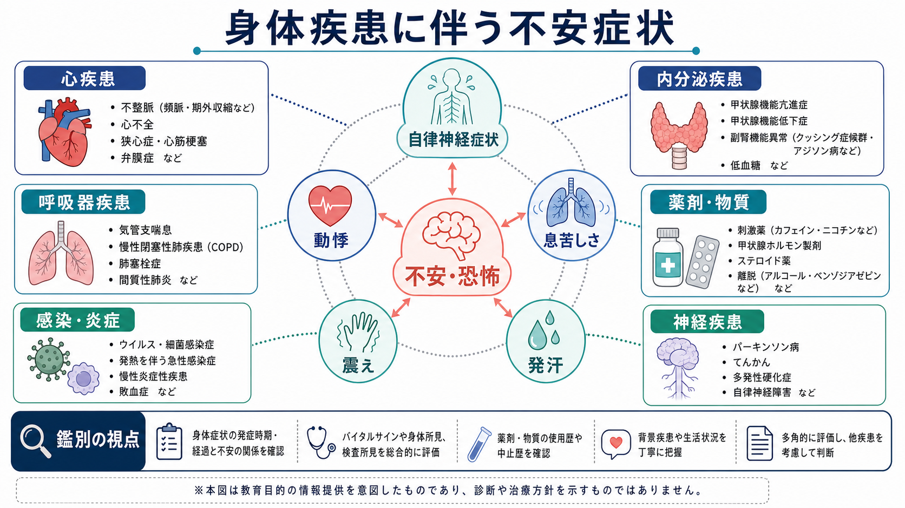
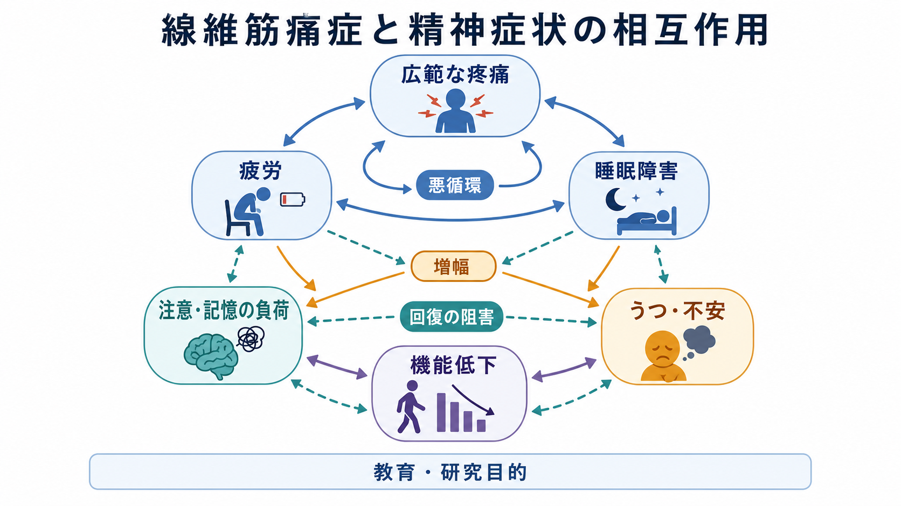

# 器質性精神障害とは何か

## 要点

- 器質性精神障害とは、脳疾患、全身疾患、内分泌・代謝異常、感染、自己免疫、物質・薬剤、中毒・離脱などの身体的要因と関連して生じる精神症状をまとめて考える臨床的な枠組みである。
- 現代の診断分類では「器質性」という言葉だけで一括するより、[[神経認知障害群とは何か]]、物質・薬剤誘発性障害、他の医学的疾患による精神障害、せん妄などに分けて記述することが多い[1][2]。
- 重要なのは、「精神症状があるから精神疾患だけ」と決めつけず、急性発症、意識・注意の変動、高齢発症、神経徴候、発熱、けいれん、頭部外傷、薬剤変更などの手がかりを拾うことである[3][4]。
- 本記事は教育・研究目的の概説であり、個別の診断や治療指示ではない。

## この記事で答える問い

1. 「器質性精神障害」とは、何をまとめるための言葉なのか。
2. 一次性の精神障害、せん妄、認知症状、物質・薬剤誘発性障害とはどう関係するのか。
3. 身体要因は、どのような仕組みで精神症状や認知変化につながるのか。
4. 臨床・研究では、どのような赤旗と評価軸を持つと見逃しを減らせるのか。

## まず結論

器質性精神障害は、単一の病名というより「身体的要因が精神症状の成立に重要に関わっていないか」を問うための視点である。たとえば、脳腫瘍、てんかん、脳血管障害、神経変性疾患、感染症、自己免疫性脳炎、甲状腺疾患、肝腎機能障害、低酸素、電解質異常、アルコール・薬物・処方薬、離脱症候群などは、幻覚、妄想、抑うつ、不安、興奮、無気力、認知機能低下、意識変容として現れることがある[3]。

したがって実践上の問いは、「これは器質性か非器質性か」と二分することではない。むしろ、症状の時間経過、意識・注意、神経学的所見、身体所見、薬剤歴、物質使用歴、検査所見、既存の精神疾患との関係を組み合わせて、仮説を更新し続けることである。既存の精神疾患がある人でも、新しい身体疾患や薬剤性変化が重なることはあるため、既知の診断名だけで説明を閉じない姿勢が重要になる[3]。

## 背景

「器質性」という語は、精神症状の背景に脳や身体の病変があるという意味で使われてきた。しかし、現代の精神医学では、ほとんどの精神症状に神経生物学的基盤があると考えられるため、「器質性」と「機能性」を単純に対立させる言い方には限界がある。

一方で、この概念には現在でも実用的な価値がある。精神症状の背後に、可逆的または緊急性の高い身体要因がある場合、見落としは重大な不利益につながるからである。WHO の ICD-11 CDDR は、精神・行動・神経発達症群を臨床で同定するための診断記述を提供し、DSM-5-TR も「他の医学的疾患による」「物質・医薬品誘発性」といった形で身体要因との関係を明示する枠組みを持つ[1][2]。

この意味で、器質性精神障害は古い用語でありながら、[[精神科救急でみる疾患・症候群には何があるのか]]、[[器質性精神病とは何か]]、[[中毒性精神障害とは何か]]、[[自己免疫性脳炎に伴う精神症状とは何か]]などを横断する実践的な見取り図として機能する。

## 基本概念

### 1. せん妄

せん妄は、急性に出現し、注意・意識・認知が変動する症候群である。NICE は、高齢、認知機能障害、股関節骨折、重症身体疾患をリスク因子として挙げ、数時間から数日の変化や日内変動、集中困難、反応の遅さ、幻覚、活動性変化、睡眠障害などを観察することを推奨している[4]。詳細は [[せん妄と認知症はどう違うのか]] と [[ICUせん妄とは何か]] が近い。

### 2. 神経認知障害

神経認知障害は、注意、記憶、実行機能、言語、知覚運動、社会的認知などの低下を中心に整理する枠組みである。アルツハイマー病、レビー小体病、血管性病変、外傷性脳損傷、HIV、パーキンソン病など、多様な原因が含まれる[2]。関連ノートには [[認知症とは何か]]、[[アルツハイマー型認知症とは何か]]、[[血管性認知症とは何か]]、[[レビー小体型認知症とは何か]] がある。

### 3. 他の医学的疾患による精神症状

内分泌疾患、感染症、自己免疫疾患、脳腫瘍、てんかん、脳血管障害、肝腎機能障害、ビタミン欠乏などは、抑うつ、躁状態、精神病症状、不安、人格変化、認知機能低下として現れることがある[3]。この領域は [[身体疾患による気分障害とは何か]]、[[甲状腺機能亢進症に伴う精神症状とは何か]]、[[甲状腺機能低下症に伴う精神症状とは何か]]、[[脳腫瘍に伴う精神症状とは何か]] と接続する。

### 4. 物質・薬剤・中毒・離脱

アルコール、鎮静薬、刺激薬、大麻、オピオイド、カフェイン、抗コリン薬、ステロイド、抗てんかん薬、抗パーキンソン病薬などは、使用、過量、相互作用、中止、離脱を通じて精神症状を生じうる[3][8]。DSM-5-TR では、物質使用症、物質中毒、物質離脱、物質・医薬品誘発性精神障害が区別される[2]。関連ノートには [[物質使用障害とは何か]]、[[アルコール離脱とは何か]]、[[薬剤性精神病とは何か]]、[[ステロイド精神病とは何か]] がある。

## 仕組み

器質性精神障害の仕組みは一つではない。複数の身体要因が、脳の予備能、神経伝達、炎症、代謝、睡眠覚醒、感覚入力、ネットワーク結合を乱し、その人の脆弱性と組み合わさって症状を作る。

せん妄研究では、急性脳不全として、神経炎症、神経伝達物質の不均衡、代謝障害、ストレス反応、感覚入力の乱れ、睡眠覚醒リズムの破綻、ネットワーク統合の失敗が相互に関与すると考えられている[5][6]。たとえば感染や手術侵襲は炎症性シグナルを増やし、低酸素や電解質異常は神経活動の安定性を下げ、抗コリン薬や鎮静薬は注意・記憶・覚醒を支える神経伝達を乱す。

自己免疫性脳炎では、急性または亜急性の精神症状、記憶障害、けいれん、運動異常、自律神経症状などが組み合わさることがある。Graus らの診断アプローチは、抗体結果だけに依存せず、臨床経過、MRI、髄液、脳波、代替診断の除外を組み合わせて早期に疑う重要性を示した[7]。これは [[抗NMDA受容体脳炎とは何か]] や [[自己免疫性脳炎に伴う精神症状とは何か]] と直結する。

物質・薬剤では、神経伝達物質、報酬回路、ストレス回路、前頭前野による自己制御が影響を受ける。NIDA は、薬物がニューロン間の信号伝達を変え、報酬回路、拡張扁桃体、前頭前野などに作用することで、気分、動機づけ、渇望、判断、衝動制御に影響すると説明している[8]。この知見は [[依存症における渇望とは何か]] や [[物質誘発性精神病とは何か]] と接続する。

## 図解

次の図は、臨床場面で「精神症状を見たときに、どこで身体要因を疑うか」をまとめた評価フローである。実際の診断はこの図だけで行うものではなく、状況に応じた身体診察、神経学的診察、薬剤確認、検査、画像、専門職連携を組み合わせる。

| 観察軸 | 器質性要因を考えやすい手がかり | 例 |
|---|---|---|
| 時間経過 | 急性発症、日内変動、急速な悪化 | せん妄、脳炎、薬剤性、離脱 |
| 意識・注意 | ぼんやりする、集中できない、反応が遅い | せん妄、低酸素、感染、代謝異常 |
| 神経徴候 | けいれん、失語、片麻痺、歩行障害、頭痛 | てんかん、脳卒中、腫瘍、脳炎 |
| 身体所見 | 発熱、脱水、低血糖、肝腎機能障害、自律神経症状 | 感染、内分泌、代謝、薬剤 |
| 物質・薬剤 | 新規薬剤、増減量、中止、相互作用、過量 | 抗コリン薬、ステロイド、鎮静薬、アルコール |
| 年齢・既往 | 高齢発症、既存認知症、頭部外傷、自己免疫疾患 | 脳脆弱性と誘因の重なり |

## 臨床・研究との接続

臨床では、身体評価と精神科的支援を対立させないことが重要である。身体疾患の治療、薬剤調整、脱水や睡眠の改善、疼痛管理、環境調整、家族からの経過聴取、危険行動への安全確保、本人の不安への支援は、同時に必要になることが多い[3][4]。

研究では、器質性精神障害は「除外診断」としてだけでなく、精神症状が脳・身体・環境の相互作用から生じることを調べる窓になる。せん妄では炎症、脳脆弱性、神経伝達、睡眠覚醒、感覚入力、認知予備能が研究対象になる[5][6]。自己免疫性脳炎では、精神症状と免疫、神経回路、抗体、髄液・MRI・脳波所見の関係が問題になる[7]。物質関連障害では、報酬学習、ストレス、渇望、前頭前野機能、社会環境が重要な研究軸になる[8]。

## よくある誤解

### 「器質性」と言えば、精神疾患ではない

誤りである。身体要因が背景にあっても、本人には苦痛、不安、幻覚、抑うつ、興奮、認知困難が生じる。精神科的評価と支援は不要にならない。むしろ、身体医学と精神医学の両方から見る必要がある。

### 検査で異常がなければ器質性ではない

誤りである。検査は仮説に依存し、時期によって所見が変わる。初期の自己免疫性脳炎や軽微な代謝異常、薬剤相互作用、睡眠覚醒リズムの破綻などは、一回の検査だけでは説明しきれないことがある[7]。

### 既に精神疾患の診断があれば、身体評価は不要である

誤りである。既存の精神疾患がある人にも感染、脱水、糖代謝異常、頭部外傷、薬剤性変化、物質使用、神経疾患は起こる。Merck Manual は、既知の精神疾患がある患者の新しい精神症状を、その診断だけで説明しないよう注意している[3]。

### 「器質性」と「一次性」は完全に分けられる

単純には分けられない。身体疾患、薬剤、物質、睡眠、疼痛、ストレス、発達特性、既存の精神疾患は重なり合う。診断分類は便利な地図だが、実際の症状形成は多因子的である。

## 関連ノート

- [[器質性精神病とは何か]]
- [[中毒性精神障害とは何か]]
- [[神経認知障害群とは何か]]
- [[せん妄と認知症はどう違うのか]]
- [[物質使用障害とは何か]]
- [[身体疾患による気分障害とは何か]]
- [[内分泌疾患に伴う精神症状とは何か]]
- [[自己免疫性脳炎に伴う精神症状とは何か]]
- [[頭部外傷後精神症状とは何か]]
- [[てんかんに伴う精神症状とは何か]]
- [[DSMとICDは何が違うのか]]

### MOC更新候補

- [[MOC｜精神医学]]
- [[MOC｜脳・神経科学]]
- [[MOC｜臨床実践・治療]]

## 理解チェック

1. 器質性精神障害を「身体疾患があるかないか」だけでなく、「症状形成に身体要因がどの程度関与しているか」と考える利点は何か。
2. せん妄を疑うとき、時間経過、意識・注意、日内変動のどれを最初に確認すべきか。
3. 既存の精神疾患がある人に急な混乱が出たとき、なぜ薬剤・感染・脱水・代謝異常を確認する必要があるのか。
4. 自己免疫性脳炎や物質・薬剤誘発性障害は、なぜ「精神症状だけ」からでは見分けにくいのか。

## 未解決問題

- どの臨床サインの組み合わせが、身体要因の見逃しを最も効率よく減らすのか。
- せん妄、薬剤性精神症状、自己免疫性脳炎、一次性精神病の境界を、バイオマーカーと臨床経過でどこまで精密化できるのか。
- 精神科医療と身体科医療の連携を、救急、一般病棟、外来、地域支援でどう標準化できるのか。
- 「器質性」という用語を残す場合、スティグマや二分法を避けながら、教育的にどう使うのがよいのか。

## 参考文献

[1] World Health Organization. (2024). *Clinical descriptions and diagnostic requirements for ICD-11 mental, behavioural and neurodevelopmental disorders*. https://www.who.int/publications/i/item/9789240077263

[2] American Psychiatric Association. (2022). *Diagnostic and Statistical Manual of Mental Disorders, Fifth Edition, Text Revision (DSM-5-TR)*. American Psychiatric Association Publishing. https://doi.org/10.1176/appi.books.9780890425787

[3] First, M. B., & Zimmerman, M. (2026). Medical Assessment of the Patient With Psychiatric Symptoms. *Merck Manual Professional Edition*. https://www.merckmanuals.com/professional/psychiatric-disorders/approach-to-the-patient-with-mental-symptoms/medical-assessment-of-the-patient-with-mental-symptoms

[4] National Institute for Health and Care Excellence. (2023). *Delirium: prevention, diagnosis and management in hospital and long-term care* (CG103). https://www.nice.org.uk/guidance/cg103

[5] Wilson, J. E., Mart, M. F., Cunningham, C., Shehabi, Y., Girard, T. D., MacLullich, A. M. J., Slooter, A. J. C., et al. (2020). Delirium. *Nature Reviews Disease Primers, 6*, 90. https://doi.org/10.1038/s41572-020-00223-4

[6] Maldonado, J. R. (2018). Delirium pathophysiology: An updated hypothesis of the etiology of acute brain failure. *International Journal of Geriatric Psychiatry, 33*(11), 1428-1457. https://doi.org/10.1002/gps.4823

[7] Graus, F., Titulaer, M. J., Balu, R., Benseler, S., Bien, C. G., Cellucci, T., Cortese, I., et al. (2016). A clinical approach to diagnosis of autoimmune encephalitis. *The Lancet Neurology, 15*(4), 391-404. https://doi.org/10.1016/S1474-4422(15)00401-9

[8] National Institute on Drug Abuse. (2020). *Drugs, Brains, and Behavior: The Science of Addiction: Drugs and the Brain*. https://nida.nih.gov/publications/drugs-brains-behavior-science-addiction/drugs-brain
