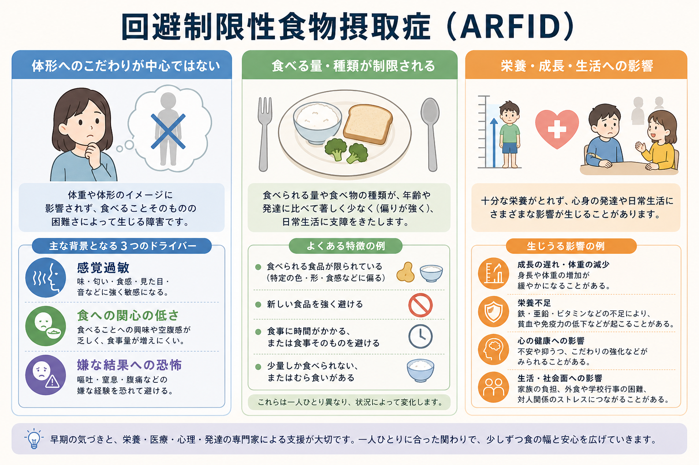
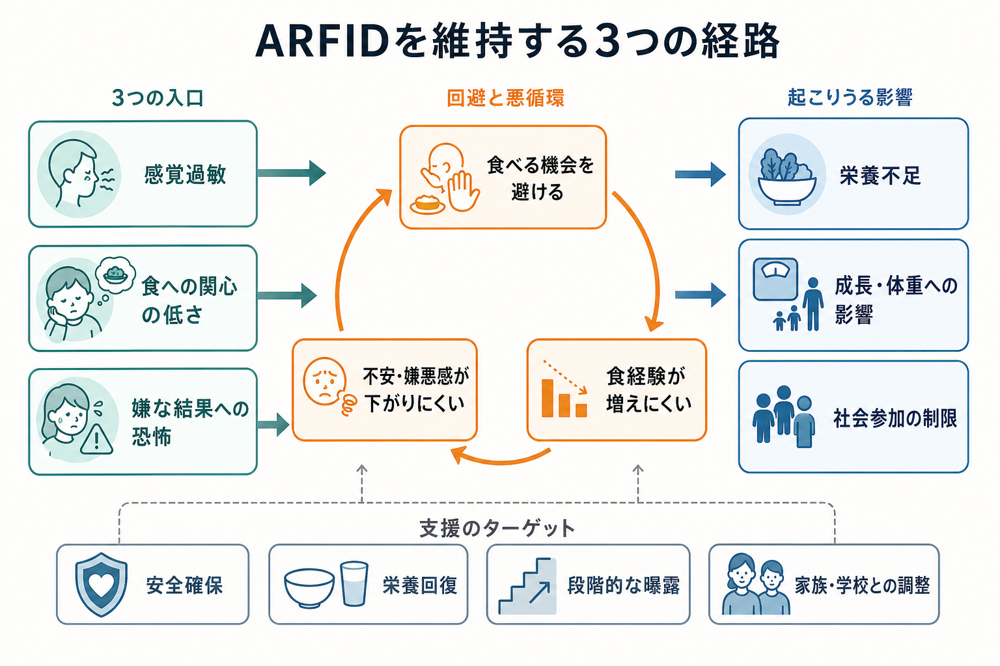
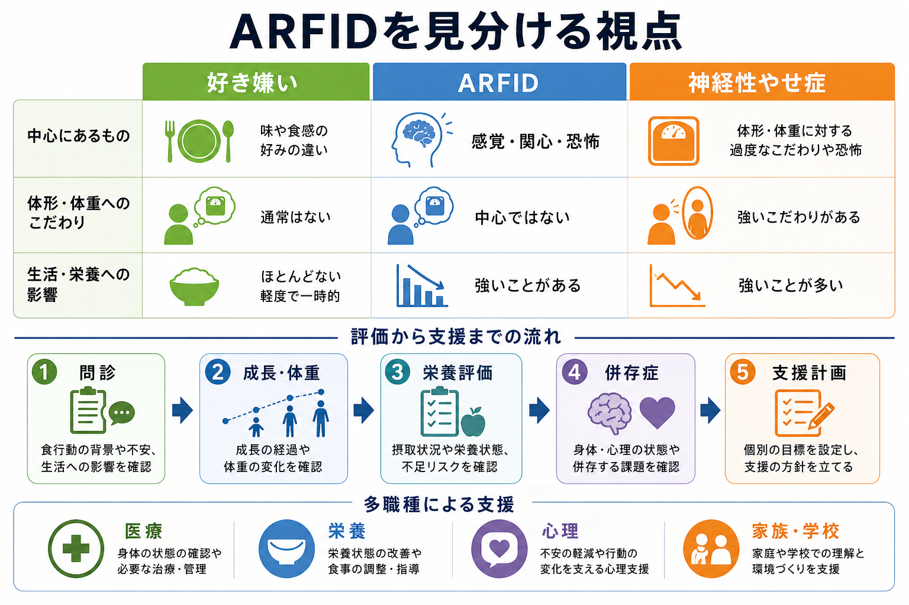

# 回避制限性食物摂取症とは何か

## 要点

- 回避制限性食物摂取症（avoidant/restrictive food intake disorder; ARFID）は、体形・体重へのこだわりを主因とせず、食べる量や食物の種類が制限される摂食・食行動の障害である。
- 中核は「感覚過敏」「食への関心の低さ」「嫌な結果への恐怖」という複数の経路で理解できるが、実際には重なり合うことが多い。
- 問題は「好き嫌いが強い」こと自体ではなく、栄養不足、成長・体重への影響、経管栄養や栄養補助への依存、学校・家庭・対人場面の制限などが生じる点にある。
- 評価では、神経性やせ症、身体疾患、薬剤、食物アレルギー、文化・宗教的食習慣、食物入手困難を区別しつつ、医学・栄養・心理・発達の観点を統合する。
- 支援は、身体的安全と栄養回復を土台に、認知行動療法、家族を含む支援、段階的な食経験の拡張、学校・家庭環境の調整を組み合わせる。

## この記事で答える問い

1. ARFID は、通常の好き嫌いや神経性やせ症と何が違うのか。
2. どのような仕組みで食物摂取の制限が維持されるのか。
3. 臨床・研究では、何を評価し、どのように支援を考えるのか。

## まず結論

ARFID は、「痩せたいから食べない」障害ではない。むしろ、食物のにおい・味・食感への強い苦手さ、食べることへの関心や空腹感の乏しさ、嘔吐・窒息・腹痛などの嫌な結果への恐怖によって、食べられる量や種類が狭くなる状態である[1][2]。

ただし、体形へのこだわりが中心ではないから軽い、という意味ではない。摂取できる栄養とエネルギーが不足すれば、成長の遅れ、体重減少、ビタミン・ミネラル欠乏、脱水、学校・仕事・家族行事への参加困難が生じうる[3][4]。そのため、ARFID は「食の個性」だけでなく、生活機能と身体健康の問題として評価される。

## 背景

ARFID は DSM-5 で導入され、DSM-5-TR でも摂食・食行動症群の一つとして扱われる診断概念である[1]。ICD-11 でも 6B83 Avoidant-restrictive food intake disorder として位置づけられ、体重・体形への没頭に動機づけられない食物摂取の回避・制限と、それに伴う身体健康または機能への影響が重視される[2]。

従来、「偏食」「小食」「神経質な食べ方」と見なされていた人の一部には、単なる嗜好では説明できない苦痛や機能障害がある。特に子どもでは成長曲線の変化、食卓や給食への参加困難、家族の負担として現れやすい。一方、成人でも長年の限定的な食事、外食困難、栄養欠乏、消化器症状への恐怖などを背景に問題化することがある[3][4]。

## 基本概念

DSM-5-TR の枠組みでは、ARFID は食べること・食物摂取の障害により、適切なエネルギーまたは栄養要求を満たせず、少なくとも一つの重大な影響を伴う状態として理解される。代表的な影響は、著しい体重減少、子どもの期待される体重増加や成長の不十分さ、栄養欠乏、経管栄養や栄養補助食品への依存、心理社会的機能の著しい障害である[1][5]。

ARFID を理解するうえで重要なのは、食物制限の「理由」が一つに固定されないことである。臨床研究では、次の三つのプロファイルがよく使われる[5][6]。

| プロファイル | 典型的な訴え | 見落としやすい点 |
|---|---|---|
| 感覚過敏 | 食感、におい、味、色、見た目、温度が耐えがたい | 「わがまま」ではなく、感覚処理や嫌悪反応として理解する必要がある |
| 食への関心の低さ | 空腹を感じにくい、食事が面倒、少量で満腹になる | 低体重でなくても栄養不足や生活制限が起こりうる |
| 嫌な結果への恐怖 | 窒息、嘔吐、腹痛、アレルギー様反応への恐怖 | 急性の出来事の後に、食物や食事場面の回避が広がることがある |

これらは排他的な分類ではない。たとえば、もともと食感への強い苦手さがある人が、嘔吐体験の後にさらに食べられるものを減らすことがある。逆に、食への関心が低い人が、周囲から強く促される経験を重ねて食事場面そのものを怖がることもある。

## 仕組み

ARFID の維持には、身体、感覚、情動学習、家族・学校環境が絡む。感覚過敏が強い場合、特定の食感やにおいを避けることで短期的には不快感が下がる。しかし避け続けると、新しい食経験が増えず、「これは食べても大丈夫だった」という学習機会が乏しくなる。

嫌な結果への恐怖が中心の場合も同様である。窒息しそうになった、吐いた、強い腹痛を経験したといった出来事の後、食事と危険が結びつくことがある。その後、確認、検索、食べる場面の回避によって一時的に安心しても、長期的には恐怖が下がりにくくなる。この構造は [[不安症群とは何か]] や [[限局性恐怖症とは何か]] の回避学習とも重なる。

食への関心の低さが目立つ場合は、空腹感や内受容感覚の弱さ、少量での満腹感、食事の報酬価の低さが関わる可能性がある。近年のレビューでは、ARFID の神経生物学的機序はまだ確立途上だが、感覚処理、報酬、内受容感覚、不安関連回路を検討する研究が増えている[4][8]。

## 図解

ARFID の評価では、「食べない理由」だけでなく、「その結果として何が起きているか」を同時に見る。以下の図は、通常の好き嫌い、ARFID、神経性やせ症を大まかに区別し、評価から支援計画までの流れを示したものである。

## 臨床・研究との接続

臨床的には、最初に身体的リスクを評価する。成長曲線、体重変化、脱水、電解質異常、鉄・亜鉛・ビタミンなどの不足、消化器・耳鼻咽喉・歯科的問題、薬剤の影響を確認する。特に急な摂取低下、失神、著しい体重減少、徐脈、脱水がある場合は、心理的説明に進む前に医学的安全を優先する[3][7]。

心理・発達面では、[[不安症群とは何か]]、[[強迫症とは何か]]、[[選択性緘黙とは何か]]、発達特性、トラウマ体験、家族の食事パターンを評価する。ただし、併存症があるから ARFID ではない、とは言えない。併存症が摂取制限を説明する部分と、ARFID として独立に支援すべき部分を分けて考える必要がある。

研究・評価尺度では、PARDI（Pica, ARFID, and Rumination Disorder Interview）のような半構造化面接が、ARFID の診断、重症度、三つのプロファイルを評価する道具として開発されている[6]。質問紙版やスクリーニング尺度も研究されているが、治療経過を追う標準的な尺度についてはまだ発展途上である[7]。

治療研究では、ARFID に特化した認知行動療法（CBT-AR）が、子ども・青年および成人で予備的な有効性を示している。CBT-AR は、規則的な食事、摂取量または種類の拡大、栄養不足の理解、感覚・恐怖・内受容感覚に応じた段階的曝露を組み合わせる[7][8]。ただし、現時点のエビデンスはオープントライアルや小規模研究が中心で、より大規模な比較試験と長期予後研究が必要である[4][7]。

## よくある誤解

**「ただの好き嫌いである」**  
通常の好き嫌いは、成長、栄養、生活機能を大きく損なわない範囲にとどまることが多い。ARFID では、摂取制限が身体健康や心理社会的機能に明確な影響を及ぼす[1][3]。

**「体重が低くなければ ARFID ではない」**  
ARFID は低体重だけで判断されない。食べられる食品の範囲が極端に狭い、栄養補助に依存している、外食や学校行事に参加できないなど、体重以外の機能障害が中心になることもある[2][5]。

**「神経性やせ症の軽い形である」**  
神経性やせ症では、体重増加への強い恐怖や体形・体重の自己評価への過大な影響が中核になる。ARFID では、体形・体重へのこだわりは中心ではなく、感覚、関心、恐怖が摂取制限を駆動する[1][2]。

**「無理に食べさせれば治る」**  
強制は短期的に摂取量を増やすことがあっても、食事場面への不安や嫌悪を強める場合がある。支援では、身体的安全を確保したうえで、本人のプロファイルに応じた段階的な食経験、家族の関わり方、学校や職場での調整を考える[7][8]。

## 関連ノート

既存ノートとして、以下が関連しうる。

- [[不安症群とは何か]]
- [[限局性恐怖症とは何か]]
- [[強迫症とは何か]]
- [[選択性緘黙とは何か]]

今後の作成候補として、以下がある。

- 神経性やせ症とは何か
- 摂食症群とは何か
- ARFID と自閉スペクトラム症
- 摂食症における家族支援
- CBT-AR とは何か

MOC 更新候補: `content/00_MOC/` 配下の精神医学・摂食症関連 MOC。並列ジョブとの競合を避けるため、本記事では MOC ファイルを直接更新しない。

## 理解チェック

1. ARFID と神経性やせ症を区別するとき、体形・体重へのこだわりはどのように位置づけられるか。
2. ARFID の三つの代表的なプロファイルは何か。
3. 「食べる機会を避ける」ことは、短期的な安心と長期的な維持のどちらにどう関わるか。
4. 体重が正常範囲でも、ARFID として評価すべき可能性があるのはどのような場合か。
5. 支援計画を立てるとき、医学・栄養・心理・家族/学校環境を分けて見る理由は何か。

## 参考文献

[1] American Psychiatric Association. (2022). *Diagnostic and Statistical Manual of Mental Disorders, Fifth Edition, Text Revision (DSM-5-TR)*. American Psychiatric Association Publishing. 診断基準の要約は MSD Manual Professional Edition, "Avoidant/Restrictive Food Intake Disorder (ARFID)" を参照。https://www.msdmanuals.com/professional/psychiatric-disorders/eating-disorders/avoidant-restrictive-food-intake-disorder-arfid

[2] World Health Organization. (2026). *ICD-11 for Mortality and Morbidity Statistics*, 6B83 Avoidant-restrictive food intake disorder. https://icd.who.int/browse/2025-01/mms/en#1242188600

[3] National Institute of Mental Health. (2024). *Eating Disorders: What You Need to Know*. https://www.nimh.nih.gov/health/publications/eating-disorders

[4] Menzel, J. E., & Perry, T. R. (2024). Avoidant/Restrictive Food Intake Disorder: Review and Recent Advances. *Focus, 22*(3), 288-300. https://doi.org/10.1176/appi.focus.20240008

[5] Brigham, K. S., Manzo, L. D., Eddy, K. T., & Thomas, J. J. (2018). Evaluation and Treatment of Avoidant/Restrictive Food Intake Disorder (ARFID) in Adolescents. *Current Pediatrics Reports, 6*(2), 107-113. https://doi.org/10.1007/s40124-018-0162-y

[6] Bryant-Waugh, R., Micali, N., Cooke, L., Lawson, E. A., Eddy, K. T., & Thomas, J. J. (2019). Development of the Pica, ARFID, and Rumination Disorder Interview, a multi-informant, semi-structured interview of feeding disorders across the lifespan: A pilot study for ages 10-22. *International Journal of Eating Disorders, 52*(4), 378-387. https://doi.org/10.1002/eat.22958

[7] Kambanis, P. E., & Thomas, J. J. (2023). Assessment and Treatment of Avoidant/Restrictive Food Intake Disorder. *Current Psychiatry Reports, 25*(2), 53-64. https://doi.org/10.1007/s11920-022-01404-6

[8] Thomas, J. J., Becker, K. R., Kuhnle, M. C., Jo, J. H., Harshman, S. G., Wons, O. B., Keshishian, A. C., Hauser, K., Breithaupt, L., Liebman, R. E., Misra, M., Wilhelm, S., Lawson, E. A., & Eddy, K. T. (2020). Cognitive-behavioral therapy for avoidant/restrictive food intake disorder: Feasibility, acceptability, and proof-of-concept for children and adolescents. *International Journal of Eating Disorders, 53*(10), 1636-1646. https://doi.org/10.1002/eat.23355

## 未解決問題

- ARFID の三つのプロファイルが、発達、神経生物学、治療反応の違いをどの程度説明するのかは、まだ確立していない。
- 成人 ARFID の自然経過、長期予後、職場・対人機能への影響については研究が不足している。
- CBT-AR、家族ベース治療、栄養介入、薬物療法の組み合わせを、どの患者にどの順序で使うべきかは今後の比較研究が必要である。
- 自閉スペクトラム症、消化器疾患、不安症との重なりを、過剰診断にも過小診断にもならず評価する実践知が求められる。
