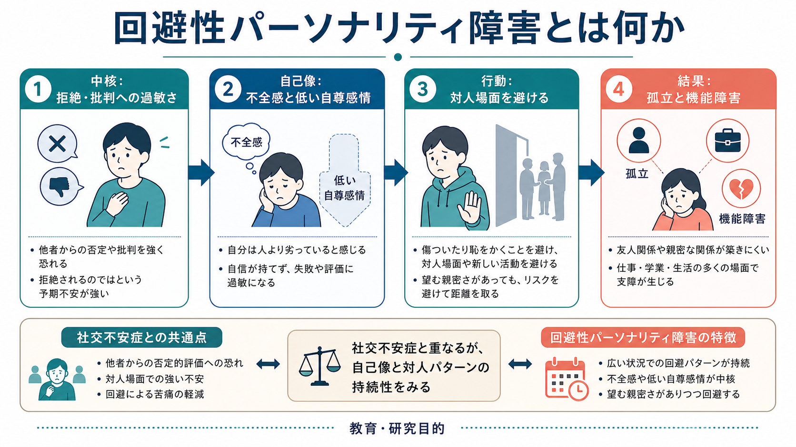
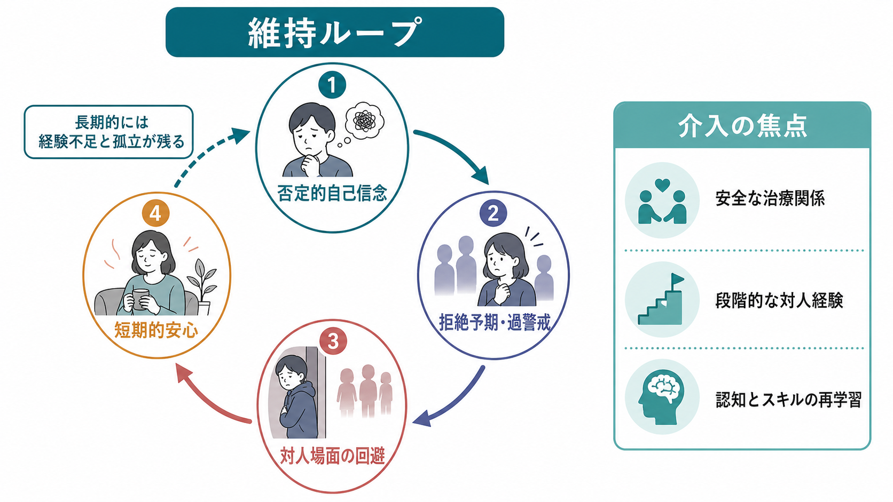

# 回避性パーソナリティ障害とは何か

## 要点

- 回避性パーソナリティ障害は、批判・拒絶・恥への強い過敏さ、不全感、対人場面の回避が広い生活領域で続き、苦痛や機能障害をもたらす[[精神医学とは何か|精神医学]]上の概念である[1][2]。
- 本人は人間関係を望んでいないのではなく、むしろ親密さや承認を求めながら、「傷つくくらいなら避ける」という安全行動に縛られやすい[2][3]。
- [[社交不安症とは何か]]と大きく重なるが、回避性パーソナリティ障害では、低い自己評価、親密関係での抑制、仕事・学業・生活全般に及ぶ持続的な対人パターンをより重視する[2][4]。
- 治療研究は境界性パーソナリティ障害などに比べて少ないが、認知行動療法、対人スキルへの介入、スキーマ療法、メンタライゼーションやメタ認知対人療法などが検討されている[5][6]。
- 本稿は教育・研究目的の整理であり、個別の診断や治療指示ではない。

## この記事で答える問い

1. 回避性パーソナリティ障害は、単なる「内向的な性格」や「人見知り」と何が違うのか。
2. 批判や拒絶への過敏さは、どのように回避と孤立を維持するのか。
3. [[社交不安症とは何か]]、[[不安症群とは何か]]、他のパーソナリティ障害とはどう鑑別されるのか。
4. 臨床・研究では、どのような評価軸と未解決問題があるのか。

## まず結論

回避性パーソナリティ障害は、「人と関わりたくない状態」ではなく、「関わりたいが、拒絶・批判・恥を予期しすぎて関われない状態」と捉えると理解しやすい。短期的には、会議を避ける、誘いを断る、自己開示しない、新しい活動をしないといった回避により[[不安とは何か|不安]]が下がる。しかし長期的には、成功体験や修正経験が得られず、「やはり自分は受け入れられない」という自己像が保たれる[3][5]。

診断名だけで人を説明することはできない。重要なのは、どの場面でどのような評価を恐れ、どのような安全行動をとり、その結果として学業・仕事・親密関係・生活の選択肢がどの程度狭まっているかを、時間経過の中で見ることである[1][2]。

## 背景

DSM-5-TRでは、回避性パーソナリティ障害はクラスターC、すなわち不安・恐怖を基調とするパーソナリティ障害群に置かれる[1]。診断基準では、社会的抑制、不全感、否定的評価への過敏さが成人期早期までに始まり、複数の文脈にまたがって持続することが重視される[1][2]。

一方、ICD-11は従来の細かなパーソナリティ障害カテゴリーから、重症度と人格特性ドメインを組み合わせる次元的モデルへ移行した[7]。この枠組みでは、回避性パーソナリティ障害に相当する臨床像は、対人回避、親密さへの恐れ、否定的情動性、離隔・引きこもり傾向などとして記述されやすい。つまり、[[DSMとICDは何が違うのか|DSMとICD]]では、同じ臨床現象を「カテゴリー」として見るか、「重症度と特性の組み合わせ」として見るかに違いがある。

疫学的には、米国の推定有病率はおよそ2%前後とされることがあるが、調査法、診断面接、対象集団によって幅がある[2]。臨床現場では、本人が「パーソナリティの問題」を主訴に来るよりも、[[うつ病とは何か|抑うつ]]、[[不安症群とは何か|不安症]]、孤立、仕事や学業の困難をきっかけに評価されることが多い[2][3]。

## 基本概念

回避性パーソナリティ障害の中心には、次の三つのまとまりがある。

| 領域 | 典型的な表れ | 評価で見る点 |
|---|---|---|
| 否定的自己像 | 自分は劣っている、魅力がない、失敗すれば見捨てられると感じる | どの場面で自己評価が急落するか |
| 拒絶・批判への過敏さ | 些細な表情、沈黙、返信の遅れを否定的に解釈する | [[予期不安とは何か|予期不安]]と事後反すうの強さ |
| 回避と安全行動 | 発表、会議、食事、恋愛、昇進、自己開示を避ける | 短期的安心と長期的損失のバランス |

DSM-5-TRに対応する臨床像では、対人接触を含む活動の回避、好かれている確信がない限り関わらないこと、親密関係での抑制、批判や拒絶へのとらわれ、新しい対人場面での抑制、自分を劣った存在と見ること、恥をかく可能性のある新規活動を避けることなどが重視される[1][2]。

ここで重要なのは、回避が本人にとって合理性をもつ点である。強い不安や恥の予期があるとき、避けることは短期的には苦痛を減らす。しかし、その場面で実際に何が起きたかを学ぶ機会が失われるため、長期的には不安と低い自己像が維持される[3][5]。

## 仕組み

回避性パーソナリティ障害の維持メカニズムは、単一の原因ではなく、気質、発達経験、学習、認知、身体反応、対人環境が重なった循環として捉えるのが実用的である。

1. もともとの不安傾向や行動抑制が、対人評価への感受性を高める。
2. いじめ、拒絶、過度な批判、情緒的ネグレクトなどの経験が、「自分は受け入れられない」というスキーマを強めることがある[8]。
3. 対人場面で、視線、沈黙、相手の表情、身体感覚に注意が向き、否定的解釈が起こりやすくなる。
4. 回避や安全行動によって短期的な安心が得られる。
5. しかし、肯定的な経験や失敗からの回復経験が不足し、自己像と対人予測が更新されにくくなる。

この循環は、[[認知バイアスとは何か]]の観点からは、曖昧な情報を拒絶の証拠として読む傾向として理解できる。また、[[愛着とは何か]]や[[トラウマは発達にどう影響するのか]]の観点からは、他者に近づくこと自体が安全ではないと学習された対人モデルとして理解できる。ただし、発達上の逆境が常に原因であると単純化してはならない。研究上は関連が示されていても、個人ごとの経路は多様である[3][8]。

神経科学的には、回避性パーソナリティ障害だけに特異的な脳部位を想定するより、[[扁桃体過活動は不安症やPTSDにどう関わるのか|扁桃体]]、前頭前野、島皮質、身体感覚、社会的評価処理が関わる不安・脅威検出ネットワークの個人差として捉えるほうが慎重である。現時点では、神経画像所見を個別診断や治療選択に直結させる段階にはない。

## 図解

上の2枚の図は、回避性パーソナリティ障害を「性格の弱さ」ではなく、脅威予測、自己像、回避行動、対人経験の不足が相互に補強する循環として整理している。図中の「短期的安心」は、回避を責めるための言葉ではない。むしろ、なぜ回避がその場では有効に感じられるのかを理解し、どの部分を少しずつ変えられるかを考えるための手がかりである。

## 臨床・研究との接続

臨床評価では、診断基準の有無だけでなく、次の点を丁寧に見る。

- 発症時期と持続性: 小児期・青年期からの対人抑制なのか、うつ病や外傷体験後に目立つようになったのか。
- 広がり: 発表だけが苦手なのか、友人、恋愛、仕事、家族、医療面接まで広く影響するのか。
- 併存症: [[社交不安症とは何か]]、[[うつ病とは何か]]、物質使用、他のパーソナリティ障害が重なっていないか。
- 本人の願望: 孤立を望んでいるのか、つながりたいが怖いのか。
- 安全行動: 断る、黙る、先延ばしする、完璧に準備する、相手を試す、自己開示を避けるなどのパターン。

治療・支援では、安定した治療関係、批判や拒絶への予測の検討、段階的な対人経験、社会的スキル、自己像への介入が焦点になりやすい[2][5]。2024年のRCTでは、社交不安症と回避性パーソナリティ障害を併存する外来患者に対して、集団スキーマ療法と集団認知行動療法の双方で改善がみられ、主要アウトカムでは明確な群間差はなかったが、スキーマ療法のほうが完遂率が高かったと報告されている[6]。これは、特定の治療法を単純に優先する根拠というより、長期的な対人パターンを扱う治療の受容性と継続性を研究する必要性を示す。

薬物療法は、回避性パーソナリティ障害そのものを直接変える特効薬として位置づけるより、併存する不安症状、抑うつ、睡眠、身体症状などを含めて総合的に検討される[2][5]。個別の治療選択は、診断、重症度、併存症、リスク、本人の希望、利用可能な支援資源に応じて専門家と相談して決める必要がある。

研究上は、回避性パーソナリティ障害を[[社交不安症とは何か|社交不安症]]の重症表現型とみる立場、独立したパーソナリティ病理とみる立場、ICD-11のように人格機能と特性の組み合わせとしてみる立場が併存している[4][7]。この違いは、治療研究の対象者選定、評価尺度、予後研究に影響する。

## よくある誤解

**誤解1: 回避性パーソナリティ障害は、単なる内向性である。**  
内向性は性格特性であり、それ自体は障害ではない。回避性パーソナリティ障害では、拒絶や批判への恐れが強く、本人が望む人間関係や活動まで制限され、苦痛や機能障害が生じる点が重要である[1][2]。

**誤解2: 本人は人と関わりたくない。**  
多くの場合、親密さや承認への願望はある。問題は、関係を望まないことではなく、関係に近づくほど恥、拒絶、批判の予期が強まることである[2][3]。

**誤解3: 社交不安症と完全に同じである。**  
両者は重なりが大きく、併存も多い。しかし回避性パーソナリティ障害では、自己像の低さ、親密関係での抑制、広い生活領域に及ぶ持続的対人パターンがより前景化する[2][4]。

**誤解4: 回避をやめればすぐよくなる。**  
急な曝露や強制的な参加は、失敗体験として記憶される場合がある。実際には、安全感、予測の検討、段階づけ、対人スキル、失敗後の回復経験を組み合わせる必要がある[5][6]。

## 関連ノート

- [[社交不安症とは何か]]
- [[不安症群とは何か]]
- [[不安とは何か]]
- [[予期不安とは何か]]
- [[DSMとICDは何が違うのか]]
- [[境界性パーソナリティ障害とは何か]]
- [[妄想性パーソナリティ障害とは何か]]
- [[統合失調型パーソナリティ障害とは何か]]
- [[愛着とは何か]]
- [[トラウマは発達にどう影響するのか]]
- [[扁桃体過活動は不安症やPTSDにどう関わるのか]]

MOC更新候補: [[MOC｜精神医学]]。並列ジョブとの競合を避けるため、本タスクではMOC本体は更新していない。

今後の作成候補: `パーソナリティ障害群とは何か`, `依存性パーソナリティ障害とは何か`, `強迫性パーソナリティ障害とは何か`, `スキーマ療法とは何か`, `認知バイアスとは何か`。

## 理解チェック

1. 回避性パーソナリティ障害を、内向性や単なる人見知りと区別する観点は何か。
2. 回避や安全行動は、短期的には何をもたらし、長期的には何を維持するのか。
3. [[社交不安症とは何か]]との重なりと違いを、自己像、持続性、生活領域の広がりから説明できるか。
4. ICD-11の次元的モデルで考えると、回避性パーソナリティ障害に相当する臨床像はどのように記述できるか。

## 参考文献

[1] American Psychiatric Association. (2022). *Diagnostic and Statistical Manual of Mental Disorders, Fifth Edition, Text Revision (DSM-5-TR)*. https://doi.org/10.1176/appi.books.9780890425787

[2] Zimmerman, M. (2026). *Avoidant Personality Disorder (AVPD).* Merck Manual Professional Edition. https://www.merckmanuals.com/professional/psychiatric-disorders/personality-disorders/avoidant-personality-disorder-avpd

[3] Torrico, T. J., & Sapra, A. (2024). *Avoidant Personality Disorder.* StatPearls, NCBI Bookshelf. https://www.ncbi.nlm.nih.gov/books/NBK559325/

[4] Lampe, L. (2016). Avoidant personality disorder as a social anxiety phenotype: Risk factors, associations and treatment. *Current Opinion in Psychiatry, 29*(1), 64-69. https://doi.org/10.1097/YCO.0000000000000211

[5] Weinbrecht, A., Schulze, L., Boettcher, J., & Renneberg, B. (2016). Avoidant personality disorder: A current review. *Current Psychiatry Reports, 18*, 29. https://doi.org/10.1007/s11920-016-0665-6

[6] Baljé, A. E., Greeven, A., Deen, M., van Giezen, A. E., Arntz, A., & Spinhoven, P. (2024). Group schema therapy versus group cognitive behavioral therapy for patients with social anxiety disorder and comorbid avoidant personality disorder: A randomized controlled trial. *Journal of Anxiety Disorders, 104*, 102860. https://doi.org/10.1016/j.janxdis.2024.102860

[7] World Health Organization. (2026). *ICD-11 for Mortality and Morbidity Statistics.* https://icd.who.int/browse/2026-01/mms/en

[8] Eikenaes, I., Egeland, J., Hummelen, B., & Wilberg, T. (2015). Avoidant personality disorder versus social phobia: The significance of childhood neglect. *PLOS ONE, 10*(3), e0122846. https://doi.org/10.1371/journal.pone.0122846
