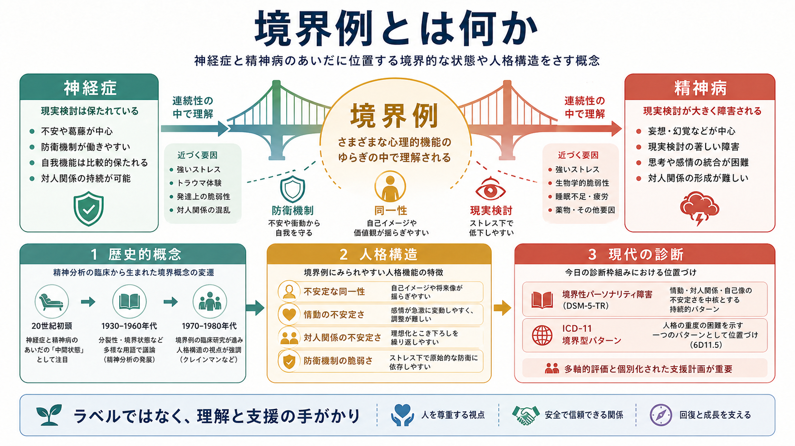
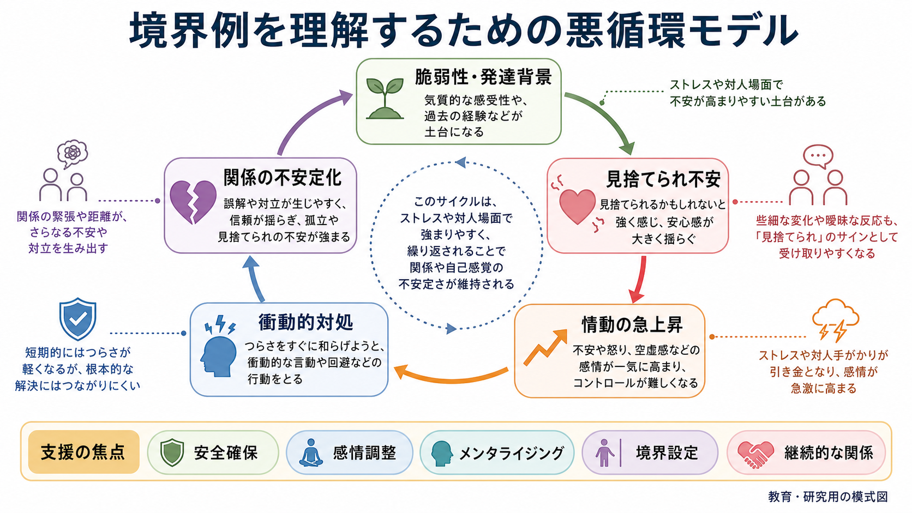

# 境界例とは何か

## 要点

- 境界例は、もともと「神経症と精神病のあいだ」に位置するように見える臨床群を指す歴史的概念であり、現在の診断名と一対一対応する言葉ではない。
- Kernberg は、境界例を単なる症状名ではなく、同一性の不安定さ、原始的防衛、現実検討の相対的保持を特徴とする「人格構造」の問題として整理した [1]。
- DSM では境界性パーソナリティ障害という診断カテゴリーが確立したが、ICD-11 ではパーソナリティ障害の重症度と特性を記述し、必要に応じて「境界型パターン」を付加する方式へ移っている [3][4]。
- 臨床では、境界例という語をラベルとして貼るよりも、情動調整、対人関係、自己像、衝動性、安全確保、支援関係の維持をどう評価するかが重要である [5][6]。
- 本記事は教育・研究目的の概念整理であり、個別の診断や治療方針を決めるものではない。

## この記事で答える問い

1. 「境界例」は、何と何の境界を意味していたのか。
2. 精神分析・精神病理学では、境界例をどのように理解してきたのか。
3. 境界例と、現代の境界性パーソナリティ障害は同じなのか。
4. 研究や臨床支援では、この概念をどのように安全に使えばよいのか。

## まず結論

境界例とは、現在の単一の診断名ではなく、精神医学史の中で「従来の神経症としては説明しにくいが、典型的な精神病とも言い切れない」臨床像を理解するために使われてきた概念である。初期には、精神病に近い不安定さや退行を示すが現実検討は大きく崩れない人々をどう捉えるか、という問題意識から発展した [2]。

現代的に読むなら、境界例は「診断名」よりも「見立ての視点」である。つまり、本人の価値ではなく、自己像、対人関係、情動調整、防衛機制、衝動性、ストレス下の解離・精神病様体験などがどのように組み合わさって生活機能を妨げているかを見るための言葉である。これは [[パーソナリティ障害群とは何か]] や [[パーソナリティ機能の障害とは何か]] と連続して理解できる。

## 背景

「境界」という言葉は、精神医学の分類がまだ現在ほど操作的ではなかった時代に生まれた。古典的には、神経症は不安、葛藤、防衛を中心としながらも現実検討が保たれる状態として、精神病は妄想・幻覚・思考の解体などにより現実検討が大きく障害される状態として対比されてきた。ところが臨床では、普段は現実検討が保たれている一方で、対人関係やストレス下で急激に不安定化し、解離、怒り、自己破壊的行動、精神病様体験を示す人々が観察された。

Gunderson は、境界性パーソナリティ障害という診断が成立していく過程を、曖昧な「境界状態」から、反復的に観察できる症候群へと焦点が移っていく歴史として整理している [2]。ここで重要なのは、「境界例」という語が、単に中間的で軽い状態を意味していたわけではない点である。むしろ、神経症・精神病・気分障害・発達上の問題・対人関係上の困難が絡み合う、分類上も治療上も難しい臨床領域を指していた。

## 基本概念

### 神経症と精神病のあいだ

境界例の「境界」は、歴史的には神経症と精神病の境界を指していた。神経症に近い側面としては、本人が現実をおおむね共有でき、対話や内省が可能であり、葛藤や不安を心理的に理解できる点がある。一方で精神病に近い側面として、強いストレスや対人危機の中で、現実感の揺らぎ、被害的な解釈、解離、自己像の崩れが目立つことがある。

ただし、現在の観点では「神経症か精神病か」という二分法だけで境界例を説明するのは不十分である。むしろ、現実検討がどの程度保たれているか、自己と他者の表象がどれくらい統合されているか、情動がどの程度調整できるか、関係がどのように安定・不安定化するかを多面的に見る必要がある。

### 人格構造としての境界例

Kernberg の貢献は、境界例を「症状リスト」ではなく「人格構造」として整理した点にある。彼の境界性人格構造では、現実検討は概ね保たれるが、同一性の統合が不安定で、分裂、投影性同一化、否認などの原始的防衛が用いられやすいとされる [1]。これは [[防衛機制とは何か]]、[[転移とは何か]]、[[逆転移とは何か]] と関係する。

この見方では、境界例は「症状がいくつあるか」だけでなく、本人が自己と他者をどう経験しているか、強い感情の下でどのような対人パターンが反復するか、面接や治療関係の中でどのような転移・逆転移が起こるかを含めて理解される。

### 現代診断との関係

DSM-5-TR では、境界性パーソナリティ障害は、対人関係、自己像、感情、衝動性の不安定さが広範に持続するパターンとして扱われる [3]。ただし、歴史的な「境界例」は、DSM の境界性パーソナリティ障害だけを意味しない。非定型精神病、複雑なトラウマ反応、気分障害、解離症、発達特性、物質使用、身体疾患や薬剤の影響などが、境界例と呼ばれてきた臨床像に似て見えることもある。

ICD-11 では、パーソナリティ障害をまず重症度で評価し、必要に応じて特性ドメインや境界型パターンを付加する。WHO の ICD-11 では、境界型パターンは、対人関係、自己像、感情、衝動性の不安定さを示すパターンとして記述され、単独ではなくパーソナリティ障害またはパーソナリティ困難と組み合わせて用いられる [4]。この変化は、[[DSMとICDは何が違うのか]] や「カテゴリー診断と次元診断」の問題とつながる。

## 仕組み

境界例の仕組みを一つの原因で説明することはできない。Nature Reviews Disease Primers の概説は、境界性パーソナリティ障害を、生物学的脆弱性、発達環境、対人学習、情動調整、社会的機能の相互作用として整理している [5]。つまり、単に「性格の問題」でも「育て方だけの問題」でもない。

臨床的には、次のような悪循環として理解すると見通しがよい。

1. 気質、発達歴、トラウマ、慢性的ストレス、身体状態などにより、情動が急に高まりやすい土台がある。
2. 対人場面で、曖昧な反応や距離の変化が「見捨てられ」「拒絶」「攻撃」として強く体験される。
3. 不安、怒り、空虚感、恥、解離が急速に高まり、考える余地が狭くなる。
4. 回避、確認、怒りの爆発、自己破壊的行動、過量服薬、物質使用などが、短期的に苦痛を下げる対処として選ばれやすくなる。
5. その対処が関係の緊張や孤立を強め、次の危機の引き金になる。

この悪循環は、本人の「わがまま」や「操作性」として片づけるべきではない。強い情動下では、自己と他者を同時に複雑に考える力、相手の意図を柔軟に推測する力、将来の結果を見通す力が落ちやすい。したがって支援では、安全確保、感情調整、メンタライジング、境界設定、継続的な関係が焦点になる。

## 図解

| 図 | ねらい | 本文での使い方 |
|---|---|---|
| 境界例の歴史と現代診断の概念地図 | 神経症・精神病の境界、人格構造、DSM/ICD の位置づけを一枚で把握する | 背景と基本概念の導入 |
| 境界例を理解するための悪循環モデル | 対人ストレス、情動の急上昇、衝動的対処、関係不安定化の循環を見る | 仕組みと支援焦点の整理 |

## 臨床・研究との接続

### 評価では「ラベル」より機能を見る

NICE のガイドラインは、境界性パーソナリティ障害の評価で、心理社会的・職業的機能、対処方略、強みと脆弱性、併存する精神疾患、社会的問題、心理療法や社会的支援の必要性を包括的に見ることを推奨している [6]。これは、境界例という言葉を使う場合にも重要である。

たとえば、同じ「対人不安定」でも、主な背景が双極性障害の気分エピソードなのか、[[複雑性PTSDとは何か]] に近いトラウマ反応なのか、[[解離とは何か]] が中心なのか、[[自閉スペクトラム症とは何か]] の対人理解の違いが関与しているのかで、支援の焦点は変わる。境界例という語は、鑑別診断を省略するためではなく、むしろ多面的評価を促すために使うべきである。

### 治療では構造化と継続性が重要になる

心理療法研究では、弁証法的行動療法 DBT、メンタライゼーションに基づく治療 MBT、転移焦点化精神療法 TFP、スキーマ療法など、境界性パーソナリティ障害に焦点化した複数の治療が検討されてきた。Cochrane レビューは、BPD に合わせた心理療法が通常治療などと比べて一部のアウトカムで有益である可能性を示しつつ、効果の大きさやエビデンスの確実性には限界があると整理している [7]。

Linehan らの初期のランダム化試験では、慢性的なパラ自殺行動を伴う境界性パーソナリティ障害の女性に対して、DBT が通常治療と比べてパラ自殺行動、入院日数、治療継続に有利であった [8]。この知見は、境界例の支援で「感情調整スキル」「危機対応」「治療関係の維持」を構造化する発想につながる。関連して、[[自傷を伴う境界性パーソナリティ障害とは何か]] や [[精神科面接で境界設定はなぜ必要なのか]] も参照できる。

### 研究では次元的理解が広がっている

境界例は、診断カテゴリーとしてだけでなく、情動不安定性、対人過敏性、衝動性、同一性の不安定さ、解離傾向などの次元として研究されることが増えている。ICD-11 の重症度・特性ベースの分類は、この流れと相性がよい [4]。ただし、次元化すればすべてが解決するわけではない。臨床現場では、支援制度、保険、リスク評価、本人への説明、スティグマ回避を同時に考える必要がある。

## よくある誤解

### 誤解1: 境界例は「軽い精神病」である

境界例は、精神病より軽い状態という意味ではない。現実検討が比較的保たれることは多いが、苦痛や生活機能障害が軽いとは限らない。むしろ、対人関係や自己像の不安定さが長期に続き、危機介入や継続支援を必要とすることがある [5][6]。

### 誤解2: 境界例は「性格が悪い」という意味である

これは避けるべき理解である。パーソナリティ病理は、本人の価値や道徳性ではなく、自己・他者・感情・行動を調整する機能の困難として見る必要がある。診断名や概念は、非難ではなく支援計画のために使われるべきである。

### 誤解3: 境界例と境界性パーソナリティ障害は完全に同じである

重なる部分は大きいが、完全に同じではない。境界例は歴史的・精神病理学的な広い概念であり、境界性パーソナリティ障害は現代診断体系の一カテゴリーである。ICD-11 では、境界型パターンはパーソナリティ障害の重症度評価に付加される指定子として扱われる [4]。

### 誤解4: 薬物療法だけで中心的な問題が解決する

併存するうつ、不安、不眠、衝動性、精神病様症状などに薬物療法が検討されることはあるが、境界性パーソナリティ障害の中核には、構造化された心理療法、危機計画、関係調整、社会的支援が重要である [6][7]。

## 関連ノート

- [[パーソナリティ障害群とは何か]]
- [[パーソナリティ機能の障害とは何か]]
- [[パーソナリティ障害と複雑性PTSDはどう関係するのか]]
- [[自傷を伴う境界性パーソナリティ障害とは何か]]
- [[DSMとICDは何が違うのか]]
- [[防衛機制とは何か]]
- [[転移とは何か]]
- [[逆転移とは何か]]
- [[精神科面接で境界設定はなぜ必要なのか]]

## MOC更新候補

- `content/00_MOC/` 配下の精神医学、精神病理学、パーソナリティ障害関連 MOC に追加候補。
- 並列ジョブとの衝突を避けるため、本タスクでは MOC ファイルは更新していない。

## 理解チェック

1. 境界例という語は、歴史的には何と何の「境界」を指していたか。
2. Kernberg の境界性人格構造では、現実検討、同一性、防衛機制はどのように整理されるか。
3. 歴史的な境界例と、DSM の境界性パーソナリティ障害はなぜ同一視しすぎない方がよいか。
4. 境界例という概念を臨床支援で使うとき、ラベル化を避けるために何を見るべきか。

## 未解決問題

- 境界性パーソナリティ障害、複雑性PTSD、解離症、双極性障害、発達特性の重なりを、臨床的にどこまで明確に区別できるか。
- ICD-11 の次元的分類が、実際の治療選択、予後説明、スティグマ低減にどの程度役立つか。
- 情動調整、対人過敏性、自己像の不安定さを測る尺度が、文化差や発達段階をまたいでどこまで妥当か。
- 心理療法のどの共通要因が、境界例と呼ばれてきた臨床群の改善に最も重要なのか。

## 参考文献

[1] Kernberg, O. (1967). Borderline Personality Organization. *Journal of the American Psychoanalytic Association*, 15(3), 641-685. https://doi.org/10.1177/000306516701500309

[2] Gunderson, J. G. (2009). Borderline Personality Disorder: Ontogeny of a Diagnosis. *American Journal of Psychiatry*, 166(5), 530-539. https://doi.org/10.1176/appi.ajp.2009.08121825

[3] American Psychiatric Association. (2022). *Diagnostic and Statistical Manual of Mental Disorders, Fifth Edition, Text Revision (DSM-5-TR).* American Psychiatric Association Publishing. https://doi.org/10.1176/appi.books.9780890425787

[4] World Health Organization. (2025). ICD-11 for Mortality and Morbidity Statistics: 6D11.5 Borderline pattern. https://icd.who.int/browse/2025-01/mms/en#2006821354

[5] Gunderson, J. G., Herpertz, S. C., Skodol, A. E., Torgersen, S., & Zanarini, M. C. (2018). Borderline personality disorder. *Nature Reviews Disease Primers*, 4, 18029. https://doi.org/10.1038/nrdp.2018.29

[6] National Institute for Health and Care Excellence. (2009). *Borderline personality disorder: recognition and management* (Clinical guideline CG78). https://www.nice.org.uk/guidance/cg78

[7] Storebø, O. J., Stoffers-Winterling, J. M., Völlm, B. A., et al. (2020). Psychological therapies for people with borderline personality disorder. *Cochrane Database of Systematic Reviews*, 2020(5), CD012955. https://doi.org/10.1002/14651858.CD012955.pub2

[8] Linehan, M. M., Armstrong, H. E., Suarez, A., Allmon, D., & Heard, H. L. (1991). Cognitive-behavioral treatment of chronically parasuicidal borderline patients. *Archives of General Psychiatry*, 48(12), 1060-1064. https://doi.org/10.1001/archpsyc.1991.01810360024003
