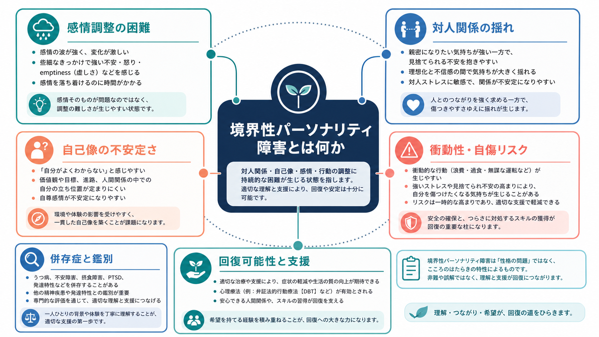
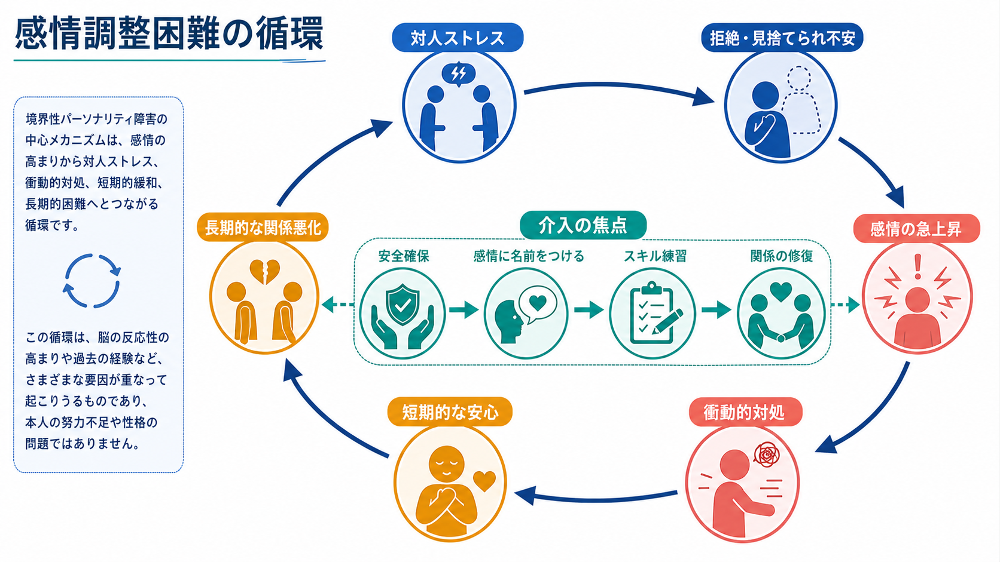
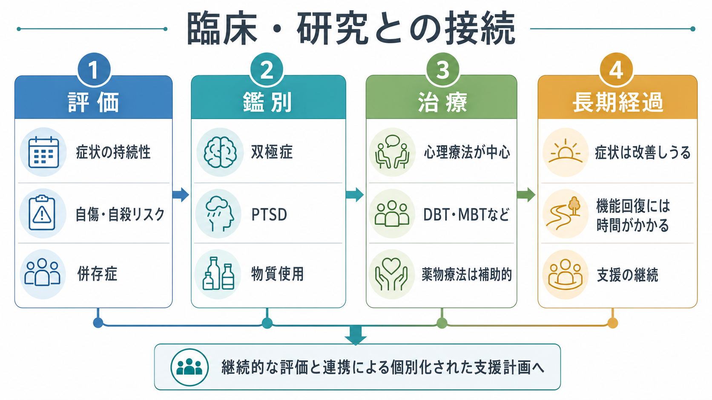

# 境界性パーソナリティ障害とは何か

## 要点

- 境界性パーソナリティ障害（borderline personality disorder: BPD）は、感情調整の困難、対人関係の不安定さ、自己像の揺れ、衝動性、自傷・自殺関連行動などが持続的なパターンとして現れるパーソナリティ障害である[1][2]。
- 中核は「性格が悪い」という問題ではなく、強い感情反応、拒絶や見捨てられへの過敏さ、衝動的な対処、関係修復の難しさが相互に強め合う脆弱性-ストレスの循環として理解すると見通しがよい[5]。
- 診断は自己診断ではなく、症状の持続性、発達歴、対人・職業機能、併存症、自傷・自殺リスク、物質使用、身体疾患などを含む専門的評価で行う[3][4]。
- 治療では心理療法が中心であり、DBT、MBTなどBPDに焦点化した心理療法は症状重症度、自傷、心理社会的機能に一定の有益性を示す。ただし効果推定の不確実性も残る[4][6]。
- 長期経過は一様ではないが、症状の寛解は十分に起こりうる。一方で、社会的・職業的機能の回復には症状改善より長い時間と継続支援が必要になりやすい[7]。

## この記事で答える問い

1. 境界性パーソナリティ障害は、どのような症状のまとまりとして理解されるのか。
2. 感情不安定性、対人関係の揺れ、衝動性はどのように結びつくのか。
3. [[双極性障害とは何か]]、[[PTSDとは何か]]、[[複雑性PTSDとは何か]]、物質使用、摂食障害などとは何を鑑別する必要があるのか。
4. 治療と支援では、何を目標にし、どのような限界を踏まえるべきか。

## まず結論

BPDは、強い感情、対人関係の不安、自己像の不安定さ、衝動的行動が「その場をしのぐための対処」として絡み合い、結果として本人の苦痛と生活機能の障害を長引かせる状態である。重要なのは、症状を人格への非難として扱わず、繰り返し起きるパターンとして評価することである。

たとえば、拒絶されたように感じる出来事があると、急激な不安・怒り・空虚感が生じる。そこで連絡を連続して送る、関係を急に断つ、危険な行動に移る、自分を傷つけるといった短期的な緩和策が起きることがある。しかし、その対処が長期的には対人関係や自己評価をさらに不安定にし、次の危機への感受性を高める。この循環を、本人の責任だけに還元せず、学習、発達、環境、併存症、支援の不足を含めて見る必要がある[2][5]。

## 背景

DSM-5-TRでは、BPDはパーソナリティ障害の一つとして位置づけられ、対人関係、自己像、感情の不安定さと著しい衝動性の広範なパターンとして記述される[1]。NIMHも、BPDを感情調整の困難が衝動性、自己像、対人関係に影響する精神疾患として説明している[2]。

BPDは臨床現場でしばしば誤解される。症状が激しく見えるため、「操作的」「治らない」「支援者を困らせる」といったラベルが貼られやすい。しかし、近年のレビューやガイドラインは、BPDを治療可能で、症状の軽減と生活機能の改善を目標にできる状態として扱う[4][5]。特に、支援者側のスティグマを減らし、危機時だけでなく長期的な治療計画を作ることが重要である[3][4]。

## 基本概念

### 感情不安定性

BPDでいう感情不安定性は、単なる「気分屋」ではない。怒り、不安、恥、空虚感、孤独感などが急速に高まり、数時間から数日単位で変動し、本人にとって制御困難な苦痛として経験されることが多い[2]。[[MSEで気分と感情をどう区別するか]]で扱うように、気分と感情の観察では、強度、持続時間、誘因、身体反応、行動への影響を分けて見る。

### 対人関係の揺れ

対人関係では、相手を強く理想化した直後に強い失望や怒りへ転じる、見捨てられへの不安から関係にしがみつく、逆に先に関係を切るといった揺れが起こりうる[1][2]。これは「わがまま」と見るより、対人安全感が崩れたときに、相手の意図を脅威として読みやすくなる状態として理解するとよい。

### 自己像の不安定さ

自分がどのような人間で、何を大切にし、どこに属しているのかという感覚が変動しやすい。価値観、目標、性的同一性、職業選択、親密な関係の位置づけが急に変わることもある[1][2]。この不安定さは、対人関係の揺れや空虚感と結びつきやすい。

### 衝動性と自傷リスク

衝動性は、浪費、危険な性行動、物質使用、過食、危険運転、自傷などとして現れることがある[1][2]。ただし、衝動的行動が主に躁状態・軽躁状態の期間に限って出る場合は、[[双極I型障害とは何か]]や[[双極II型障害とは何か]]との鑑別が重要である[2]。自傷や自殺企図がある場合は、[[自傷と自殺企図はどう違うのか]]、[[自殺リスク評価では何を聞くべきか]]のように、意図、致死性、反復性、保護因子、直近の危機を具体的に評価する。

## 仕組み

BPDの仕組みは単一原因では説明できない。遺伝的脆弱性、発達早期の逆境体験、愛着や養育環境、情動ネットワーク、実行機能、対人学習、社会的支援の不足が重なり、感情調整と対人関係のパターンとして固定化されると考えられる[5]。

有用な見取り図は、次の循環である。

1. 対人ストレスや拒絶の手がかりを強く検出する。
2. 不安、怒り、恥、空虚感が急上昇する。
3. その苦痛を下げるために、衝動的な対処や自傷が起きる。
4. 一時的には安心するが、関係悪化、罪悪感、孤立、支援者との摩擦が増える。
5. 次の対人ストレスにさらに敏感になる。

この循環は、[[扁桃体過活動は不安症やPTSDにどう関わるのか]]で扱うような脅威検出系、前頭前野による制御、報酬・罰学習、対人予測の偏りと接続して研究される。ただし、脳画像や心理尺度だけで個人を診断することはできない。臨床では、現在の安全、生活機能、関係性、併存症を含む総合評価が優先される[3][4]。

## 図解

上の1枚目は、BPDを感情、対人関係、自己像、衝動性、併存症、回復可能性の6領域として眺める概念地図である。2枚目は、対人ストレスから感情の急上昇、衝動的対処、短期的安心、長期的困難へ進む循環を示している。

3枚目は、評価・鑑別・治療・長期経過を臨床と研究の接続として整理したものである。BPDでは、危機介入だけで完結させず、本人の目標、併存症、心理療法へのアクセス、家族・支援者との協働、職業・学業・生活機能を同時に扱う必要がある[3][4]。

## 臨床・研究との接続

### 評価

評価では、診断名を急いで付けるより、反復するパターンを丁寧に確認する。APAの2024年ガイドラインは、初期評価で本人の受診理由、治療目標と希望、精神症状、パーソナリティ障害の中核特徴、併存症、治療歴、身体健康、心理社会・文化的要因、精神状態、自殺・自傷・攻撃性リスクを含めることを推奨している[4]。

NICEも、地域精神保健サービスでの評価では、心理社会・職業機能、対処方略、強みと脆弱性、併存する精神疾患、社会問題、心理治療や社会的支援の必要性を評価することを推奨する[3]。これは、[[物質使用歴はどのように聞くべきか]]、[[トラウマ歴はどのように聞くべきか]]、[[MSEで認知機能をどう評価するか]]などの総合的な面接とつながる。

### 鑑別と併存

BPDは、[[大うつ病性障害とは何か]]、[[うつ病とは何か]]、[[双極性障害とは何か]]、[[PTSDとは何か]]、[[複雑性PTSDとは何か]]、[[ADHDとは何か]]、[[物質使用障害とは何か]]、[[摂食障害群とは何か]]と重なって見えることがある。鑑別の要点は、症状の時間構造である。双極症では躁・軽躁エピソードの持続と睡眠欲求低下、活動性増加、気分高揚または易怒性のまとまりを見る。PTSDや複雑性PTSDでは、トラウマ記憶、回避、過覚醒、自己組織化の障害との関係を見る。物質使用では、酩酊、離脱、使用パターンとの時間関係を見る。

### 治療

心理療法が治療の中心である。Cochraneレビューでは、BPDに焦点化した心理療法は通常治療と比べてBPD症状重症度を下げる方向の効果を示し、DBTはBPD重症度・自傷・心理社会的機能、MBTは自傷・自殺関連アウトカムで有益性が示唆された。ただし、多くの結果は低い確実性であり、近年の系統的レビューでも治療形式間の比較や有害事象報告には限界が残るため、効果を過大に断定しないことが重要である[6][8]。

薬物療法は、BPDそのものを薬で「治す」ものとして位置づけるべきではない。APA 2024やNICEは、薬物療法を併存症や特定症状への補助として慎重に扱い、治療計画、心理社会的介入、危機計画を中心に置く方向を示している[3][4]。

### 長期経過

古い悲観的イメージとは異なり、BPD症状は長期的に改善しうる。Zanariniらの10年追跡研究では、症状寛解と社会的・職業的機能を含む「回復」は時間を要するが、一定割合で達成され、再発は寛解より少ないことが示された[7]。ただし、症状が軽くなっても、仕事、学業、親密な関係、自己効力感の回復には別の支援が必要になりやすい。

## よくある誤解

### 誤解1: BPDは本人の性格の悪さである

BPDは道徳的欠陥ではない。感情、対人予測、自己像、衝動的対処が絡む精神医学的状態であり、本人の苦痛も大きい[2][5]。非難ではなく、パターンの理解と安全な支援が必要である。

### 誤解2: BPDは治らない

症状の寛解は十分に起こりうる[7]。ただし、短期間で完全に解決するという意味ではない。危機対応、心理療法、生活支援、併存症治療、関係修復を組み合わせる必要がある。

### 誤解3: 自傷は注目を集めるためだけに行われる

自傷には、耐えがたい感情を下げる、解離から戻る、自己嫌悪を処理する、助けを求めるなど複数の機能がありうる。支援では、意図を決めつけず、安全確保と代替スキルの獲得を同時に扱う[3][6]。

### 誤解4: 診断名を告げると悪化する

不適切な伝え方はスティグマを強めるが、丁寧な心理教育は本人と支援者が同じ地図を持つ助けになる。診断名はラベルではなく、治療計画を作るための作業仮説として扱う。

## 関連ノート

- [[PTSDとは何か]]
- [[複雑性PTSDとは何か]]
- [[双極性障害とは何か]]
- [[双極I型障害とは何か]]
- [[双極II型障害とは何か]]
- [[大うつ病性障害とは何か]]
- [[ADHDとは何か]]
- [[物質使用障害とは何か]]
- [[摂食障害群とは何か]]
- [[自傷と自殺企図はどう違うのか]]
- [[自殺リスク評価では何を聞くべきか]]
- [[トラウマ歴はどのように聞くべきか]]
- [[扁桃体過活動は不安症やPTSDにどう関わるのか]]

今後の作成候補: 弁証法的行動療法とは何か、メンタライゼーションに基づく治療とは何か、パーソナリティ障害とは何か、見捨てられ不安とは何か、感情調整困難とは何か。

MOC更新候補: `content/00_MOC/` 配下の精神医学、疾患・症候群、心理療法、臨床評価に関するMOC。並列生成ジョブとの競合を避けるため、本記事ではMOC本体は更新しない。

## 理解チェック

1. BPDの中核特徴を、感情・対人関係・自己像・衝動性の4領域から説明できるか。
2. BPDの衝動性と、双極症の躁・軽躁エピソード中の衝動性を、時間構造で区別して考えられるか。
3. 自傷を「注目目的」と決めつけず、機能分析と安全確保の観点から説明できるか。
4. DBTやMBTなどの心理療法について、有益性とエビデンスの限界を同時に述べられるか。
5. 本記事が教育・研究目的であり、個別診断や治療指示ではないことを説明できるか。

## 未解決問題

- BPDの神経生物学的所見を、個人の診断や治療選択にどこまで使えるか。
- どの患者にDBT、MBT、TFP、GPMなどのどの治療形式が合うのかを予測する指標は何か。
- 青年期の早期介入で、スティグマを増やさず、適切な支援につなぐ評価体系をどう作るか。
- 併存するPTSD、物質使用、摂食障害、発達特性がある場合、治療順序をどう最適化するか。

## 参考文献

[1] American Psychiatric Association. (2022). *Diagnostic and Statistical Manual of Mental Disorders, Fifth Edition, Text Revision (DSM-5-TR)*. American Psychiatric Association Publishing. https://doi.org/10.1176/appi.books.9780890425787

[2] National Institute of Mental Health. (2026). *Borderline Personality Disorder*. https://www.nimh.nih.gov/health/publications/borderline-personality-disorder

[3] National Institute for Health and Care Excellence. (2009, updated). *Borderline personality disorder: recognition and management* (Clinical guideline CG78). https://www.nice.org.uk/guidance/cg78

[4] Keepers, G. A., Fochtmann, L. J., Anzia, J. M., Benjamin, S., Lyness, J. M., Mojtabai, R., Servis, M., Choi-Kain, L., Nelson, K. J., Oldham, J. M., Sharp, C., Degenhardt, A., Hong, S. H., & Medicus, J. (2024). The American Psychiatric Association Practice Guideline for the Treatment of Patients With Borderline Personality Disorder. *American Journal of Psychiatry, 181*(11), 1024-1028. https://doi.org/10.1176/appi.ajp.24181010

[5] Gunderson, J. G., Herpertz, S. C., Skodol, A. E., Torgersen, S., & Zanarini, M. C. (2018). Borderline personality disorder. *Nature Reviews Disease Primers, 4*, 18029. https://doi.org/10.1038/nrdp.2018.29

[6] Storebø, O. J., Stoffers-Winterling, J. M., Völlm, B. A., Kongerslev, M. T., Mattivi, J. T., Jørgensen, M. S., Faltinsen, E., Todorovac, A., Sales, C. P., Callesen, H. E., Lieb, K., & Simonsen, E. (2020). Psychological therapies for people with borderline personality disorder. *Cochrane Database of Systematic Reviews*, Issue 5, CD012955. https://doi.org/10.1002/14651858.CD012955.pub2

[7] Zanarini, M. C., Frankenburg, F. R., Reich, D. B., & Fitzmaurice, G. (2010). Time-to-attainment of recovery from borderline personality disorder and its stability: A 10-year prospective follow-up study. *American Journal of Psychiatry, 167*(6), 663-667. https://doi.org/10.1176/appi.ajp.2009.09081130

[8] Crotty, K., Viswanathan, M., Kennedy, S., Edlund, M. J., Ali, R., Siddiqui, M., Wines, R., Ratajczak, P., & Gartlehner, G. (2024). Psychotherapies for the treatment of borderline personality disorder: A systematic review. *Journal of Consulting and Clinical Psychology, 92*(5), 275-295. https://doi.org/10.1037/ccp0000833
