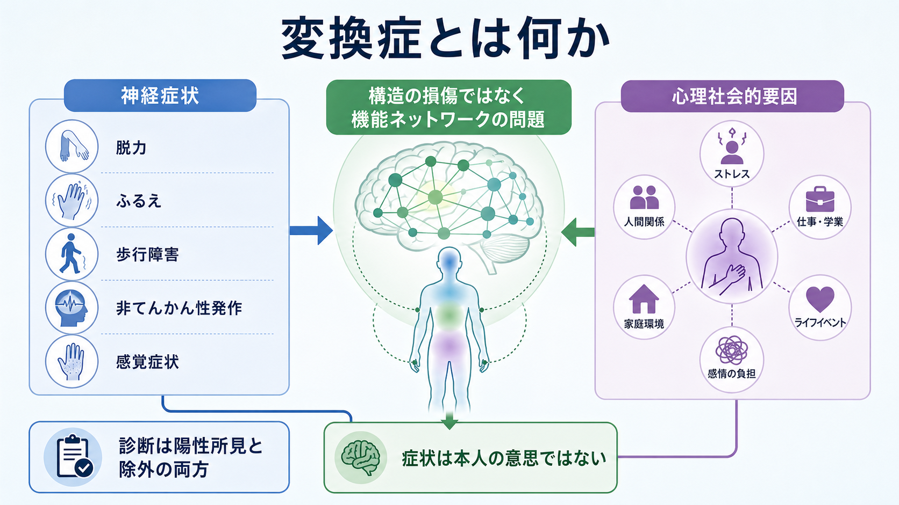
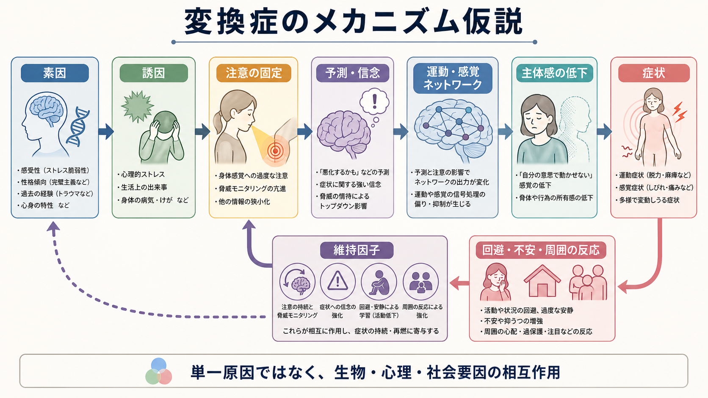
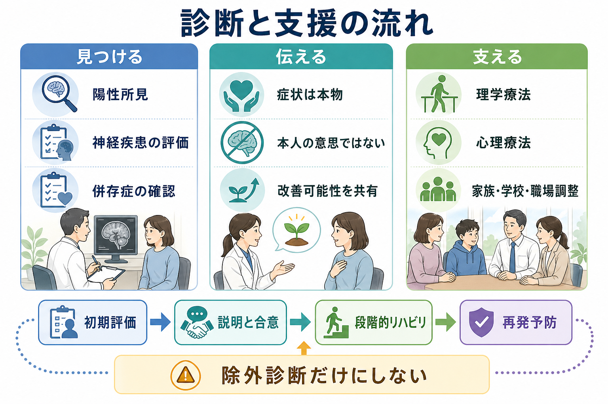

# 変換症とは何か

## 要点

- 変換症は、脱力、ふるえ、歩行障害、感覚障害、非てんかん性発作など、神経疾患に似た症状が、本人の意思によらず出現する病態である。現在は「機能性神経症状症」または functional neurological disorder（FND）という名称も広く使われる[1][3]。
- 重要なのは、「脳や神経に何も起きていない」という意味ではない。構造画像で明確な損傷が見つからない場合でも、脳ネットワークの働き方、注意、予測、主体感、情動・ストレス反応の調整が変化していると考えられている[3][4]。
- 診断は「検査で異常がないから」だけで行うものではない。Hoover徴候、ふるえの同調、注意をそらしたときの変化など、症状と既知の神経疾患との不一致を示す陽性所見を重視する[1][3]。
- 心理社会的要因はしばしば関与するが、DSM-5以降では明確な心理的ストレス因子が診断の必須条件ではなくなった。身体疾患、けが、疲労、生活上の負荷、過去の逆境、周囲の反応などが複合的に関わる[2][4]。
- 治療・支援では、症状が本物で本人の意思ではないことを共有し、神経学的評価、説明、理学療法、心理療法、併存症への対応、家族・学校・職場調整を組み合わせる[5][6]。

## この記事で答える問い

1. 変換症は、神経疾患、詐病、心因反応とどのように違うのか。
2. 「心理社会的要因と関連する神経症状」と言うとき、何が症状を作り、何が症状を維持するのか。
3. 診断では、除外診断と陽性所見をどのように組み合わせるのか。
4. 臨床や研究では、変換症をどのように説明し、支援し、検証しているのか。

## まず結論

変換症とは、神経系の「構造が壊れた」ためではなく、運動・感覚・注意・予測・情動調整・主体感に関わるネットワークの働き方が変化し、神経学的症状として現れる状態である。症状は意図的に作られるものではなく、患者本人には現実の脱力、ふるえ、発作、しびれ、歩行困難として経験される[3][4]。

ただし、「心理的ストレスが身体症状に変換される」という古典的な説明だけでは不十分である。現在の見方では、[[予測処理とは何か|予測処理]]、[[内受容感覚とは何か|内受容感覚]]、身体への注意、過去の学習、身体疾患や外傷、[[PTSDとは何か|トラウマ関連症状]]、[[不安症群とは何か|不安]]や[[うつ病とは何か|抑うつ]]、周囲の反応が相互作用し、症状の発生と維持に関わると考える[4][7]。

## 背景

変換症という名称は、心理的葛藤や苦痛が身体症状へ「変換」されるという古典的な精神力動的理解に由来する。しかし、現代の臨床では、この用語だけでは「心の問題だから神経学的には本物ではない」という誤解を招きやすい。そのため、神経内科・精神医学・リハビリテーション領域では、FND、機能性神経障害、機能性神経症状症という表現が使われることが多い[4][7]。

DSM-5-TR の枠組みでは、変換症は「機能性神経症状症」として、随意運動または感覚機能の変化を示す1つ以上の症状、既知の神経疾患・医学的状態との不一致を示す臨床所見、他の疾患でよりよく説明されないこと、臨床的苦痛・機能障害または医学的評価の必要性によって特徴づけられる[1]。ICD-11 では「解離性神経症状症」として、運動・感覚・認知機能の統合が非随意的に途切れる症状群として整理され、非てんかん性発作、脱力、歩行障害、視覚・聴覚・感覚症状などの指定子が用意されている[2]。

## 基本概念

### 症状は本物だが、既知の神経疾患の型と一致しにくい

変換症の症状は、患者にとって実際に体験される神経症状である。典型例には、片側または両側の脱力、麻痺、ふるえ、ジストニア様姿勢、歩行障害、声が出にくい、視野や感覚の異常、意識消失様発作、非てんかん性発作がある[3]。症状は突然始まることも、身体疾患や外傷、ストレス、生活上の負荷の後に現れることもあるが、明確な誘因が見つからない場合もある[3][4]。

臨床上の鍵は、症状が既知の神経解剖や病態生理と合わない、または場面や注意の向け方で変化することである。たとえば、ベッド上の筋力検査では脚が動かないように見えるが、別の課題では自動的な筋活動が出る、ふるえが反対側のリズム運動に引き込まれる、発作様症状がてんかん発作の脳波変化を伴わない、などである[1][3]。

### 除外診断だけではなく陽性診断である

以前は、変換症は「検査で神経疾患が否定された後に残る診断」と見なされやすかった。しかし現在は、FND に特異的または支持的な臨床徴候をもとに、陽性診断として説明することが推奨される[3][4]。もちろん、脳卒中、てんかん、多発性硬化症、末梢神経障害、筋疾患、薬剤性症状、代謝性疾患などの評価は必要であり、FND と神経疾患が併存することもある[2][3]。

この点は、[[器質性精神病とは何か|器質性の病態]]と精神医学的病態を単純に二分しない姿勢とも関係する。FND は「器質か心因か」の二択ではなく、神経系の機能的制御、身体感覚、情動、社会文脈が重なる境界領域の病態として理解する必要がある。

## 仕組み

変換症のメカニズムは単一ではない。現在の研究では、運動・感覚ネットワークの出力そのものに加えて、身体に向けられる注意、症状に関する予測や信念、情動・ストレス関連ネットワーク、自己の行為を「自分が起こしている」と感じる主体感が関与すると考えられている[4][7]。

予測処理の観点から言えば、脳は身体からの入力を受け身に読むだけでなく、「この身体はこう動くはずだ」「この感覚は危険かもしれない」という予測を作り、感覚入力と照合している。強い身体への注意や症状に関する期待があると、運動や感覚の信号処理が偏り、本人の意図とは別に脱力、ふるえ、痛み、しびれ、発作様症状として固定される可能性がある[4]。

また、症状が一度生じると、活動回避、不安、過度な安静、家族や周囲の心配、医療者からのあいまいな説明が、意図せず症状を維持することがある[5][6]。これは「本人が症状を利用している」という意味ではない。むしろ、身体を守ろうとする反応、失敗や悪化を避ける行動、周囲の保護的反応が、長期的には機能回復の機会を減らすことがある、という理解である。

## 図解

上の2枚の図は、変換症を「神経症状」「機能ネットワーク」「心理社会的要因」の三者関係として捉えるための概念図である。重要なのは、心理社会的要因があるからといって症状が作りごとになるわけではなく、脳と身体の制御の仕方に実際の変化が生じるという点である[3][4]。

臨床では、症状を説明するときに次の3点を同時に伝えると誤解が少ない。

| 伝えること | 意味 | 避けたい言い方 |
|---|---|---|
| 症状は本物である | 本人の苦痛と機能障害を認める | 「気のせい」 |
| 本人の意思ではない | 詐病や作為とは異なる | 「わざと」 |
| 改善可能性がある | 神経系の機能的制御を再学習できる可能性がある | 「異常なしだから終わり」 |

## 臨床・研究との接続

診断では、神経学的評価と精神医学的評価の両方が必要になる。神経学的評価では、症状型に応じて、画像検査、脳波、筋電図、神経伝導検査、身体診察を組み合わせる。精神医学的評価では、[[全般不安症とは何か|不安症状]]、抑うつ、トラウマ関連症状、解離、睡眠、疼痛、発達特性、物質使用、家族・学校・職場環境を確認する[2][5]。

支援では、診断名を告げるだけでは不十分である。患者が「なぜ本物の症状なのに検査で構造的異常が出にくいのか」「なぜ注意や動作の仕方で症状が変わるのか」を理解できる説明が、治療そのものの一部になる[5][6]。運動症状では、症状を直接力で抑えるのではなく、自動的で自然な運動を引き出し、注意を症状から課題や環境へ移す理学療法が重視される。非てんかん性発作では、発作の安全管理、誘因・前兆の把握、心理療法、併存するてんかんの有無の確認が必要になる[5][6]。

研究面では、機能的神経画像、神経生理、計算論的モデル、臨床試験が進んでいる。補足運動野、島皮質、扁桃体、前頭前野、側頭頭頂接合部など、運動準備、内受容、情動、注意、主体感に関わるネットワークが検討されている[4][7]。ただし、現時点で単独で診断を確定できるバイオマーカーはなく、画像所見を個別診断へ直結させることはできない[3][7]。

## よくある誤解

### 「検査で異常がないなら病気ではない」

構造画像や通常検査で異常が見つからないことは、症状が存在しないことを意味しない。FND は、神経系の構造損傷よりも機能的制御の変化に焦点を当てる病態であり、診断には陽性所見と医学的評価の両方が必要である[1][3]。

### 「心理的原因が見つからないなら変換症ではない」

DSM-5以降、心理的ストレス因子は診断に役立つことはあっても必須条件ではない。心理的出来事が明確でない症例、身体疾患や外傷を契機とする症例、複数の要因が少しずつ重なる症例がある[3][4]。

### 「本人がわざとしている」

変換症は詐病や作為症とは異なる。ICD-11 でも、症状は非随意的な統合の途切れとして記述され、意図的に偽装・誘発される状態とは区別される[2]。本人の努力不足や性格の問題として扱うと、診断理解と治療関係を損ないやすい。

### 「精神科だけ、または神経内科だけで扱えばよい」

FND は神経内科、精神科、心理職、理学療法、作業療法、言語療法、プライマリケア、家族・学校・職場支援が交差する領域である。最初の説明が不十分だと、患者は「見捨てられた」「異常なしと言われただけ」と感じやすく、医療不信や不要な検査の反復につながる[4][6]。

## 関連ノート

- [[身体症状症は脳の予測処理で説明できるのか]]
- [[解離症状は脳ネットワークでどう説明できるのか]]
- [[解離とは認知科学的に何か]]
- [[予測処理とは何か]]
- [[内受容感覚とは何か]]
- [[身体所有感とは何か]]
- [[身体図式とは何か]]
- [[PTSDとは何か]]
- [[不安症群とは何か]]
- [[うつ病とは何か]]
- [[パニック症とは何か]]
- [[器質性精神病とは何か]]

MOC更新候補: `MOC｜精神医学`, `MOC｜神経科学と精神疾患`, `MOC｜意識・自己・身体性`, `MOC｜計算論的精神医学`

今後の作成候補: 機能性神経障害とは何か、非てんかん性発作とは何か、身体症状症と変換症の違い、Hoover徴候とは何か、神経疾患とFNDの併存をどう考えるか

## 理解チェック

1. 変換症を「気のせい」や「詐病」と説明してはいけない理由は何か。
2. 診断で「除外診断だけではなく陽性所見が重要」と言うとき、どのような所見が想定されるか。
3. 心理社会的要因が診断の必須条件ではなくなったことは、臨床説明にどのような影響を持つか。
4. 予測、注意、主体感、回避行動は、症状の発生・維持にどのように関わりうるか。
5. 変換症の支援で、神経内科、精神科、心理療法、理学療法、家族・学校・職場調整を分けずに考える理由は何か。

## 参考文献

[1] Merck Manual Professional Edition. Functional Neurological Symptom Disorder (Conversion Disorder). Reviewed/Revised Jul 2024. https://www.merckmanuals.com/professional/psychiatric-disorders/somatic-symptom-and-related-disorders/functional-neurological-symptom-disorder

[2] World Health Organization. ICD-11 MMS: 6B60 Dissociative neurological symptom disorder. https://icd.who.int/browse/2025-01/mms/en#1069443471

[3] National Institute of Neurological Disorders and Stroke. Functional Neurologic Disorder. https://www.ninds.nih.gov/health-information/disorders/functional-neurologic-disorder

[4] Espay AJ, Aybek S, Carson A, et al. Current Concepts in Diagnosis and Treatment of Functional Neurological Disorders. *JAMA Neurology*. 2018;75(9):1132-1141. https://doi.org/10.1001/jamaneurol.2018.1264

[5] Gilmour GS, Nielsen G, Teodoro T, et al. Management of functional neurological disorder. *Journal of Neurology*. 2020;267:2164-2172. https://doi.org/10.1007/s00415-020-09772-w

[6] Dworetzky BA, Baslet G. Functional neurological disorder: Practical management. *Neurotherapeutics*. 2025;22(4):e00612. https://doi.org/10.1016/j.neurot.2025.e00612

[7] Hallett M. Functional Neurologic Disorder, La Lésion Dynamique: 2024 Wartenberg Lecture. *Neurology*. 2024;103(11):e210051. https://doi.org/10.1212/WNL.0000000000210051

[8] Varley D, Sweetman J, Brabyn S, Lagos D, van der Feltz-Cornelis C. The clinical management of functional neurological disorder: A scoping review of the literature. *Journal of Psychosomatic Research*. 2023;165:111121. https://doi.org/10.1016/j.jpsychores.2022.111121

