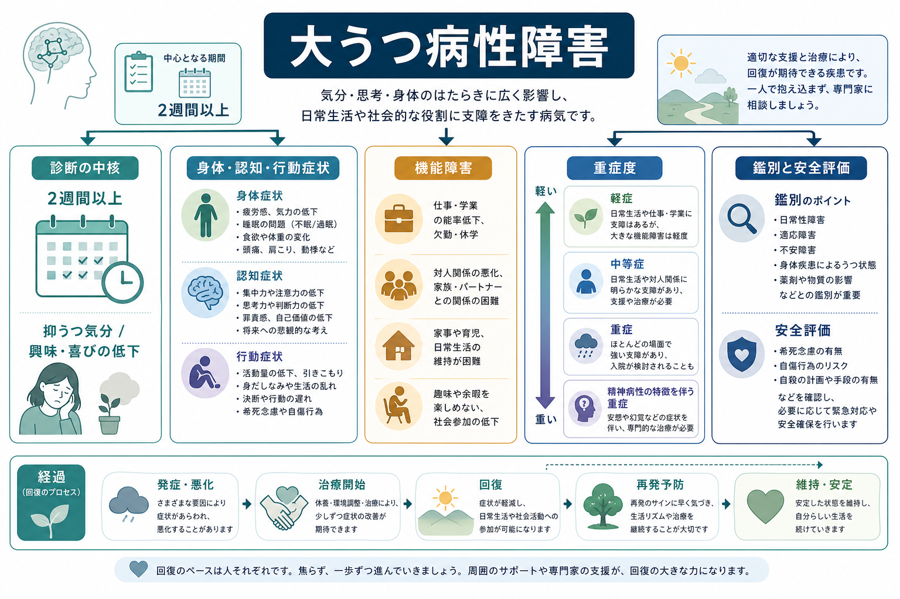
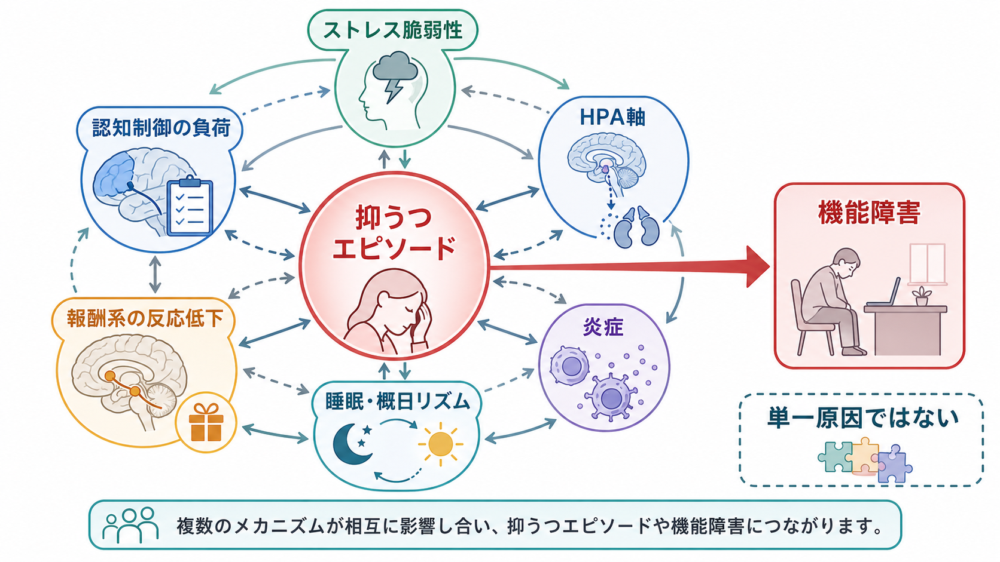
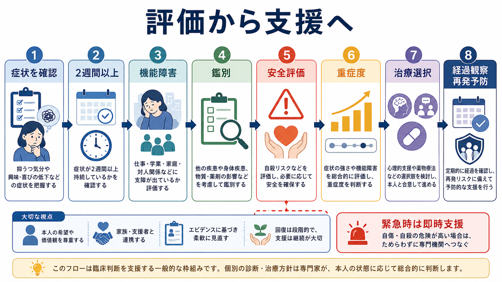

# 大うつ病性障害とは何か

## 要点

- 大うつ病性障害は、「気分が落ち込む」だけでなく、興味・喜びの低下、睡眠、食欲、疲労感、思考、罪責感、自殺念慮などが一定期間まとまって続き、生活機能を損なう状態として理解する。
- 診断の中心は[[抑うつ気分とは何か|抑うつ気分]]または興味・喜びの低下を含む抑うつエピソードで、DSM-5 系では少なくとも2週間、複数症状、臨床的苦痛または機能障害、躁病・軽躁病エピソードの除外が重視される[1]。
- 重症度は症状数だけで決まらず、仕事・学業・家庭・対人関係・セルフケアの障害、安全評価、精神病症状、併存症、経過を合わせて判断する。
- 医療・精神医学の内容として、本稿は教育・研究目的の整理であり、個別の診断や治療指示ではない。

## この記事で答える問い

- 大うつ病性障害は、通常の落ち込みとどこが違うのか。
- 診断では、どの症状、期間、機能障害を確認するのか。
- 重症度や安全評価はなぜ重要なのか。
- 「セロトニン不足」だけでは説明できない仕組みを、どう理解すればよいのか。

## まず結論

大うつ病性障害は、持続する抑うつエピソードによって、感情、身体、認知、行動、社会的役割が同時に影響を受ける疾患概念である。診断分類では[[DSMとICDは何が違うのか|DSMやICD]]の操作的基準を使うが、臨床的には「症状が何個あるか」だけでなく、機能障害、安全性、鑑別、本人の文脈を統合して理解する必要がある[1][2]。

## 背景

世界保健機関は、うつ病が世界的に頻度の高い精神疾患であり、気分、興味、楽しみ、睡眠、食欲、集中、価値感、将来への見通しに影響しうると説明している[2]。NIMH も、大うつ病では悲しみや空虚感だけでなく、疲労、睡眠・食欲の変化、集中困難、身体症状、自殺念慮などがまとまって現れることを示している[3]。

ただし、うつ病は単一の均質な病気というより、複数の経路から似た抑うつエピソードに至る異質な症候群として扱う方が実際的である。疫学・遺伝・心理社会的要因・身体疾患・薬物・発達歴などが重なり、症状の組み合わせ、再発性、治療反応、生活機能への影響は人によって大きく異なる[4]。

## 基本概念

### 抑うつエピソード

診断上の核は、一定期間続く抑うつエピソードである。DSM-5 系の大うつ病エピソードでは、抑うつ気分または興味・喜びの低下の少なくとも一方を含み、睡眠、食欲・体重、精神運動、疲労、罪責感、思考・集中、自殺念慮などの症状が、同じ2週間の間にまとまって存在することが重視される[1]。

この「2週間」は、つらさを軽視するための線引きではない。日常的な[[気分とは何か|気分]]の揺れや悲嘆反応と、持続的で広範な機能低下を伴う状態を区別するための操作的な目安である。したがって評価では、症状リストだけでなく、いつ始まり、ほとんど毎日あるのか、以前の状態からどれだけ変化したのかを確認する。

### 機能障害

大うつ病性障害では、生活のどこがどう損なわれているかが重要である。仕事や学業の欠勤・能率低下、家事や育児の困難、対人関係の回避、セルフケアの低下、身体疾患管理の停滞などが評価対象になる。これは[[精神科で生活機能をどう評価するか]]や[[GAFやWHODASは何を評価するのか]]と直接つながる。

症状が多くても生活機能が保たれている人もいれば、症状数は中等度でも安全性や生活維持の面で大きな支援が必要な人もいる。そのため重症度は、症状数、症状の強さ、苦痛、機能障害、安全性、精神病症状、併存症を合わせて判断する。

## 仕組み

大うつ病性障害を「脳内物質が足りないだけ」と説明するのは単純化しすぎである。主要レビューでは、ストレス応答、遺伝的脆弱性、発達歴、報酬処理、認知制御、睡眠・概日リズム、免疫・炎症、内分泌、社会的ストレスなどが相互作用する疾患として整理されている[5][6]。

報酬系の反応低下は、興味・喜びの低下や意欲低下と関係する。認知制御の負荷は、反すう、否定的思考、注意の偏り、判断の遅れとして表れうる。[[前頭頭頂ネットワークは認知制御をどう支えるのか|認知制御ネットワーク]]、情動処理、ストレス応答系が相互に影響するため、同じ「抑うつ」でも、身体症状が前景に立つ場合、睡眠障害が中心のように見える場合、不安が強い場合などがある。

また、[[セロトニンは気分だけに関わるのか|セロトニン]]は重要な神経調節系の一部だが、うつ病全体を単一物質の不足で説明することはできない。薬物療法、心理療法、睡眠・活動リズム、社会的支援、身体疾患管理がそれぞれ異なる経路に働きかけると考える方が、臨床と研究の双方で有用である[5][7]。

## 図解

3枚の図は、本文の読み方を補助するためのものである。1枚目は診断、症状、重症度、機能障害を概観する。2枚目は、複数のメカニズムが抑うつエピソードを支えるという見方を示す。3枚目は、評価から支援へ進むときの臨床的な確認順序をまとめる。

## 臨床・研究との接続

臨床評価では、まず抑うつ症状の有無、持続期間、日内変動、睡眠、食欲、精神運動、集中、罪責感、希死念慮を確認する。次に、[[精神科診断における除外診断とは何か|除外診断]]として、双極性障害、物質・薬剤、身体疾患、適応障害、悲嘆、不安症、精神病性障害などを検討する[1][7]。

特に[[双極性障害とは何か]]の既往は重要である。過去の躁病・軽躁病エピソードを見落とすと、うつ状態だけを見て大うつ病性障害と扱ってしまう可能性がある。[[身体疾患による気分障害とは何か]]、薬物・アルコール、睡眠障害、疼痛、内分泌疾患なども評価に含める。

安全評価では、[[自殺念慮と自殺企図は何が違うのか|自殺念慮や自殺企図]]、具体的な計画、手段へのアクセス、過去の企図、物質使用、孤立、保護因子、支援体制を確認する。自傷・自殺の危険が高い場合は、教育的な一般論ではなく、専門機関や救急を含む即時の安全確保が必要になる。

研究や測定では、PHQ-9 のような尺度が抑うつ症状のスクリーニングや重症度把握に用いられる[8]。ただし尺度は診断そのものではなく、面接、生活機能、鑑別、安全性、経過と合わせて使う補助線である。これは[[精神症状の横断的評価とは何か]]という視点にも近い。

## よくある誤解

### 「気の持ちよう」で説明できる

大うつ病性障害では、意欲低下、睡眠、食欲、集中、身体症状、社会的機能が同時に変化しうる。本人の努力不足として説明すると、疾患の多因子性と機能障害を見落とす。

### 「悲しい出来事があれば、うつ病ではない」

ストレスや喪失体験が誘因になることはあるが、それだけで診断が否定されるわけではない。持続、症状の広がり、機能障害、安全性、経過を見て判断する。

### 「薬だけ、または心理療法だけで考えればよい」

NICE などのガイドラインは、重症度、本人の希望、過去の反応、併存症、リスクに応じて、心理療法、薬物療法、生活支援、継続的モニタリングを組み合わせて考える[7]。単一の方法を全員に一律に当てはめるより、状態と文脈に応じて段階的に評価することが重要である。

## 関連ノート

- [[抑うつ気分とは何か]]
- [[双極性障害とは何か]]
- [[睡眠障害とは何か]]
- [[精神科診断における除外診断とは何か]]
- [[精神科で生活機能をどう評価するか]]
- [[自殺念慮と自殺企図は何が違うのか]]
- [[DSMとICDは何が違うのか]]

## 理解チェック

1. 大うつ病性障害の診断で、抑うつ気分または興味・喜びの低下が重要視されるのはなぜか。
2. 「症状数」と「重症度」は、どの点で同じではないか。
3. 双極性障害、身体疾患、物質・薬剤の影響を鑑別する必要があるのはなぜか。
4. PHQ-9 のような尺度を使うとき、診断面接と区別すべき点は何か。

## 参考文献

[1] American Psychiatric Association. (2013/2022). *Diagnostic and Statistical Manual of Mental Disorders* DSM-5 / DSM-5-TR; Major Depressive Episode criteria summarized in NCBI Bookshelf table. https://www.ncbi.nlm.nih.gov/books/NBK519712/table/ch3.t5/

[2] World Health Organization. (2023). Depressive disorder (depression). https://www.who.int/news-room/fact-sheets/detail/depression

[3] National Institute of Mental Health. Depression. https://www.nimh.nih.gov/health/topics/depression

[4] Marx, W., Penninx, B. W. J. H., Solmi, M., Furukawa, T. A., Firth, J., Carvalho, A. F., & Berk, M. (2023). Major depressive disorder. *Nature Reviews Disease Primers*, 9, 44. https://doi.org/10.1038/s41572-023-00454-1

[5] Otte, C., Gold, S. M., Penninx, B. W., Pariante, C. M., Etkin, A., Fava, M., Mohr, D. C., & Schatzberg, A. F. (2016). Major depressive disorder. *Nature Reviews Disease Primers*, 2, 16065. https://doi.org/10.1038/nrdp.2016.65

[6] Malhi, G. S., & Mann, J. J. (2018). Depression. *The Lancet*, 392(10161), 2299-2312. https://doi.org/10.1016/S0140-6736(18)31948-2

[7] National Institute for Health and Care Excellence. (2022). *Depression in adults: treatment and management* (NICE guideline NG222). https://www.nice.org.uk/guidance/ng222

[8] Kroenke, K., Spitzer, R. L., & Williams, J. B. W. (2001). The PHQ-9: Validity of a brief depression severity measure. *Journal of General Internal Medicine*, 16(9), 606-613. https://doi.org/10.1046/j.1525-1497.2001.016009606.x

## 未解決問題

- 大うつ病性障害の異質性を、症状プロファイル、発症経路、バイオマーカー、治療反応からどこまで下位分類できるか。
- 炎症、睡眠・概日、報酬処理、認知制御の知見を、個別化された評価や介入選択にどう結びつけるか。
- 再発予防において、尺度測定、生活リズム、社会的支援、心理療法、薬物療法をどのように統合するか。

## MOC更新候補

- `content/00_MOC/MOC｜精神医学.md`
- `content/00_MOC/MOC｜総論・診断・面接.md`
- `content/00_MOC/MOC｜症候学.md`
