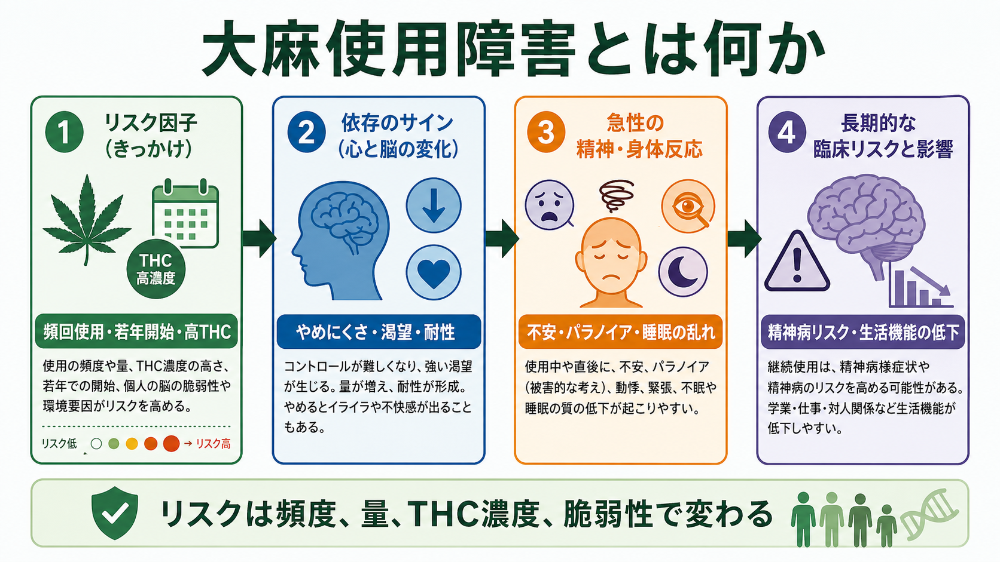
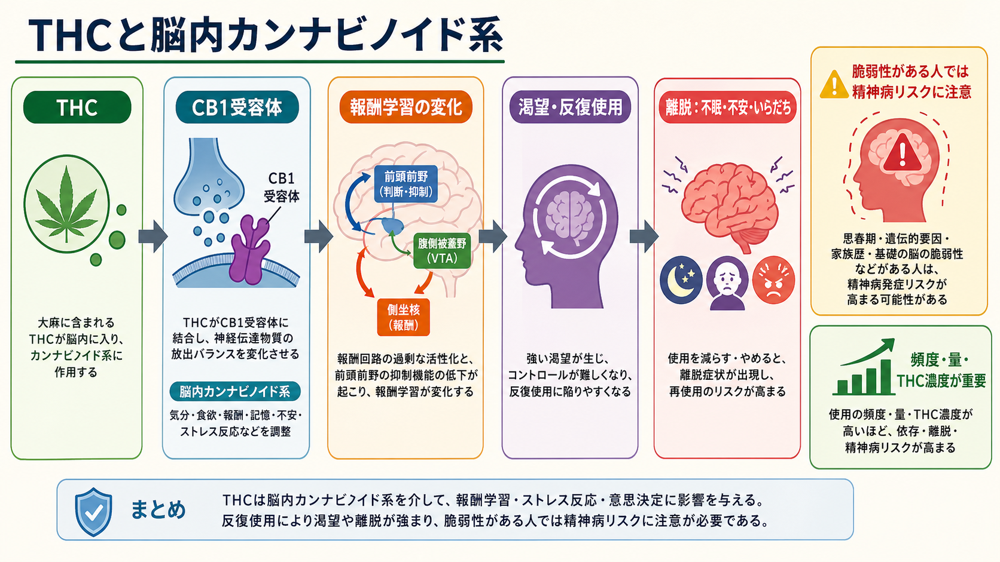
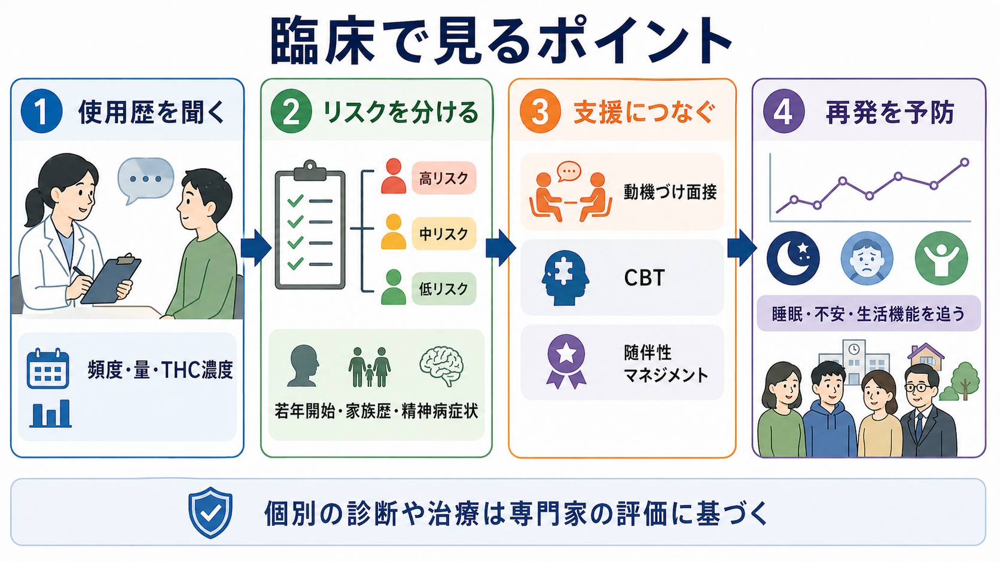

# 大麻使用障害とは何か

## 要点

- 大麻使用障害は、単に「大麻を使ったことがある」状態ではなく、使用を減らせない、渇望が強い、生活・学業・仕事・対人関係に支障が出る、耐性や離脱がある、といった問題が持続する状態である[1][4]。
- リスクは「使うか、使わないか」だけでなく、若年開始、頻回使用、使用量、THC濃度、精神病や不安への脆弱性、併存する心理社会的ストレスで変わる[1][2][5]。
- 大麻は一部の人で不安、パラノイア、睡眠障害を引き起こし、頻回使用や高THC製品では精神病リスクとの関連が強くなる[2][5][8]。
- 治療では、動機づけ面接、認知行動療法、随伴性マネジメントなどの心理社会的介入が中心で、現時点で大麻使用障害そのものに対する標準的な承認薬は限られる、または存在しないと整理される[4][6][7]。

## この記事で答える問い

1. 大麻使用障害は、通常の使用や一時的な中毒と何が違うのか。
2. 依存、離脱、不安、精神病リスクはどのようにつながるのか。
3. 臨床や研究では、どのような点を評価し、どのような支援につなげるのか。

## まず結論

大麻使用障害は、THCを含む大麻製品の反復使用が、報酬学習、ストレス反応、睡眠、気分、認知、社会機能に影響し、「やめたいのにやめにくい」パターンとして固定化していく状態である。重要なのは、大麻を一枚岩の物質として扱わないことである。THC濃度、摂取経路、使用頻度、開始年齢、本人の精神病脆弱性や不安症状によって、リスクの形は大きく変わる[1][2][5]。

一方で、大麻使用と精神症状の関係は、すべてを単純な因果に還元できるわけではない。精神症状が先にあり自己治療的に使う場合、使用が症状を悪化させる場合、両者に共通する遺伝・環境リスクがある場合が混在する。したがって臨床では、使用歴、症状の時間関係、離脱、併存疾患、生活機能を一緒に評価する必要がある[3][4]。

## 背景

大麻は Cannabis sativa などに由来する植物性製品の総称で、精神作用の中心は主に delta-9-tetrahydrocannabinol、すなわち THC である。THCは知覚、気分、時間感覚、注意、運動協調、判断に影響する。近年は、乾燥植物だけでなく、濃縮製品、ベイプ、エディブルなど摂取形態が多様化し、THC濃度が高い製品も増えている[1][3]。

精神医学的に問題となるのは、快・リラックス・睡眠補助として経験される効果だけではない。使用中または使用後に、不安、パニック様症状、パラノイア、知覚変化、判断低下が出ることがある。さらに、頻回使用、若年開始、高THC製品の使用は、依存、認知機能への影響、[[物質誘発性精神病とは何か|物質誘発性精神病]]、[[初回エピソード精神病とは何か|初回エピソード精神病]]との関連を考えるうえで重要である[2][5][8]。

## 基本概念

### 大麻使用障害

DSM系の診断枠組みでは、大麻使用障害は、12か月以内に複数の基準を満たす「臨床的に意味のある障害または苦痛を伴う問題的使用」として捉えられる。基準には、意図より多く使う、減量に失敗する、使用や回復に多くの時間を使う、渇望、役割不履行、対人問題があっても続ける、危険な状況で使う、身体・心理的問題があっても続ける、耐性、離脱などが含まれる[4]。

これは道徳的な弱さではなく、行動、学習、環境、ストレス、脳内報酬系が絡む精神医学的状態である。軽症では「週末だけのつもりが量が増える」「やめると眠れない」程度から始まり、重症では学校・仕事・家族関係・安全行動に明らかな支障が出る。

### 中毒、離脱、依存

急性中毒では、気分変化、注意・判断の低下、時間感覚の変化、不安、運動協調の低下などが問題になる。離脱では、使用を減らした後に、いらだち、不安、不眠、食欲低下、落ち着かなさ、気分の落ち込みなどが出ることがある[4]。依存の臨床像は、急性の「酔い」よりも、反復使用、耐性、離脱回避、生活機能の低下として現れる。

### 不安と精神病リスク

大麻は一部の人で不安やパラノイアを起こす。CDCは、大麻使用が不安やパラノイアを含む不快な思考・感情を引き起こすことがあり、精神病や統合失調症を含む長期的精神疾患との関連が報告されていると整理している[2]。特に、若年開始、頻回使用、高THC製品は、[[統合失調症とは何か|統合失調症]]スペクトラムの脆弱性をもつ人で注意が必要である[5][8]。

ただし、「大麻を使う人は必ず精神病になる」という意味ではない。リスクは確率的であり、遺伝的脆弱性、家族歴、発達段階、使用量、THC濃度、他物質使用、睡眠不足、ストレス、既存の[[不安症群とは何か|不安症]]や気分症状と組み合わさる。

## 仕組み

THCは脳内カンナビノイド系、とくにCB1受容体を介して、神経伝達物質の放出調整に影響する。CB1受容体は前頭前野、海馬、扁桃体、線条体など、報酬、記憶、情動、ストレス反応、意思決定に関わる領域に広く分布する[4]。

反復使用では、次のような循環が起こりやすい。

| 段階 | 何が起こるか | 臨床的に見えること |
|---|---|---|
| 初期効果 | リラックス、快、不安軽減として経験されることがある | 「眠れる」「落ち着く」と感じる |
| 学習 | ストレスや不快感と使用が結びつく | 嫌なことがあると使いたくなる |
| 耐性 | 同じ効果により多い量や高濃度を求める | 使用頻度・量が増える |
| 離脱 | 減量・中止で不眠、不安、いらだちが出る | やめるとつらく、再使用する |
| 機能低下 | 注意、記憶、対人、学業・仕事に影響する | 生活の優先順位が崩れる |

この循環は、[[全般不安症とは何か|全般不安症]]や睡眠問題がある人では、自己治療的使用として始まることがある。しかし短期的な不安軽減が、長期的には不眠、離脱不安、回避行動を強める場合がある。ここが臨床的に重要な分岐点である。

## 図解

1枚目は、大麻使用障害を「リスク因子」「依存のサイン」「急性の精神・身体反応」「長期的な臨床リスク」に分けて示している。ポイントは、リスクが一つの要因で決まるのではなく、頻度、量、THC濃度、若年開始、脆弱性で変わることである。

2枚目は、THCが脳内カンナビノイド系を介して報酬学習、渇望、離脱、不安、精神病脆弱性へつながる流れを示している。これは厳密な単一路線の因果図ではなく、臨床理解のための簡略化である。

3枚目は、臨床での評価と支援の流れである。使用歴を非難せずに聞き、リスクを分け、心理社会的支援につなぎ、睡眠・不安・生活機能を追跡する。

## 臨床・研究との接続

### 評価で見ること

臨床評価では、単に「使っているか」ではなく、少なくとも次を確認する。

- 使用頻度、量、製品のTHC濃度、摂取経路。
- 開始年齢、増量の経過、やめようとした経験。
- 渇望、耐性、離脱、不眠、不安、いらだち。
- 学業、仕事、家族、対人関係、安全運転への影響。
- 幻覚、妄想、パラノイア、思考のまとまりにくさ。
- [[統合失調症の前駆期とは何か|精神病前駆症状]]、家族歴、既往歴、他物質使用。

尿検査などの薬物検査は、使用の手がかりにはなるが、それだけで大麻使用障害や現在の機能障害を診断できるわけではない。診断には、症状、機能、時間経過、本人の困りごとを組み合わせる必要がある[4]。

### 精神病リスク研究

EU-GEI研究では、ヨーロッパとブラジルの複数地域で初回精神病患者と対照群を比較し、毎日使用および高THC大麻の使用が精神病性障害のオッズ上昇と関連すると報告した。とくに毎日の高THC使用では、未使用者と比べて精神病性障害のオッズが高いと推定された[5]。この研究は観察研究であり、因果を一つに断定するものではないが、頻度とTHC濃度を分けて考える必要性を強く示している。

### 支援と治療

心理社会的介入では、動機づけ面接・動機づけ強化療法、認知行動療法、随伴性マネジメントが中心になる。Cochraneレビューでは、心理社会的治療は無治療より使用頻度や依存重症度を減らす方向の効果を示し、特にMETとCBTの組み合わせや、随伴性マネジメントの併用が検討されている[6]。より新しいシステマティックレビューでも、MET-CBTなどが一部の禁欲指標を改善する可能性が示されたが、エビデンスの確実性には限界がある[7]。

支援の目標は、必ずしも最初から完全な断酒・断薬だけに固定されるわけではない。重症度、精神病症状、安全性、妊娠、年齢、家族・学校・職場の支援、本人の準備性に応じて、禁欲、使用日数の減少、高THC製品の回避、睡眠改善、不安への介入、再発予防を組み合わせる。

## よくある誤解

### 誤解1: 大麻は自然由来だから依存しない

自然由来かどうかと依存リスクは別問題である。CDCは、大麻使用者の一部が大麻使用障害を発症し、若年開始や頻回使用でリスクが高いと説明している[1]。THC濃度が高い製品では、脳への影響や耐性・離脱の問題をより慎重に見る必要がある。

### 誤解2: 不安に効くなら安全である

短期的に不安が和らぐと感じる人はいるが、それは長期的な安全性を保証しない。反復使用により、離脱時の不安、不眠、いらだちが強まり、結果として再使用が維持されることがある[4]。不安症状がある場合は、[[不安症群とは何か|不安症群]]としての評価と支援を並行して考える。

### 誤解3: 精神病リスクは一部の極端な例だけで、通常は考えなくてよい

多くの使用者が精神病を発症するわけではない。しかし、若年開始、頻回使用、高THC、家族歴、前駆症状、睡眠障害がある場合は、[[物質誘発性精神病とは何か|物質誘発性精神病]]や[[初回エピソード精神病とは何か|初回エピソード精神病]]のリスク評価が必要になる[2][5][8]。

### 誤解4: 尿検査が陽性なら大麻使用障害である

陽性は使用の可能性を示すが、大麻使用障害の診断そのものではない。診断は、コントロール困難、渇望、耐性、離脱、生活機能障害、危険使用、心理社会的影響を含む臨床評価で行う[4]。

## 関連ノート

- [[物質誘発性精神病とは何か]]
- [[初回エピソード精神病とは何か]]
- [[統合失調症とは何か]]
- [[統合失調症の前駆期とは何か]]
- [[不安症群とは何か]]
- [[全般不安症とは何か]]
- [[精神病性うつ病とは何か]]
- [[統合失調症の認知機能障害とは何か]]

MOC更新候補: `content/00_MOC/MOC｜精神医学.md`、`content/00_MOC/MOC｜臨床実践・治療.md`、`content/00_MOC/MOC｜神経科学と精神疾患.md` に `[[大麻使用障害とは何か]]` を追加する候補。並列ジョブとの競合を避けるため、今回はMOC本体は更新しない。

## 理解チェック

1. 大麻使用障害の診断で、単なる使用経験ではなく「障害」として見るために必要な観点は何か。
2. 若年開始、頻回使用、高THC製品は、なぜ精神病リスクの説明で重要になるのか。
3. 不安を和らげる目的の使用が、長期的に不安や不眠を維持する可能性があるのはなぜか。
4. 尿検査の結果だけで大麻使用障害を診断できない理由は何か。

## 参考文献

[1] Centers for Disease Control and Prevention. (2024). *Understanding Your Risk for Cannabis Use Disorder*. https://www.cdc.gov/cannabis/health-effects/cannabis-use-disorder.html

[2] Centers for Disease Control and Prevention. (2024). *Cannabis and Mental Health*. https://www.cdc.gov/cannabis/health-effects/mental-health.html

[3] National Academies of Sciences, Engineering, and Medicine. (2017). *The Health Effects of Cannabis and Cannabinoids: The Current State of Evidence and Recommendations for Research*. National Academies Press. https://www.ncbi.nlm.nih.gov/books/NBK425768/

[4] Nimmana, B. K., & Marwaha, R. (2025). *Cannabis Use Disorder*. StatPearls. https://www.ncbi.nlm.nih.gov/books/NBK538131/

[5] Di Forti, M., Quattrone, D., Freeman, T. P., et al. (2019). The contribution of cannabis use to variation in the incidence of psychotic disorder across Europe (EU-GEI): a multicentre case-control study. *The Lancet Psychiatry, 6*(5), 427-436. https://doi.org/10.1016/S2215-0366(19)30048-3

[6] Gates, P. J., Sabioni, P., Copeland, J., Le Foll, B., & Gowing, L. (2016). Psychosocial interventions for cannabis use disorder. *Cochrane Database of Systematic Reviews*, CD005336. https://doi.org/10.1002/14651858.CD005336.pub4

[7] Halicka, M., Parkhouse, T. L., Webster, K., Spiga, F., Hines, L. A., Freeman, T. P., et al. (2025). Effectiveness and safety of psychosocial interventions for the treatment of cannabis use disorder: A systematic review and meta-analysis. *Addiction, 120*(11), 2181-2201. https://doi.org/10.1111/add.70084

[8] Volkow, N. D., Swanson, J. M., Evins, A. E., et al. (2016). Effects of cannabis use on human behavior, including cognition, motivation, and psychosis: A review. *JAMA Psychiatry, 73*(3), 292-297. https://doi.org/10.1001/jamapsychiatry.2015.3278
