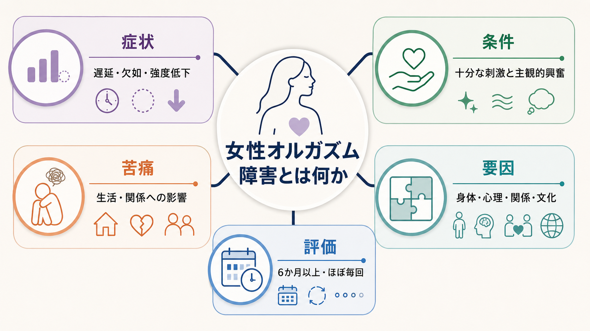
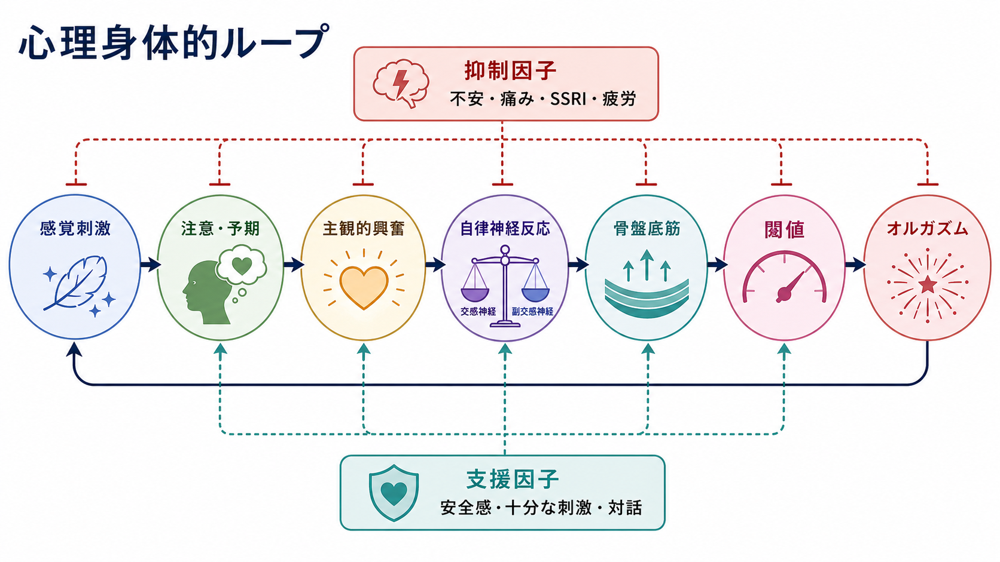
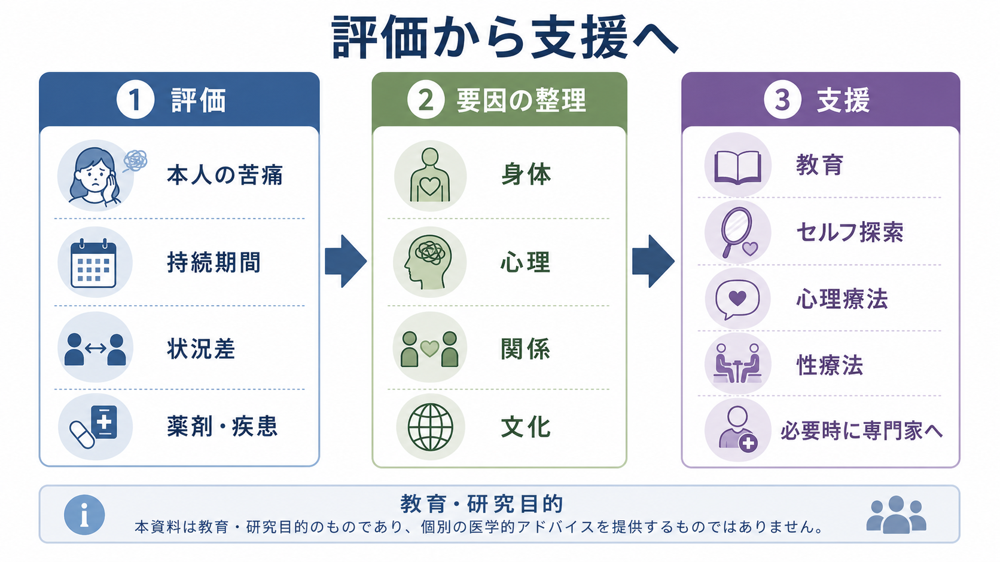

# 女性オルガズム障害とは何か

## 要点

- 女性オルガズム障害は、十分な主観的興奮があるにもかかわらず、オルガズムが著しく遅れる、まれである、起こらない、または強度が著しく低い状態が持続し、本人に苦痛や対人上の困難をもたらす場合に検討される診断概念である[1]。
- 「オルガズムに達しないこと」だけでは障害とは限らない。刺激の種類、状況、本人の満足、苦痛の有無を含めて評価する必要がある[1][2]。
- 要因は単一ではなく、薬剤、神経・内分泌・骨盤底、痛み、不安、注意の向け方、関係性、文化的メッセージが相互に作用する[2][3]。
- 支援では、教育、自己探索、コミュニケーション、性療法、心理療法、併存疾患や薬剤要因の確認を組み合わせる。個別の診断や治療変更は専門家との相談が前提である[1][7]。

## この記事で答える問い

1. 女性オルガズム障害は、単なる「性の好み」や「経験不足」とどう違うのか。
2. 身体要因と心理要因は、どのようにオルガズムの遅延・欠如・強度低下に関わるのか。
3. 研究・臨床では、どのような評価と支援が考えられているのか。

## まず結論

女性オルガズム障害は、オルガズムの有無だけで決まるラベルではない。重要なのは、本人にとって十分な刺激と主観的興奮がある状況でも、ほぼ毎回またはほとんど毎回、遅延・欠如・頻度低下・強度低下が続き、それが本人の苦痛や関係上の困難につながっているかである[1]。したがって、臨床的には「身体の反応が弱いから心理の問題」「不安があるから身体は関係ない」と切り分けるより、[[うつ病とは何か]]、[[不安症群とは何か]]、[[PTSDとは何か]]、薬剤、慢性疾患、痛み、関係性を含む心理身体的なループとして理解するほうが実用的である[2][3]。

## 背景

女性の性反応は、欲望、興奮、オルガズムが常に直線的に進むとは限らない。Basson らは、女性の性反応を、関係性、文脈、主観的興奮、身体感覚、満足が循環的に影響し合うモデルとして整理した[4]。この視点では、オルガズムは「正しい順番で必ず到達すべきゴール」ではなく、刺激、注意、安心感、身体状態、関係の文脈の中で生じたり生じなかったりする可変的な体験である。

この可変性は、診断を慎重にする理由でもある。たとえば、膣性交だけではオルガズムに達しにくくても、本人が満足しており苦痛がなければ、臨床的な障害とは限らない[2]。一方で、本人が強い苦痛を抱え、ほぼ毎回の性活動で遅延・欠如・強度低下が続くなら、医学的・心理学的評価の対象になりうる[1]。

## 基本概念

DSM-5-TR に基づく臨床的説明では、女性オルガズム障害は、正常な性的興奮相の後に、オルガズムが遅延する、まれである、欠如する、または強度が著しく低い状態として説明される[1]。症状はおおむね6か月以上持続し、本人の苦痛や対人上の問題を伴う必要がある[1]。

評価では、次の区別が重要になる。

| 観点 | 確認すること |
|---|---|
| 生涯性か獲得性か | 以前から一度も達しにくいのか、ある時期から変化したのか |
| 全般性か状況性か | どの刺激・相手・状況でも生じるのか、特定条件に限られるのか |
| 興奮との関係 | 主観的興奮そのものが低いのか、興奮はあるがオルガズムだけが困難なのか |
| 苦痛の有無 | 本人が苦痛や関係上の困難を感じているのか |
| 除外・併存要因 | 薬剤、疾患、痛み、[[身体症状症とは何か]]、[[薬剤性うつ症状とは何か]]、関係性ストレスなど |

FSFI などの質問紙は、欲求、興奮、潤滑、オルガズム、満足、痛みといった複数領域を整理する補助として使われるが、点数だけで診断が決まるわけではない[5]。本人の言葉で困りごとを聞き、文脈を丁寧に扱うことが中心である。

## 仕組み

オルガズムは、末梢の感覚入力、骨盤底筋や自律神経反応、中枢神経系の注意・報酬・情動処理、ホルモンや神経伝達物質が組み合わさった体験である[3]。身体側では、糖尿病や多発性硬化症などによる神経障害、外陰部皮膚疾患、骨盤底筋の過緊張、性交痛、閉経関連の泌尿生殖器症候群などが関わりうる[1][2]。薬剤では SSRI などの抗うつ薬がオルガズムの遅延や欠如に関係することがある[1][8]。

心理側では、不安、失敗予期、羞恥、過度な自己観察、過去の望まない性体験、パートナーへの不信、コミュニケーションの乏しさが、性的刺激への注意や身体感覚への没入を妨げることがある[2][4]。このとき、問題は「気の持ちよう」ではなく、注意、予期、情動、自律神経反応が相互に影響する心理身体的な調整問題として理解できる。

このループでは、十分な刺激があっても、「また達しないのでは」という予期や痛みへの警戒が強いと、注意が快感ではなく監視へ向かう。すると主観的興奮が弱まり、自律神経反応や骨盤底筋の協調も変化し、さらにオルガズムの閾値が高く感じられる。逆に、安全感、十分な非挿入刺激、本人の好みの探索、パートナーとの対話は、このループを緩める支援因子になりうる[1][7]。

## 図解

女性オルガズム障害を図解するときは、単一原因モデルではなく、次の3層で見ると整理しやすい。

1. 症状層: 遅延、欠如、頻度低下、強度低下。
2. 調整層: 感覚刺激、注意、主観的興奮、自律神経、骨盤底筋、オルガズム閾値。
3. 文脈層: 身体疾患、薬剤、痛み、心理状態、関係性、文化的意味づけ。

## 臨床・研究との接続

臨床評価では、本人が何を問題としているのか、いつから変化したのか、どの状況で起こるのか、どの刺激では起こらないのか、痛みや恐怖があるのか、薬剤や身体疾患が関与していないかを確認する[1][2]。特に SSRI 関連の性機能障害では、自己判断で中止せず、処方医と相談して薬剤変更、減量、併用療法などの可能性を検討する必要がある。女性の SSRI 関連性機能障害に対する bupropion 併用を検討したランダム化比較試験では、FSFI の複数領域に改善が報告されたが、適応や安全性は個別に判断されるべきである[8]。

心理療法・行動療法では、認知行動療法、マインドフルネス、性療法、感覚集中法、自己刺激を通じた身体感覚の探索などが検討されている[1][7]。2022年のレビューでは、女性性機能障害への行動療法のうち、認知行動療法とマインドフルネス系介入の経験的支持が比較的厚い一方、研究では複数の性機能障害がまとめて扱われることが多く、女性オルガズム障害だけへの効果推定には限界があると整理されている[7]。2017年のメタ分析でも、マインドフルネス系介入は性機能と主観的ウェルビーイングに改善を示す可能性があるが、出版バイアスや対照群の限界が指摘されている[6]。

## よくある誤解

**誤解1: オルガズムに達しなければ必ず病気である。**  
本人が満足しており苦痛がないなら、臨床的な障害とは限らない。診断では、苦痛、持続期間、状況、十分な刺激、他の要因を含めて判断する[1][2]。

**誤解2: 原因は心理か身体のどちらか一方である。**  
実際には、神経、薬剤、痛み、注意、不安、関係性、文化的期待が重なりやすい[2][3]。心理要因があることは「身体要因がない」という意味ではなく、身体要因があることも「心理的支援が不要」という意味ではない。

**誤解3: 膣性交で毎回オルガズムに達するのが標準である。**  
刺激の種類と必要な強度には大きな個人差がある。臨床的には、特定の性行為を標準化するより、本人の快・安全・同意・苦痛の有無を中心に評価する[2][4]。

**誤解4: 支援とは薬だけ、または会話だけである。**  
薬剤調整、身体疾患や痛みの治療、教育、自己探索、パートナーとの対話、心理療法、性療法は相補的である[1][7]。

## 関連ノート

- [[うつ病とは何か]]
- [[不安症群とは何か]]
- [[PTSDとは何か]]
- [[身体症状症とは何か]]
- [[薬剤性うつ症状とは何か]]
- [[性別違和とは何か]]

## MOC更新候補

- `content/00_MOC/` 配下の精神医学・性機能障害・臨床心理に関する MOC がある場合、本記事へのリンクを追加候補にする。
- 並列ジョブとの競合を避けるため、本作業では MOC 本体は更新しない。

## 理解チェック

1. 女性オルガズム障害の評価で「苦痛の有無」が重要なのはなぜか。
2. SSRI、痛み、不安、関係性は、どのように同じ心理身体的ループに入るか。
3. 「膣性交でのオルガズム」を標準にしすぎると、どのような臨床的誤解が生じるか。

## 未解決問題

- 女性オルガズム障害単独を対象にした大規模ランダム化比較試験は限られ、介入効果の一般化には慎重さが必要である[7]。
- 文化、性的マイノリティ、障害、加齢、慢性疾患の文脈を十分に反映した評価尺度と支援研究は、さらに蓄積が必要である。
- 生理指標、主観的快感、関係性の満足は必ずしも一致しないため、研究では何をアウトカムにするかが重要な課題である[4][5]。

## 参考文献

[1] Conn, A., Hodges, K. R., & Goje, O. (2023/2026). Female Orgasmic Disorder. *MSD Manual Professional Edition*. https://www.msdmanuals.com/professional/gynecology-and-obstetrics/female-sexual-function-and-dysfunction/female-orgasmic-disorder

[2] Conn, A., Hodges, K. R., & Goje, O. (2023/2026). Orgasmic Disorder in Women. *Merck Manual Consumer Version*. https://www.merckmanuals.com/home/women-s-health-issues/sexual-function-and-dysfunction-in-women/orgasmic-disorder-in-women

[3] Meston, C. M., & Frohlich, P. F. (2000). The Neurobiology of Sexual Function. *Archives of General Psychiatry, 57*(11), 1012-1030. https://doi.org/10.1001/archpsyc.57.11.1012

[4] Basson, R., Leiblum, S., Brotto, L., Derogatis, L., Fourcroy, J., Fugl-Meyer, K., Graziottin, A., Heiman, J. R., Laan, E., Meston, C., Schover, L., van Lankveld, J., & Weijmar Schultz, W. (2004). Revised definitions of women's sexual dysfunction. *The Journal of Sexual Medicine, 1*(1), 40-48. https://doi.org/10.1111/j.1743-6109.2004.10107.x

[5] Rosen, R. C. (2002). Assessment of female sexual dysfunction: review of validated methods. *Fertility and Sterility, 77*(Suppl 4), S89-S93. https://doi.org/10.1016/S0015-0282(02)02966-7

[6] Stephenson, K. R., & Kerth, J. (2017). Effects of Mindfulness-Based Therapies for Female Sexual Dysfunction: A Meta-Analytic Review. *The Journal of Sex Research, 54*(7), 832-849. https://doi.org/10.1080/00224499.2017.1331199

[7] Mestre-Bach, G., Blycker, G. R., & Potenza, M. N. (2022). Behavioral Therapies for Treating Female Sexual Dysfunctions: A State-of-the-Art Review. *Journal of Clinical Medicine, 11*(10), 2794. https://doi.org/10.3390/jcm11102794

[8] Safarinejad, M. R. (2011). Reversal of SSRI-induced female sexual dysfunction by adjunctive bupropion in menstruating women: a double-blind, placebo-controlled and randomized study. *Journal of Psychopharmacology, 25*(3), 370-378. https://doi.org/10.1177/0269881109351966
