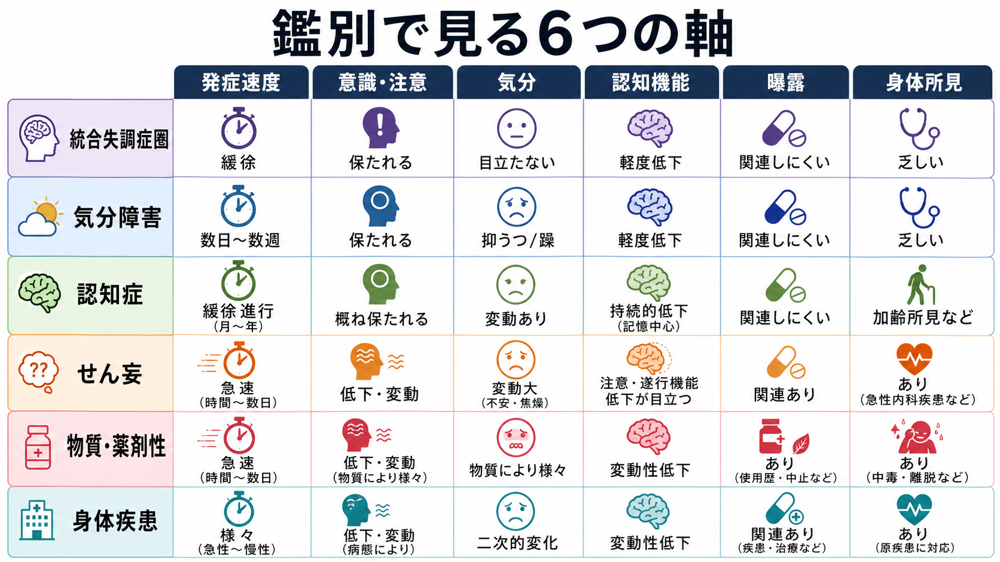
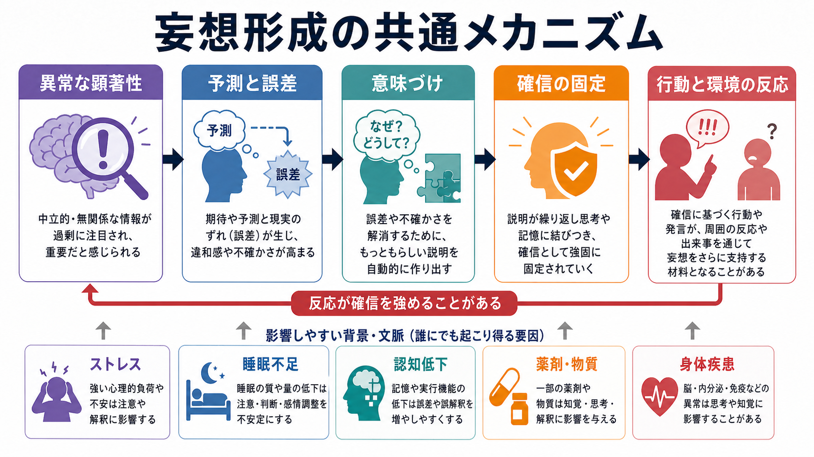

# 妄想を伴う疾患には何があるのか

## 要点

- 妄想は「統合失調症だけの症状」ではなく、[[統合失調症とは何か|統合失調症]]圏、[[妄想性障害とは何か|妄想性障害]]、[[統合失調感情障害とは何か|統合失調感情障害]]、[[双極性障害とは何か|双極性障害]]、[[精神病性うつ病とは何か|精神病性うつ病]]、[[認知症とは何か|認知症]]、[[せん妄と認知症はどう違うのか|せん妄]]、[[物質誘発性精神病とは何か|物質誘発性精神病]]、[[薬剤性精神病とは何か|薬剤性精神病]]、[[器質性精神病とは何か|器質性精神病]]でみられる。
- 鑑別では、妄想内容そのものよりも、発症速度、意識・注意、気分エピソード、認知機能、物質・薬剤曝露、身体所見を同時に見る。
- 急性発症、注意の変動、意識水準の変化、発熱・脱水・低酸素・薬剤変更がある場合は、精神疾患名を急いで固定せず、せん妄や身体疾患を優先して考える。
- 本記事は教育・研究目的の整理であり、個別診断や治療指示ではない。

## この記事で答える問い

1. 妄想を伴う代表的な疾患群には何があるのか。
2. 統合失調症圏、気分障害、認知症、せん妄、身体疾患、物質・薬剤性はどう見分けるのか。
3. 妄想形成には、診断をまたいでどのような共通メカニズムが関わるのか。

## まず結論

妄想をみたときの最初の分岐は、「精神病性障害かどうか」ではなく、「どの時間経過と文脈で生じているか」である。数時間から数日の急な変化で、注意が保てず、意識水準や睡眠覚醒リズムが揺れるなら、せん妄や身体疾患・薬剤性の可能性を強く考える[6]。数週間から数か月以上の持続的な妄想、幻覚、思考のまとまりにくさ、陰性症状、認知機能障害が前景に立つなら、統合失調症圏や関連する精神病性障害を考える[1][2]。

一方、妄想が躁状態やうつ状態と強く連動して出るなら、双極性障害や精神病性うつ病の枠組みで理解する必要がある[3][4]。高齢期に、記憶障害、見当識障害、実行機能低下、幻視、誤認、もの盗られ妄想が目立つなら、認知症に伴う精神病症状や[[BPSDとは何か|BPSD]]として整理する[5]。物質使用、離脱、処方薬変更、ステロイド、抗コリン薬、ドパミン作動薬などとの時間的関係が明確なら、物質・薬剤性を検討する[8]。

## 背景

妄想とは、通常、反証があっても修正されにくい強い確信として扱われる。内容は被害、関係、嫉妬、誇大、身体、罪業、貧困、虚無、もの盗られなど多様である。ただし、内容だけで診断は決まらない。たとえば「誰かに狙われている」という被害的な確信は、[[統合失調症の陽性症状とは何か|統合失調症の陽性症状]]にも、躁状態にも、うつ病の罪業妄想にも、認知症の誤認にも、薬剤性精神病にも現れうる。

したがって鑑別では、妄想の「テーマ」よりも、症状の束をみる。幻覚、解体した思考、陰性症状、気分高揚または抑うつ、注意障害、記憶障害、身体所見、薬剤・物質曝露、発症年齢、経過、生活機能の変化を並べて検討する。

## 基本概念

### 精神病性障害

統合失調症では、妄想、幻覚、思考障害などの精神病症状に加えて、陰性症状や認知機能障害が生活機能に影響することがある[1]。NICE は、成人の精神病・統合失調症ガイドラインの中で、統合失調症、統合失調感情障害、統合失調症様障害、妄想性障害などを精神病性障害の範囲として扱っている[2]。[[初回エピソード精神病とは何か|初回エピソード精神病]]では、最初から診断名を固定しすぎず、経過と除外診断を重ねる姿勢が重要になる。

### 気分障害

双極性障害では、躁状態またはうつ状態の中で幻覚や妄想を伴うことがある[3]。誇大妄想、宗教的使命感、特別な力があるという確信は躁状態と結びつきやすい。精神病性うつ病では、罪業、貧困、病気、虚無など、抑うつ気分と調和しやすい妄想が典型的に記述される[4]。この場合、妄想だけを切り出すより、睡眠、活動性、精神運動制止、自殺念慮、食欲、日内変動などを一緒に評価する。

### 認知症

認知症では、妄想、幻覚、誤認がBPSDの一部としてみられる。レビューでは、認知症における精神病症状の頻度は高く、アルツハイマー病では妄想や誤認、レビー小体型認知症では幻視を含む幻覚が目立ちやすいと整理されている[5]。[[レビー小体型認知症とは何か|レビー小体型認知症]]、[[アルツハイマー型認知症とは何か|アルツハイマー型認知症]]、[[血管性認知症とは何か|血管性認知症]]では、妄想の背景にある認知機能低下や知覚の変化をみる必要がある。

### せん妄・身体疾患

せん妄は、急性で変動性の注意・認知・意識水準の障害であり、幻覚、妄想、パラノイアを伴うことがある[6]。感染、脱水、低酸素、疼痛、手術、睡眠障害、薬剤変更などが背景になりうる。身体疾患による精神病性障害では、脳腫瘍、てんかん、脳血管障害、内分泌疾患、自己免疫疾患、代謝・栄養障害、神経変性疾患などが原因になりうる[7]。

### 物質・薬剤性

アルコール、アンフェタミン、カンナビス、コカイン、幻覚薬、PCP、鎮静薬などの intoxication や withdrawal、または処方薬の影響で、妄想や幻覚が生じることがある[8]。[[物質使用障害とは何か|物質使用障害]]が併存する場合、一次性精神病と物質誘発性精神病の境界は単純ではない。症状が物質使用・中止・増量とどう時間的に結びつくか、持続するか、せん妄を伴うかを確認する。

## 仕組み

妄想形成を一つの原因に還元することはできない。診断横断的には、少なくとも次の要素が重なりうる。

| 要素 | 妄想との関係 |
|---|---|
| 異常な顕著性 | 本来は中立的な出来事が、過剰に重要で意味深く感じられる |
| 予測と誤差 | 期待と現実のずれが強い違和感や不確かさとして体験される |
| 意味づけ | 不確かさを減らすため、もっともらしい説明が作られる |
| 確信の固定 | 反復、記憶、情動、周囲の反応によって信念が修正されにくくなる |
| 背景因子 | ストレス、睡眠不足、認知低下、薬剤・物質、身体疾患が影響しうる |

この枠組みは、統合失調症圏の妄想だけでなく、認知症の誤認、せん妄の被害的解釈、気分障害の気分一致妄想を考えるときにも役立つ。ただし、これは臨床診断を置き換えるモデルではなく、現象を整理するための補助線である。

## 図解

追加図解案: 「妄想を伴う疾患の見取り図」というタイトルで、中央に「妄想」、周囲に「精神病性障害」「気分障害」「認知症」「せん妄・身体疾患」「物質・薬剤性」を配置し、それぞれに「持続性」「気分との関係」「認知変動」「急性発症」「曝露・離脱」という短い鑑別手がかりを添える。

## 臨床・研究との接続

妄想を伴う疾患の整理は、研究では「精神病症状」という横断的次元と、診断分類との対応を考える課題につながる。臨床では、同じ妄想という現象でも、統合失調症圏、気分障害、認知症、せん妄、身体疾患、物質・薬剤性では評価の優先順位が異なる。

とくに実践上重要なのは、可逆的・緊急性の高い要因を見落とさないことである。急性発症、意識・注意の変動、発熱、脱水、低酸素、薬剤変更、物質使用、神経学的徴候がある場合、精神医学的ラベルだけで説明しない。反対に、持続的な精神病症状が生活機能を損なっている場合は、早期支援、心理社会的支援、家族支援、リスク評価、身体合併症評価を含む包括的な見立てが必要になる。

## よくある誤解

### 妄想があれば統合失調症である

誤りである。妄想は統合失調症に多いが、双極性障害、うつ病、認知症、せん妄、身体疾患、物質・薬剤性でもみられる[1][3][5][6][8]。

### 高齢者のもの盗られ妄想は性格の問題である

単純化しすぎである。記憶障害、見当識障害、視覚認知の変化、不安、環境変化、介護負担との相互作用として現れることがある。[[認知症と精神病症状はどう関係するのか|認知症と精神病症状]]の観点からみる必要がある。

### 急な妄想は精神科疾患としてだけ考えればよい

危険な単純化である。数時間から数日の変化、注意障害、意識変動、身体症状があれば、せん妄、薬剤、物質、感染、代謝異常、神経疾患を考える[6][7][8]。

## 関連ノート

- [[統合失調症とは何か]]
- [[統合失調症の陽性症状とは何か]]
- [[妄想性障害とは何か]]
- [[統合失調感情障害とは何か]]
- [[双極性障害とは何か]]
- [[精神病性うつ病とは何か]]
- [[認知症と精神病症状はどう関係するのか]]
- [[BPSDとは何か]]
- [[せん妄と認知症はどう違うのか]]
- [[物質誘発性精神病とは何か]]
- [[薬剤性精神病とは何か]]
- [[器質性精神病とは何か]]

## MOC更新候補

- `content/00_MOC/` 配下の精神医学、精神病性障害、認知症、鑑別診断に関するMOCへ追加候補。
- 並列生成ジョブとの競合を避けるため、本ジョブではMOC本体は更新しない。

## 理解チェック

1. 妄想をみたとき、内容だけでなく発症速度を見る理由は何か。
2. 気分障害に伴う妄想では、どのような情報を一緒に確認する必要があるか。
3. 認知症に伴う妄想と、せん妄に伴う妄想を分ける手がかりは何か。
4. 物質・薬剤性を疑うとき、どのような時間関係を確認するか。

## 参考文献

[1] National Institute of Mental Health. (2024). *Schizophrenia*. https://www.nimh.nih.gov/health/publications/schizophrenia

[2] National Institute for Health and Care Excellence. (2014). *Psychosis and schizophrenia in adults: prevention and management*. NCBI Bookshelf. https://www.ncbi.nlm.nih.gov/books/NBK555203/

[3] National Institute of Mental Health. (n.d.). *Bipolar Disorder*. https://www.nimh.nih.gov/health/topics/bipolar-disorder

[4] National Institute for Health and Care Excellence. (2022). *Psychotic depression*. NCBI Bookshelf. https://www.ncbi.nlm.nih.gov/books/NBK583078/

[5] Pessoa, R. M. P., et al. (2023). The frequency of psychotic symptoms in types of dementia: a systematic review. *Dementia & Neuropsychologia*. https://pmc.ncbi.nlm.nih.gov/articles/PMC10202325/

[6] Huang, J. (2025). Delirium. *MSD Manual Professional Edition*. https://www.msdmanuals.com/professional/neurologic-disorders/delirium-and-dementia/delirium

[7] Keshavan, M. S., & Zimmerman, M. (2025). Psychotic Disorder Due to Another Medical Condition. *Merck Manual Professional Edition*. https://www.merckmanuals.com/en-pr/professional/psychiatric-disorders/schizophrenia-and-related-disorders/psychotic-disorder-due-to-another-medical-condition

[8] Keshavan, M. S., & Zimmerman, M. (2025). Substance- or Medication-Induced Psychotic Disorder. *MSD Manual Professional Edition*. https://www.msdmanuals.com/professional/psychiatric-disorders/schizophrenia-and-related-disorders/substance-or-medication-induced-psychotic-disorder

## 未解決問題

- 妄想内容の違いが、どの程度まで疾患特異的な手がかりになるのか。
- 認知症、せん妄、一次性精神病、物質誘発性精神病が重なる場面で、どの評価手順がもっとも実用的か。
- 予測処理、顕著性、認知バイアス、社会的文脈を統合した妄想モデルを、臨床評価にどう落とし込むか。
