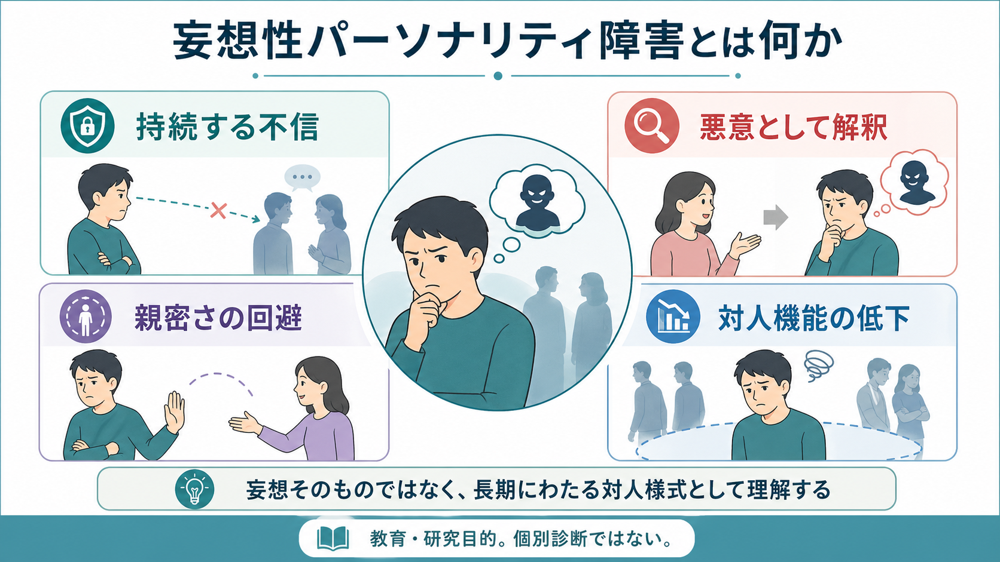
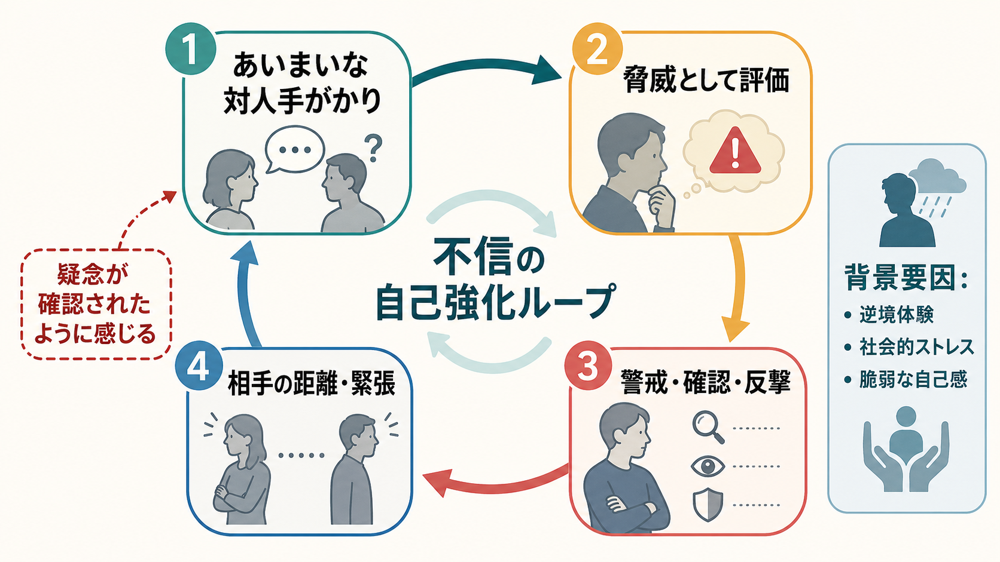
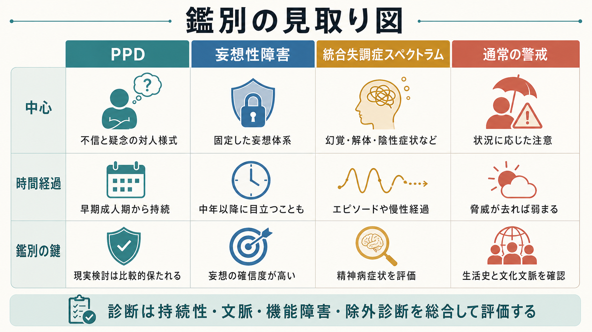

# 妄想性パーソナリティ障害とは何か

## 要点

- 妄想性パーソナリティ障害は、他者の意図を悪意・搾取・攻撃として読みやすい、不信と疑念の持続的な対人様式である[1][2]。
- 中核は「妄想そのもの」ではなく、早期成人期から多くの場面で続く、解釈・感情・行動・対人関係のパターンである[1][3]。
- [[妄想性障害とは何か]]や[[統合失調症とは何か]]では固定した妄想、幻覚、思考の解体などが前景化しやすいが、妄想性パーソナリティ障害では現実検討が比較的保たれる場合が多い[1][2]。
- 研究上は、統合失調症スペクトラムだけでなく、逆境体験、社会的ストレス、過覚醒、認知的硬さ、脆弱な自己感との関連から理解されることが多い[4][5]。
- 治療研究は少なく、信頼関係の形成、併存症の評価、リスク評価、生活機能への支援を慎重に組み合わせる必要がある[2][6]。

## この記事で答える問い

1. 妄想性パーソナリティ障害は、単なる「疑い深い性格」と何が違うのか。
2. [[妄想性障害とは何か]]、[[被害型妄想性障害とは何か]]、[[統合失調症とは何か]]とはどのように鑑別するのか。
3. 他者への不信や疑念は、どのような自己強化ループで続きやすいのか。
4. 臨床・研究では、診断名をどのように扱うと害を減らせるのか。

## まず結論

妄想性パーソナリティ障害は、「他者を信じられない人」という道徳的評価ではない。中心にあるのは、あいまいな言葉、視線、沈黙、遅い返信、軽い冗談などを、侮辱・裏切り・攻撃のサインとして読みやすい対人処理の傾向である[1][2]。その結果、本人は自分を守るために警戒し、確認し、距離を取り、時に反撃する。しかし周囲から見ると、それが攻撃的、冷淡、頑固、猜疑的に見え、関係の緊張が増す。緊張した反応は、本人にとっては「やはり相手は信用できない」という証拠のように感じられ、不信がさらに強まる。

この意味で、妄想性パーソナリティ障害は、単一の症状というよりも、解釈、感情、身体の警戒、行動、対人結果が結びついた長期的なパターンである。医療・心理支援では、診断名を貼ることよりも、本人の安全感、生活機能、併存する[[不安症群とは何か]]、抑うつ、物質使用、外傷体験、精神病症状の有無を丁寧に評価することが重要になる[2][4]。

## 背景

DSM-5-TR では、妄想性パーソナリティ障害はパーソナリティ障害のクラスターAに含まれ、他者の動機を悪意あるものとして解釈する、広範な不信と疑念のパターンとして記述される[1][2]。典型的には早期成人期までに始まり、友人、家族、職場、親密な関係など複数の文脈で認められる。

一方、ICD-11 では従来型の「妄想性人格障害」というカテゴリーを中心に置くよりも、パーソナリティ機能の障害の重症度と、否定的感情、離隔、非社会性、脱抑制、強迫性などの特性領域で記述する次元モデルが採用されている[7][8]。妄想性パーソナリティ障害に近い臨床像は、否定的感情のなかの不信、怒り、恨みやすさ、離隔のなかの親密さの回避、場合によっては非社会性の一部として捉えられる[8]。

この変化は重要である。なぜなら、現実の臨床では「妄想性パーソナリティ障害だけ」が純粋に存在するよりも、不安、抑うつ、外傷関連症状、他のパーソナリティ特性、[[物質誘発性精神病とは何か]]、身体疾患、文化的背景が重なって見えることが多いからである[2][4]。

## 基本概念

### 中核特徴

妄想性パーソナリティ障害の特徴は、次のように整理できる。

| 領域 | 典型的な現れ | 評価で注意する点 |
|---|---|---|
| 解釈 | 他者の発言や行動に隠れた侮辱・脅威を読む | 実際の被害、差別、いじめ、ハラスメントを過小評価しない |
| 感情 | 怒り、不安、恥、屈辱感が強まりやすい | 単なる怒りではなく、脅威への防衛として理解する |
| 行動 | 秘密主義、確認、反論、距離を取る、恨みを持ち続ける | 本人にとっては自己防衛であることが多い |
| 対人関係 | 親密さを求めつつ、裏切られる不安から関係を避ける | 孤立、職場不適応、家族関係の緊張を評価する |
| 鑑別 | 精神病症状、気分エピソード、物質・身体疾患を除外する | [[器質性精神病とは何か]]や[[薬剤性精神病とは何か]]も確認する |

DSM-5-TR 型の理解では、根拠が不十分でも搾取・危害・欺きがあると疑う、友人や同僚の忠誠を疑う、情報を悪用される恐れから打ち明けにくい、軽い発言に侮辱や脅威を読む、恨みを持ち続ける、人格や評判への攻撃を感じて反撃する、パートナーの不貞を疑う、といった特徴が重視される[1][2]。ただし、実際の診断はチェックリストの数だけで決めるものではなく、持続性、文脈、生活機能、文化的背景、除外診断を総合して行う。

### 「普通の警戒」との違い

疑うこと自体は病的ではない。危険な環境、差別、暴力、搾取、過去の裏切り、職場での不公正があるなら、警戒は適応的でありうる。問題になるのは、脅威が低い場面でも悪意の解釈が広がり、修正されにくく、関係や仕事や生活を持続的に損なう場合である[2][4]。

したがって、臨床評価では「疑いが正しいか間違っているか」を急いで裁くよりも、何が本人にとって脅威として体験され、どの程度の確信度があり、反証にどの程度開かれており、どの生活領域が損なわれているかを見る必要がある。

## 仕組み

妄想性パーソナリティ障害を理解するうえで有用なのは、不信の自己強化ループである。あいまいな対人手がかりが脅威として評価されると、身体は警戒し、心は相手の悪意を探す。本人は自分を守るために質問を重ねたり、距離を取ったり、先回りして反撃したりする。すると相手は緊張し、説明を控え、距離を取りやすくなる。この距離が、本人には「やはり隠している」「攻撃するつもりだ」という証拠に見えやすい。

このループは、本人の意志の弱さでは説明できない。レビュー研究では、PPD は統合失調症との連続性だけではなく、幼少期の逆境体験、ネグレクト、身体的・性的虐待、社会的ストレス、脅威への過敏さと関連づけて論じられている[4][5]。また、否定的感情、過覚醒、認知的硬さ、敵意、脆弱な自己感が重なると、社会的相互作用の中で「自分を守るための警戒」が過剰に作動しやすくなる[4]。

ただし、原因を一つに決めることはできない。遺伝的脆弱性、発達歴、家族関係、社会的排除、文化的文脈、身体疾患、睡眠、物質使用、現在のストレスが重なって現れる。支援では「本当は何が原因か」を単純化するより、現在のループのどこを弱められるかを考えるほうが実践的である。

## 図解

3枚の図は、それぞれ異なる読み方を想定している。1枚目は概念地図であり、妄想性パーソナリティ障害を「持続する不信」「悪意としての解釈」「親密さの回避」「対人機能の低下」の4つに分ける。2枚目はメカニズム図であり、疑念が対人反応を通じて確認されたように感じられる自己強化ループを示す。3枚目は鑑別の見取り図であり、PPD、妄想性障害、統合失調症スペクトラム、通常の警戒を混同しないための入口である。

図は診断基準そのものではない。実際の診断では、症状の持続期間、発症時期、現実検討、精神病症状の有無、気分エピソード、物質・薬剤・身体疾患、文化的文脈、生活機能、本人と周囲の安全を総合して評価する。

## 臨床・研究との接続

### 鑑別診断

[[妄想性障害とは何か]]では、比較的まとまった妄想体系が中心になり、本人の確信度が高く、反証が効きにくい。[[被害型妄想性障害とは何か]]では、追跡、監視、攻撃、陰謀などのテーマが固定しやすい。妄想性パーソナリティ障害では疑念は広範で持続的だが、必ずしも固定した妄想体系としてまとまるわけではない[1][2]。

[[統合失調症とは何か]]や[[統合失調症の陽性症状とは何か]]では、幻覚、妄想、思考や行動の解体、陰性症状、認知機能障害が評価対象になる。[[統合失調型パーソナリティ障害とは何か]]では、奇異な信念、魔術的思考、通常とは異なる知覚体験、奇異な話し方や行動がより目立つことがある。PPD では、疑念や警戒は強くても、これらの精神病症状が中核とは限らない[1][2]。

さらに、[[PTSDとは何か]]や[[複雑性PTSDとは何か]]では、トラウマ後の過覚醒、回避、侵入症状、自己組織化の困難が不信として現れることがある。差別、迫害、家庭内暴力、いじめ、移住後の社会的脅威など、現実に危険があった文脈を見落とすと、適応的な警戒を病理化してしまう。

### 支援の原則

PPD に特化した大規模な治療試験は限られており、薬物療法についても確立した標準治療があるとは言いにくい[2][6]。そのため、実践では次のような原則が重要になる。

- 治療者が急いで説得せず、予測可能で一貫した関わりを保つ。
- 診断名ではなく、困っている場面、睡眠、怒り、不安、孤立、仕事、家族関係などの具体的問題から入る。
- 被害の訴えを即座に否定せず、証拠、確信度、代替説明、安全性を分けて検討する。
- 併存する抑うつ、不安、物質使用、自傷他害リスク、短時間の精神病様体験を評価する[2]。
- 薬物は PPD そのものを「治す」ものとしてではなく、強い不安、抑うつ、不眠、攻撃性、精神病症状など個別の標的症状に応じて慎重に考える[2][6]。

本人が支援を疑うことは、支援への抵抗というよりも、症状そのものの一部であることが多い。したがって、関係形成の失敗を本人の問題だけに帰さず、治療構造、説明の仕方、境界設定、危機時対応を明確にすることが重要である。

### 研究上の位置づけ

PPD は頻度のわりに研究が少ない診断である[4][5]。レビューでは、PPD の信頼性・妥当性、独立したカテゴリーとしての扱い、統合失調症スペクトラムとの関係、トラウマ関連症状との関係が議論されてきた[4][5]。ICD-11 の次元モデルは、固定した診断カテゴリーだけでなく、不信、怒り、離隔、対人機能の障害といった構成要素を研究しやすくする枠組みとして有用である[7][8]。

## よくある誤解

### 誤解1: 妄想性パーソナリティ障害は「妄想性障害の軽い版」である

軽い版ではない。両者は重なって見えることがあるが、妄想性障害では固定した妄想が中心であり、PPD では不信と疑念の対人様式が中心である[1][2]。鑑別では、確信度、妄想体系のまとまり、幻覚や思考解体の有無、気分エピソード、物質・身体疾患を評価する。

### 誤解2: 疑い深い人は全員 PPD である

疑い深さだけでは診断できない。現実の危険、差別、文化的背景、職業上の守秘、過去の被害、現在のストレスに応じた警戒は病的とは限らない。診断には、持続的で広範なパターン、機能障害、本人または周囲の苦痛、除外診断が必要である[2]。

### 誤解3: 本人はただ攻撃的で協力しない

攻撃的に見える反応の背景には、脅威予測、屈辱感、裏切られる不安、自己防衛があることが多い[4]。もちろん暴力やハラスメントは正当化されないが、支援では安全確保と同時に、脅威評価の柔軟性を高める関わりが必要になる。

### 誤解4: 診断名がつけば治療方針は自動的に決まる

PPD に特化したエビデンスは限られるため、診断名だけでは治療方針は決まらない[6]。実際には、信頼関係、併存症、リスク、生活機能、家族・職場環境、本人の目標に基づいて支援を組み立てる。

## 関連ノート

- [[妄想性障害とは何か]]
- [[被害型妄想性障害とは何か]]
- [[統合失調症とは何か]]
- [[統合失調型パーソナリティ障害とは何か]]
- [[PTSDとは何か]]
- [[複雑性PTSDとは何か]]
- [[不安症群とは何か]]
- [[物質誘発性精神病とは何か]]
- [[器質性精神病とは何か]]

### 関連ノート候補

- パーソナリティ障害とは何か
- パーソナリティ機能とは何か
- 猜疑心と妄想はどう違うのか
- 治療関係における信頼形成とは何か

### MOC更新候補

- `content/00_MOC/` 配下の精神医学、精神病性障害、パーソナリティ障害、トラウマ関連の MOC に本記事 `[[妄想性パーソナリティ障害とは何か]]` を追加する候補。
- 並列生成ジョブとの衝突を避けるため、このジョブでは MOC ファイルを直接更新しない。

## 理解チェック

1. 妄想性パーソナリティ障害を「妄想そのもの」ではなく「対人様式」として捉える理由は何か。
2. 通常の警戒、妄想性障害、統合失調症スペクトラム、PPD を分けるとき、どの情報を確認する必要があるか。
3. 不信の自己強化ループでは、本人の防衛行動がどのように疑念を強める可能性があるか。
4. トラウマ、差別、現実の危険を見落として診断すると、どのような害が生じうるか。

## 参考文献

[1] American Psychiatric Association. (2022). *Diagnostic and Statistical Manual of Mental Disorders, Fifth Edition, Text Revision (DSM-5-TR).* American Psychiatric Association Publishing. https://www.psychiatry.org/psychiatrists/practice/dsm

[2] Jain, L., & Torrico, T. J. (2024). *Paranoid Personality Disorder*. StatPearls. National Center for Biotechnology Information. https://www.ncbi.nlm.nih.gov/books/NBK606107/

[3] Zimmerman, M. (2025). *Paranoid Personality Disorder (PPD).* Merck Manual Professional Edition. https://www.merckmanuals.com/professional/psychiatric-disorders/personality-disorders/paranoid-personality-disorder-ppd

[4] Lee, R. (2017). Mistrustful and misunderstood: A review of paranoid personality disorder. *Current Behavioral Neuroscience Reports, 4*(2), 151-165. https://doi.org/10.1007/s40473-017-0116-7

[5] Triebwasser, J., Chemerinski, E., Roussos, P., & Siever, L. J. (2013). Paranoid personality disorder. *Journal of Personality Disorders, 27*(6), 795-805. https://doi.org/10.1521/pedi_2012_26_055

[6] Völlm, B. A., Farooq, S., Jones, H., Ferriter, M., Gibbon, S., Stoffers, J., Duggan, C., Huband, N., & Lieb, K. (2011). Pharmacological interventions for paranoid personality disorder. *Cochrane Database of Systematic Reviews*, CD009100. https://doi.org/10.1002/14651858.CD009100

[7] Clark, L. A., Corona-Espinosa, A., Khoo, S., Kotelnikova, Y., Levin-Aspenson, H. F., Serapio-García, G., & Watson, D. (2021). Preliminary scales for ICD-11 personality disorder: Self and interpersonal dysfunction plus five personality disorder trait domains. *Frontiers in Psychology, 12*, 668724. https://doi.org/10.3389/fpsyg.2021.668724

[8] Bach, B., First, M. B., & Pincus, H. A. (2024). Practical implications of ICD-11 personality disorder classifications. *BMC Psychiatry, 24*, 380. https://doi.org/10.1186/s12888-024-05640-3

## 未解決問題

- PPD に特化した心理療法・薬物療法のランダム化比較試験は乏しく、どの支援がどのサブグループに有効かは十分に確立していない。
- トラウマ関連症状、社会的排除、文化的文脈、精神病性体験の連続性を、どのように過不足なく評価するかは今後の重要課題である。
- ICD-11 の次元モデルによって、従来の PPD カテゴリーよりも臨床的に有用な支援計画を立てられるかは、さらなる検証が必要である。
