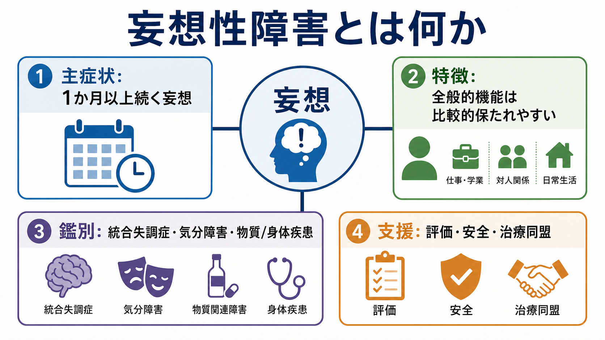
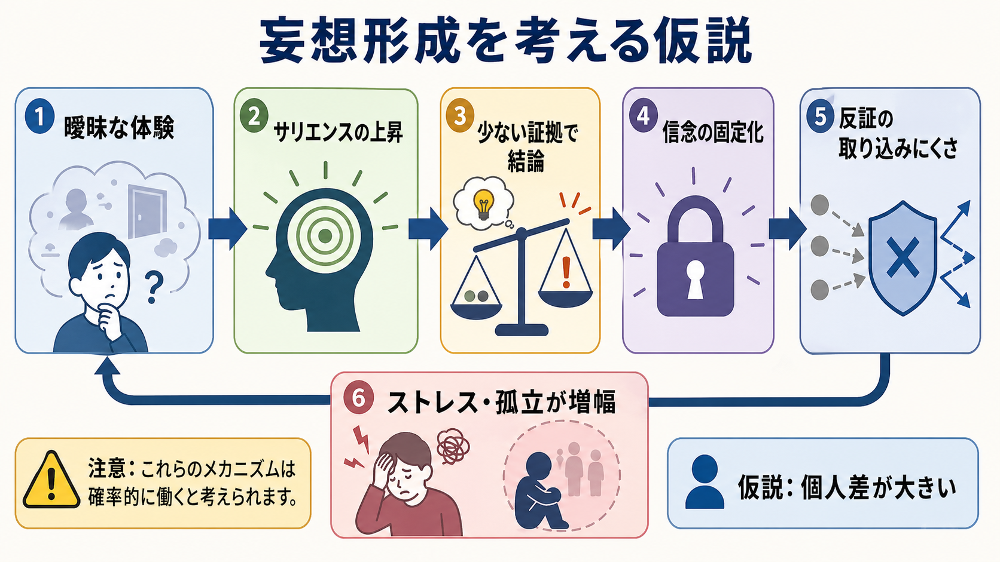

# 妄想性障害とは何か

## 要点

- 妄想性障害は、比較的体系化された妄想が主症状となる精神病性障害である。
- DSM-5-TR では「1か月以上」、ICD-11 では「典型的には3か月以上」と、持続期間の置き方に違いがある。[1][2]
- 統合失調症と比べると、幻覚、まとまりのない発話、陰性症状、著しい行動の解体は目立たず、妄想に直接関係しない生活機能は比較的保たれやすい。[1][3]
- 診断では、[[統合失調症とは何か]]、気分障害、[[物質誘発性精神病とは何か]]、[[器質性精神病とは何か]]、[[認知症と精神病症状はどう関係するのか]]などを丁寧に除外する。
- 妄想の形成と維持には、異常なサリエンス、少ない証拠で結論に飛ぶ傾向、信念の柔軟性低下、ストレスや孤立などが関与する可能性があるが、単一の機序で説明できる疾患ではない。[6][7][8]

## この記事で答える問い

このノートでは、[[妄想とは何か]]という症候レベルの理解から一歩進めて、「妄想性障害」という診断単位が何を指し、何とは区別されるのかを整理する。特に、全般的機能が保たれやすいという特徴を、病態が軽いという意味に短絡せず、診断境界・リスク評価・支援関係の観点から読むことを目標にする。

## まず結論

妄想性障害とは、妄想が生活世界の中心に強く入り込みながらも、統合失調症で典型的に問題になるような広範な思考解体、目立つ幻覚、陰性症状、行動の著しいまとまりのなさが前景化しにくい状態である。[1][3] そのため、診察室では一見すると落ち着いており、仕事・家事・会話・身だしなみが保たれていることもある。しかし、特定の主題に触れると、被害、嫉妬、被愛、身体、誇大などの信念体系が強い確信をもって語られ、対人関係、法的問題、安全、治療同盟に大きな影響を及ぼすことがある。

重要なのは、「妄想があるから妄想性障害」と即断しないことである。妄想は、[[統合失調症の陽性症状とは何か]]、[[双極性障害とは何か]]、[[大うつ病性障害とは何か]]、せん妄、認知症、薬物・身体疾患、文化的背景の違いなど多くの文脈で生じうる。妄想性障害は、症状内容だけでなく、経過、他の精神病症状の有無、気分エピソードとの時間関係、物質・身体疾患の影響、生活機能の広がりを見て判断する診断である。[1][2][4]

## 背景

妄想性障害は、精神病性障害群の中でも「妄想が比較的限局して前景に立つ」診断として位置づけられる。DSM-5-TR では、妄想性障害は統合失調スペクトラムおよび他の精神病性障害群に含まれ、少なくとも1か月以上の妄想、統合失調症基準を満たさないこと、妄想の影響以外では機能が著しく障害されないこと、気分エピソードがある場合も妄想期間に比べて短いこと、物質・身体疾患などで説明されないことが重視される。[1][3]

ICD-11 では、妄想または関連する妄想群が典型的には3か月以上持続し、気分エピソードがないこと、統合失調症の特徴的症状が存在しないこと、妄想に直接関係する態度や行動を除けば感情・発話・行動が通常は保たれることが説明されている。[2] ここでの違いは、DSM と ICD が完全に同じ診断アルゴリズムではないことを示す。実務では、[[DSMとICDは何が違うのか]]を踏まえ、研究、診療、保険・制度、国際比較の文脈に応じて分類体系の差を明示する必要がある。

疫学的にはまれな疾患とされ、統合失調症より頻度は低い。DSM-5 系の記述や総説では、生涯有病率はおおむね 0.02% 程度とされることがあるが、診断の難しさ、受診につながりにくさ、妄想主題による相談先の分散のため、推定には不確実性がある。[4][5]

## 基本概念

妄想性障害を理解するうえでの第一の軸は、「妄想の内容」よりも「妄想がどのように生活に組み込まれているか」である。妄想主題は、被害型、嫉妬型、被愛型、誇大型、身体型、混合型などに整理される。既存ノートでは [[被害型妄想性障害とは何か]]、[[嫉妬型妄想性障害とは何か]]、[[被愛型妄想性障害とは何か]]、[[身体型妄想性障害とは何か]] と接続できる。

第二の軸は、妄想の体系化である。妄想性障害では、断片的で急速に変化する混乱というより、本人なりの根拠、時系列、関係づけ、説明体系を伴うことが多い。周囲から見ると根拠が不十分でも、本人にとっては経験を説明する「筋の通った物語」として機能する。そのため、正面から否定されると、訂正されるよりも「理解されなかった」「相手も関係している」と受け取られ、治療関係が悪化することがある。[4]

第三の軸は、機能の保たれ方である。「全般的機能が比較的保たれる」とは、苦痛や支障がないという意味ではない。妄想主題に関係しない場面では会話、認知、身だしなみ、仕事、家事が保たれていても、妄想主題に関わる相手への確認行動、訴訟的行動、追跡、孤立、抑うつ、自傷他害リスクが問題になることがある。[4] したがって、[[精神科で生活機能をどう評価するか]]や[[他害リスク評価では何を見るべきか]]との接続が重要になる。

## 仕組み

妄想性障害の病態は、まだ単一の神経機序として確立していない。むしろ、精神病性体験の研究から示される複数のレベルを重ねて理解するのが現実的である。

1つ目は、サリエンスの変化である。通常なら流れていく曖昧な出来事が、異様に重要で、自己に関係し、意味をもつものとして感じられることがある。これは[[ドパミン仮説は統合失調症をどこまで説明できるのか]]や[[妄想は予測誤差処理の異常として説明できるのか]]と関係するが、妄想性障害に特異的な確定機序として扱うのではなく、精神病性体験を理解する一つの仮説として読むのがよい。[8]

2つ目は、推論様式である。妄想をもつ人の一部では、確率的推論課題において十分な情報を集める前に結論へ進みやすい「jumping to conclusions」が報告されている。[6][7] これは「考えが浅い」という人格評価ではなく、不確実な情報処理におけるデータ収集量、確信度、代替説明の検討、ワーキングメモリ負荷などが絡む認知過程である。

3つ目は、信念の固定化である。いったん妄想的説明が形成されると、反証可能な情報が入りにくくなり、反証そのものが妄想体系に取り込まれる場合がある。例えば、安心材料を提示しても「隠蔽されている証拠」と解釈されることがある。この段階では、内容の真偽だけを争うより、苦痛、睡眠、孤立、生活上の損失、安全、本人が困っている点に焦点を移すほうが臨床的には有用なことが多い。[4][7]

## 図解

上の2枚の図は、妄想性障害を二つの角度から整理している。1枚目は診断概念の地図であり、主症状、鑑別、比較的保たれる機能、臨床評価を一つの画面にまとめている。2枚目は、妄想形成を説明する仮説図であり、曖昧な体験、サリエンス、少ない証拠での結論、信念の固定化、ストレスや孤立の増幅を流れとして示している。

ただし、図は診断基準そのものではない。実際の診断では、[[精神状態診察MSEとは何か]]、[[MSEで思考内容をどう評価するか]]、[[MSEで知覚異常をどう聞くか]]、身体疾患・薬剤・物質使用の評価、家族や支援者からの経過情報を組み合わせる。

## 臨床・研究との接続

臨床では、最初に「妄想を訂正する」よりも、危険、苦痛、生活上の困りごと、睡眠、抑うつ、孤立、家族関係、法的・職業的問題を評価する。妄想内容が現実には正しくないと判断される場合でも、本人にとっては切迫した意味をもつため、面接者が安易に同意したり、逆に嘲笑・論破したりすることは避ける。[4] [[治療関係とは何か]]、[[ラポールはどのように形成されるのか]]、[[精神科面接で避けるべき対応は何か]]が実践上の基盤になる。

治療については、妄想性障害だけを対象にした大規模な臨床試験は限られる。NICE の成人精神病・統合失調症ガイドラインでは、妄想性障害を含む精神病性障害群を対象に、早期認識、身体健康、家族・介護者支援、心理社会的支援、薬物療法を含む包括的管理が扱われている。[5] 個別診療では、抗精神病薬、心理教育、認知行動療法的アプローチ、家族支援、リスク管理、地域支援を、本人の困りごとと安全性に沿って組み合わせる。

研究では、妄想性障害そのものの標本が少ないため、統合失調スペクトラムや精神病性障害全体の妄想研究から知見を借りることが多い。JTC、信念柔軟性、帰属バイアス、トラウマ、社会的孤立、都市性、移民経験、聴覚・身体感覚の異常体験などが議論されるが、これらは「妄想性障害の原因が一つに決まった」という意味ではない。[6][7][8]

## よくある誤解

### 妄想性障害は軽い精神病なのか

軽いとは限らない。生活の多くが保たれて見えても、特定の妄想主題が安全、対人関係、職業、法的問題に深く影響することがある。全般的機能が保たれやすいという特徴は、支障が限局しやすいという診断上の観察であって、苦痛やリスクが小さいという保証ではない。

### 妄想の内容が現実にありえそうなら妄想ではないのか

現実に起こりうる内容でも、根拠、確信の強さ、反証への反応、文化的背景、生活への影響を総合すると妄想と評価されることがある。[3][4] たとえば「配偶者の不貞」「近隣からの嫌がらせ」「身体に異常がある」という内容は現実にもありうるが、証拠との関係が著しく不均衡で、反証がほとんど効かず、生活を支配する場合には臨床的評価が必要になる。

### 幻覚が少しでもあれば妄想性障害ではないのか

必ずしもそうではない。DSM-5-TR では、幻覚がある場合でも目立たず、妄想主題に関連していれば妄想性障害と矛盾しないとされる。[1] ICD-11 でも、妄想主題に関連する知覚異常は診断と両立しうると説明される。[2] ただし、明瞭で持続的な幻覚、思考解体、陰性症状、作為体験や影響体験が前景に立つ場合は、統合失調症などの鑑別を優先する。

### 本人が落ち着いて話せるなら病気ではないのか

落ち着いた会話、整った身だしなみ、保たれた記憶や見当識は、妄想性障害でしばしば見られる。むしろ、妄想主題以外の面では機能が保たれるため、周囲が問題を見逃したり、逆に本人の訴えだけに巻き込まれたりしやすい。診断では、[[現病歴はどのように構造化するべきか]]、[[家族歴から何がわかるのか]]、[[生活歴はなぜ重要なのか]]を含め、時間軸で評価する。

## 関連ノート

- [[妄想とは何か]]
- [[妄想を伴う疾患には何があるのか]]
- [[妄想は予測誤差処理の異常として説明できるのか]]
- [[統合失調症とは何か]]
- [[統合失調症の陽性症状とは何か]]
- [[精神科診断における除外診断とは何か]]
- [[MSEで思考内容をどう評価するか]]
- [[精神状態診察MSEとは何か]]
- [[被害型妄想性障害とは何か]]
- [[嫉妬型妄想性障害とは何か]]
- [[被愛型妄想性障害とは何か]]
- [[身体型妄想性障害とは何か]]

## MOC更新候補

- `content/00_MOC/` 配下の精神医学、精神病性障害、症候学に関する MOC に、本記事 `[[妄想性障害とは何か]]` を追加する候補。
- 並列記事生成との衝突を避けるため、本ジョブでは MOC ファイルの直接更新は行わない。

## 理解チェック

1. 妄想性障害と統合失調症を分けるとき、妄想の内容だけでなく何を見る必要があるか。
2. 「全般的機能が保たれやすい」と「臨床的に軽い」はなぜ同じではないのか。
3. 妄想性障害の鑑別で、気分障害、物質・薬剤、身体疾患、認知症を確認する理由は何か。
4. JTC や信念柔軟性の研究は、妄想性障害の理解に何を与え、何をまだ説明しきれていないか。

## 未解決問題

- 妄想性障害に特化した大規模縦断研究・治療研究は、統合失調症研究に比べて少ない。
- DSM と ICD で持続期間や記述が異なるため、研究間比較では分類体系を明示する必要がある。
- 認知バイアス、サリエンス、社会的孤立、トラウマ、文化的文脈がどのように組み合わさるかは、個人差が大きい。
- 妄想内容に直接反論しすぎず、安全と生活機能を扱う面接技法の教育・評価は、今後も重要な実践課題である。

## 参考文献

[1] American Psychiatric Association. (2022). *Diagnostic and Statistical Manual of Mental Disorders, Fifth Edition, Text Revision (DSM-5-TR).* American Psychiatric Association Publishing. https://www.psychiatry.org/psychiatrists/practice/dsm

[2] World Health Organization. (2026). *ICD-11 for Mortality and Morbidity Statistics: 6A24 Delusional disorder.* https://icd.who.int/browse/2026-01/mms/en#1974996783

[3] Keshavan, M. S. (2025). Delusional Disorder. *Merck Manual Professional Edition.* https://www.merckmanuals.com/en-ca/professional/psychiatric-disorders/schizophrenia-and-related-disorders/delusional-disorder

[4] Joseph, S. M., & Siddiqui, W. (2023). Delusional Disorder. In *StatPearls.* StatPearls Publishing. https://www.ncbi.nlm.nih.gov/books/NBK539855/

[5] National Institute for Health and Care Excellence. (2014). *Psychosis and schizophrenia in adults: prevention and management* (NICE Clinical Guideline CG178). https://www.ncbi.nlm.nih.gov/books/NBK555203/

[6] So, S. H., Freeman, D., Dunn, G., Kapur, S., Kuipers, E., Bebbington, P., Fowler, D., & Garety, P. A. (2012). Jumping to conclusions, a lack of belief flexibility and delusional conviction in psychosis. *Journal of Abnormal Psychology, 121*(1), 129-139. https://doi.org/10.1037/a0025297

[7] Garety, P., Joyce, E., Jolley, S., Emsley, R., Waller, H., Kuipers, E., Bebbington, P., Fowler, D., Dunn, G., & Freeman, D. (2013). Neuropsychological functioning and jumping to conclusions in delusions. *Schizophrenia Research, 150*(2-3), 570-574. https://doi.org/10.1016/j.schres.2013.08.035

[8] Garety, P. A., & Freeman, D. (1999). Cognitive approaches to delusions: A critical review of theories and evidence. *British Journal of Clinical Psychology, 38*(2), 113-154. https://doi.org/10.1348/014466599162700
