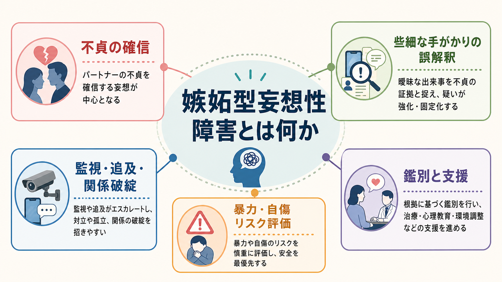
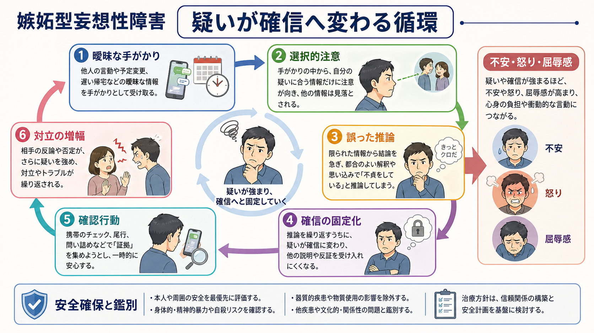
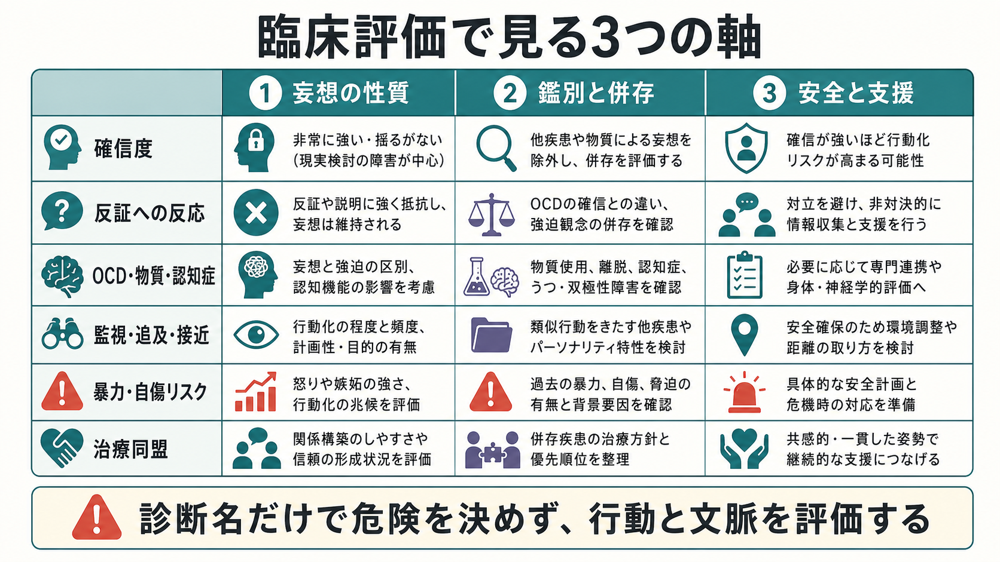

# 嫉妬型妄想性障害とは何か

## 要点

- 嫉妬型妄想性障害は、[[妄想性障害とは何か]]のうち、配偶者・恋人など親密なパートナーの不貞を主要テーマとする型である。
- 問題の中心は「嫉妬が強い」ことだけではなく、乏しい根拠から不貞を確信し、反証や説明を受けても信念が修正されにくい点にある。
- 監視、尾行、スマートフォン確認、執拗な追及、疑われた相手や第三者への接近が生じると、親密関係の破綻だけでなく、暴力・自傷・子どもへの影響を含む安全評価が必要になる。
- 鑑別では、[[強迫観念とは何か]]・[[強迫行為とは何か]]に近い強迫性嫉妬、[[統合失調症とは何か]]、気分障害、[[物質誘発性精神病とは何か]]、神経認知障害、文化的背景、実際の関係問題を分けて考える。
- 本稿は教育・研究目的の整理であり、個別の診断や治療指示ではない。現実の危険がある場合は、医療・福祉・司法・地域資源を含む安全確保が優先される。

## この記事で答える問い

1. 嫉妬型妄想性障害は、通常の嫉妬や関係不安と何が違うのか。
2. 不貞の疑いがどのように確信化し、関係内の行動を変えるのか。
3. なぜ暴力・自傷リスク評価が重要になるのか。
4. どのような疾患・状態と鑑別する必要があるのか。
5. 研究と臨床では、どの程度の確からしさで語れるのか。

## まず結論

嫉妬型妄想性障害は、パートナーの不貞を「可能性」ではなく「事実」として確信する[[妄想とは何か]]の一型である。DSM 系の診断分類では妄想性障害の jealous type として、中心テーマが配偶者または恋人の不貞であるものを指す[1]。ICD-11 の妄想性障害では、妄想または関連する妄想群が典型的に 3 か月以上持続し、統合失調症に特徴的な持続的幻覚、陰性症状、解体した思考などが前景に立たないこと、物質や身体疾患で説明されないことが重視される[2]。

したがって、臨床的に重要なのは「嫉妬心の有無」ではない。疑いの根拠の薄さ、確信度、反証への抵抗、行動化、苦痛、関係への影響、安全リスクをまとめて評価する必要がある。病的嫉妬のレビューでは、患者本人と周囲へのリスク、特にパートナー、疑われた第三者、子ども、自殺リスクの評価が中心課題として挙げられている[3]。

## 背景

嫉妬は、親密な関係で起こりうる一般的感情である。しかし病的嫉妬では、曖昧な出来事が不貞の証拠として扱われ、信念が修正されにくくなり、確認や追及が生活の中心になりやすい。古典的には「Othello 症候群」と呼ばれることもあるが、この語は単一疾患を意味するより、病的嫉妬という臨床現象を広く指すことが多い[3]。

病的嫉妬は、妄想性障害だけに限られない。統合失調症、アルコール関連精神病、神経認知障害、気分障害、パーソナリティ特性、強迫症状、実際の関係葛藤のなかでも生じうる。入院精神科患者を対象にした研究では、嫉妬妄想は全体としてまれだが、統合失調症圏や器質性・アルコール関連の精神病で比較的多くみられた[4][5]。

## 基本概念

### 妄想性障害のなかの嫉妬型

妄想性障害では、生活全体が広範に解体するというより、特定の妄想テーマを軸に考え方や行動が変化することが多い。嫉妬型では、そのテーマが「パートナーが不貞をしている」という確信になる。NCBI MedGen でも、嫉妬型妄想性障害は「配偶者または恋人が不貞であるという中心的妄想テーマ」をもつ subtype と定義されている[1]。

この点で、[[嫉妬妄想とは何か]]は症状名に近く、嫉妬型妄想性障害は診断分類上のまとまりに近い。実際には、嫉妬妄想があるから直ちに嫉妬型妄想性障害と決まるわけではなく、持続期間、他の精神病症状、気分エピソード、物質・身体疾患、機能障害、リスクを確認する。

### 通常の嫉妬・関係不安との違い

通常の嫉妬では、根拠の強さに応じて疑いが揺れ、相手の説明や新しい情報によって判断が修正される余地がある。嫉妬型の妄想では、些細な予定変更、服装、スマートフォン通知、表情、帰宅時刻などが「不貞の証拠」として過大に解釈される。反証は「隠している証拠」と再解釈され、確信がむしろ強まることがある。

強迫性嫉妬との違いも重要である。強迫性嫉妬では「不貞かもしれない」という侵入的な疑念が苦痛で、自分でも不合理だと感じることが多い。一方、妄想性嫉妬では「不貞である」という確信が中心で、洞察が乏しい。強迫性嫉妬と妄想性嫉妬はどちらも関係の苦痛や虐待・自殺・他害リスクを伴いうるが、治療方針は異なりうる[6]。

## 仕組み

嫉妬型妄想性障害の仕組みは、単一の脳部位や単一の性格特性だけでは説明しにくい。実際の臨床では、以下の循環として理解すると見通しがよい。

1. 曖昧な手がかりがある。
2. 疑いに合う情報だけに注意が向く。
3. 限られた情報から不貞を推論する。
4. 反証が取り込まれず、確信が固定化する。
5. 監視・確認・追及によって一時的に不安が下がる。
6. 相手の防衛・怒り・距離取りが「やはり怪しい」と解釈され、対立が増幅する。

この循環では、不安だけでなく、怒り、屈辱感、見捨てられ不安、支配欲、アルコール使用、睡眠不足、関係内の実際の不信が燃料になることがある。注意すべき点は、妄想がある人を一律に危険視することではない。リスクは診断名から自動的に決まるのではなく、過去の暴力、脅迫、武器へのアクセス、ストーキング、物質使用、切迫した別離、子どもの同居、希死念慮、疑われた第三者への接近など、具体的な行動と文脈から評価する。

## 図解

3 枚目は、臨床評価で見る軸を整理したものである。妄想の確信度だけでなく、鑑別、併存、安全、治療同盟を同時に見る。

## 臨床・研究との接続

### 評価で見ること

評価では、本人の語りだけでなく、可能で安全な範囲でパートナーや家族からの情報も重要になる。ただし、同席面接だけでは被害や脅迫が見えにくいことがあるため、必要に応じて別々に聴取する。病的嫉妬の臨床レビューでは、精神科既往、物質使用、関係の質、過去の家庭内暴力、脅迫や実際の暴力、第三者へのリスク、子どもへのリスク、自殺リスクを含む評価が推奨されている[3]。これは [[他害リスク評価では何を見るべきか]]、[[自殺リスク評価では何を聞くべきか]] と直接つながる。

また、身体疾患や薬剤・物質の影響も確認する。ICD-11 の妄想性障害では、脳腫瘍などの身体疾患や、中枢神経系に作用する物質・薬剤、離脱の影響で説明される場合は除外する方向で整理される[2]。高齢発症、認知機能低下、幻視、パーキンソニズム、意識変動がある場合は、[[レビー小体型認知症は神経回路にどのような影響を与えるのか]]など神経認知障害との関連も検討する。

### 暴力・自傷リスク

嫉妬妄想は、まれではあるが暴力リスクと関連する現象として繰り返し論じられてきた。Soyka と Schmidt の 2000-2008 年の入院患者 14,309 例の後方視的研究では、嫉妬妄想は 72 例、全体の 0.5%に同定され、そのうち入院時に攻撃的であった人は 20.8%で、全体標本の 6.2%より高かった[4]。別の 8,134 例の解析でも嫉妬妄想の有病率は 1.1%で、器質性精神病、妄想性障害、アルコール精神病、統合失調症で比較的高かった[5]。

これらは「嫉妬型妄想性障害の人は必ず暴力的」という意味ではない。むしろ、まれな現象であるからこそ、診断名で安心も断罪もせず、具体的な危険因子を丁寧に見る必要がある、という示唆である。

### 治療と支援

妄想性障害の治療研究は、統合失調症などに比べて質・量ともに限られている。Cochrane レビューでは、妄想性障害に対する治療のランダム化比較試験は非常に少なく、特定の治療を強く推奨するには証拠が不十分と結論づけられた[7]。一方、薬物療法レビューでは、抗精神病薬が一定の反応を示す可能性はあるが、研究の多くは観察研究や症例系列であり、確実な薬剤選択を導くには限界がある[8]。

したがって実践上は、妄想そのものへの治療、併存するうつ・不安・物質使用への対応、心理教育、家族・パートナーの安全、距離の取り方、法的・福祉的支援、治療同盟の構築を組み合わせて考える。本人の確信を正面から論破しようとすると関係が悪化しやすいため、「不貞の真偽を裁く」よりも、苦痛、睡眠、行動、対立、安全を共有できる目標として扱うことが多い。

## よくある誤解

### 「嫉妬深い性格」と同じである

違う。性格傾向としての嫉妬深さは連続的な特徴だが、嫉妬型妄想性障害では、不貞の確信が妄想水準になり、反証への抵抗、行動化、機能障害、安全リスクが問題になる。

### 実際に不貞があれば妄想ではない

単純ではない。実際の関係問題がある場合でも、本人が挙げる「証拠」が現実と対応せず、反応が過剰で、確信が訂正不能であれば、病的嫉妬や妄想性の評価が必要になることがある[3]。ただし、臨床家は相手の言い分だけで「妄想」と決めつけず、情報の偏りや安全を慎重に扱う。

### パートナーが説得すれば治る

多くの場合、説得だけでは十分ではない。反証が妄想体系に取り込まれると、説明や弁明がかえって疑いを強めることがある。支援では、本人の苦痛と安全を扱いながら、併存疾患、物質使用、睡眠、ストレス、関係内の境界設定を含めて介入する。

### 診断がつけば危険度も決まる

決まらない。危険度は、過去の暴力、脅迫、接近行動、別離のタイミング、武器、物質使用、希死念慮、第三者への怒り、子どもの安全、支援資源などから評価する。診断名は評価の入口であり、結論ではない。

## 関連ノート

- [[妄想性障害とは何か]]
- [[被害型妄想性障害とは何か]]
- [[嫉妬妄想とは何か]]
- [[妄想とは何か]]
- [[統合失調症とは何か]]
- [[物質誘発性精神病とは何か]]
- [[DSMとICDは何が違うのか]]
- [[他害リスク評価では何を見るべきか]]
- [[自殺リスク評価では何を聞くべきか]]

## MOC更新候補

- `content/00_MOC/MOC｜精神医学.md`
- `content/00_MOC/MOC｜症候学.md`
- `content/00_MOC/MOC｜総論・診断・面接.md`

並列生成ジョブとの衝突を避けるため、本記事作成時点では MOC 本体は更新していない。

## 理解チェック

1. 嫉妬型妄想性障害では、通常の嫉妬と比べて何が「妄想性」と判断されるのか。
2. 強迫性嫉妬と妄想性嫉妬では、洞察と治療方針にどのような違いがありうるか。
3. 暴力リスクを診断名だけで判断してはいけない理由は何か。
4. 高齢発症や物質使用がある場合、どのような鑑別を追加すべきか。

## 未解決問題

- 嫉妬型妄想性障害だけを対象にした大規模縦断研究やランダム化比較試験は少ない。
- 暴力・自傷リスクは重要だが、個人レベルでの予測精度には限界がある。
- 文化差、ジェンダー、親密関係の権力性、ストーキング法制、家庭内暴力支援との接続を、診断概念だけで扱い切ることは難しい。
- 妄想性嫉妬と強迫性嫉妬、過価値観念、パーソナリティ特性、実際の関係不信の境界は臨床的に連続的である。

## 参考文献

[1] National Center for Biotechnology Information. Jealous Type Delusional Disorder. *MedGen*. https://www.ncbi.nlm.nih.gov/medgen/452758

[2] World Health Organization. ICD-11 MMS: 6A24 Delusional disorder. https://icd.who.int/browse/latest-release/mms/en / mirror: https://www.findacode.com/icd-11/code-1974996783.html

[3] Kingham, M., & Gordon, H. (2004). Aspects of morbid jealousy. *Advances in Psychiatric Treatment*, 10(3), 207-215. https://doi.org/10.1192/apt.10.3.207

[4] Soyka, M., & Schmidt, P. (2011). Prevalence of delusional jealousy in psychiatric disorders. *Journal of Forensic Sciences*, 56(2), 450-452. https://doi.org/10.1111/j.1556-4029.2010.01664.x

[5] Soyka, M., Naber, G., & Völcker, A. (1991). Prevalence of delusional jealousy in different psychiatric disorders: An analysis of 93 cases. *The British Journal of Psychiatry*, 158, 549-553. https://doi.org/10.1192/bjp.158.4.549

[6] Marazziti, D., Consoli, G., Albanese, F., Laquidara, E., Baroni, S., & Dell'Osso, M. C. (2013). Obsessive versus delusional jealousy. *Psychopathology*, 46(4), 223-228. https://pubmed.ncbi.nlm.nih.gov/24048408/

[7] Skelton, M., Khokhar, W. A., & Thacker, S. P. (2015). Treatments for delusional disorder. *Cochrane Database of Systematic Reviews*, 2015(5), CD009785. https://doi.org/10.1002/14651858.CD009785.pub2

[8] Muñoz-Negro, J. E., Gómez-Sierra, F. J., Peralta, V., González-Rodríguez, A., & Cervilla, J. A. (2020). A systematic review of studies with clinician-rated scales on the pharmacological treatment of delusional disorder. *International Clinical Psychopharmacology*, 35(3), 129-136. https://doi.org/10.1097/YIC.0000000000000306
