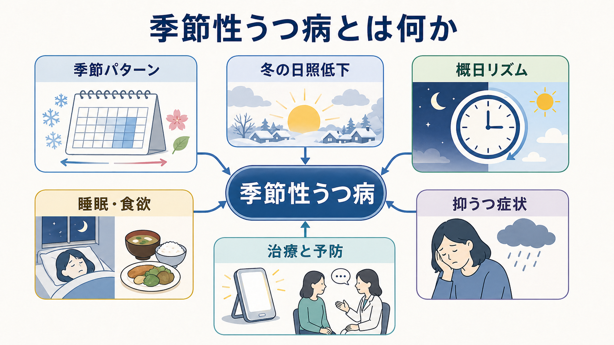
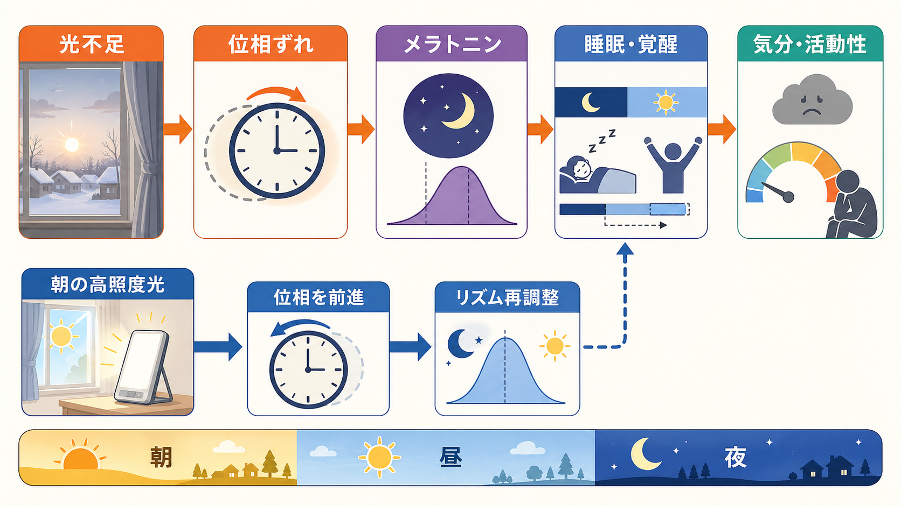

# 季節性うつ病とは何か

## 要点

- 季節性うつ病は、独立した病名というより、[[うつ病とは何か|うつ病]]や双極性障害の気分エピソードが特定の季節に反復して出現・寛解する「季節型」のパターンとして理解される[1]。
- 典型例は秋から冬に抑うつが強まり、春から夏に改善する冬季型である。ただし、夏季型や、地域・生活リズム・職業上の光曝露によって異なる表れ方もありうる[2][4]。
- 重要な手がかりは「冬だから少し気分が落ちる」ではなく、[[抑うつ気分とは何か|抑うつ気分]]、[[快感消失とは何か|快感消失]]、睡眠・食欲・活動性の変化が、生活機能の低下を伴って季節的に反復することである[1][2]。
- 仕組みとしては、光環境の変化、概日リズムの位相ずれ、メラトニン分泌のタイミング、睡眠・覚醒リズム、認知・行動の縮小が重なって説明される[5]。
- 治療・支援には、朝の高照度光療法、季節性うつ病に合わせた認知行動療法、抗うつ薬による予防、睡眠・活動・安全性評価が含まれる。ただし個別の治療選択は診断、双極性の有無、併存症、副作用リスクを踏まえて医療者と検討する[2][7][8]。

## この記事で答える問い

1. 季節性うつ病は、通常のうつ病や「冬の気分の落ち込み」と何が違うのか。
2. なぜ光環境や概日リズムが抑うつエピソードに関係するのか。
3. 臨床では、何を評価し、何と鑑別し、どのような支援につなげるのか。
4. 研究上は、季節性うつ病から睡眠・リズム・気分調節について何が学べるのか。

## まず結論

季節性うつ病とは、気分エピソードが季節と同期して反復する状態である。冬季型では、日照時間の短縮や朝の光曝露の不足が、体内時計の位相、メラトニン分泌、睡眠・覚醒、食欲、活動性に影響し、それが抑うつ症状と結びつくと考えられている[2][5]。

ただし、季節性うつ病は「日光不足だけで決まる病気」ではない。遺伝的素因、過去の気分エピソード、緯度、屋内生活、勤務時間、睡眠習慣、ストレス、認知的評価、社会的孤立が重なって、ある人では冬に症状が再燃しやすくなる[4][5]。そのため、理解の中心は「季節」ではなく、「季節変化に対して脳・身体・生活リズムがどう調整に失敗するか」に置くと見通しがよい。

## 背景

季節性の気分変動は古くから知られていたが、1980年代に Rosenthal らが、冬に反復する抑うつ症候群と光療法への反応を系統的に記述したことで、季節性感情障害として研究が進んだ[3]。現在の診断分類では、季節性うつ病は「季節型を伴う」気分エピソードとして扱われ、特定の季節に発症し、別の季節に寛解する関係が複数年にわたって確認されることが重視される[1]。

典型的な冬季型では、気分の落ち込みだけでなく、過眠、朝起きにくい、炭水化物を欲する、体重増加、疲労感、活動量低下、対人接触の減少が目立つことがある[2][4]。一方で、すべての人が同じ症状を示すわけではなく、[[不眠とは何か|不眠]]、焦燥、食欲低下、不安が前景に出る例もある。症状の見え方だけでなく、季節的反復、生活機能、既往歴、自殺リスクを合わせて評価する必要がある。

## 基本概念

### 「季節型」は診断名ではなくパターンである

DSM-5-TR では、季節型は大うつ病性障害や双極性障害に付ける特定用語として位置づけられる。季節と気分エピソードの開始・寛解に規則的な関係があり、非季節性エピソードより季節性エピソードが優勢であることが要点である[1]。

この点は臨床的に重要である。冬に抑うつが出る場合でも、双極性障害のうつ病相、甲状腺疾患、睡眠相後退、交代勤務、物質・薬剤、慢性疾患、喪失体験、社会的孤立などが関与していることがある。特に双極性障害では、抗うつ薬や光療法が気分高揚・躁転リスクと関係しうるため、過去の軽躁・躁状態の評価が欠かせない[1][2]。

### 「冬の憂うつ」との違い

冬に活動量が落ちたり、寒さで外出が減ったりすること自体はよくある。しかし季節性うつ病では、[[気分とは何か|気分]]、興味、睡眠、食欲、集中、罪責感、疲労、希死念慮などがまとまって変化し、仕事・学業・家庭・対人関係に支障が出る[1][2]。[[希死念慮とは何か|希死念慮]]がある場合は、季節性かどうかにかかわらず安全性評価を優先する。

## 仕組み

### 光は「明るさ」ではなく時刻情報でもある

光は網膜を通じて視交叉上核に届き、概日リズムを外界の昼夜周期に同期させる。冬に朝の光が弱く、屋内生活が長く、起床時刻が遅れると、体内時計が社会的な睡眠・覚醒スケジュールからずれやすくなる[5]。

Lewy らの位相シフト仮説では、冬季うつ病の一部は、メラトニン分泌開始時刻と睡眠中央時刻の関係が最適範囲からずれることで説明される。多くの冬季型では位相遅延が想定され、朝の高照度光によって位相を前進させることが治療効果と結びつくと考えられる[5]。

### 睡眠・食欲・活動性が症状を増幅する

概日リズムのずれは、眠気、朝の起きにくさ、日中活動量の低下、食事時刻の乱れを介して抑うつを悪化させうる。過眠や炭水化物欲求は冬季型でしばしば語られるが、それらは単なる随伴症状ではなく、活動機会を減らし、自己評価を下げ、さらに気分を悪化させる循環を作りうる[2][4]。

この循環は認知行動療法の標的にもなる。冬に「どうせまた悪くなる」「外に出ても意味がない」と予測し、活動を先送りし、社会的接触を減らすほど、光曝露も報酬経験も減っていく。季節性うつ病向けの CBT-SAD は、この季節特有の思考と行動パターンを扱う点に特徴がある[8]。

### 単一原因モデルでは足りない

季節性うつ病は、光だけ、メラトニンだけ、セロトニンだけで説明できるものではない。レビューでは、光曝露、概日リズム、神経伝達、遺伝、気質、認知、行動、社会環境が重なる多因子モデルとして理解する必要が示されている[4][5]。したがって、研究知見を臨床に使うときは、「朝の光を増やせば全員に十分」という単純化を避ける。

## 図解

上の 2 枚の図は、季節性うつ病を二つのレベルで整理している。

- 1枚目は、季節型エピソードを「冬の日照低下」「概日リズム」「睡眠・食欲」「抑うつ症状」「治療と予防」の関係として見る概念地図である。
- 2枚目は、冬の朝の光不足が体内時計の位相ずれ、メラトニン分泌タイミング、睡眠・覚醒リズム、気分・活動性に結びつく経路を示す。朝の高照度光は、この経路に介入する代表的な方法である[2][5]。

## 臨床・研究との接続

### 評価で見るポイント

臨床評価では、気分エピソードの有無だけでなく、発症月、寛解月、過去数年の反復、非季節性エピソード、双極性症状、睡眠相、勤務形態、日中の屋外光曝露、併存症、薬剤、物質使用、身体疾患を確認する[1][2]。また、症状が冬に強いとしても、重症度、精神病症状、希死念慮、セルフケア低下がある場合は、季節性という説明に留めず安全性と治療導入を優先する。

### 治療・支援

NIMH は、季節性うつ病の治療選択肢として、光療法、心理療法、抗うつ薬、ビタミンDへの配慮を挙げている。冬季型の光療法では、10,000ルクス程度のライトボックスを朝に 30-45 分用いる説明が一般的である[2]。ただし、眼疾患、光感受性を高める薬剤、双極性障害、頭痛や不眠の副作用がある場合は、医療者の判断が重要になる。

予防については、光療法の予防効果に関する Cochrane レビューでは、利用可能な研究が少なく、確実な結論には制限があるとされる[6]。一方、成人の季節性うつ病再発予防に対する第二世代抗うつ薬のレビューでは、ブプロピオン徐放製剤に中等度の質のエビデンスがあるが、利益を得ない人や有害事象リスクもあるため、予防的投与は個別判断になる[7]。

CBT-SAD と光療法を比較したランダム化試験では、急性期には両者とも抑うつ症状を改善し、寛解率に大きな差はみられなかった[8]。これは、季節性うつ病を「光の問題」とだけ捉えず、冬に縮小する行動、季節に関する予測、回避、睡眠・活動リズムを含めて支援する意義を示している。

### 研究上の意義

季節性うつ病は、自然環境の周期変化が気分、睡眠、食欲、活動、認知にどう影響するかを調べるモデルでもある。特に、光曝露の時刻、メラトニン、睡眠中央時刻、活動量、症状評価を組み合わせることで、気分障害を時間生物学の観点から理解する手がかりになる[5]。今後は、ウェアラブル、光曝露センサー、スマートフォンによる活動・睡眠測定を使い、個人ごとのリズム脆弱性を推定する研究が発展しうる。

## よくある誤解

### 「冬に落ち込む人はみんな季節性うつ病である」

冬の気分低下は広くみられるが、季節性うつ病では、臨床的に意味のある抑うつエピソードが季節的に反復し、生活機能への影響を伴う[1][2]。季節だけで判断せず、症状のまとまり、持続、重症度、反復性を見る。

### 「日光を浴びれば必ず治る」

光曝露は重要だが、すべての人に十分な治療ではない。双極性、睡眠相、薬剤、生活環境、認知行動パターン、身体疾患、安全性を合わせて評価する必要がある[2][5]。

### 「ビタミンD不足と同じである」

冬の日照低下はビタミンDと関係しうるが、季節性うつ病の中核をビタミンDだけで説明することはできない。NIMH もビタミンDを選択肢の一つとして挙げるが、光療法、心理療法、抗うつ薬と同列に、状況に応じて検討されるものとして説明している[2]。

### 「春になれば自然に治るから放置してよい」

春に軽快しやすい人でも、冬の数か月に学業・仕事・家庭生活が大きく損なわれたり、希死念慮が出たりすることがある。反復性がある場合は、次の季節に備えた予防計画を立てる価値がある[6][7]。

## 関連ノート

- [[うつ病とは何か]]
- [[抑うつ気分とは何か]]
- [[快感消失とは何か]]
- [[不眠とは何か]]
- [[気分とは何か]]
- [[希死念慮とは何か]]

## 理解チェック

1. 季節性うつ病が「独立した病名」ではなく「季節型のパターン」と説明される理由は何か。
2. 冬の朝の光不足は、概日リズムとメラトニン分泌タイミングにどのような影響を与えうるか。
3. 光療法を考えるとき、双極性障害や睡眠相を確認する必要があるのはなぜか。
4. CBT-SAD が、光曝露だけではなく認知・行動パターンを扱う理由は何か。

## 参考文献

[1] American Psychiatric Association. (2022). *Diagnostic and Statistical Manual of Mental Disorders, Fifth Edition, Text Revision (DSM-5-TR)*. https://doi.org/10.1176/appi.books.9780890425787

[2] National Institute of Mental Health. *Seasonal Affective Disorder*. https://www.nimh.nih.gov/health/publications/seasonal-affective-disorder

[3] Rosenthal, N. E., Sack, D. A., Gillin, J. C., Lewy, A. J., Goodwin, F. K., Davenport, Y., Mueller, P. S., Newsome, D. A., & Wehr, T. A. (1984). Seasonal affective disorder: A description of the syndrome and preliminary findings with light therapy. *Archives of General Psychiatry, 41*(1), 72-80. https://doi.org/10.1001/archpsyc.1984.01790120076010

[4] Partonen, T., & Lönnqvist, J. (1998). Seasonal affective disorder. *The Lancet, 352*(9137), 1369-1374. https://doi.org/10.1016/S0140-6736(98)01015-0

[5] Lewy, A. J., Rough, J. N., Songer, J. B., Mishra, N., Yuhas, K., & Emens, J. S. (2007). The phase shift hypothesis for the circadian component of winter depression. *Dialogues in Clinical Neuroscience, 9*(3), 291-300. https://doi.org/10.31887/DCNS.2007.9.3/alewy

[6] Nussbaumer-Streit, B., Forneris, C. A., Morgan, L. C., Van Noord, M. G., Gaynes, B. N., Greenblatt, A., Wipplinger, J., Lux, L. J., Winkler, D., & Gartlehner, G. (2019). Light therapy for preventing seasonal affective disorder. *Cochrane Database of Systematic Reviews, 2019*(3), CD011269. https://doi.org/10.1002/14651858.CD011269.pub3

[7] Gartlehner, G., Nussbaumer-Streit, B., Gaynes, B. N., Forneris, C. A., Morgan, L. C., Greenblatt, A., Wipplinger, J., Lux, L. J., Van Noord, M. G., & Winkler, D. (2019). Second-generation antidepressants for preventing seasonal affective disorder in adults. *Cochrane Database of Systematic Reviews, 2019*(3), CD011268. https://doi.org/10.1002/14651858.CD011268.pub3

[8] Rohan, K. J., Mahon, J. N., Evans, M., Ho, S.-Y., Meyerhoff, J., Postolache, T. T., & Vacek, P. M. (2015). Randomized trial of cognitive-behavioral therapy versus light therapy for seasonal affective disorder: Acute outcomes. *American Journal of Psychiatry, 172*(9), 862-869. https://doi.org/10.1176/appi.ajp.2015.14101293

## 未解決問題

- どの患者が光療法、CBT-SAD、薬物予防、生活リズム介入のどれに最も反応しやすいかを、事前に予測する指標はまだ十分ではない。
- 光曝露量、睡眠相、メラトニン、活動量を日常環境で測定し、個別化された介入時刻を決める方法は発展途上である。
- 夏季型の季節性うつ病は冬季型より研究が少なく、病態と支援方法の整理が今後の課題である。

## MOC更新候補

- `content/00_MOC/MOC｜精神医学.md` に `[[季節性うつ病とは何か]]` を追加する候補。
- 並列ジョブとの競合を避けるため、このタスクでは MOC ファイル自体は更新しない。
