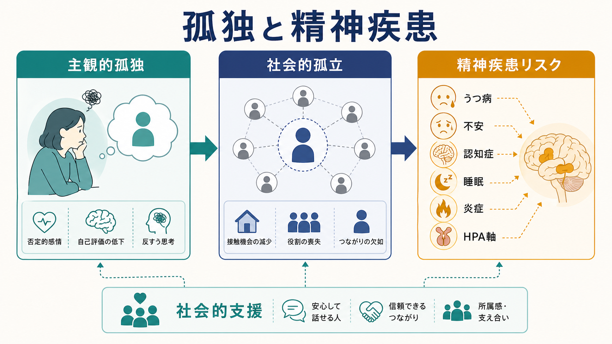
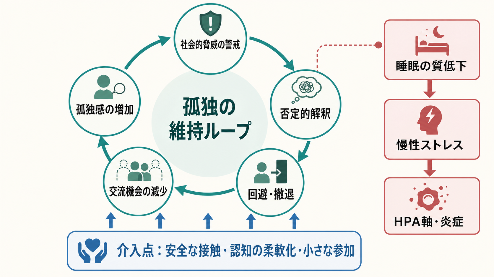
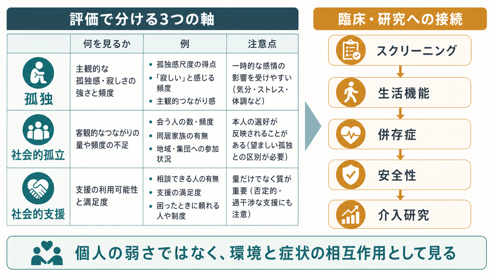

# 孤独と精神疾患はどう関係するのか

## 要点

- 孤独は「一人でいること」そのものではなく、望む社会的つながりと実際のつながりのずれとして経験される主観的な苦痛である。一方、社会的孤立は交流頻度、同居、役割、参加などで測られる客観的状態であり、両者は重なるが同じではない[1][2]。
- 縦断研究の系統的レビューでは、孤独は後のうつ病発症と関連し、不安や自傷関連アウトカムにも関連する可能性が示されている。ただし、因果方向、測定法、年齢層、身体疾患、既存症状の影響を慎重に分ける必要がある[3]。
- すでに精神疾患がある人では、孤独や乏しい主観的支援が、うつ症状、回復、社会機能の不良な経過と関連する。したがって孤独は「背景事情」ではなく、評価と支援計画に入れるべき維持因子である[4]。
- 認知症についても、2024年の大規模メタ分析で孤独は全認知症、アルツハイマー病、血管性認知症、認知障害リスク上昇と関連した。ただし、孤独が原因なのか、早期認知変化が孤独を増やすのか、双方向性を考える必要がある[5]。
- この記事は教育・研究目的の整理であり、個別の診断や治療指示ではない。自殺念慮、急激な悪化、虐待、生活上の危機がある場合は、地域の救急・医療機関・信頼できる支援者につながることが優先される。

## この記事で答える問い

1. 孤独と社会的孤立は、精神疾患リスクの文脈でどう違うのか。
2. 孤独は、[[うつ病とは何か|うつ病]]、[[不安症群とは何か|不安症]]、[[認知症とは何か|認知症]]とどのように関連するのか。
3. その関連は、どのような心理・行動・生理メカニズムで説明できるのか。
4. 臨床・研究では、孤独をどのように評価し、どこまで介入対象として扱うべきか。

## まず結論

孤独は、精神疾患の単独原因ではない。しかし、社会的脅威への警戒、否定的解釈、回避、活動低下、睡眠の質低下、慢性ストレス反応を通じて、うつ病や不安を悪化させる「維持ループ」になりうる[2][3]。孤独が強い人は、人と会いたい気持ちを持ちながらも、拒絶される予測や恥の感覚によって接触を避けやすい。接触が減ると、支援、報酬経験、現実検証の機会も減り、孤独感がさらに強まる。

この循環は、[[不安とは何か|不安]]、抑うつ、睡眠、身体疾患、貧困、差別、介護、移住、死別、[[スティグマとは何か|スティグマ]]と絡む。したがって、臨床では孤独を「本人の性格」や「単なる寂しさ」として片づけず、症状、生活機能、社会環境、[[社会的支援は健康にどう影響するのか|社会的支援]]の質を同時に見る必要がある。

## 背景

WHO は、孤独と社会的孤立を世界的な公衆衛生課題として位置づけ、2025年の Commission on Social Connection 報告書で、精神的健康、身体的健康、教育、雇用、地域社会への影響を整理している[1]。90件のコホート研究を統合したメタ分析でも、孤独と社会的孤立はいずれも全死亡リスク上昇と関連しており、精神疾患だけに閉じない健康リスクとして扱われる[6]。この流れは、孤独を個人の気分だけでなく、社会的決定要因と健康リスクの交点として扱う見方を強めている。

精神医学で重要なのは、孤独が診断名ではなく、複数の診断を横断するリスク・維持因子だという点である。[[精神疾患とは何か]]で扱うように、精神疾患は症状、機能障害、苦痛、環境との相互作用から評価される。孤独はその中で、発症前の脆弱性、発症後の回復阻害、再発リスク、治療アクセスの低下に関わりうる。

## 基本概念

### 孤独

孤独は、関係の「量」だけで決まらない。周囲に人がいても、自分が理解されない、頼れない、必要とされないと感じれば孤独は生じる。逆に一人の時間が多くても、本人が選び取り、十分なつながりを感じていれば病的な孤独とは限らない。詳しい一般的影響は [[孤独は心身にどのような影響を与えるのか]] で扱う。

### 社会的孤立

社会的孤立は、独居、交流頻度の少なさ、地域参加の少なさ、役割の喪失、支援者の少なさなどで測られる。孤独が「つながりの主観的質」に近いのに対し、社会的孤立は「つながりの客観的構造」に近い。研究では両者を分けて測らないと、誰にどの支援が必要かが見えにくくなる。

### 精神疾患との関係

孤独は、うつ病や不安症の症状そのものと重なりやすい。抑うつでは興味や喜びの低下、疲労、自己評価低下によって人と会う力が下がる。不安では拒絶や評価への予測が強まり、回避が増える。つまり、孤独は精神疾患の「原因」だけでなく「結果」でもあり、両者は双方向に強め合う。

## 仕組み

### 1. 社会的脅威への警戒

Cacioppo と Hawkley のレビューでは、孤独は社会的脅威への過警戒を高め、注意、記憶、解釈、対人行動を否定的な方向へ偏らせると整理されている[2]。これは身を守る反応として理解できるが、中立的な表情や返信の遅れを拒絶として読みやすくなると、対人接触そのものが負担になる。

### 2. 回避と活動低下

孤独が続くと、「会っても疲れる」「迷惑かもしれない」「断られるかもしれない」という予測が強まり、連絡や参加が減る。これは短期的には不安を下げるが、長期的には報酬経験、助けを求める機会、現実的なフィードバックを減らす。[[行動活性化とは何か|行動活性化]]がうつ病治療で重視するように、活動と報酬経験の低下は抑うつを維持しやすい。

### 3. 睡眠・HPA軸・炎症

孤独は、夜間も安全感が下がり、[[睡眠障害とは何か|睡眠障害]]や睡眠の質低下と関連しうる[2]。睡眠が乱れると、情動調整、注意、疲労、痛み、免疫反応が悪化しやすい。さらに慢性ストレスとして [[HPA軸は精神疾患にどう関わるのか|HPA軸]] や交感神経系に負荷をかけ、炎症関連経路とも接続する可能性がある[2]。ただし、炎症所見は単純ではなく、[[炎症仮説はうつ病をどう説明するのか|炎症仮説]]だけで孤独と精神疾患を説明することはできない。

### 4. 認知症リスクへの接続

孤独と認知症リスクの関連は、いくつかの経路で考えられる。第一に、孤独は抑うつ、睡眠、身体活動低下、慢性疾患管理の不良を通じて脳健康に影響しうる。第二に、社会的交流の減少は認知的刺激や役割経験を減らす。第三に、認知症の前駆期に、会話の困難、失敗体験、外出低下が生じ、孤独が増える可能性もある。2024年のメタ分析は、孤独と認知症リスクの関連が抑うつや社会的孤立を調整しても残ると報告したが、異質性と測定差も大きい[5]。

## 図解

孤独を評価するときは、少なくとも「主観的孤独」「客観的孤立」「支援の質」を分ける。たとえば、独居でも孤独ではない人、同居していても強い孤独を感じる人、支援者がいても本人には安全に感じられない人がいる。介入も、単に人数を増やすだけでなく、本人にとって意味のある接点を増やす必要がある。

## 臨床・研究との接続

臨床では、孤独を「誰と暮らしているか」だけで判断しない。次のような問いが役に立つ。

- 必要なときに連絡できる人がいるか。
- 一緒にいて安心できる相手がいるか。
- 症状や生活上の困りごとを話せる相手がいるか。
- 孤独が強まる時間帯、場所、出来事はあるか。
- 抑うつ、不安、睡眠、物質使用、身体疾患、経済問題、安全性とどう絡んでいるか。

研究では、孤独と社会的孤立を別々に測定し、ベースライン症状、身体疾患、認知機能、社会経済要因、性別、年齢、文化差を調整する必要がある。精神疾患がある人のアウトカム研究では、孤独や主観的支援はうつ症状、回復、社会機能の経過と関連するため、[[併存症とは何か|併存症]]や生活機能と同じく、予後因子として扱う価値がある[4]。

介入研究では、単に「人と会う機会」を増やすだけでは十分でないことがある。Masi らのメタ分析では、社会的スキル、支援、接触機会、社会的認知への介入が整理され、ランダム化比較試験では不適応的な社会的認知を扱う介入が比較的有望とされた[7]。これは、孤独が接触の不足だけでなく、拒絶予測、確認バイアス、回避の循環として維持されることと整合する。

## よくある誤解

### 「友人を増やせば解決する」

友人や接触機会は重要だが、数だけでは不十分である。本人が安全に感じられ、相互性があり、困ったときに頼れる関係かどうかを見る必要がある。

### 「孤独は高齢者だけの問題である」

高齢期の孤独は重要だが、若年者にも孤独は多い。WHO 報告も、孤独と社会的孤立が年齢層を超えた公衆衛生課題であると整理している[1]。

### 「孤独は精神疾患の原因だ」

孤独はリスク因子でありうるが、単独原因ではない。抑うつや不安が孤独を増やすこともあり、身体疾患、貧困、差別、家族関係、地域構造も関わる。因果は一方向ではなく、循環として見る方が実践的である[3][4]。

### 「介入は交流イベントを作ればよい」

交流イベントが合う人もいるが、強い不安、抑うつ、トラウマ、スティグマがある人には負担になることがある。安全感、段階づけ、本人の価値、認知的な予測の柔軟化、生活上の障壁の調整が必要になる。

## 関連ノート

- [[孤独は心身にどのような影響を与えるのか]]
- [[社会的支援は健康にどう影響するのか]]
- [[うつ病とは何か]]
- [[不安症群とは何か]]
- [[不安症とうつ病はどう併存するのか]]
- [[認知症とは何か]]
- [[HPA軸は精神疾患にどう関わるのか]]
- [[睡眠障害は脳機能にどのような影響を与えるのか]]

## MOC更新候補

- `content/00_MOC/MOC｜精神医学.md`
- `content/00_MOC/MOC｜発達・愛着・社会心理.md`
- `content/00_MOC/MOC｜神経科学と精神疾患.md`

## 理解チェック

1. 孤独と社会的孤立は、どの点で異なるか。
2. 孤独がうつ病や不安を維持するループには、どのような認知・行動要素があるか。
3. 認知症リスクとの関連を読むとき、なぜ双方向性を考える必要があるか。
4. 臨床評価で「同居しているか」だけでは不十分なのはなぜか。

## 未解決問題

- 孤独が精神疾患を引き起こす因果効果と、既存症状が孤独を増やす逆因果を、どの程度分離できるか。
- 孤独のどの側面、たとえば情緒的孤独、社会的孤独、所属感の欠如、被拒絶感が、うつ病・不安・認知症リスクに強く関わるか。
- 年齢、文化、デジタル交流、地域資源、神経発達特性によって、有効な介入がどう変わるか。
- 孤独介入を精神科診療、地域保健、学校、職場、認知症予防のどこに組み込むと効果と安全性のバランスがよいか。

## 参考文献

[1] World Health Organization. (2025). *From loneliness to social connection: charting a path to healthier societies. Report of the WHO Commission on Social Connection*. https://www.who.int/publications/i/item/9789240112360

[2] Hawkley, L. C., & Cacioppo, J. T. (2010). Loneliness matters: a theoretical and empirical review of consequences and mechanisms. *Annals of Behavioral Medicine, 40*(2), 218-227. https://doi.org/10.1007/s12160-010-9210-8

[3] Mann, F., Wang, J., Pearce, E., Ma, R., Schlief, M., Lloyd-Evans, B., Ikhtabi, S., & Johnson, S. (2022). Loneliness and the onset of new mental health problems in the general population. *Social Psychiatry and Psychiatric Epidemiology, 57*, 2161-2178. https://doi.org/10.1007/s00127-022-02261-7

[4] Wang, J., Mann, F., Lloyd-Evans, B., Ma, R., & Johnson, S. (2018). Associations between loneliness and perceived social support and outcomes of mental health problems: a systematic review. *BMC Psychiatry, 18*, 156. https://doi.org/10.1186/s12888-018-1736-5

[5] Luchetti, M., Aschwanden, D., Sesker, A. A., Zhu, X., O'Súilleabháin, P. S., Stephan, Y., Terracciano, A., & Sutin, A. R. (2024). A meta-analysis of loneliness and risk of dementia using longitudinal data from >600,000 individuals. *Nature Mental Health, 2*, 1350-1361. https://doi.org/10.1038/s44220-024-00328-9

[6] Wang, F., Gao, Y., Han, Z., Yu, Y., Long, Z., Jiang, X., Wu, Y., Pei, B., Cao, Y., Ye, J., Wang, M., & Zhao, Y. (2023). A systematic review and meta-analysis of 90 cohort studies of social isolation, loneliness and mortality. *Nature Human Behaviour, 7*, 1307-1319. https://doi.org/10.1038/s41562-023-01617-6

[7] Masi, C. M., Chen, H.-Y., Hawkley, L. C., & Cacioppo, J. T. (2011). A meta-analysis of interventions to reduce loneliness. *Personality and Social Psychology Review, 15*(3), 219-266. https://doi.org/10.1177/1088868310377394
