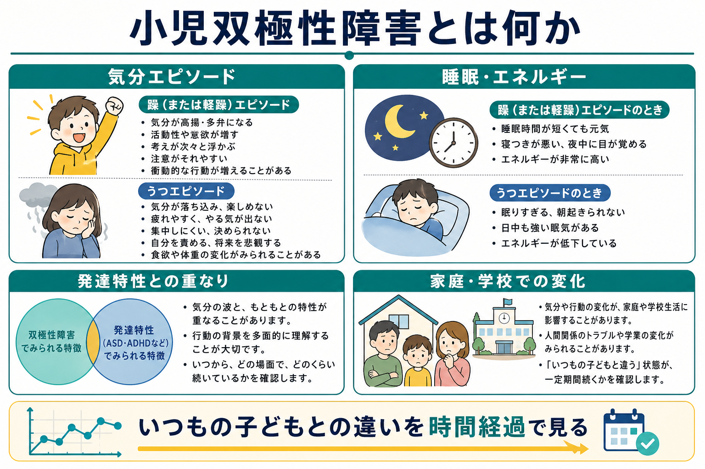
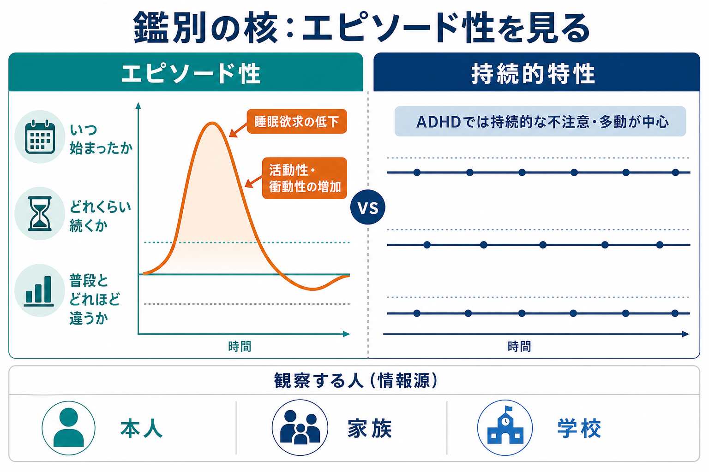
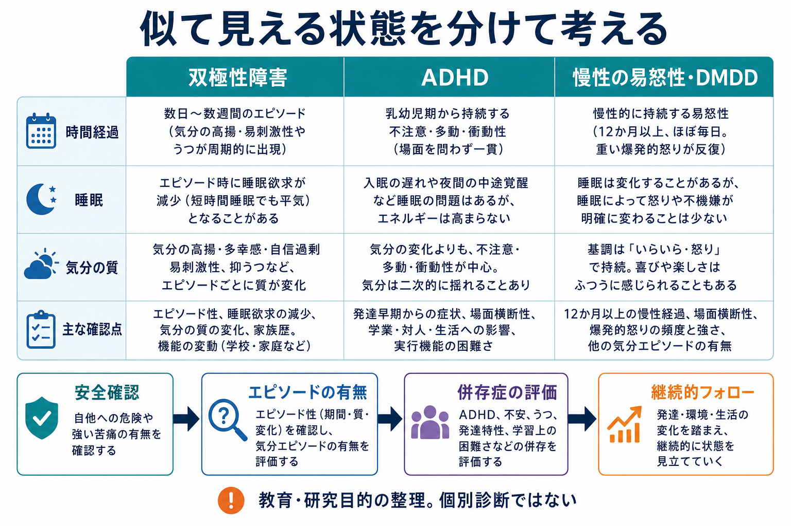

# 小児双極性障害とは何か

## 要点

- 小児双極性障害は、子どもに「機嫌の波がある」ことではなく、躁病・軽躁病・うつ病の気分エピソードが、普段の発達水準や生活機能から明らかに外れて現れる状態として理解する[1][2]。
- 鑑別の中心は、症状の強さだけでなく「いつ始まり、どれくらい続き、普段とどれほど違い、家庭・学校・対人関係にどう影響したか」を時系列で見ることにある[1][3]。
- [[ADHDとは何か]]とは、不注意・多動・衝動性、睡眠問題、易怒性が重なるため混同されやすい。ADHDは発達早期から持続的・場面横断的にみられやすく、双極性障害では気分・睡眠欲求・活動性の変化がエピソードとしてまとまる点が重要である[4][5]。
- 慢性の易怒性や激しいかんしゃくは、必ずしも双極性障害を意味しない。DSM-5で導入された破壊的気分調節不全障害（DMDD）は、慢性的な易怒性を小児双極性障害から分けて考えるための診断概念でもある[6]。
- 本記事は教育・研究目的の整理であり、個別の診断や治療方針を示すものではない。自傷他害の危険、睡眠をほとんど取らない状態、精神病症状、急激な機能低下がある場合は専門家による評価が必要である[1][2]。

## この記事で答える問い

1. 小児双極性障害は、成人の[[双極性障害とは何か|双極性障害]]と何が同じで、何が違って見えるのか。
2. 子どもの躁病・軽躁病・うつ病エピソードは、発達特性や環境反応とどう区別されるのか。
3. [[ADHDとは何か|ADHD]]、反抗挑発、慢性の易怒性、[[大うつ病性障害とは何か|大うつ病]]とはどこが重なり、どこが違うのか。
4. 家庭・学校・臨床研究では、どのような情報を集めると見立ての精度が上がるのか。

## まず結論

小児双極性障害を理解する鍵は、「症状リスト」よりも「時間経過」である。たとえば、落ち着きのなさ、話しすぎ、怒りっぽさ、睡眠の乱れは、ADHD、不安、トラウマ反応、家庭・学校ストレス、身体疾患、薬物・物質の影響でも起こりうる。双極性障害として考えるには、気分の高揚または明らかな易刺激性、活動性・エネルギーの増加、睡眠欲求の低下、思考や行動の加速、危険行動などが、普段とは違うまとまりとして出現し、数日以上続き、生活機能に影響するかを確認する必要がある[1][2][3]。

NICEは、子ども・若者の双極性障害診断について、経験ある専門家または多職種チームによる集中的・前方視的な縦断観察の後に行うべきだとしている。また、診断時には躁病が存在すること、少なくとも7日間ほとんどの日・大部分の時間で多幸気分がみられること、易怒性だけを中核診断基準にしないことを明記している[2]。これは、小児双極性障害が「見逃されてはいけない」が、同時に「怒りっぽさだけで広く診断してはいけない」状態であることを示している。

## 背景

双極性障害は、躁病・軽躁病・うつ病エピソードを特徴とする気分障害であり、[[双極I型障害とは何か]]では躁病エピソード、[[双極II型障害とは何か]]では軽躁病エピソードとうつ病エピソードが診断の中心になる。児童青年期にも症状は出現しうるが、特に12歳未満ではまれで、思春期以降に目立ちやすいとされる[1][2]。

子どもの場合、発達段階によって症状の表れ方が変わる。幼い子どもでは、気分を言語化する力が限られ、周囲には「怒り」「かんしゃく」「落ち着きのなさ」「学校でのトラブル」として見えることがある。青年期になると、睡眠時間の短縮、活動性の増加、性的・金銭的・対人的なリスク行動、抑うつ、自傷念慮、物質使用などが絡みやすくなる[1][3]。

このため、小児双極性障害では、本人の語りだけでも、保護者の観察だけでも、学校の行動記録だけでも不十分になりやすい。複数の情報源を照合し、「本人にとっての普段」と比べてどの程度逸脱しているかを確認する必要がある[1][2]。

## 基本概念

### 躁病・軽躁病エピソード

躁病エピソードでは、気分の高揚、開放的な気分、または著しい易刺激性に加えて、活動性・エネルギーの増加がみられる。睡眠欲求の低下、話し続ける、考えが次々浮かぶ、注意散漫、目標志向活動の増加、危険を顧みない行動、誇大的な考えなどがまとまって出現する。重症になると精神病症状や入院を要する機能障害を伴うこともある[1][3]。

軽躁病は躁病より軽いが、「調子がよいだけ」とは限らない。本人には快適に感じられても、睡眠が短くなり、活動量が増え、対人摩擦や衝動的決定が増える場合がある。青年期では、軽躁を本人が病的変化と感じにくく、後から[[大うつ病性障害とは何か|うつ病]]として相談されることもある[3]。

### うつ病エピソード

小児・青年の双極性障害では、躁症状よりも抑うつ症状が目立つ時期が多いことがある。COBY研究では、双極スペクトラム障害をもつ7〜17歳の若者は、4年間の追跡で有症状期間が長く、抑うつ症状や混合性の症状、気分極性の変化が多いことが示された[7]。したがって、うつ病エピソードで受診した子ども・青年では、過去の軽躁・躁病様エピソード、家族歴、睡眠欲求の低下、活動性の変化を丁寧に聴く必要がある[2][3]。

### 混合性と急速な変動

児童青年期では、成人の典型例のように「躁」と「うつ」がきれいに分かれず、気分の高揚、怒り、焦燥、抑うつ、希死念慮、衝動性が混ざって見えることがある[3][7]。ただし、数時間単位の気分の揺れだけで双極性障害と判断するのは危険である。臨床的には、エピソードの持続、普段との差、睡眠・エネルギー・活動性の変化、機能障害を組み合わせて評価する。

## 仕組み

小児双極性障害は、単一の脳部位や単一の遺伝子で説明できる疾患ではない。研究上は、遺伝的脆弱性、気分調節、報酬処理、睡眠・概日リズム、ストレス反応、家族・学校環境が相互作用する発達精神病理として理解される[1][3]。

特に重要なのは、発達特性と気分エピソードが重なる点である。ADHDの多動・衝動性は幼少期から持続しやすい。一方、双極性障害では、ある時期から睡眠欲求が下がり、エネルギーや活動性が増え、気分の質が普段と変わる。両者は併存することもあり、どちらか一方だけに単純化できない[4][5]。

### ADHDとの鑑別

ADHDと双極性障害の重なりは大きい。話しすぎ、注意散漫、衝動的行動、落ち着きのなさ、情動調整の難しさは、どちらでも見られうる[4][5]。鑑別で有用なのは、重なる症状ではなく、より躁病に特異的な変化である。

| 観点 | 双極性障害で確認すること | ADHDで確認すること |
|---|---|---|
| 時間経過 | 数日から数週間のエピソードとして普段と違う状態が出る | 発達早期から持続し、場面をまたいでみられる |
| 睡眠 | 睡眠時間が短くても疲れにくい「睡眠欲求の低下」 | 入眠困難や夜更かしはあっても、睡眠不足で疲労しやすいことが多い |
| 気分の質 | 多幸感、誇大性、著しい易刺激性、混合性がまとまる | 不注意・多動・衝動性が中心で、気分変化は二次的なことが多い |
| 機能変化 | 急に危険行動、対人摩擦、学業低下、家庭内トラブルが増える | 慢性的な実行機能の困難、忘れ物、課題管理困難が続く |
| 情報源 | 本人・家族・学校の時系列記録が重要 | 複数場面での持続的困難の確認が重要 |

近年のレビューでは、ADHDと双極性障害の併存には、診断基準の重なりによる見かけの併存、共通リスク、真の併存、発達的な連続性など複数の説明がありうるとされる[5]。そのため、実務上は「ADHDか双極性障害か」という二分法だけでなく、「ADHDが基盤にあり、別時期に気分エピソードが加わったのか」「気分エピソード中だけADHD様に見えるのか」を分けて考える。

### 慢性の易怒性・DMDDとの鑑別

小児双極性障害をめぐる論争の一つは、慢性的な易怒性を双極性障害に含めるべきかどうかだった。Leibenluftらの研究系譜は、慢性的・非エピソード性の重い易怒性を、古典的なエピソード性躁病とは分けて検討する必要を示した[6]。DSM-5でDMDDが導入された背景にも、慢性的なかんしゃくや怒りを広く小児双極性障害と診断しすぎる問題があった。

ただし、DMDDという診断名を使うかどうか以前に重要なのは、易怒性が「慢性的にほぼ毎日続く基調」なのか、「普段とは違う気分エピソードの一部」なのかである。前者では将来のうつ病・不安症リスクとの関連が議論され、後者では双極スペクトラムの経過として追跡する必要がある[6]。

## 図解

1枚目は、児童青年期の双極性障害を「気分エピソード」「睡眠・エネルギー」「発達特性との重なり」「家庭・学校での変化」の4領域で整理している。ここでの中心は、単発の困りごとではなく、いつもの子どもとの違いを時間経過で見ることである。

2枚目は、ADHDとの鑑別で最も重要な「エピソード性」を示している。躁病・軽躁病では、気分・睡眠・活動性の変化が山のようにまとまって現れる。一方、ADHDでは不注意・多動・衝動性が比較的持続的な特性としてみられやすい。

3枚目は、双極性障害、ADHD、慢性の易怒性・DMDDを比較し、安全確認、エピソードの有無、併存症評価、継続的フォローという流れで整理している。これは診断手順そのものではなく、教育・研究用の概念整理である。

## 臨床・研究との接続

### 評価で集める情報

臨床評価では、本人の主観、保護者の観察、学校での様子、睡眠記録、生活リズム、家族歴、身体疾患、薬剤・物質使用、ストレス因、虐待やトラウマの可能性を統合する[1][2]。NIMHは、双極性障害を診断する血液検査や脳画像検査はなく、睡眠、エネルギー、行動、家族内の精神疾患などを含む包括的評価が必要だとしている[1]。

特に自殺念慮、自傷、精神病症状、急激な睡眠短縮、危険行動、家庭・学校での著しい機能低下は、安全評価と専門的介入の必要性を高める。ここでは個別の治療指示は扱わないが、教育資料としても安全確認を軽く扱わないことが重要である[1][2]。

### 縦断研究が示すこと

COBY研究は、小児・青年の双極スペクトラム障害が、回復と再発、症状下位閾値、抑うつ・混合症状、気分極性の変化を伴う縦断的疾患であることを示した[7]。これは、初回評価だけで「白黒」をつけるよりも、生活機能と症状の推移を継続して追う重要性を支持する。

疫学研究のメタ分析では、小児双極性障害の推定有病率は研究方法や診断範囲に大きく影響される[8]。つまり、「増えている」「まれである」と単純に語るより、サンプルが地域住民か臨床紹介例か、双極I型だけかスペクトラムまで含むか、診断面接の方法は何かを確認する必要がある。

### 研究と臨床を混同しない

研究では、症状尺度、構造化面接、家族歴、神経認知課題、脳画像、遺伝・環境リスクが検討される。しかし、個別症例の診断では、研究知見をそのまま当てはめるのではなく、本人の発達段階、文化的背景、生活環境、併存症、リスクを踏まえて総合的に判断する必要がある[3][4]。

## よくある誤解

### 「子どもに双極性障害はない」

子どもや青年にも双極性障害は起こりうる。ただし、12歳未満ではまれであり、診断には発達段階を踏まえた慎重な評価が必要である[1][2]。

### 「怒りっぽければ小児双極性障害である」

易怒性だけでは不十分である。NICEは、子ども・若者の診断で易怒性を中核診断基準としないことを明記している[2]。慢性の易怒性は、DMDD、[[反抗挑発症とは何か]]、不安、トラウマ、家庭・学校ストレス、発達特性などとも関連しうる。

### 「ADHDと診断されていれば双極性障害は除外できる」

除外できない。ADHDと双極性障害は併存しうるし、片方の症状がもう片方に似て見えることもある[4][5]。重要なのは、発達早期から続く特性と、後からまとまって出現する気分エピソードを分けて記述することである。

### 「うつ病だけに見えるなら双極性障害は考えなくてよい」

青年期では、抑うつ症状を主訴に受診し、過去の軽躁が見逃されることがある。[[大うつ病性障害とは何か|大うつ病]]として評価する場合でも、睡眠欲求の低下、活動性の増加、誇大性、危険行動、家族歴、抗うつ薬使用後の気分変化などを確認する必要がある[2][3]。

## 関連ノート

- [[双極性障害とは何か]]
- [[双極I型障害とは何か]]
- [[双極II型障害とは何か]]
- [[双極性障害とうつ病はどう鑑別するのか]]
- [[ADHDとは何か]]
- [[ADHDとうつ病はどう鑑別するのか]]
- [[反抗挑発症とは何か]]
- [[大うつ病性障害とは何か]]
- [[不安症群とは何か]]
- [[PTSDとは何か]]
- [[不眠障害とは何か]]

MOC更新候補: `content/00_MOC/` 配下の精神医学、気分障害、児童青年精神医学に関するMOC。並列ジョブとの競合を避けるため、本記事ではMOC本体を更新しない。

## 理解チェック

1. ADHDの多動・衝動性と、双極性障害の躁病エピソードでみられる活動性増加を区別するとき、どのような時間経過を確認するか。
2. 「睡眠時間が短い」と「睡眠欲求が低下している」はどう違うか。
3. 慢性の易怒性を、なぜ小児双極性障害とただちに同一視してはいけないのか。
4. 本人・家族・学校の情報が食い違うとき、どのような追加情報が役立つか。
5. うつ病で相談された青年に、過去の軽躁症状を確認する理由は何か。

## 未解決問題

- 小児期の慢性易怒性、ADHD、双極スペクトラムが、どの程度共通リスクをもち、どの程度別の発達経路をたどるのかはまだ完全には整理されていない[5][6]。
- 小児双極性障害の有病率推定は、診断範囲、調査対象、面接方法に左右されるため、地域差や時代差の解釈には注意が必要である[8]。
- 脳画像・遺伝・認知課題の知見は蓄積しているが、個別診断に使える単一のバイオマーカーは確立していない[1][3]。

## 参考文献

[1] National Institute of Mental Health. (2023). *Bipolar Disorder in Children and Teens*. https://www.nimh.nih.gov/health/publications/bipolar-disorder-in-children-and-teens

[2] National Institute for Health and Care Excellence. (2025). *Bipolar disorder: assessment and management* (NICE Clinical Guideline CG185). https://www.nice.org.uk/guidance/cg185

[3] McClellan, J., Kowatch, R., Findling, R. L., & Work Group on Quality Issues. (2007). Practice Parameter for the Assessment and Treatment of Children and Adolescents With Bipolar Disorder. *Journal of the American Academy of Child & Adolescent Psychiatry, 46*(1), 107-125. https://doi.org/10.1097/01.chi.0000242240.69678.c4

[4] Youngstrom, E. A., Birmaher, B., & Findling, R. L. (2008). Pediatric bipolar disorder: validity, phenomenology, and recommendations for diagnosis. *Bipolar Disorders, 10*(1 Pt 2), 194-214. https://doi.org/10.1111/j.1399-5618.2007.00563.x

[5] Comparelli, A., Polidori, L., Sarli, G., Pistollato, A., & Pompili, M. (2022). Differentiation and comorbidity of bipolar disorder and attention deficit and hyperactivity disorder in children, adolescents, and adults: A clinical and nosological perspective. *Frontiers in Psychiatry, 13*, 949375. https://doi.org/10.3389/fpsyt.2022.949375

[6] Leibenluft, E. (2011). Severe Mood Dysregulation, Irritability, and the Diagnostic Boundaries of Bipolar Disorder in Youths. *American Journal of Psychiatry, 168*(2), 129-142. https://doi.org/10.1176/appi.ajp.2010.10050766

[7] Birmaher, B., Axelson, D., Goldstein, B., et al. (2009). Four-year longitudinal course of children and adolescents with bipolar spectrum disorders: the Course and Outcome of Bipolar Youth (COBY) study. *American Journal of Psychiatry, 166*(7), 795-804. https://doi.org/10.1176/appi.ajp.2009.08101569

[8] Van Meter, A. R., Moreira, A. L. R., & Youngstrom, E. A. (2019). Updated Meta-Analysis of Epidemiologic Studies of Pediatric Bipolar Disorder. *Journal of Clinical Psychiatry, 80*(3), 18r12180. https://doi.org/10.4088/JCP.18r12180
