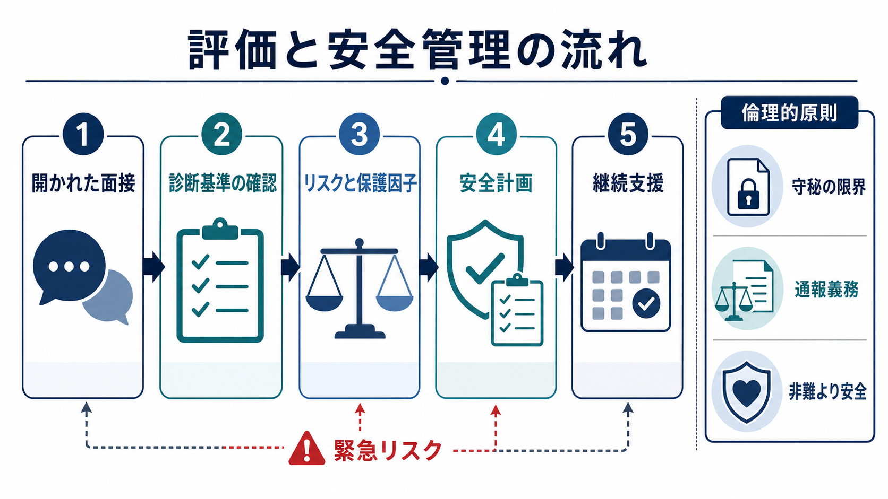
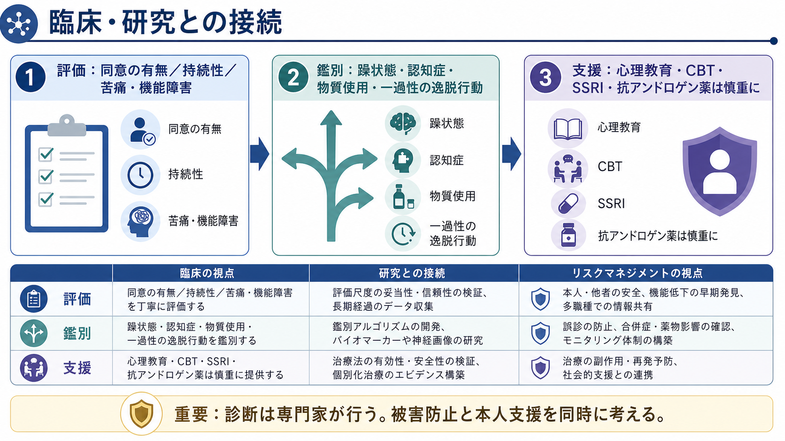

# 小児性愛障害とは何か

## 要点

- 小児性愛障害は、思春期前の子どもへの持続的で強い性的関心があり、本人がそれに基づいて行動した、または強い苦痛・機能障害を伴う場合に問題となる診断概念である[1][2]。
- 診断名と犯罪名は同じではない。違法行為や児童被害の評価は法制度と安全管理の問題であり、診断の有無だけで判断しない[1][2]。
- 臨床では、性的関心そのものを聞くだけでなく、衝動性、機会、過去の行動、被害リスク、併存症、保護因子、守秘の限界を評価する[3][5]。
- 支援の目標は「非難すること」ではなく、子どもの安全確保、本人の苦痛軽減、行動化の予防、継続的な監督と治療につなぐことである[5][6]。

## この記事で答える問い

1. 小児性愛障害は、単なる性的関心や犯罪行為とどう違うのか。
2. 面接では何を評価し、何を安全管理につなげるのか。
3. 治療・支援では、心理社会的介入、薬物療法、法的対応をどう位置づけるのか。

## まず結論

小児への性的関心が語られたとき、臨床的に最初に必要なのは、診断名を急いで貼ることではない。まず、子どもに差し迫った危険があるか、実際の接触・画像利用・加害行為・接近行動があるか、本人が衝動をどの程度制御できているかを確認する。そのうえで、診断基準、併存症、生活環境、法的義務、治療可能性を整理する。

この記事は教育・研究目的の概説であり、個別事例の診断、治療指示、法的判断を代替しない。実際のリスクがある場合は、地域の法制度、児童保護、司法、精神科・性問題専門臨床の連携が必要になる。

## 背景

小児性愛障害を理解するときに混同しやすいのは、「性的関心」「診断」「違法行為」「被害リスク」である。性的関心は内的体験であり、診断は医学的分類であり、違法行為は法制度上の問題であり、被害リスクは安全管理上の問題である。これらは重なりうるが、一対一には対応しない。

DSM-5-TR 系の基準では、思春期前の子どもに関する反復的で強い性的空想・衝動・行動が少なくとも 6 か月続き、本人が衝動に基づいて行動した、またはその衝動や空想により著しい苦痛・機能障害があること、本人が 16 歳以上で対象児より少なくとも 5 歳以上年長であることが中核になる[1]。ICD-11 でも、思春期前の子どもを対象とする持続的・焦点化された強い性的興奮パターンがあり、それに基づいて行動した、または著しい苦痛を伴う場合に小児性愛障害として扱う[2]。

一方で、子どもへの性的加害のすべてが小児性愛障害から起こるわけではない。衝動性、機会、認知症や躁状態、物質使用、反社会性、家庭内権力関係、孤立などが関与することもある[2][3]。したがって評価では、診断概念だけでなく、[[物質使用歴はどのように聞くべきか|物質使用歴]]、[[他害リスク評価では何を見るべきか|他害リスク]]、[[虐待リスクを精神科でどう評価するか|虐待リスク]]を分けて見る必要がある。

## 基本概念

### 小児性愛と小児性愛障害

「小児性愛」は、一般には思春期前の子どもへの性的関心を指す。一方、「小児性愛障害」は、診断分類上の障害概念であり、関心の持続性、強さ、対象、行動化、苦痛・機能障害、年齢差などを含めて判断される[1][2]。つまり、内的関心の存在だけでただちに診断や犯罪を意味するわけではないが、子どもが同意能力をもたない以上、行動化のリスクは常に重大な安全問題として扱う。

### 診断と法的判断

精神医学的診断基準と法律上の犯罪・通報義務は別の体系である。たとえば DSM の年齢差基準を満たさない場合でも、地域の法律では違法になることがある。逆に、違法行為があっても、それが持続的な小児性愛的興奮パターンによるものとは限らない[1][2]。臨床家は、診断評価と同時に守秘の限界、通報義務、児童保護、記録を確認しなければならない[7]。

### 評価で見る領域

評価は、本人の言葉を単に信じるか疑うかではなく、複数の情報源を統合する作業である。聞くべき領域には、関心の対象年齢と持続性、衝動の強さ、苦痛、過去の行動、オンライン行動、接触機会、子どもとの同居・職業上の接触、物質使用、気分症状、発達特性、反社会性、支援者、治療動機が含まれる[3][5]。

## 仕組み

小児性愛障害を単一の「原因」で説明することはできない。研究は、性的関心、自己制御、認知、対人関係、機会、社会的孤立、併存症、法的・環境的制約が重なって行動リスクを形づくると考える。Seto の整理では、小児性愛は子どもへの性的関心に関わる要因であり、実際の子どもへの性的加害は、関心だけでなく自己制御、機会、反社会性、親密性の困難など複数要因によって左右される[3]。

一般人口における小児への性的関心の推定値は研究方法によって大きく異なる。系統的レビューでは、定義、質問形式、サンプル、匿名性、測定法の違いにより推定にばらつきがあり、男性サンプルや学生サンプルに偏りがあることが指摘されている[4]。この不確実性は、臨床で「ありふれているから軽い」とも「まれだから見ない」とも決めつけてはいけないことを示している。

臨床的に重要なのは、関心の有無そのものよりも、行動化の近さである。たとえば、孤立、飲酒や薬物使用、抑うつ、怒り、アクセス可能な子ども、監督の弱さ、秘密保持を求める関係、オンライン画像利用が重なると、安全管理の優先度は上がる。逆に、本人が危険な状況を避ける計画を持ち、支援者や専門家に相談し、子どもとの接触を制限し、治療に継続的に関与できる場合は、保護因子として評価できる[5][6]。

## 図解

下の図は、関心・診断・安全管理を分けて考えるための臨床的な比較である。診断名は支援の入口であり、免責でも断罪でもない。評価は常に、本人の苦痛と子どもの安全を同時に扱う。

## 臨床・研究との接続

### 面接

面接では、羞恥や恐怖を強めるだけの問い方は情報を閉ざしやすい。一方で、安全リスクを曖昧にしてはいけない。実践上は、[[精神科面接で境界設定はなぜ必要なのか|境界設定]]を明確にし、「話した内容はできる限り尊重するが、子どもへの差し迫った危険や虐待の疑いがある場合には守秘に限界がある」と最初に説明する。これは本人を罰するためではなく、評価と安全確保の前提である。

### リスク評価

リスク評価では、静的因子と動的因子を分ける。静的因子には過去の加害歴や被害者との関係など、短期には変わりにくい情報がある。動的因子には、衝動の強さ、飲酒、孤立、怒り、アクセス機会、治療参加、監督体制など、介入で変わりうる情報がある。ATSA の成人ガイドラインは、リスク・ニーズ・反応性の原則に基づき、再犯リスクに応じた強度、再犯に関連する動的ニーズへの介入、個人の発達段階や動機づけに合った方法を重視する[5]。

### 治療・支援

治療は、心理教育、認知行動療法、再発予防、社会的支援、併存症治療を組み合わせることが多い[5][6]。薬物療法は万能ではなく、リスクの高さ、苦痛、衝動性、併存症、副作用、同意、医学的監視を踏まえて専門家が検討する。WFSBP の薬物療法ガイドラインは、パラフィリア障害の重症度と他者を危険にさらす行動リスクに応じて、SSRI、抗アンドロゲン薬、GnRH アナログなどを段階的に位置づけている[6]。

予防的支援も重要である。実際に加害をしていない、または相談しづらい人が早期に支援へつながれる体制は、本人の苦痛軽減と子どもの安全の両方に関わる。ドイツの Dunkelfeld 予防プロジェクトなどは、未検挙・自己申告のリスク群に支援を届ける試みとして研究されている[8]。ただし、予防プログラムの効果は対象、測定法、追跡期間に依存するため、単純な一般化は避ける。

## よくある誤解

### 誤解1: 診断名がある人は必ず加害する

小児への性的関心があることと、実際に加害することは同じではない。行動化には、自己制御、機会、環境、併存症、支援の有無が関わる[3]。ただし、子どもが被害を受ける可能性は重大であり、「行動していないから安全」とも言えない。必要なのは、過小評価でも過剰な決めつけでもなく、具体的なリスク評価である。

### 誤解2: 相談すると必ず罰せられる

相談内容と地域の法制度、既遂行為、差し迫った危険、被害児の有無によって対応は変わる。守秘の限界はあるが、早期相談は安全計画や治療につながる入口にもなる。臨床では、[[心理教育とは何か|心理教育]]と安全管理を分けず、本人がリスク状況を避ける具体策を作れるように支援する。

### 誤解3: 薬を使えば問題は解決する

薬物療法は性衝動や併存症に関わる一部の症状を軽減しうるが、関係性、認知、機会、生活構造、監督体制を置き換えるものではない[6]。薬物療法を検討する場合も、心理社会的介入、モニタリング、身体的副作用の評価、同意、法的枠組みと一体で扱う必要がある。

### 誤解4: 被害防止と本人支援は対立する

実際には、本人が相談できず孤立するほど、リスクは見えにくくなる。非難だけでは安全は作れない。子どもの安全を最優先にしながら、本人の苦痛、併存症、生活困難、治療動機を扱うことが、再発予防と早期介入の基盤になる[5][8]。

## 関連ノート

- [[虐待リスクを精神科でどう評価するか]]
- [[他害リスク評価では何を見るべきか]]
- [[精神科面接で境界設定はなぜ必要なのか]]
- [[物質使用歴はどのように聞くべきか]]
- [[心理教育とは何か]]
- [[リスク下の意思決定はどのように行われるのか]]
- [[抑制制御とは何か]]
- [[逆境的小児期体験ACEとは何か]]

### MOC更新候補

- `content/00_MOC/MOC｜精神医学.md`
- `content/00_MOC/MOC｜総論・診断・面接.md`
- `content/00_MOC/MOC｜臨床実践・治療.md`

## 理解チェック

1. 小児性愛と小児性愛障害は、どの点で区別されるか。
2. 診断基準と法的判断を混同すると、どのような評価上の問題が起こるか。
3. 子どもの安全を評価するとき、本人の内的関心以外にどのような動的因子を見るべきか。
4. 薬物療法を単独の解決策として扱えない理由は何か。

## 未解決問題

- 一般人口における小児への性的関心の推定は、測定法と定義に強く左右されるため、比較可能な研究設計が必要である[4]。
- 早期相談・予防プログラムが、実際の被害防止、本人の苦痛軽減、オンライン行動の変化にどの程度寄与するかは、さらに検証が必要である[8]。
- 薬物療法と心理社会的介入の最適な組み合わせ、長期的な安全性、本人の同意と人権をどう両立するかは、臨床倫理上の重要課題である[6]。

## 参考文献

[1] American Psychiatric Association. (2022). *Diagnostic and Statistical Manual of Mental Disorders, Fifth Edition, Text Revision (DSM-5-TR).* American Psychiatric Association Publishing. https://doi.org/10.1176/appi.books.9780890425787

[2] World Health Organization. (2025). ICD-11 for Mortality and Morbidity Statistics: 6D32 Pedophilic disorder. https://icd.who.int/browse/2025-01/mms/en#517058174

[3] Seto, M. C. (2018). *Pedophilia and Sexual Offending Against Children: Theory, Assessment, and Intervention* (2nd ed.). American Psychological Association. https://doi.org/10.1037/0000107-000

[4] Savoie, V., Quayle, E., & Flynn, E. (2021). Prevalence and correlates of individuals with sexual interest in children: A systematic review. *Child Abuse & Neglect, 115*, 105005. https://doi.org/10.1016/j.chiabu.2021.105005

[5] Association for the Treatment and Prevention of Sexual Abuse. (2014). *ATSA Practice Guidelines for the Assessment, Treatment, and Management of Male Adult Sexual Abusers.* https://members.atsa.com/learn/Details/guidelines-adult-atsa-practice-guidelines-for-the-assessment-treatment-and-management-of-male-adult-sexual-abusers-194331

[6] Thibaut, F., Cosyns, P., Fedoroff, J. P., Briken, P., Goethals, K., & Bradford, J. M. W. (2020). The World Federation of Societies of Biological Psychiatry (WFSBP) 2020 guidelines for the pharmacological treatment of paraphilic disorders. *The World Journal of Biological Psychiatry, 21*(6), 412-490. https://doi.org/10.1080/15622975.2020.1744723

[7] MSD Manual Professional Edition. (2026). Pedophilic Disorder. Reviewed/Revised Oct 2025, Modified Jan 2026. https://www.msdmanuals.com/professional/psychiatric-disorders/paraphilias-and-paraphilic-disorders/pedophilic-disorder

[8] Beier, K. M., Nentzl, J., & von Heyden, M. (2024). Preventing Child Sexual Abuse and the Use of Child Sexual Abuse Materials: Following up on the German Prevention Project Dunkelfeld. *Journal of Prevention, 45*, 881-900. https://doi.org/10.1007/s10935-024-00792-0

