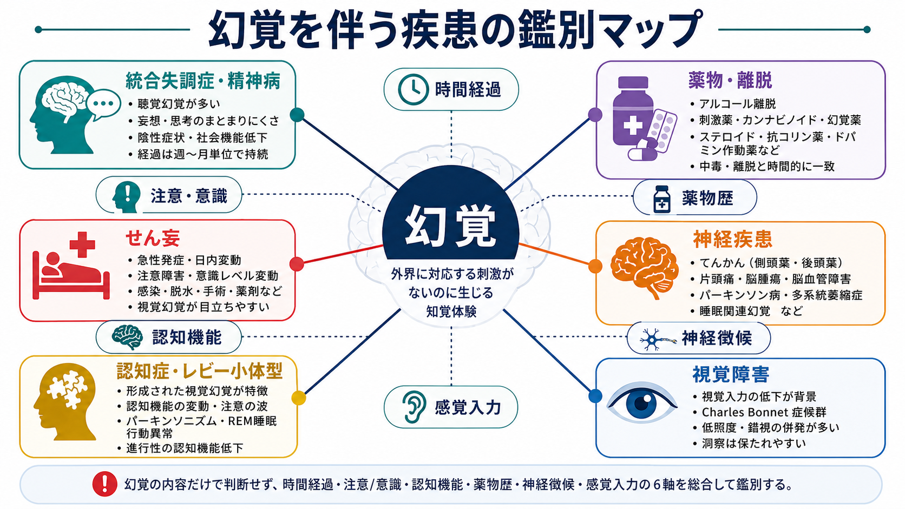
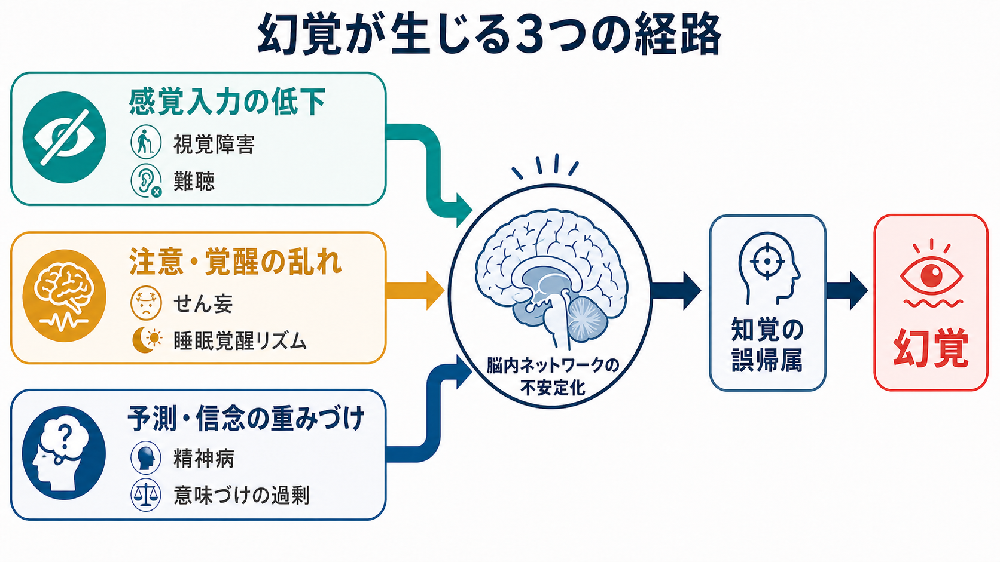
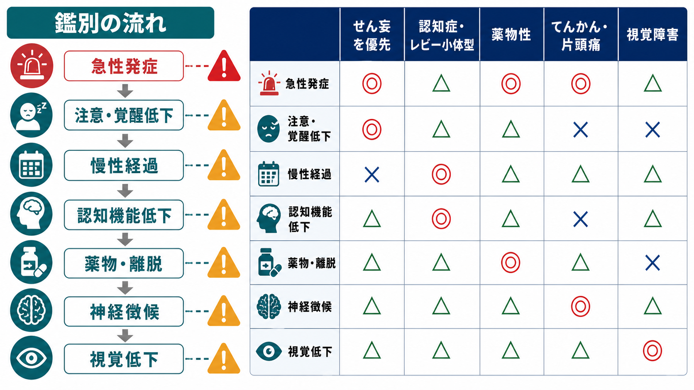

# 幻覚を伴う疾患には何があるのか

## 要点

- 幻覚は [[統合失調症とは何か]] だけでなく、[[ICUせん妄とは何か|せん妄]]、[[認知症とは何か]]、薬物・離脱、[[てんかんに伴う精神症状とは何か|てんかん]]、パーキンソン病関連疾患、視覚障害などで起こる。
- 鑑別では「幻覚の内容」だけでなく、発症速度、意識・注意、認知機能、薬物・身体疾患、神経徴候、感覚障害を同時に見る。
- 急性発症、意識・注意の変動、発熱・脱水・感染、薬物変更、離脱、自律神経症状がある場合は、まずせん妄・中毒・離脱・身体疾患を優先して考える。
- 幻覚があること自体を個別診断に直結させず、教育・研究目的の整理として読む。

## この記事で答える問い

この記事の問いは、「幻覚をみたとき、どの疾患群をどの順番で考えるべきか」である。幻覚は、外界に対応する刺激がないのに知覚体験が生じる現象で、聴覚、視覚、体感、嗅覚、味覚などに分けられる。臨床では、幻覚そのものよりも「どの文脈で出たか」が重要になる。

## まず結論

幻覚の鑑別は、次の順番で考えると整理しやすい。

1. 急性で変動するか。変動する注意障害や意識水準の変化があれば、せん妄をまず考える [3][4]。
2. 物質・薬剤・離脱と時間的に結びつくか。アルコール離脱、刺激薬、カンナビノイド、幻覚薬、ステロイド、抗コリン薬、ドパミン作動薬などを確認する [7]。
3. 慢性の精神病症状として持続するか。妄想、まとまりにくい思考、陰性症状、社会機能低下、病期を合わせて [[統合失調症の陽性症状とは何か]] や他の精神病性障害を考える [1][2]。
4. 認知機能低下、パーキンソニズム、レム睡眠行動異常、認知の変動があるか。[[レビー小体型認知症とは何か]] や [[パーキンソン病認知症とは何か]] では視覚幻覚が重要な手がかりになる [5][6]。
5. 視覚障害、てんかん、片頭痛、脳病変、睡眠関連現象などがないか。視覚幻覚だけが前景に立つときは、神経・眼科的原因も考える [8]。

## 背景

「幻覚がある」という情報だけでは、疾患名はほとんど決まらない。例えば、声が聞こえる場合は精神病性障害が想起されやすいが、重度のうつ病や双極性障害、薬物、てんかん、せん妄でも起こりうる。逆に、ありありとした人物・動物の視覚幻覚は、精神病性障害よりも、せん妄、レビー小体型認知症、パーキンソン病精神病、視覚障害に伴う Charles Bonnet 症候群、後頭葉てんかんなどを強く示唆することがある [5][6][8]。

NICE の成人精神病・統合失調症ガイドラインは、精神病を知覚・思考・気分・行動が大きく変化する状態として扱い、早期認識と包括的評価を重視している [1]。一方、ICD-11 では統合失調症の中核症状に持続する幻覚や妄想などが含まれるが、症状が他の身体疾患や物質・薬剤の直接効果で説明される場合は、一次性精神病として扱わない [2]。この点が鑑別の出発点になる。

## 基本概念

### 幻覚・錯覚・妄想

| 概念 | 何が起きているか | 鑑別で見る点 |
|---|---|---|
| 幻覚 | 対応する外的刺激がない知覚体験 | 感覚様式、現実検討、発症時期、随伴症状 |
| 錯覚 | 実在する刺激を別のものとして知覚する | 低照度、視覚障害、せん妄、パーキンソン病 |
| 妄想 | 訂正されにくい確信・信念 | 被害性、関係性、気分との一致、文化的文脈 |

幻覚の内容が奇妙かどうかより、注意障害、意識の変動、認知低下、薬物歴、身体所見、神経所見のほうが鑑別価値を持つことが多い。視覚幻覚のレビューでも、精神病、せん妄、認知症、パーキンソン病、視覚障害、てんかん、片頭痛、脳病変などを幅広く評価する必要が強調されている [8]。

### 感覚様式の手がかり

| 主な幻覚 | 比較的考えやすい病態 | 注意点 |
|---|---|---|
| 聴覚幻覚 | 統合失調症などの精神病性障害、気分障害、薬物 | 聴覚幻覚だけで統合失調症とはいえない |
| 視覚幻覚 | せん妄、レビー小体型認知症、パーキンソン病、視覚障害、てんかん、薬物 | 鮮明な人物・動物像、低照度、認知変動を確認 |
| 体感・触覚幻覚 | 中毒・離脱、せん妄、精神病性障害 | 虫が這う感覚は刺激薬や離脱でもみられる |
| 嗅覚・味覚幻覚 | 側頭葉てんかん、片頭痛、脳病変、精神病性障害 | 単独なら神経学的評価も考える |

## 仕組み

幻覚を一つの機序で説明するのは難しい。大まかには、次の三つが重なると考えると理解しやすい。

1. 感覚入力が少ない。視覚障害や聴覚障害では、脳内の予測や自発活動が知覚体験として立ち上がりやすくなる。
2. 覚醒・注意が不安定である。せん妄では、炎症、代謝異常、薬剤、睡眠覚醒リズムの乱れなどが脳ネットワークを不安定にし、注意・意識・知覚の変動を起こす [4]。
3. 予測や信念の重みづけが変わる。精神病性障害では、知覚や考えに過剰な意味づけが加わり、幻覚や妄想が互いに補強することがある。これは [[妄想は予測誤差処理の異常として説明できるのか]] や [[幻覚は脳内でどのように生じるのか]] と接続して理解できる。

## 図解

鑑別の実務では、幻覚の「形」よりも「文脈」を先に見る。

| 最初に見る軸 | せん妄を示唆 | 精神病性障害を示唆 | 認知症・神経疾患を示唆 |
|---|---|---|---|
| 時間経過 | 時間から日単位、日内変動 | 週から月単位で持続 | 月から年単位、進行性 |
| 注意・意識 | 注意低下、覚醒変動 | 意識は比較的清明なことが多い | 認知変動がある場合あり |
| 随伴症状 | 発熱、脱水、感染、術後、薬剤変更 | 妄想、思考のまとまりにくさ、陰性症状 | 記憶障害、実行機能低下、パーキンソニズム |
| 幻覚の型 | 視覚幻覚が多い | 聴覚幻覚が多いが他様式もありうる | 形成された視覚幻覚、錯視、存在感 |
| まず確認すること | 身体疾患・薬剤・離脱 | 病期、機能低下、気分症状 | 認知機能、睡眠、運動症状、視覚 |

## 臨床・研究との接続

### 統合失調症・精神病性障害

[[統合失調症とは何か]] では、幻覚は陽性症状の一部であり、妄想、思考障害、まとまりにくい行動、陰性症状、認知機能障害、社会機能低下と合わせて評価する [1][2]。ただし、発症が急性で意識・注意が変動する場合、物質使用や身体疾患と時間的に結びつく場合、または高齢発症で認知機能低下や神経徴候が目立つ場合は、一次性精神病以外を先に除外する。

### せん妄

せん妄は、急性に生じる注意・意識・認知の障害で、日内変動しやすい。NICE は病院・長期ケア施設でのリスク評価、早期認識、診断、予防を重視しており、2023 年に評価・診断関連の推奨が更新されている [3]。高齢、認知症、重症疾患、感染、脱水、術後、薬剤、ICU 環境などは重要な背景である [3][4]。[[せん妄と認知症はどう違うのか]] でも、急性発症と変動性が鑑別の中心になる。

### 認知症・レビー小体型認知症

[[アルツハイマー型認知症とは何か]] でも精神病症状は起こりうるが、繰り返す形成された視覚幻覚、認知の変動、レム睡眠行動異常、パーキンソニズムがそろうと [[レビー小体型認知症とは何か]] を考える。DLB Consortium の第 4 回コンセンサス報告では、反復する視覚幻覚はレビー小体型認知症の中核的臨床特徴の一つとして整理されている [5]。[[認知症と精神病症状はどう関係するのか]] とも接続する領域である。

### パーキンソン病関連

パーキンソン病では、病気そのもの、認知機能低下、睡眠障害、視覚処理の変化、ドパミン作動薬などが重なり、錯視、存在感、通過幻覚、形成された視覚幻覚、妄想が現れることがある [6]。パーキンソン病精神病は、精神科と神経内科の境界にある病態であり、せん妄、薬剤性、[[レビー小体型認知症とは何か]]、[[パーキンソン病認知症とは何か]] との関係を丁寧に見る必要がある。

### 薬物・薬剤・離脱

薬物・薬剤関連では、急性中毒、離脱、処方薬の副作用を分ける。カンナビノイド、コカイン、アンフェタミン、メタンフェタミン、幻覚薬、ケタミン、PCP などは幻覚や妄想を起こしうる [7]。臨床では、[[アルコール離脱とは何か]]、[[ステロイド精神病とは何か]]、[[薬物過量服薬とは何か]]、抗コリン薬、睡眠薬、ドパミン作動薬なども確認する。時間関係、用量変化、尿中薬物検査、離脱兆候、せん妄の有無が鑑別に関わる。

### 神経疾患・視覚障害

視覚幻覚では、[[てんかんに伴う精神症状とは何か]]、片頭痛、後頭葉・側頭葉病変、脳腫瘍、脳血管障害、睡眠関連幻覚、視覚障害に伴う Charles Bonnet 症候群を考える [8]。単純な光・線・形、片側性、発作性、頭痛や神経脱落症状との関連、視力低下、洞察の保たれ方は手がかりになる。[[視覚ネットワークはどのように階層的に情報処理するのか]] を理解しておくと、視覚入力の低下と脳内予測の関係を考えやすい。

## よくある誤解

### 幻覚があれば統合失調症である

誤りである。統合失調症では幻覚が中核症状になりうるが、せん妄、認知症、薬物、神経疾患、視覚障害でも幻覚は起こる [2][8]。特に高齢者、急性発症、身体疾患の存在、薬剤変更がある場合は、一次性精神病と決めつけない。

### 視覚幻覚は精神科だけの問題である

視覚幻覚は精神科的疾患でも起こるが、せん妄、DLB、パーキンソン病、てんかん、片頭痛、視覚障害でも重要な症状である [5][6][8]。眼科・神経内科・身体医学的評価が必要になることがある。

### 本人が「現実ではないかもしれない」と言えば軽い

洞察が保たれていても、原因が軽いとは限らない。Charles Bonnet 症候群のように洞察が保たれやすい病態もあれば、せん妄や神経疾患の初期に一部の洞察が残ることもある。生活機能、安全性、身体所見、経過を合わせて見る。

## 関連ノート

- [[統合失調症とは何か]]
- [[統合失調症の陽性症状とは何か]]
- [[せん妄と認知症はどう違うのか]]
- [[ICUせん妄とは何か]]
- [[認知症とは何か]]
- [[認知症と精神病症状はどう関係するのか]]
- [[レビー小体型認知症とは何か]]
- [[パーキンソン病認知症とは何か]]
- [[てんかんに伴う精神症状とは何か]]
- [[アルコール離脱とは何か]]
- [[ステロイド精神病とは何か]]
- [[幻覚は脳内でどのように生じるのか]]

## MOC更新候補

- `content/00_MOC/` 配下の精神医学 MOC に、本記事を「精神症状の鑑別」または「疾患・症候群」の項目として追加する候補。
- MOC の同時編集競合を避けるため、本ジョブでは MOC 本体は更新しない。

## 理解チェック

1. 幻覚を伴う患者で、急性発症・日内変動・注意障害がある場合、まず何を疑うか。
2. ありありとした人物や動物の視覚幻覚、認知の変動、パーキンソニズムがある場合、どの認知症を考えるか。
3. 幻覚が統合失調症によるものか、薬物・身体疾患によるものかを分けるために、どの時間関係を確認するか。
4. 視覚幻覚だけが目立ち、本人の洞察が比較的保たれている場合、どのような眼科・神経学的原因を考えるか。

## 未解決問題

- 幻覚の神経機構は、感覚入力低下、覚醒・注意、予測処理、神経伝達物質、睡眠覚醒リズムが絡むため、疾患横断的な統一モデルはまだ限定的である。
- 幻覚の主観的苦痛、洞察、文化的意味づけ、危険性をどう標準化して評価するかは、臨床研究上の課題である。
- 高齢者では、認知症、せん妄、薬剤、感覚障害、パーキンソニズムが重なりやすく、一つの診断名だけで説明しにくい。

## 参考文献

[1] National Institute for Health and Care Excellence. (2014, last reviewed 2025). *Psychosis and schizophrenia in adults: prevention and management (CG178).* https://www.nice.org.uk/guidance/CG178

[2] World Health Organization. (2026). *ICD-11 for Mortality and Morbidity Statistics: Schizophrenia or other primary psychotic disorders.* https://icd.who.int/browse/2026-01/mms/en

[3] National Institute for Health and Care Excellence. (2010, updated 2023). *Delirium: prevention, diagnosis and management in hospital and long-term care (CG103).* https://www.nice.org.uk/guidance/CG103

[4] Wilson, J. E., Mart, M. F., Cunningham, C., Shehabi, Y., Girard, T. D., MacLullich, A. M. J., Slooter, A. J. C., & Ely, E. W. (2020). Delirium. *Nature Reviews Disease Primers, 6*, 90. https://doi.org/10.1038/s41572-020-00223-4

[5] McKeith, I. G., Boeve, B. F., Dickson, D. W., Halliday, G., Taylor, J.-P., Weintraub, D., et al. (2017). Diagnosis and management of dementia with Lewy bodies: Fourth consensus report of the DLB Consortium. *Neurology, 89*(1), 88-100. https://doi.org/10.1212/WNL.0000000000004058

[6] Pagonabarraga, J., Bejr-Kasem, H., Martinez-Horta, S., & Kulisevsky, J. (2024). Parkinson disease psychosis: from phenomenology to neurobiological mechanisms. *Nature Reviews Neurology, 20*, 135-150. https://doi.org/10.1038/s41582-023-00918-8

[7] Fiorentini, A., Cantù, F., Crisanti, C., Cereda, G., Oldani, L., & Brambilla, P. (2021). Substance-induced psychoses: An updated literature review. *Frontiers in Psychiatry, 12*, 694863. https://doi.org/10.3389/fpsyt.2021.694863

[8] Teeple, R. C., Caplan, J. P., & Stern, T. A. (2009). Visual hallucinations: Differential diagnosis and treatment. *Primary Care Companion to the Journal of Clinical Psychiatry, 11*(1), 26-32. https://doi.org/10.4088/PCC.08r00673
