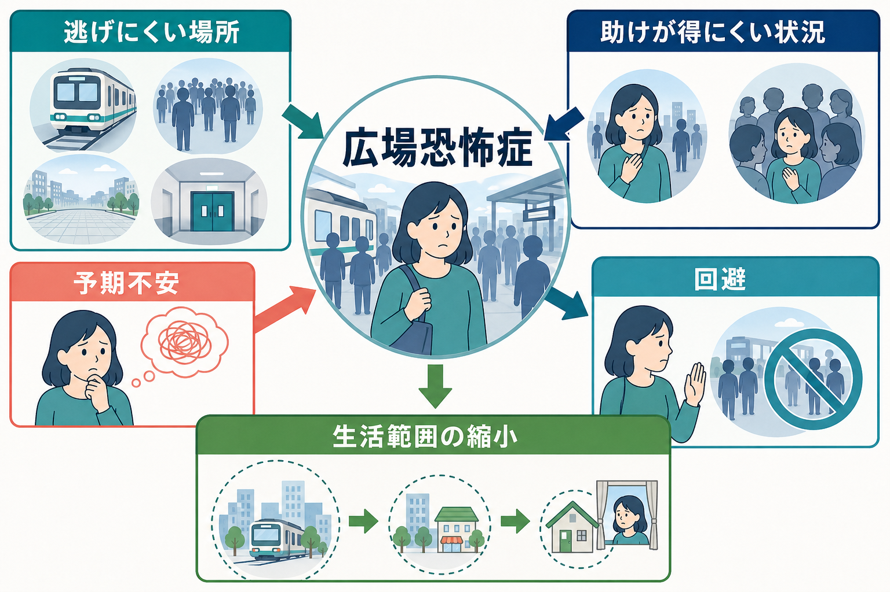
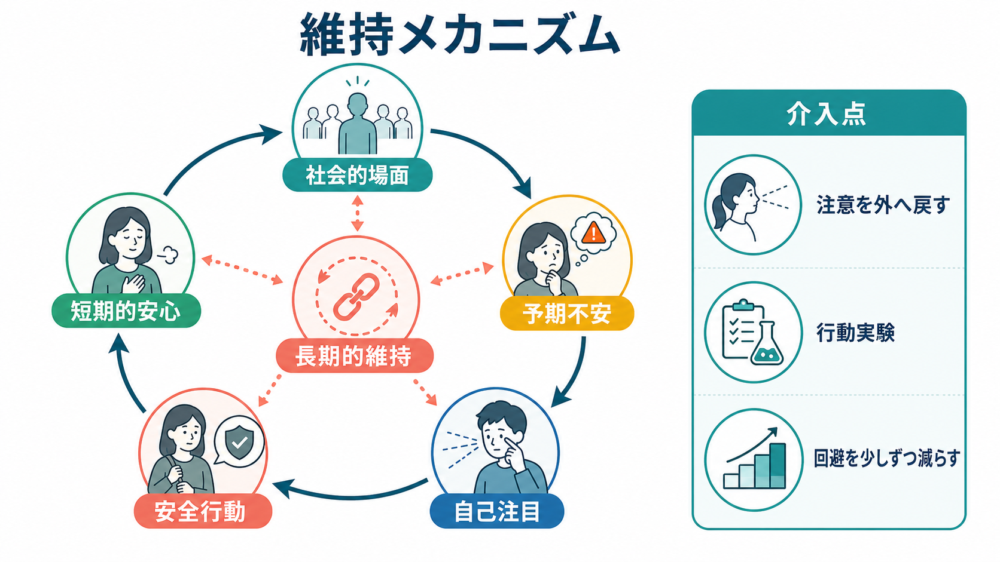
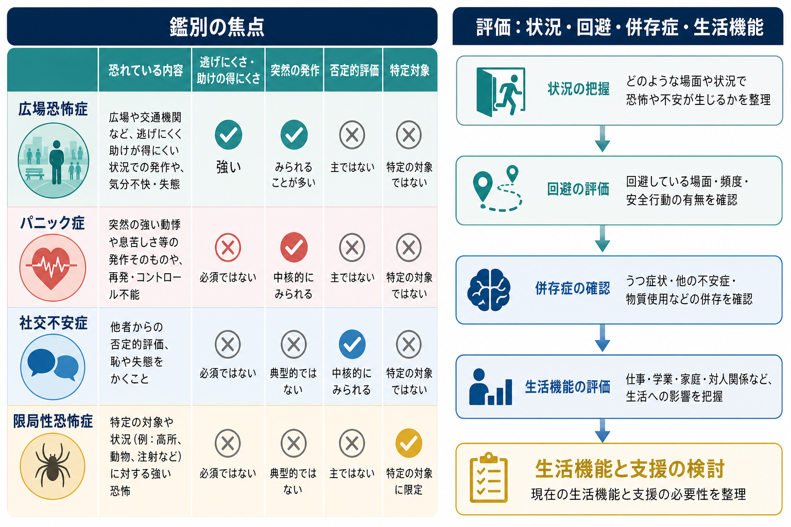

# 広場恐怖症とは何か

## 要点

- 広場恐怖症は「広い場所が怖い病気」ではなく、逃げにくい、助けが得にくい、またはパニック様症状・失神・失禁などが起きたら困ると感じられる状況への強い[[恐怖とは何か|恐怖]]・[[不安とは何か|不安]]と回避を中心とする[[不安症群とは何か|不安症]]である[1][2]。
- 典型的には、公共交通機関、広い場所、閉じた場所、列や人混み、一人で外出することなど複数の状況で問題になる。DSM-5-TR では、これら5領域のうち2つ以上が焦点になること、状況がほぼ常に不安を誘発すること、回避や同伴者への依存、6か月以上の持続、生活機能への障害などが重視される[1][3]。
- [[パニック症とは何か|パニック症]]と重なることは多いが、DSM-5 以降は独立した診断として扱われる。パニック発作だけではなく、「倒れる」「尿意を我慢できない」「その場で動けなくなる」などの無力化・恥ずかしさへの予測も中核になりうる[3][4]。
- 維持には、脅威予測、身体感覚への過注意、[[予期不安とは何か|予期不安]]、[[回避行動とは何か|回避行動]]、安全行動、短期的な安心、長期的な生活範囲の縮小という循環が関わる[2][5]。
- 治療や支援では、心理教育、認知行動療法、段階的な曝露、必要に応じた薬物療法、併存症と生活機能の評価が組み合わされる。ただし本記事は教育・研究目的の整理であり、個別の診断や治療指示ではない[5][6][7]。

## この記事で答える問い

1. 広場恐怖症は、単なる「外出嫌い」や「広い場所への恐怖」と何が違うのか。
2. なぜ逃げにくさ・助けの得にくさが強い不安と回避につながるのか。
3. パニック症、社交不安症、限局性恐怖症、うつ病、身体疾患とはどう鑑別するのか。
4. 臨床・研究では、何を評価し、どのような介入点を考えるのか。

## まず結論

広場恐怖症の中心は、場所そのものではなく「その状況で困ったことが起きたとき、逃げられない、助けてもらえない、恥をかく、制御できない」という予測である。したがって、同じ駅や店でも、誰かと一緒なら行ける、出口が見えるなら耐えられる、空いている時間なら大丈夫、乗り換えが少なければ可能、というように、状況の物理的特徴と本人の安全感が相互に作用する。

この特徴のため、広場恐怖症は[[パニック発作とは何か|パニック発作]]だけで説明すると狭くなりすぎる。実際には、動悸・息苦しさ・めまいなどへの恐怖に加え、失神、転倒、失禁、嘔吐、混乱、他者の前で取り乱すことなどへの予測が問題になることがある[1][3]。症状の強さは「不安の大きさ」だけではなく、行ける場所の範囲、同伴者への依存、仕事・学業・家庭・対人関係の制限として現れる。

## 背景

歴史的に、広場恐怖症は[[パニック症とは何か|パニック症]]と密接に扱われてきた。DSM-IV ではパニック症との関連の中で分類される面が強かったが、DSM-5 以降はパニック症と広場恐怖症が独立した診断として扱われるようになった[3][4]。この変更は、パニック症がなくても広場恐怖症として強い機能障害を示す人がいること、また「パニック発作が先にあり、その後に広場恐怖が生じる」という単線的な経過では説明できない例があることを反映している[3][4]。

疫学研究では、DSM-5 型の広場恐怖症の生涯有病率はおよそ1.5%前後、12か月有病率はおよそ1.0%と推定されている。DSM-5 と DSM-IV の定義で把握される症例は完全には一致せず、DSM-5 基準では重症度や併存症の高い群をより明確に含む可能性が示されている[4]。一方で、広場恐怖症は他の不安症や抑うつ、物質使用、身体疾患と重なりやすいため、単一の症状名としてではなく、生活機能と併存状態を含めて評価する必要がある[1][2]。

## 基本概念

### 診断概念の核

DSM-5-TR に沿って整理すると、広場恐怖症では次のような状況のうち少なくとも2つが、強い恐怖・不安の対象になる[1][3]。

| 状況領域 | 例 | 恐怖の焦点 |
|---|---|---|
| 公共交通機関 | 電車、バス、飛行機、船 | 途中で降りられない、発作時に逃げられない |
| 広い場所 | 駐車場、橋、広場、市街地 | すぐ安全な場所へ戻れない |
| 閉じた場所 | 店、劇場、映画館、エレベーター | 出口まで遠い、閉じ込められる |
| 列・人混み | レジ待ち、混雑した駅、イベント | 人前で取り乱す、抜け出しにくい |
| 一人で外出 | 自宅外に一人でいること | 助けを呼べない、支えがない |

重要なのは、これらの状況が「実際に危険だから」避けられるのではなく、予測される危険や困難に対して不安が過大になり、回避が生活を制限していく点である。本人は恐怖が過剰だと理解していても、身体反応や不安の高まりが強いため、状況に入る前から強い[[予期不安とは何か|予期不安]]が生じることがある。

### 「広場」の誤解

日本語の「広場恐怖症」は、語感として「広い場所だけが怖い」と誤解されやすい。しかし臨床上の agoraphobia は、広い場所だけでなく、電車、バス、店、映画館、行列、人混み、一人外出などを含む。共通するのは、物理的な広さではなく、「逃げ道」「助け」「他者の目」「身体症状が起きた場合の対処可能性」である[1][2]。

そのため、広場恐怖症は「怠け」「わがまま」「外出習慣の不足」として理解すると本質を見失う。本人の行動は、短期的には不安を下げる合理的な安全確保として機能している。しかし、その回避が繰り返されるほど、行ける場所が狭まり、「行けない自分」という予測が強化される。

## 仕組み

### 予測、身体感覚、回避の循環

広場恐怖症の維持は、次の循環として理解しやすい。

1. 「ここで具合が悪くなったら逃げられない」と予測する。
2. 動悸、息苦しさ、めまい、腹部不快感などの身体感覚に注意が向く。
3. 身体感覚が危険の証拠として解釈され、不安が強まる。
4. 途中で帰る、出口近くに立つ、同伴者を求める、空いている時間だけ行くなどの安全行動が増える。
5. その場は安心するが、「避けたから大丈夫だった」という学習が起き、次回の予期不安が残る。
6. 行動範囲が狭まり、仕事・学業・家庭・対人関係への影響が広がる。

この循環は、[[回避学習とは何か|回避学習]]や[[恐怖条件づけとは何か|恐怖条件づけ]]の観点からも理解できる。回避は不安をすぐ下げるため強化されやすいが、その結果として「実際には耐えられた」「助けがなくても対処できた」「身体感覚は危険ではなかった」という反証経験が得られにくくなる[5][6]。

### 安全行動は悪者ではないが、固定化すると問題になる

安全行動とは、不安を下げるための行動である。たとえば、必ず水を持つ、出口の近くにいる、同伴者に迎えに来てもらう、混む時間を避ける、すぐ帰れる経路だけ選ぶ、体調を何度も確認する、といった行動がある。これらは本人が日常を維持するための工夫であり、単純に「やめればよい」と言えるものではない。

ただし、安全行動が唯一の対処法になると、本人は「安全行動がなければ耐えられない」と学習しやすい。臨床的には、安全行動を一気に取り上げるのではなく、本人の同意と安全を確保しながら、少しずつ行動実験や曝露を設計し、予測と実際のずれを学習できる形にすることが重要になる[5][6]。

### 脳・身体・環境の相互作用

広場恐怖症は、単一の脳部位や神経伝達物質だけで説明できるものではない。レビューでは、不安症全般において脅威検出、注意、予測、身体感覚、回避行動、ストレス反応が相互に関わることが整理されている[2]。広場恐怖症では、とくに身体感覚への注意、内受容感覚、空間・移動の感覚、他者がいる環境での制御可能性が重要になる。

この観点では、駅や店は単なる「刺激」ではない。出口までの距離、混雑、音、照明、体調、睡眠不足、過去の経験、同伴者の有無、スマートフォンで助けを呼べるかどうかなどが、同じ場所の意味を変える。広場恐怖症を理解するには、個人内の不安反応だけでなく、環境がどのように予測と行動を形づくるかを見る必要がある。

## 図解

上の2枚の図は、広場恐怖症を「状況」「予測」「回避」「生活機能」の連鎖として見るためのものである。1枚目は、逃げにくい場所、助けが得にくい状況、予期不安、回避、生活範囲の縮小を全体地図として示している。2枚目は、短期的な安心が長期的な維持につながる循環を示す。

3枚目は、鑑別と評価の焦点を整理する。広場恐怖症、パニック症、[[社交不安症とは何か|社交不安症]]、限局性恐怖症は、外から見ると「避ける」という行動が似ている。しかし、恐れている内容が違う。広場恐怖症では逃げにくさ・助けの得にくさが焦点になり、パニック症では突然の発作そのもの、社交不安症では否定的評価、限局性恐怖症では特定対象や特定状況への恐怖が中心になりやすい[1][3]。

## 臨床・研究との接続

### 評価で見ること

臨床評価では、単に「外出できるか」を聞くだけでは不十分である。少なくとも次の点を分けて確認する必要がある[1][5]。

| 評価軸 | 確認する内容 |
|---|---|
| 状況 | どの場所・移動・混雑・一人行動で不安が出るか |
| 予測 | 何が起きると恐れているか。発作、失神、失禁、転倒、羞恥、助けの不在など |
| 回避 | 完全回避、部分回避、同伴者依存、安全行動の内容 |
| 身体症状 | 動悸、息苦しさ、めまい、消化器症状、痛み、疲労など |
| 併存症 | パニック症、うつ病、社交不安症、PTSD、物質使用、身体疾患 |
| 生活機能 | 仕事、学業、家事、育児、通院、買い物、対人関係への影響 |
| リスク | 孤立、抑うつ、自殺念慮、アルコール・鎮静薬への依存的使用 |

身体疾患や薬剤、物質使用による症状も鑑別に入る。たとえば、不整脈、内分泌疾患、前庭機能の問題、消化器疾患、呼吸器疾患などが背景にある場合、「その症状が出る場所を避ける」行動が生じうる。精神科診断では、[[精神科診断における除外診断とは何か|除外診断]]と生活機能評価をあわせて行う必要がある。

### 支援・治療との接続

NICE のガイドラインは、成人のパニック症を広場恐怖の有無を含めて扱い、心理療法、薬物療法、本人の選好と共同意思決定を重視している[5]。Cochrane のネットワークメタ解析では、パニック症に広場恐怖を伴う場合を含む成人で、心理療法は無治療より有効で、認知行動療法は最も研究が多い介入の一つとして整理されている。ただし、介入間の優劣についてはエビデンスの質や精度に限界がある[6]。

薬物療法と心理療法の比較では、短期的な有効性や受容性について不確実性が残り、長期データや副作用データの不足も指摘されている[7]。したがって、臨床では「どれが絶対に正しいか」ではなく、症状の重さ、併存症、過去の治療反応、本人の希望、アクセス可能性、リスク、安全性を統合して方針を決める。

研究上は、広場恐怖症をパニック症の付属物としてではなく、独自の予測・回避・空間行動の問題として扱うことが重要である。仮想現実、モバイル評価、位置情報、行動実験、内受容感覚、空間認知、社会的支援などを組み合わせると、「どの状況で何が予測され、どの安全行動が維持に関わるか」をより細かく扱える可能性がある。

## よくある誤解

### 誤解1: 広い場所だけが怖い

実際には、広い場所だけでなく、電車、バス、店、映画館、列、人混み、一人外出などが含まれる。共通点は広さではなく、逃げにくさ・助けの得にくさ・制御不能感である[1][3]。

### 誤解2: パニック発作がなければ広場恐怖症ではない

パニック症と広場恐怖症は重なりやすいが、現在の分類では独立して診断される。パニック様症状だけでなく、失神、失禁、転倒、嘔吐、混乱などへの恐怖も問題になりうる[3][4]。

### 誤解3: 避けるから悪化するので、無理に行けばよい

回避は短期的には不安を下げ、本人を守る働きもある。問題は、回避だけが対処法になり、反証経験が得られなくなることである。曝露や行動実験は、本人の同意、段階づけ、安全確認、振り返りを伴って行われるべきであり、単なる根性論ではない[5][6]。

### 誤解4: 家族や支援者は同伴をやめればよい

同伴者は生活維持に重要な支えになる一方で、本人が「一人では絶対に無理」と学習する要因にもなりうる。支援では、安心を保ちながら自律性を増やす段階設計が必要である。支援者の役割は、本人の恐怖を否定することではなく、予測・安全行動・実際の結果を一緒に整理することである。

## 関連ノート

- [[不安症群とは何か]]
- [[パニック症とは何か]]
- [[パニック発作とは何か]]
- [[予期不安とは何か]]
- [[回避行動とは何か]]
- [[恐怖とは何か]]
- [[不安とは何か]]
- [[社交不安症とは何か]]
- [[全般不安症とは何か]]
- [[DSMとICDは何が違うのか]]
- [[鑑別診断とは何か]]
- [[回避学習とは何か]]
- [[恐怖条件づけとは何か]]
- [[扁桃体過活動は不安症やPTSDにどう関わるのか]]

### MOC更新候補

- [[MOC｜精神医学]]
- [[MOC｜症候学]]
- [[MOC｜臨床実践・治療]]
- [[MOC｜学習・行動・動機づけ]]

## 理解チェック

1. 広場恐怖症で恐れられるのは、場所そのものというより、どのような状況評価か。
2. パニック症と広場恐怖症を分けて考える利点は何か。
3. 安全行動はどのように短期的な安心と長期的な維持の両方に関わるか。
4. 社交不安症や限局性恐怖症と鑑別するとき、何を聞くべきか。
5. 曝露を「無理に慣れさせること」と理解すると、何を見落とすか。

## 未解決問題

- 広場恐怖症に固有の神経・認知メカニズムは、パニック症や他の不安症とどこまで分離できるのか。
- どの安全行動は生活維持に役立ち、どの安全行動は回復を妨げやすいのか。
- 仮想現実やスマートフォンを用いた日常場面評価は、曝露計画や再発予防にどこまで役立つのか。
- 高齢者、身体疾患をもつ人、発達特性をもつ人では、広場恐怖症の評価と支援をどのように調整すべきか。

## 参考文献

[1] Balaram, K., & Marwaha, R. (2024). *Agoraphobia*. StatPearls. NCBI Bookshelf. https://www.ncbi.nlm.nih.gov/books/NBK554387/

[2] Szuhany, K. L., & Simon, N. M. (2022). Anxiety disorders: A review. *JAMA, 328*(24), 2431-2445. https://doi.org/10.1001/jama.2022.22744

[3] American Psychiatric Association. (2022). *Diagnostic and Statistical Manual of Mental Disorders, Fifth Edition, Text Revision (DSM-5-TR)*. American Psychiatric Association Publishing. https://doi.org/10.1176/appi.books.9780890425787

[4] Roest, A. M., de Vries, Y. A., Lim, C. C. W., et al. (2019). A comparison of DSM-5 and DSM-IV agoraphobia in the World Mental Health Surveys. *Depression and Anxiety, 36*(6), 499-510. https://doi.org/10.1002/da.22885

[5] National Institute for Health and Care Excellence. (2011, last reviewed 2024). *Generalised anxiety disorder and panic disorder in adults: management* (CG113). https://www.nice.org.uk/guidance/cg113

[6] Pompoli, A., Furukawa, T. A., Imai, H., Tajika, A., Efthimiou, O., & Salanti, G. (2016). Psychological therapies for panic disorder with or without agoraphobia in adults: A network meta-analysis. *Cochrane Database of Systematic Reviews*, CD011004. https://doi.org/10.1002/14651858.CD011004.pub2

[7] Imai, H., Tajika, A., Chen, P., Pompoli, A., & Furukawa, T. A. (2016). Psychological therapies versus pharmacological interventions for panic disorder with or without agoraphobia in adults. *Cochrane Database of Systematic Reviews*, CD011170. https://doi.org/10.1002/14651858.CD011170.pub2
