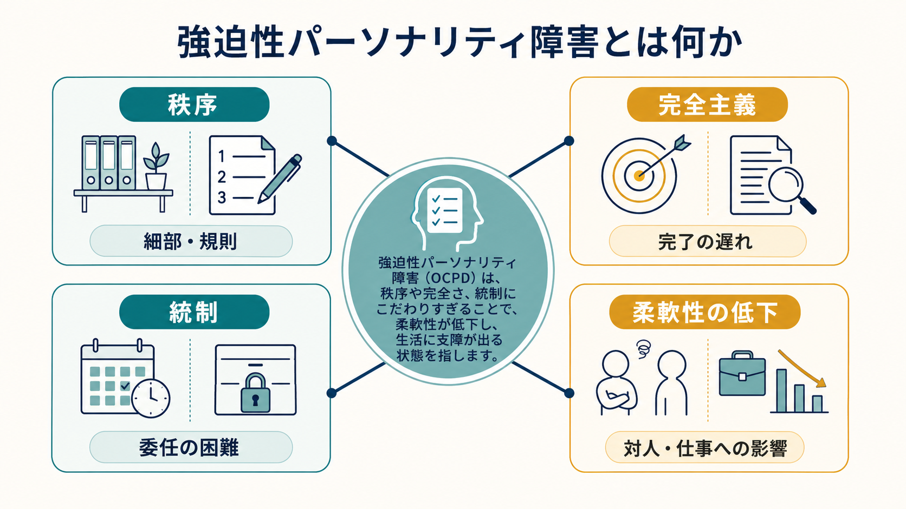
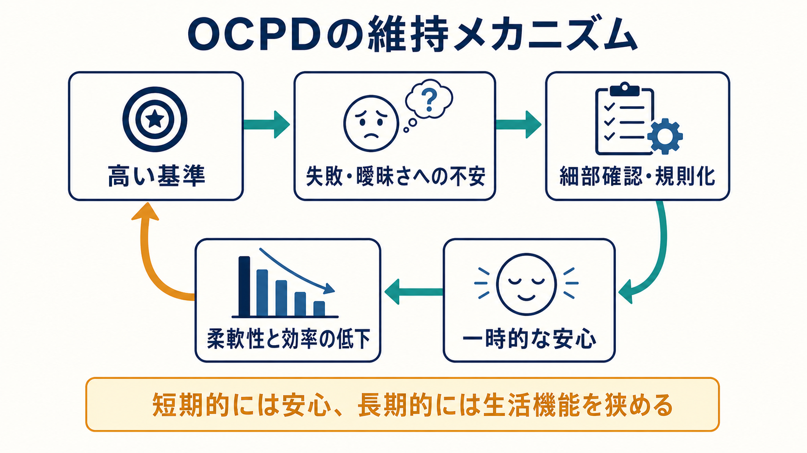
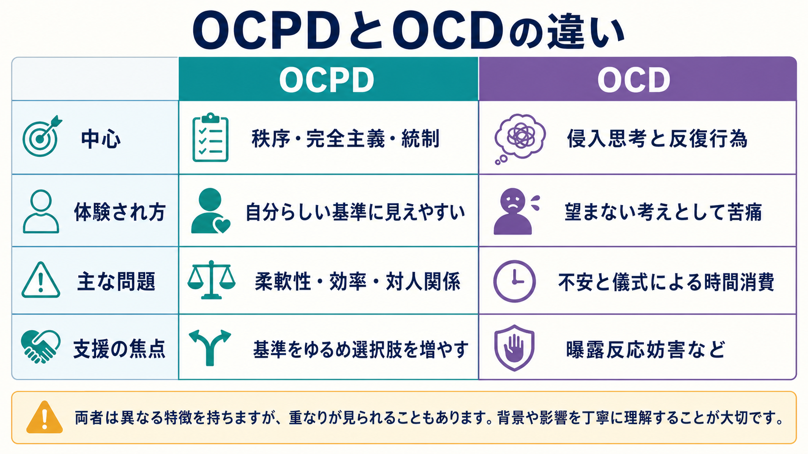

# 強迫性パーソナリティ障害とは何か

## 要点

- 強迫性パーソナリティ障害（obsessive-compulsive personality disorder: OCPD）は、秩序、完全主義、自己・他者・状況の統制に強くとらわれ、その結果として柔軟性、開放性、効率、対人関係が損なわれる持続的なパーソナリティ様式である[1][2]。
- 「几帳面」「責任感が強い」だけでは病態とはいえない。本人または周囲の生活機能、仕事、親密な関係、余暇、意思決定に反復的な支障が出ることが重要である[1][5]。
- [[強迫症とは何か|強迫症]]（OCD）とは名前が似ているが、OCDでは侵入的で望まない思考と反復行為が中心であり、OCPDでは「自分にとって正しい基準」として体験されやすい秩序・完全主義・統制が中心になる[2][6]。
- ICD-11では、従来型のサブタイプ診断よりも、パーソナリティ障害の重症度と trait qualifier を組み合わせる次元的モデルが重視され、OCPDに近い特性は anankastia として整理される[3][8]。
- 治療研究はまだ十分ではない。心理療法、とくに認知行動療法や精神力動的心理療法が用いられるが、薬物療法を含めた標準治療のエビデンスは限定的である[4][7]。

## この記事で答える問い

1. 強迫性パーソナリティ障害は、日常的な几帳面さや仕事熱心さと何が違うのか。
2. 秩序、完全主義、統制へのこだわりは、どのように生活機能と対人関係を狭めるのか。
3. [[強迫症とは何か|強迫症]]、[[ためこみ症とは何か|ためこみ症]]、[[不安症群とは何か|不安症群]]とはどこで重なり、どこで区別されるのか。
4. 研究と臨床では、OCPDをどのように評価し、どこに介入の焦点を置くのか。

## まず結論

強迫性パーソナリティ障害は、「きちんとしている人」という性格記述ではなく、秩序・完全主義・統制が過剰に固定化し、状況に応じた選択肢を狭める病態である。本人にとっては「正しい」「責任ある」「安全な」やり方に見えやすいため、苦痛の中心が不安や侵入思考としては語られず、むしろ他者の不正確さ、非効率、道徳的ゆるさへの苛立ちとして現れることもある[1][2]。

ただし、病態として扱うには慎重さが必要である。几帳面さ、誠実性、規則を守る態度は、それ自体では問題ではない。問題になるのは、細部への没頭で作業が終わらない、委任できない、余暇や親密な関係を犠牲にする、基準を少しも変えられない、周囲にも同じ基準を求める、といった形で生活機能が繰り返し損なわれる場合である[1][5]。

## 背景

OCPDは、DSM系の分類ではパーソナリティ障害の一つとして扱われる。Merck Manual の専門家向け解説は、DSM-5-TRに基づき、秩序、完全主義、自己・他者・状況の統制への持続的なとらわれが中心であり、柔軟性や効率を犠牲にする点を強調している[1]。StatPearls も、OCPDを極端な完全主義、秩序、自己統制が生活上の困難につながる状態として整理し、診断にはOCDや他のパーソナリティ障害との鑑別が必要だと述べている[2]。

ICD-11では、パーソナリティ障害の分類が大きく再編されている。まず重症度を評価し、必要に応じて否定的感情性、離隔、非社会性、脱抑制、anankastia などの trait domain を加える。anankastia は、完全性、正誤、自己・他者・状況の統制への狭い焦点を特徴とし、OCPDに近い特性群を次元的に記述する概念である[3][8]。

## 基本概念

### 中核特徴

OCPDの中心は、次の三つの軸で理解しやすい。

| 軸 | 典型的な現れ | 機能障害につながる経路 |
|---|---|---|
| 秩序 | 細部、規則、手順、予定、リストへの没頭 | 全体目標よりも手順遵守が優先され、作業が進みにくくなる |
| 完全主義 | 「十分よい」水準で終えられない | 失敗回避と修正が増え、完了が遅れる |
| 統制 | 自分や他者のやり方を細かく管理する | 委任困難、対人摩擦、孤立、疲弊が生じる |

ここで重要なのは、症状が一場面だけのこだわりではなく、思春期後期から成人期早期に始まり、複数の生活場面で持続しやすいパターンとして現れる点である[2][4]。

### 「自分に合っている」体験

OCPDの特徴は、本人にとって自分の基準が合理的・道徳的・責任あるものに見えやすいことである。OCDの強迫観念が「望まないのに浮かぶ」「不合理だと分かっていても苦しい」と体験されやすいのに対し、OCPDでは「これが正しい」「他者が雑すぎる」と体験されやすい[2][6]。このため、本人が困って受診するよりも、対人関係、職場、家族関係の摩擦を通じて問題が顕在化することがある。

## 仕組み

OCPDを維持する仕組みは、単一の脳部位や一つの性格因子で説明できるものではない。現在の整理では、遺伝的脆弱性、発達環境、愛着、学習歴、完全主義的信念、責任感、曖昧さへの不耐性などが複合的に関わると考えられている[2][4]。

臨床的には、次の循環として理解すると見通しがよい。

1. 高い基準や「間違ってはならない」という信念がある。
2. 失敗、批判、曖昧さ、他者の不正確さが脅威として感じられる。
3. 細部確認、規則化、手順化、委任回避によって一時的な安心が得られる。
4. しかし長期的には、効率、柔軟性、余暇、対人関係が損なわれる。
5. 失敗を避けられた経験が「もっと統制すべきだ」という学習を強める。

この循環では、統制は「悪い癖」ではなく、本人にとって不安や責任感を処理するための短期的な安全行動になっている。したがって支援では、単に「もっと柔軟に」と説得するだけでは不十分で、統制を手放したときに何が起こると予測しているのか、どの基準が生活を助け、どの基準が生活を狭めているのかを丁寧に評価する必要がある[5]。

## 図解

### 全体像

OCPDでは、秩序・完全主義・統制が互いに補強し合う。細部や規則への焦点は一見すると高い成果につながりそうに見えるが、基準が硬くなるほど、完了、委任、休息、関係調整が難しくなる。

### 鑑別の見取り図

| 観点 | OCPD | OCD |
|---|---|---|
| 中心 | 秩序、完全主義、統制への持続的な様式 | 侵入的な強迫観念と反復的な強迫行為 |
| 体験され方 | 自分の価値観や基準として体験されやすい | 望まない考え・衝動として苦痛を伴いやすい |
| 主な支障 | 完了の遅れ、委任困難、対人摩擦、余暇の喪失 | 儀式や確認による時間消費、不安、回避 |
| 代表的介入 | 完全主義的基準、柔軟性、対人パターンへの介入 | 曝露反応妨害、認知療法、SSRIなど |

OCDとの区別は、名称ではなく体験の質と行動の機能を見る必要がある。OCDでは「不安を下げるための儀式」が中心になりやすく、OCPDでは「正しいやり方を守るための統制」が中心になりやすい。ただし両者は併存しうるため、鑑別は単純な二分法ではなく、症状、発症時期、生活機能、苦痛の主観、反復行為の目的を総合して行う[2][6]。

## 臨床・研究との接続

### 評価

臨床評価では、本人の性格特徴だけでなく、生活機能への影響を確認する。たとえば、仕事の質は高いが締切を守れない、家族や同僚に細かい手順を要求する、休息や娯楽に罪悪感を覚える、物を捨てられない、費用を極端に抑える、道徳や規則の解釈が硬い、といった形で現れることがある[1][2]。

また、[[ためこみ症とは何か|ためこみ症]]、[[不安症群とは何か|不安症群]]、[[強迫症とは何か|強迫症]]、うつ病、摂食障害、他のパーソナリティ障害との併存や鑑別も重要である。物を捨てられないことがあっても、それがOCPDの一特徴なのか、ためこみ症として独立した生活空間の障害を伴うのかは分けて評価する必要がある。

### 支援

治療研究はOCDほど確立していない。レビューでは、認知行動療法が比較的よく検討されている一方、研究数や研究デザインには限界があるとされる[4][5]。薬物療法についても、ランダム化比較試験を対象とした系統的レビューでは、OCPD単独への薬物療法の有効性を強く結論するには証拠が限られると整理されている[7]。

実践上の焦点は、症状を「消す」ことだけではない。むしろ、本人にとって価値ある秩序や誠実性を残しながら、状況に応じて基準を調整する力を増やすことが重要である。たとえば、完璧に仕上げる課題と「十分よい」で終える課題を分ける、他者に任せる実験を小さく行う、曖昧さに耐える練習をする、怒りや不安の背後にある責任感や恥を扱う、といった介入が検討される[5]。

## よくある誤解

### 誤解1: 几帳面ならOCPDである

几帳面さや高い誠実性は、それだけでは障害ではない。障害として考えるのは、柔軟性や効率を犠牲にしても基準を変えられず、生活機能や対人関係に持続的な支障がある場合である[1]。

### 誤解2: OCPDはOCDの軽い形である

OCPDとOCDは関連する特徴を持つことがあるが、同じ連続体の軽重だけでは説明できない。OCDでは侵入思考と儀式、OCPDでは秩序・完全主義・統制のパーソナリティ様式が中心になる[2][6]。

### 誤解3: 本人は困っていないなら問題ではない

本人が自分の基準を合理的だと感じていても、周囲との関係、仕事の完了、余暇、健康、家族生活に大きな負担が出ていることがある。評価では、本人の主観的苦痛だけでなく、生活機能と周囲への影響も見る必要がある[5]。

### 誤解4: 治療では完璧主義をなくすべきである

目標は、誠実性や丁寧さを失わせることではない。重要なのは、状況に応じて基準を選び直し、「高い基準を保つ場面」と「十分よいで進める場面」を区別できるようにすることである。

## 関連ノート

- [[強迫症とは何か]]
- [[ためこみ症とは何か]]
- [[不安症群とは何か]]
- [[統合失調型パーソナリティ障害とは何か]]
- 認知行動療法とは何か（関連ノート候補）
- パーソナリティ障害とは何か（関連ノート候補）
- 完全主義とは何か（関連ノート候補）

## 理解チェック

1. OCPDにおける「完全主義」は、どのような条件で強みにとどまらず生活機能の問題になるか。
2. OCPDとOCDを区別するとき、症状の内容だけでなく「本人にどう体験されているか」を見る理由は何か。
3. ICD-11の anankastia は、従来のOCPD診断とどのように重なり、どのように違うか。
4. 支援で「基準を下げる」とだけ伝えることが不十分になりやすいのはなぜか。

## 未解決問題

- OCPDに特化した心理療法の効果を、十分なサンプルサイズと長期追跡で検証した研究はまだ限られている。
- ICD-11の次元的モデルが、日常臨床で従来のカテゴリ診断よりもどの程度有用かは、文化差を含めてさらに検証が必要である[8]。
- OCPDとOCD、ためこみ症、摂食障害、自閉スペクトラム特性、職業上の高い誠実性との境界は、個別事例では単純ではない。

## 参考文献

[1] Merck Manual Professional Edition. "Obsessive-Compulsive Personality Disorder (OCPD)." Reviewed/Revised Sept 2023, Modified Jan 2026. https://www.merckmanuals.com/professional/psychiatric-disorders/personality-disorders/obsessive-compulsive-personality-disorder-ocpd

[2] Rizvi, A., & Torrico, T. J. (2023). "Obsessive-Compulsive Personality Disorder." *StatPearls*. NCBI Bookshelf. https://www.ncbi.nlm.nih.gov/books/NBK597372/

[3] World Health Organization. *ICD-11 for Mortality and Morbidity Statistics*, 2026-01 release; 6D11.4 Anankastia in personality disorder or personality difficulty. https://icd.who.int/browse/2026-01/mms/en#848330288

[4] Diedrich, A., & Voderholzer, U. (2015). Obsessive-compulsive personality disorder: a current review. *Current Psychiatry Reports, 17*(2), 2. https://doi.org/10.1007/s11920-014-0547-8

[5] Pinto, A., Teller, J., & Wheaton, M. G. (2022). Obsessive-Compulsive Personality Disorder: A Review of Symptomatology, Impact on Functioning, and Treatment. *Focus, 20*(4), 389-396. https://doi.org/10.1176/appi.focus.20220058

[6] Merck Manual Professional Edition. "Obsessive-Compulsive Disorder (OCD)." Reviewed/Revised Nov 2025, Modified Jan 2026. https://www.merckmanuals.com/professional/psychiatric-disorders/obsessive-compulsive-and-related-disorders/obsessive-compulsive-disorder-ocd

[7] Gecaite-Stonciene, J., Williams, T., Lochner, C., Hoffman, J., & Stein, D. J. (2022). Efficacy and tolerability of pharmacotherapy for obsessive-compulsive personality disorder: a systematic review of randomized controlled trials. *Expert Opinion on Pharmacotherapy, 23*(11), 1351-1358. https://doi.org/10.1080/14656566.2022.2100695

[8] Bach, B., & First, M. B. (2021). Obsessive-Compulsive (Anankastic) Personality Disorder in the ICD-11: A Scoping Review. *Frontiers in Psychiatry, 12*, 646030. https://doi.org/10.3389/fpsyt.2021.646030
