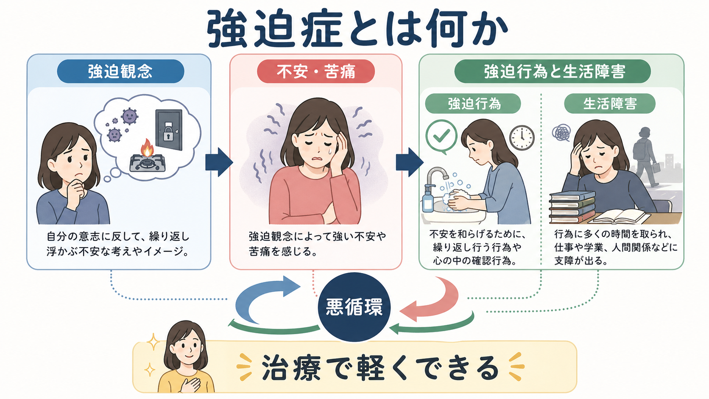
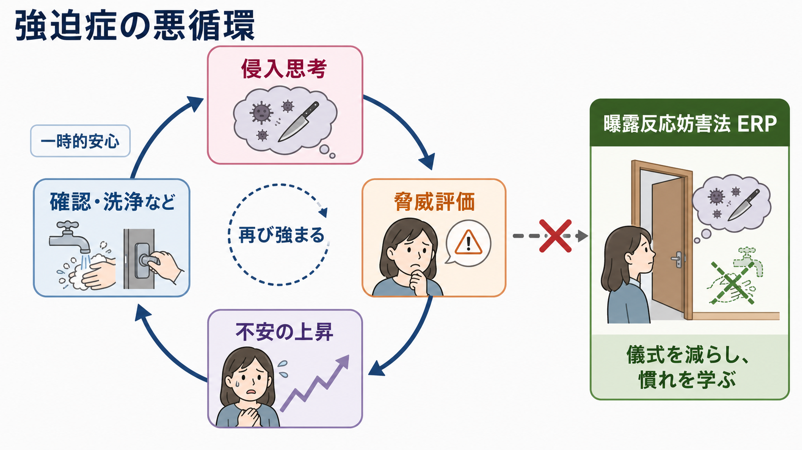
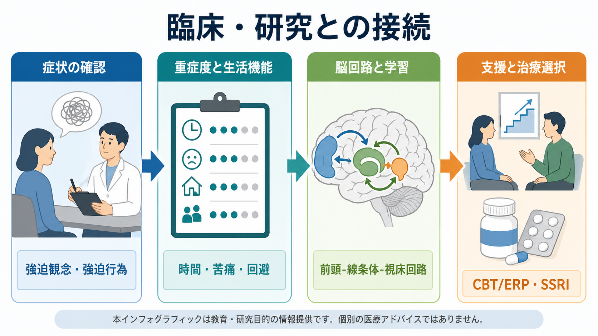

# 強迫症とは何か

## 要点

- 強迫症 obsessive-compulsive disorder: OCD は、望まない反復的な思考・イメージ・衝動である強迫観念と、不安や「不完全さ」を下げるために繰り返される強迫行為によって、苦痛や生活障害が生じる疾患である[1][2]。
- 診断上重要なのは、単に「心配性」「几帳面」「確認が多い」ことではなく、症状が時間を奪い、本人の意に反して続き、学業・仕事・家族生活・対人関係を妨げることである[1][2]。
- 強迫行為は一時的に安心をもたらすが、その安心が「確認すれば危険を避けられる」という学習を強め、次の強迫観念を起こしやすくする[3][6]。
- 神経科学では、前頭前野、線条体、視床を含む皮質-線条体-視床-皮質 cortico-striato-thalamo-cortical: CSTC 回路、認知制御、脅威評価、習慣学習の関与が重要視される[4][7]。
- 本記事は教育・研究目的の概説であり、個別の診断や治療指示ではない。症状で生活に支障がある場合は、医療者に相談して評価を受ける必要がある。

## この記事で答える問い

1. 強迫症は、通常の心配やこだわりと何が違うのか。
2. 強迫観念と強迫行為は、どのように悪循環をつくるのか。
3. 診断・評価では、何を見ればよいのか。
4. 神経回路、認知行動モデル、治療研究はどのようにつながるのか。

## まず結論

強迫症は、「不安な考えがある疾患」だけではない。より正確には、侵入的な思考やイメージに対して、脅威・責任・不完全さが過大に評価され、それを中和する行為や確認が短期的な安心を生み、長期的には症状を固定化する疾患である[1][6]。

たとえば「鍵を閉め忘れたかもしれない」という考えは多くの人に生じる。しかし強迫症では、その考えが本人にとって望まないものとして反復し、「確認しなければ大変なことになる」という切迫感を伴い、確認をやめにくくなり、生活時間や行動範囲が狭まる[1][2]。この点で、[[強迫観念とは何か]]、[[強迫行為とは何か]]、[[強迫的疑念とは何か]]は、強迫症を理解するための中核症候である。

## 背景

ICD-11では、強迫症は「強迫症または関連症群」に位置づけられる。強迫観念は、反復的・持続的で、侵入的かつ望まない思考、イメージ、衝動として体験される。強迫行為は、強迫観念への反応、厳格な規則、または「完全である」という感覚を得るために行われる反復行動または心的行為である[1]。

NIMHも、OCDを制御しにくい反復的思考、反復的で過剰な行動、またはその両方によって特徴づけられる疾患と説明している。症状はしばしば時間を消費し、強い苦痛を生み、日常生活への参加を妨げる[2]。

疫学的には、米国の National Comorbidity Survey Replication による推定で、生涯有病率は2.3%、12か月有病率は1.2%と報告された。一方で、強迫観念や強迫行為に似た体験は一般人口にも広く見られ、疾患としての強迫症は、頻度・苦痛・機能障害・抵抗困難性によって区別される[5]。

## 基本概念

### 強迫観念

強迫観念は、本人の意思に反して浮かび、しばしば不安、嫌悪、罪悪感、責任感を伴う思考・イメージ・衝動である[1][2]。代表的には、汚染への恐れ、加害への恐れ、確認への疑念、対称性や正確性へのこだわり、宗教的・性的・攻撃的内容の侵入思考などがある[4]。

重要なのは、内容の奇妙さだけで判断しないことである。臨床評価では、その考えがどれほど侵入的で望まないものか、どの程度確信されているか、どのような中和行動を誘発するか、生活機能をどれほど妨げるかを確認する[1]。

### 強迫行為

強迫行為は、不安、嫌悪、不完全感、責任感を下げるために行われる反復行動または心的行為である[1]。手洗い、確認、数える、並べる、祈る、言葉を心の中で反復する、過去の記憶を何度も点検する、 reassurance seeking と呼ばれる安心確認などが含まれる。

強迫行為は快楽を得るための行動というより、苦痛を一時的に下げる行動として理解しやすい。短期的には合理的に見えることもあるが、長期的には「やらなければ危険」「完全に安心できるまで終われない」という学習を強める[3][6]。

### 生活障害

ICD-11では、強迫観念や強迫行為が時間を消費する、または個人・家族・社会・教育・職業などの重要領域に有意な苦痛や障害をもたらすことが診断上重視される[1]。このため評価では、症状の内容だけでなく、1日に費やす時間、回避、遅刻、学業・仕事への影響、家族の巻き込まれ、疲労、睡眠、併存症を確認する。これは[[精神科で生活機能をどう評価するか]]や[[併存症とは何か]]と直接関係する。

## 仕組み

### 悪循環モデル

強迫症の中心には、次のような循環がある。

| 段階 | 起こること | 維持されやすい学習 |
|---|---|---|
| 侵入思考 | 「汚れたかもしれない」「傷つけたかもしれない」などが浮かぶ | 考えが浮かぶこと自体を危険視する |
| 脅威評価 | 責任、危険、罪悪感、不完全さを強く見積もる | 「自分が防がなければならない」と感じる |
| 不安の上昇 | 身体緊張、嫌悪、焦燥、確信の揺らぎが強まる | 不安を下げる行動を探す |
| 強迫行為 | 洗浄、確認、数える、祈る、回避、安心確認を行う | 行為で一時的に安心する |
| 再強化 | 安心が短く続くが、次回も同じ行為に頼りやすくなる | 強迫観念と強迫行為の結びつきが強まる |

Salkovskisの認知行動モデルでは、侵入思考そのものよりも、それを「重大な責任」「危険の兆候」「許されない考え」と評価する過程が中和行動を誘発し、症状を維持すると考える[6]。この見方は、ERPを含む認知行動療法の理論的基盤にもなる[3]。

### 神経回路モデル

神経科学では、強迫症は単一の脳部位の障害というより、前頭前野、眼窩前頭皮質、前部帯状皮質、線条体、視床を含むCSTC回路の調整異常として研究されてきた[4][7]。この回路は、誤り検出、脅威評価、行動選択、習慣化、反応抑制に関わる。

ただし、脳回路モデルは「脳のこの場所が壊れている」という単純な説明ではない。症状のテーマ、発症年齢、チックの併存、認知制御、習慣学習、薬物療法や心理療法への反応などが重なり合うため、強迫症は異質性の高い疾患として扱う必要がある[4][8]。詳しくは[[強迫症では皮質線条体視床回路に何が起きているのか]]と接続できる。

## 図解

| 図 | 読み方 |
|---|---|
| 図1 | 強迫観念、不安・苦痛、強迫行為、生活障害、治療可能性を全体像として見る |
| 図2 | 侵入思考から脅威評価、不安、強迫行為、一時的安心、再強化へ進む悪循環を見る |
| 図3 | 臨床評価、生活機能、脳回路・学習、支援・治療選択を接続して見る |

## 臨床・研究との接続

### 評価で見ること

強迫症の評価では、[[精神科診断は何のためにあるのか]]で扱うように、ラベルを付けること自体が目的ではない。症状の形式、苦痛、生活障害、除外診断、併存症、支援ニーズを整理し、本人が何に困っているのかを共有することが目的である。

実際には、次の観点を確認する。

- 強迫観念の内容: 汚染、確認、加害、対称性、禁忌的思考、ためこみなど。
- 強迫行為の形式: 洗浄、確認、反復、数える、祈る、安心確認、回避。
- 重症度: 時間消費、苦痛、抵抗困難性、生活機能、家族の巻き込まれ。
- 洞察: 「過剰かもしれない」と思えるか、確信がどの程度固定しているか[1]。
- 鑑別: うつ病性反すう、全般不安、妄想、チック、自閉スペクトラム症、物質・身体疾患による症状など[1]。

このため、[[精神科診断における除外診断とは何か]]、[[精神科診断面接で尺度をどう使うか]]、[[DSMとICDは何が違うのか]]は関連が深い。

### 治療研究との接続

NICEは、強迫症に対する介入として、CBT、特に曝露反応妨害法 exposure and response prevention: ERP、およびSSRIを重症度や本人の希望に応じて位置づけている[3]。ERPでは、不安を誘発する状況に段階的に接近し、通常の強迫行為を行わずに過ごすことで、「強迫行為をしなくても不安は変化する」「予測した危険は必ずしも起きない」という学習を促す[3][6]。

薬物療法ではSSRIが中核的選択肢として扱われるが、個別の薬剤選択、併存症、年齢、副作用、妊娠可能性、他剤との相互作用などは専門的評価が必要である[3][8]。この記事では治療選択を指示せず、研究と概念理解の接続に限定する。セロトニン系の理解は[[セロトニンは気分だけに関わるのか]]とも関連する。

### 心理教育との接続

[[心理教育とは何か]]の観点では、強迫症を「性格の問題」や「意志の弱さ」として説明しないことが重要である。本人は強迫行為を好きで行っているのではなく、苦痛を下げるために行っていることが多い。症状を責めるより、強迫観念、脅威評価、強迫行為、回避、家族の巻き込まれという循環を共同で見える化する方が、支援につながりやすい。

## よくある誤解

### 誤解1: きれい好きなら強迫症である

きれい好き、几帳面、慎重さだけでは強迫症とはいえない。問題になるのは、本人の意に反してやめにくく、時間を奪い、苦痛や機能障害をもたらす場合である[1][5]。

### 誤解2: 強迫観念は本人の本心である

多くの強迫観念は、本人にとって望まない侵入思考として体験される。加害や禁忌的内容の強迫観念は、内容だけを見ると危険な意図に見えることがあるが、臨床評価では、その考えへの嫌悪、抵抗、回避、確認行為、確信度、現実検討を分けて見る必要がある[1][2]。

### 誤解3: 強迫行為をやめればすぐ治る

強迫行為は症状を維持する要因になりうるが、単に「やめなさい」と言っても、本人の不安や責任感は強まりやすい。ERPやCBTでは、段階づけ、本人の理解、治療同盟、安全評価を踏まえて介入する[3][6]。

### 誤解4: 強迫症はまれで特殊な疾患である

診断基準を満たす強迫症の有病率は高くはないが、強迫観念や強迫行為に似た体験は一般人口にも見られる[5]。したがって、疾患としての強迫症を理解するには、症状の有無だけでなく、苦痛、時間、機能障害、併存症、洞察を合わせて評価する必要がある。

## 関連ノート

既存ノート:

- [[強迫観念とは何か]]
- [[強迫行為とは何か]]
- [[強迫的疑念とは何か]]
- [[強迫症では皮質線条体視床回路に何が起きているのか]]
- [[精神科診断は何のためにあるのか]]
- [[精神科診断における除外診断とは何か]]
- [[精神科で生活機能をどう評価するか]]
- [[精神科診断面接で尺度をどう使うか]]
- [[併存症とは何か]]
- [[心理教育とは何か]]
- [[DSMとICDは何が違うのか]]

今後の作成候補:

- 曝露反応妨害法ERPとは何か
- 強迫症の重症度評価Y-BOCSとは何か
- 強迫症とチック症はどう関係するのか
- 強迫症と加害強迫をどう理解するか
- 強迫症における家族の巻き込まれとは何か

MOC更新候補:

- `content/00_MOC/` 配下の精神医学MOCに、疾患・症候群ノートとして追加する。
- 神経科学MOC側では、[[強迫症では皮質線条体視床回路に何が起きているのか]]との相互参照を整理する。

## 理解チェック

1. 通常の心配や確認と、強迫症の強迫観念・強迫行為を分ける評価軸は何か。
2. 強迫行為が一時的安心をもたらすのに、長期的には症状を維持しやすい理由は何か。
3. 強迫症をCSTC回路だけで説明しきれない理由は何か。
4. ERPで「曝露」だけでなく「反応妨害」が重要になるのはなぜか。
5. 強迫観念の内容を、本人の意図や危険性と直結させてはいけない理由は何か。

## 参考文献

[1] World Health Organization. (2026). *ICD-11 for Mortality and Morbidity Statistics: 6B20 Obsessive-compulsive disorder*. https://icd.who.int/browse/2026-01/mms/en#1582741816

[2] National Institute of Mental Health. (2024). *Obsessive-Compulsive Disorder (OCD)*. Last reviewed December 2024. https://www.nimh.nih.gov/health/topics/obsessive-compulsive-disorder-ocd

[3] National Institute for Health and Care Excellence. (2005, last reviewed 2024). *Obsessive-compulsive disorder and body dysmorphic disorder: treatment* (Clinical guideline CG31). https://www.nice.org.uk/guidance/cg31

[4] Stein, D. J., Costa, D. L. C., Lochner, C., Miguel, E. C., Reddy, Y. C. J., Shavitt, R. G., van den Heuvel, O. A., & Simpson, H. B. (2019). Obsessive-compulsive disorder. *Nature Reviews Disease Primers, 5*, 52. https://doi.org/10.1038/s41572-019-0102-3

[5] Ruscio, A. M., Stein, D. J., Chiu, W. T., & Kessler, R. C. (2010). The epidemiology of obsessive-compulsive disorder in the National Comorbidity Survey Replication. *Molecular Psychiatry, 15*, 53-63. https://doi.org/10.1038/mp.2008.94

[6] Salkovskis, P. M. (1985). Obsessional-compulsive problems: A cognitive-behavioural analysis. *Behaviour Research and Therapy, 23*(5), 571-583. https://doi.org/10.1016/0005-7967(85)90105-6

[7] Pauls, D. L., Abramovitch, A., Rauch, S. L., & Geller, D. A. (2014). Obsessive-compulsive disorder: An integrative genetic and neurobiological perspective. *Nature Reviews Neuroscience, 15*, 410-424. https://doi.org/10.1038/nrn3746

[8] Fineberg, N. A., Hollander, E., Pallanti, S., Walitza, S., Grünblatt, E., Dell'Osso, B. M., Albert, U., Geller, D. A., Brakoulias, V., Reddy, Y. C. J., Arumugham, S. S., Shavitt, R. G., Drummond, L., Grancini, B., De Carlo, V., Cinosi, E., Chamberlain, S. R., Ioannidis, K., Rodriguez, C. I., et al. (2020). Clinical advances in obsessive-compulsive disorder: A position statement by the International College of Obsessive-Compulsive Spectrum Disorders. *International Clinical Psychopharmacology, 35*(4), 173-193. https://doi.org/10.1097/YIC.0000000000000314
