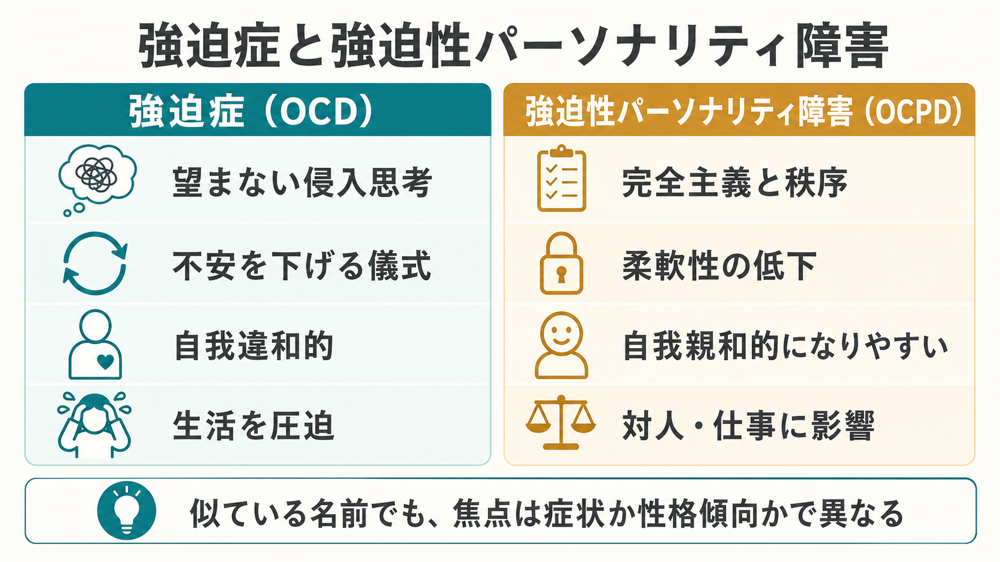
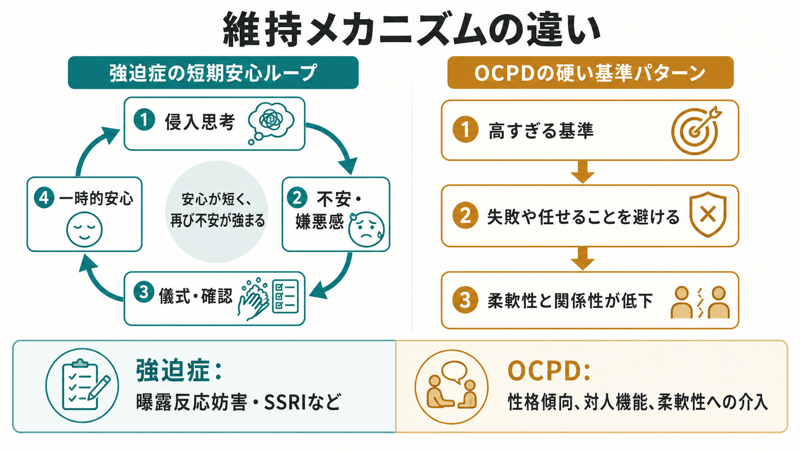
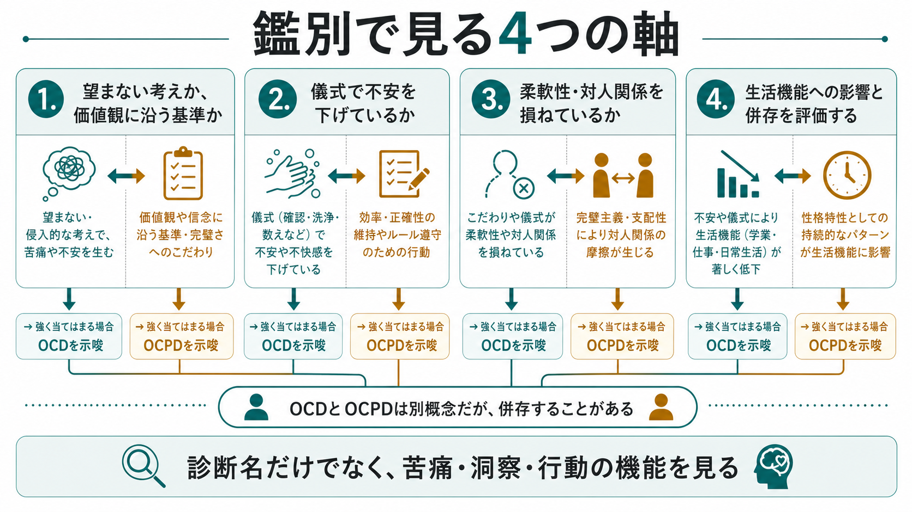

# 強迫症と強迫性パーソナリティ障害はどう違うのか

## 要点

- 強迫症 obsessive-compulsive disorder: OCD は、望まない侵入思考、イメージ、衝動と、それに伴う不安や不快感を下げるための強迫行為を中心に理解する[1][2]。
- 強迫性パーソナリティ障害 obsessive-compulsive personality disorder: OCPD は、秩序、完全主義、統制への持続的なこだわりが柔軟性、効率、対人関係を損なうパターンとして理解する[3][4]。
- 最も実用的な鑑別軸は、「本人にとって望まない症状か」「本人の価値観や自己像に沿う基準として体験されているか」である。ただし、洞察の程度は連続的で、OCDでも病識が乏しい場合がある[1][5]。
- 両者は名前が似ているが、片方は主に強迫観念・強迫行為の症候群、もう片方は性格傾向・対人機能・生活様式に関わるパーソナリティ病理である[3][6]。
- 併存することもあるため、「どちらか一方」と決めつけず、症状の機能、苦痛、洞察、生活機能、対人関係への影響を分けて評価する[5][7]。

## この記事で答える問い

1. 強迫症と強迫性パーソナリティ障害は、なぜ混同されやすいのか。
2. 自我違和的な強迫症状と、自我親和的になりやすい完全主義はどう違うのか。
3. 臨床評価では、どの質問が鑑別に役立つのか。
4. 両者が併存するとき、どのように考えればよいのか。

## まず結論

強迫症は、「こんなことを考えたくない」「確認をやめたいのにやめられない」という形で、本人にとって望まない侵入思考と儀式が苦痛になることが多い。たとえば、汚染への恐怖から長時間手を洗う、加害のイメージが浮かぶのを恐れて刃物を避ける、鍵や火元を何度も確認する、といった形で現れる[1][2]。

一方、強迫性パーソナリティ障害では、「正しく、きちんと、間違いなく進めるべきだ」という基準そのものが本人の価値観や自己像に組み込まれていることが多い。問題は、不安を下げる儀式だけではなく、完璧さ、秩序、統制へのこだわりが柔軟性、効率、任せる力、親密な関係を狭める点にある[3][4]。

ただし、「OCDは常に自我違和的、OCPDは常に自我親和的」と単純化しすぎると危ない。OCDでも洞察が乏しくなることがあり、OCPDでも自分の硬さに苦しむ人はいる。鑑別では、診断名よりも「その行動は何を避け、何を守り、どの機能を犠牲にしているのか」を見る。

## 背景

日本語では「強迫」という同じ語が入るため、強迫症と強迫性パーソナリティ障害はしばしば同じもののように扱われる。さらに、どちらにも確認、整頓、こだわり、完全主義、過剰な責任感、不確実性への弱さが関わることがあるため、表面の行動だけでは区別しにくい。

しかし、診断分類上は別の位置にある。DSM-5-TR では OCD は強迫症および関連症群に含まれ、OCPD はパーソナリティ障害に含まれる[5]。ICD-11 でも、OCD は 6B20 として強迫観念・強迫行為を中心に定義される一方、パーソナリティ病理では「anankastia」に相当する完全主義、秩序、情動・行動の制約、柔軟性低下が重要な特性として扱われる[2][4]。

この違いは、[[DSMとICDは何が違うのか|診断分類]]を覚えるためだけでなく、面接で何を聞くか、どの治療目標を立てるかに直結する。

## 基本概念

### 強迫症

強迫症では、強迫観念と強迫行為が中心になる。強迫観念は、反復的で持続的な思考、イメージ、衝動として現れ、本人にとって侵入的で望ましくなく、しばしば強い不安、嫌悪感、「完全でない」感覚を伴う[1][2]。強迫行為は、その不安や不快感を中和したり、恐れている事態を防いだりするために行われる反復行動や心の中の行為である[1][2]。

重要なのは、強迫行為が長期的な解決ではなく、短期的な安心を作る点である。確認すれば一瞬安心するが、「まだ見落としているかもしれない」という疑いが戻る。洗浄すれば一時的に清潔感が得られるが、汚染への注意がさらに鋭くなる。この構造は、[[MSEで思考内容をどう評価するか|強迫観念の評価]]でも重要である。

### 強迫性パーソナリティ障害

強迫性パーソナリティ障害では、秩序、完全主義、自己や他者の統制への広範で持続的なこだわりが問題になる[3][4]。細部、規則、予定、リストへの没頭、完璧さを求めるあまり作業が完了しないこと、仕事や生産性への過度な没頭、道徳や価値への硬さ、任せることの難しさなどが典型的に挙げられる[3][5]。

ここでの「強迫性」は、必ずしも侵入思考と儀式を意味しない。むしろ、本人が「これが正しい」「このやり方でなければならない」と感じやすい持続的な基準の硬さである。周囲から見ると融通が利かない、任せられない、細部にこだわりすぎる、休めない、関係がぎくしゃくする、と見えることがある。

### 自我違和性と自我親和性

自我違和的とは、その体験が本人の価値観や自己像に反しており、「自分らしくない」「嫌なのに浮かぶ」「やめたいのにやめられない」と感じられることを指す。OCDの強迫観念はこの形をとることが多い[6]。

自我親和的とは、その考えや行動が本人の価値観、理想、自己像と合っているように感じられることを指す。OCPDの完全主義や秩序へのこだわりは、この形をとることが多い[4][6]。

ただし、この軸は補助線であり絶対的な境界ではない。[[病識とは何か|病識]]が低いOCDでは、強迫観念や儀式がかなり正当だと感じられることがある。逆に、OCPDの人が自分の硬さや対人摩擦に苦しみ、変わりたいと感じることもある。

## 仕組み

OCDの維持には、侵入思考、不安、儀式、一時的安心のループが関わる。侵入思考そのものは一般人口でも起こりうるが、それを危険な意味として解釈し、責任を過大に感じ、不確実性を許容できなくなると、確認や洗浄などの行為で中和したくなる[2][6]。その行為は短期的には不安を下げるため、次の不安でも同じ行為が選ばれやすくなる。

OCPDでは、同じ「完全にしたい」という言葉でも、機能が異なる。中心にあるのは、失敗、曖昧さ、他者に任せること、予定外の変化への耐えにくさである。高すぎる基準は、短期的には失敗を避け、統制感を守る。しかし長期的には、作業の遅延、燃え尽き、対人摩擦、楽しみや休息の削減を招きやすい[3][4]。

### 比較表

| 観点 | 強迫症 OCD | 強迫性パーソナリティ障害 OCPD |
|---|---|---|
| 中心 | 強迫観念、強迫行為 | 完全主義、秩序、統制、柔軟性低下 |
| 体験のされ方 | 望まない、侵入的、自我違和的になりやすい | 正しい基準、自己像に沿うものとして体験されやすい |
| 行動の機能 | 不安・嫌悪感・不完全感を下げる | 失敗を避け、秩序や統制を保つ |
| 時間的特徴 | 症状として増減し、誘因で悪化しうる | 成人早期から持続する性格パターンとして現れやすい |
| 対人影響 | 回避、巻き込み、安心確認など | 任せられない、批判的、融通が利かない、親密さが損なわれる |
| 代表的介入 | CBT、とくに曝露反応妨害、SSRI、クロミプラミンなど[1][8] | 精神療法、CBT的介入、対人機能・柔軟性への介入。ただし治療研究はOCDより限定的[3][4] |

## 図解

図の4軸は、面接での質問に置き換えられる。

1. その考えは「本当は考えたくないもの」か、それとも「こうあるべき」という基準か。
2. その行動は、不安や嫌悪感を下げるために繰り返されているか。
3. 完全主義や秩序へのこだわりが、柔軟性、任せる力、対人関係を損ねているか。
4. 生活機能への影響、苦痛、洞察、併存症をどう評価できるか。

## 臨床・研究との接続

臨床的には、OCDを「几帳面な性格」と見なすと、本人が苦しんでいる侵入思考や儀式を見落とす。とくに加害強迫、性的・宗教的タブー、確認強迫は、本人が話しにくく、[[MSEで思考内容をどう評価するか|思考内容の評価]]で丁寧に区別する必要がある。

逆に、OCPDを「強迫症状」とだけ見なすと、対人関係、仕事の任せ方、休息の取りにくさ、価値観の硬さが見えにくくなる。OCPDの中心は、単発の確認行為ではなく、生活全体に広がる持続的なパターンである[3][4]。

治療研究では、OCDについては曝露反応妨害を含むCBT、SSRI、クロミプラミンが主要な選択肢として確立している[1][8]。一方、OCPDについては、心理療法、とくに認知行動的アプローチが検討されているが、OCDほど治療研究は豊富ではない[4]。したがって、OCPDでは「症状を消す」というより、硬い基準がどの場面で役立ち、どの場面で生活や関係を狭めているかを共同で検討する姿勢が重要になる。

併存も重要である。OCDの人にOCPD特性があると、対称性、秩序、ためこみ、確認などの症状次元や治療関係に影響する可能性がある[7]。この点は、[[身体醜形症とは何か]]や[[ためこみ症とは何か]]のような強迫症関連症群を読むときにも役立つ。

## よくある誤解

### 誤解1: きれい好きならOCDである

きれい好き、几帳面、予定好きであること自体はOCDではない。OCDでは、望まない侵入思考や不安を下げるための儀式が時間を奪い、苦痛や機能障害を生むことが診断上重要になる[1][2]。日常の好みと臨床的な強迫症状は分けて考える。

### 誤解2: 完全主義なら必ずOCPDである

完全主義は、学業、仕事、芸術、研究などで役立つこともある。OCPDとして問題になるのは、完全主義が柔軟性、効率、親密さ、休息、他者への信頼を持続的に損なう場合である[3][4]。

### 誤解3: OCDの人は自分の症状がおかしいと必ず分かっている

多くのOCDでは症状が自我違和的に体験されるが、洞察は良好から乏しいものまで幅がある[1][2]。本人が「本当に危険かもしれない」と強く感じている場合でも、他の精神病症状や妄想性障害と短絡的に同一視せず、強迫観念と強迫行為の関係を評価する。

### 誤解4: OCPDは本人が困っていないから臨床的問題ではない

OCPDの特性は本人には正当な基準として感じられやすいが、仕事の遅延、対人摩擦、孤立、抑うつ、不安、家族の負担として現れることがある[3][4]。本人の主観的苦痛だけでなく、生活機能と関係性を含めて見る。

### 誤解5: 両者は併存しない

OCDとOCPDは別概念だが、併存しうる[1][7]。併存する場合は、侵入思考と儀式のループだけでなく、硬い基準や任せられなさが治療計画や生活再建にどう影響しているかも評価する。

## 関連ノート

- [[MSEで思考内容をどう評価するか]]
- [[DSMとICDは何が違うのか]]
- [[病識とは何か]]
- [[身体醜形症とは何か]]
- [[ためこみ症とは何か]]
- [[うつ病とは何か]]

今後の作成候補: 強迫症とは何か、強迫観念とは何か、強迫行為とは何か、曝露反応妨害とは何か、強迫性パーソナリティ障害とは何か、完全主義とは何か、パーソナリティ障害とは何か。

MOC更新候補: `content/00_MOC/MOC｜精神医学.md`、`content/00_MOC/MOC｜症候学.md`、`content/00_MOC/MOC｜臨床実践・治療.md`。並列編集の衝突を避けるため、本記事からは更新しない。

## 理解チェック

1. 「鍵を確認しないと火事になる気がして、30分以上確認を続ける」という訴えでは、何がOCDを示唆するか。
2. 「自分のやり方でなければ仕事を任せられず、締切より細部の完璧さを優先してしまう」という訴えでは、何がOCPDを示唆するか。
3. 自我違和的と自我親和的の違いを、自分の言葉で説明できるか。
4. OCDとOCPDが併存する場合、症状評価と対人機能評価をどう分けるか。

## 未解決問題

- OCPDの治療研究はOCDに比べて少なく、どの介入要素がどの特性に効くのかは十分に確立していない。
- 自我違和性・自我親和性は便利な軸だが、洞察や文化的価値観、職業的役割によって見え方が変わる。
- 完全主義、不確実性への不耐性、責任感の過大評価など、OCDとOCPDにまたがる認知特性をどこまで共通因子として扱うかは議論が残る。

## 参考文献

[1] Phillips, K. A., & Stein, D. J. (2026). *Obsessive-Compulsive Disorder (OCD).* Merck Manual Professional Edition. https://www.merckmanuals.com/professional/psychiatric-disorders/obsessive-compulsive-and-related-disorders/obsessive-compulsive-disorder-ocd

[2] World Health Organization. (2026). *ICD-11 for Mortality and Morbidity Statistics: 6B20 Obsessive-compulsive disorder.* https://icd.who.int/browse/2026-01/mms/en#1582741816

[3] Zimmerman, M. (2026). *Obsessive-Compulsive Personality Disorder (OCPD).* Merck Manual Professional Edition. https://www.merckmanuals.com/professional/psychiatric-disorders/personality-disorders/obsessive-compulsive-personality-disorder-ocpd

[4] Pinto, A., Teller, J., & Wheaton, M. G. (2022). Obsessive-Compulsive Personality Disorder: A Review of Symptomatology, Impact on Functioning, and Treatment. *Focus, 20*(4), 389-396. https://doi.org/10.1176/appi.focus.20220058

[5] American Psychiatric Association. (2022). *Diagnostic and Statistical Manual of Mental Disorders, Fifth Edition, Text Revision (DSM-5-TR).* American Psychiatric Association Publishing. https://www.appi.org/Products/DSM-Library/Diagnostic-and-Statistical-Manual-of-Mental-Disorde

[6] Stein, D. J., Costa, D. L. C., Lochner, C., et al. (2019). Obsessive-compulsive disorder. *Nature Reviews Disease Primers, 5*, 52. https://doi.org/10.1038/s41572-019-0102-3

[7] Coles, M. E., Pinto, A., Mancebo, M. C., Rasmussen, S. A., & Eisen, J. L. (2008). OCD with comorbid OCPD: A subtype of OCD? *Journal of Psychiatric Research, 42*(4), 289-296. https://doi.org/10.1016/j.jpsychires.2006.12.009

[8] National Institute for Health and Care Excellence. (2005, last reviewed 2024). *Obsessive-compulsive disorder and body dysmorphic disorder: treatment. Clinical guideline CG31.* https://www.nice.org.uk/guidance/cg31
