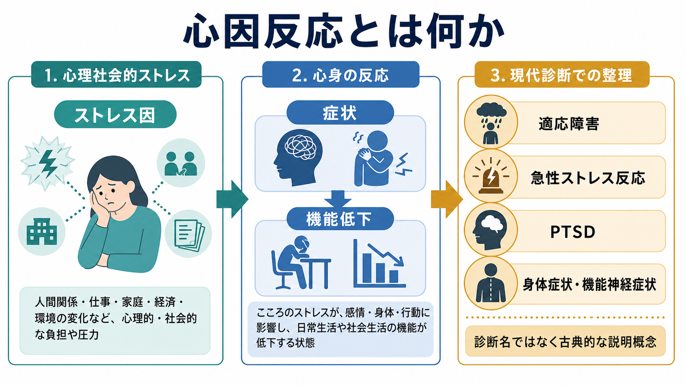
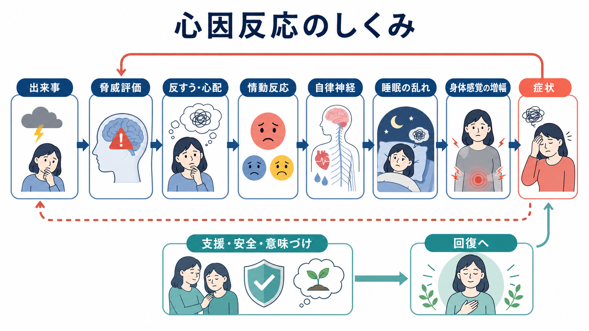
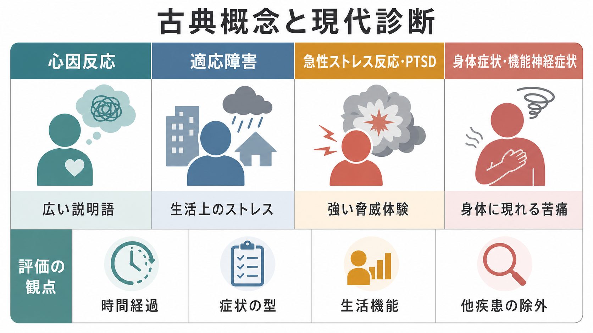

# 心因反応とは何か

## 要点

- 心因反応とは、心理社会的ストレスや葛藤に反応して、気分・不安・行動・身体感覚・意識や記憶の変化などが現れる状態を説明する古典的な言い方である。
- 現代の DSM-5-TR や ICD-11 では、「心因反応」という単一の正式診断名でまとめるより、[[適応障害とは何か]]、[[急性ストレス障害とは何か]]、[[PTSDとは何か]]、[[身体症状症とは何か]]、機能神経症状などへ症状型・時間経過・機能障害に応じて整理する[1][2][3]。
- 「心因性」は「気のせい」「作っている」という意味ではない。心理的負荷、注意、予測、情動、自律神経、身体感覚、社会的文脈が相互作用し、本人にとって実在する苦痛や機能低下として現れる[4][5][6]。
- 医療・研究では、原因を心理だけに還元せず、身体疾患、物質・薬剤、神経疾患、うつ病、不安症、トラウマ関連症状、社会的安全性を含めて評価する必要がある。

## この記事で答える問い

1. 「心因反応」は現在の診断名なのか、それとも説明概念なのか。
2. 心理的ストレスは、どのように気分・身体・行動の症状へつながるのか。
3. 適応障害、急性ストレス反応・急性ストレス障害、PTSD、身体症状症、機能神経症状とはどう関係するのか。
4. 「心因性」と言うとき、どのような誤解を避けるべきか。

## まず結論

心因反応は、現在の診断分類で一対一に対応する病名というより、「心理的ストレスに反応して症状が生じているように見える」という臨床的な説明語である。昔は、急なショック、対人葛藤、職場や家庭の負荷、喪失、災害、事故などのあとに出る不安、抑うつ、混乱、身体症状、行動変化を広く「心因反応」と呼ぶことがあった。

しかし現代の精神医学では、もう少し細かく見る。たとえば、明確な心理社会的ストレス因に対する不適応反応で、反すうや心配、機能低下が中心なら ICD-11 の適応障害に近い[1]。極度に脅威的・恐怖的な出来事の直後に、情動・身体・認知・行動症状が一過性に出るなら ICD-11 の急性ストレス反応として整理されることがある[3]。外傷体験後に再体験、回避、現在の脅威感が持続するなら PTSD の評価が必要になる[7]。身体症状が主で、その症状への過剰な心配や行動が生活を狭めるなら身体症状症の枠組みが参考になる[5]。

したがって「心因反応とは何か」と問うときの答えは、「心理的ストレスと症状の関係を示す入口の言葉だが、最終的には症状の型、時間経過、重症度、機能障害、身体疾患の有無に沿って具体化する概念」である。

## 背景

「心因」という言葉は、症状の背景に心理的要因が関与しているという見立てを含む。歴史的には、精神的ショック後の混乱、失神様症状、身体症状、情動爆発、抑うつ、不安などを、身体疾患だけでは説明しにくい反応としてまとめて扱う場面があった。

ただし、この言葉には弱点もある。第一に、心理的原因が単独で症状を作るかのように聞こえやすい。第二に、本人の意志や性格の問題だと誤解されやすい。第三に、身体疾患や神経疾患の評価を省略してよいかのような印象を与えうる。現在の診断分類が、適応障害、PTSD、身体症状症、機能神経症状などを分けて扱うのは、こうした曖昧さを減らすためでもある[1][2][5][6]。

一方で、「心因反応」という語が完全に無意味になったわけではない。本人の困りごとが、ストレス因、意味づけ、身体反応、対人環境、生活機能の変化と結びついていることを、診断名の前段階で大まかに把握するには役に立つ。大切なのは、この語を最終診断の代わりにしないことである。

## 基本概念

### 心因反応は「病名」より「見立ての入口」

心因反応は、DSM-5-TR や ICD-11 の主要診断名としてそのまま置かれているわけではない。DSM-5-TR では、ストレスやトラウマとの関連が明示される群として、PTSD、急性ストレス障害、適応障害、遷延性悲嘆症などが整理されている[2]。ICD-11 でも、適応障害、PTSD、複雑性 PTSD、遷延性悲嘆症などが「ストレス関連症群」として扱われ、急性ストレス反応は精神疾患というより強い脅威体験への一過性反応として位置づけられる[1][3][7]。

このため、記事や会話で「心因反応」と言う場合は、次のように読むと誤解が少ない。

- 何らかの心理社会的ストレス因がある。
- 症状は気分、不安、行動、身体、認知、意識・記憶など複数の領域に出うる。
- 症状は本人にとって実在し、生活機能を下げることがある。
- ただし、どの診断枠に入るかは別途評価する。

### ストレス因とストレス反応を分ける

厚生労働省委託事業「こころの耳」では、ストレスを、ストレス刺激となるものと、それを受けて生体に生じる反応に分けて考える説明がなされている[8]。この区別は心因反応を理解するうえで重要である。

同じ出来事でも、誰にとっても同じ反応になるわけではない。出来事の強さだけでなく、予測可能性、逃げ場の有無、社会的支援、過去の体験、睡眠、身体状態、現在の責任や役割が反応を変える。心因反応とは、「出来事そのもの」ではなく、「出来事がその人の心身の調整をどのように揺さぶったか」を見る概念である。

## 仕組み

心因反応を一つの直線的な因果で説明するのは粗すぎる。実際には、少なくとも次の過程が重なり合う。

1. 出来事を「危険」「失敗」「拒絶」「喪失」「逃げられない状況」と評価する。
2. 注意が脅威や身体感覚に固定され、反すうや心配が増える。
3. 自律神経・内分泌・睡眠覚醒リズムが変化し、動悸、息苦しさ、胃腸症状、疲労、痛み、過覚醒が出やすくなる。
4. 症状への不安や回避が強まると、活動量や対人接触が減り、症状がさらに目立つ。
5. 安全、休息、支援、問題解決、意味づけの更新が得られると、反応は弱まりやすい。

この流れは、「心理が身体を一方的に動かす」という単純な話ではない。身体感覚が不安を強め、不安が身体感覚への注意を増やし、睡眠不足が情動調整を弱め、社会的孤立が回復の資源を減らす。心因反応は、心理、身体、行動、環境の循環として見る方が実態に近い。

機能神経症状でも同じ注意が必要である。近年の機能性神経症状・機能性神経障害のレビューでは、かつて「心因性」と呼ばれた症状であっても、心理的ストレスの存在だけで診断するのではなく、症状の内部不一致性や既知の神経疾患との不一致など、陽性所見に基づく評価が重視される[6]。つまり「ストレスがあるから心因性」と短絡してはいけない。

## 図解

次の図は、「心因反応」という広い説明語を、現代診断でどのように分けて考えるかをまとめたものである。

| 観点 | 心因反応という古典的説明 | 現代的に確認すること |
|---|---|---|
| きっかけ | 心理社会的ストレス、葛藤、喪失、ショック | ストレス因の種類、強度、持続、本人にとっての意味 |
| 時間経過 | 一過性から遷延まで幅広い | 数日、1か月以内、3か月以内、6か月以上など |
| 症状 | 不安、抑うつ、混乱、身体症状、行動変化 | PTSD、適応障害、身体症状症、解離症状、うつ病・不安症など |
| 評価 | 心理的背景を重視 | 身体疾患、神経疾患、薬剤、物質、睡眠、生活機能も確認 |
| 注意点 | 曖昧で便利な言葉 | 「気のせい」「詐病」と誤解しない |

## 臨床・研究との接続

### 臨床での使い方

臨床では、「心因反応かどうか」よりも、次の問いの方が実用的である。

- いつ、何のあとに始まったのか。
- 症状は気分、不安、身体、行動、意識・記憶、対人関係のどこに出ているのか。
- 学校、仕事、家事、対人関係、睡眠、食事、安全にどの程度影響しているのか。
- 身体疾患、神経疾患、薬剤、物質使用、睡眠不足、疼痛、発達特性は関与していないか。
- 危機介入が必要な自傷他害リスク、虐待、DV、災害、事故、職場ハラスメントなどはないか。

この見方を取ると、「心因だから身体の検査はいらない」「身体に異常がないから精神の問題だ」といった二分法を避けられる。症状が身体に出ている場合でも、身体評価と心理社会的評価は対立しない。

### 研究での使い方

研究では、「心因反応」という大きな箱のままでは測定が難しい。ストレス因、症状、機能障害、認知的評価、反すう、回避、身体感覚増幅、社会的支援、治療反応などへ分解する必要がある。

たとえば適応障害では、ICD-11 は心理社会的ストレス因への不適応反応、ストレス因へのとらわれ、適応の失敗、生活機能障害を重視する[1]。身体症状症では、身体症状そのものの医学的説明可能性よりも、症状に関連する過剰な思考・感情・行動と機能障害が重視される[5]。機能神経症状では、心理的説明よりも、症状の可変性や不一致性などの陽性所見を含む診断プロセスが重要になる[6]。

## よくある誤解

### 誤解1: 心因反応は「気のせい」である

違う。症状は本人にとって実在し、動悸、息苦しさ、痛み、脱力、めまい、不眠、涙もろさ、集中困難、回避などとして生活を制限しうる。心理的要因が関与することと、症状が本物でないことは別である。

### 誤解2: ストレス因が見つかれば診断は終わりである

違う。ストレス因は重要な情報だが、診断を決めるには症状の型、時間経過、機能障害、身体疾患や神経疾患の評価、併存する[[うつ病とは何か]]や[[不安症群とは何か]]、物質使用、睡眠の問題を確認する必要がある。

### 誤解3: 心因反応は軽い問題である

違う。一過性で自然に回復することもあるが、機能低下、自殺念慮、対人関係の破綻、職業・学業上の問題、身体症状の慢性化につながることもある。適応障害であっても、本人の苦痛と機能障害は軽視できない[4]。

### 誤解4: 現代診断では心因という視点は不要である

不要ではない。ただし、「心因」という一語で終えるのではなく、ストレス因、症状型、時間経過、身体・神経学的評価、社会的文脈、回復資源へ分解して考える必要がある。

## 関連ノート

- [[適応障害とは何か]]
- [[抑うつを伴う適応障害とは何か]]
- [[急性ストレス障害とは何か]]
- [[PTSDとは何か]]
- [[身体症状症とは何か]]
- [[身体症状症とうつ病はどう関係するのか]]
- [[解離症群とは何か]]
- [[不安症群とは何か]]
- [[パニック症とは何か]]
- [[うつ病とは何か]]

## MOC更新候補

- `content/00_MOC/` 配下の精神医学・ストレス関連症・症候群系 MOC に、バッチ統合時に `[[心因反応とは何か]]` を追加する候補。
- 並列ジョブとの衝突を避けるため、本タスクでは MOC ファイルは更新しない。

## 理解チェック

1. 「心因反応」は、現在の DSM-5-TR や ICD-11 でそのまま正式診断名として使われる概念だろうか。
2. 「心因性」と「症状を作っている」はなぜ同じ意味ではないのか。
3. 適応障害、急性ストレス反応・急性ストレス障害、PTSD、身体症状症を分けるとき、どのような観点を見る必要があるか。
4. 身体症状がある人に「ストレスですね」とだけ説明することには、どのようなリスクがあるか。

## 未解決問題

- 「心因反応」という語は臨床現場で直感的に通じやすい一方、本人の責任や詐病を連想させる危険があり、どのような説明語に置き換えるのが最も有益かは文脈依存である。
- ストレス関連症状、身体症状、機能神経症状、うつ病・不安症の境界は重なりが大きく、単一の因果モデルでは説明しにくい。
- 文化、職場制度、家族関係、社会的孤立などが「心因反応」と呼ばれる状態に与える影響を、個人内メカニズムだけでなく社会的水準で扱う必要がある。

## 参考文献

[1] World Health Organization. ICD-11 MMS: 6B43 Adjustment disorder. https://icd.who.int/browse/latest-release/mms/en#264310751

[2] American Psychiatric Association. *Diagnostic and Statistical Manual of Mental Disorders, Fifth Edition, Text Revision (DSM-5-TR).* American Psychiatric Association Publishing, 2022. https://www.appi.org/Products/DSM-Library/Diagnostic-and-Statistical-Manual-of-Mental-Disorders-DSM-5-TR

[3] World Health Organization. ICD-11 MMS: QE84 Acute stress reaction. https://icd.who.int/browse/latest-release/mms/en#505909942

[4] Merck Manual Professional Edition. Adjustment Disorders. Reviewed/Revised Aug 2023, Modified Jan 2026. https://www.merckmanuals.com/professional/psychiatric-disorders/anxiety-and-stressor-related-disorders/adjustment-disorders

[5] D'Souza RS, Hooten WM. Somatic Symptom Disorder. *StatPearls*. Updated 2023 Mar 13. https://www.ncbi.nlm.nih.gov/books/NBK532253/

[6] Stone J. Functional neurological symptoms. *Clinical Medicine*. 2013;13(1):80-83. https://pmc.ncbi.nlm.nih.gov/articles/PMC5873716/

[7] World Health Organization. ICD-11 MMS: 6B40 Post traumatic stress disorder. https://icd.who.int/browse/latest-release/mms/en#2070699808

[8] 厚生労働省委託事業「こころの耳」. ストレスに関してまとめたページ. https://web2.kokoro.mhlw.go.jp/stress/
