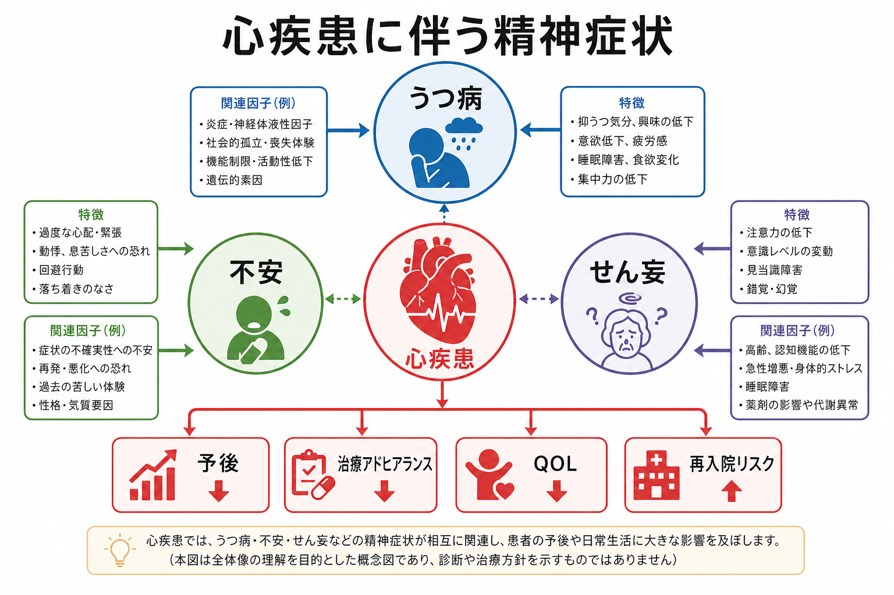
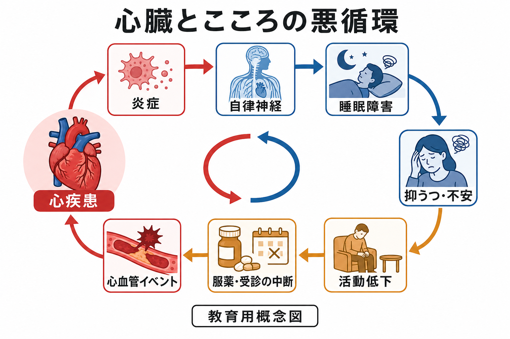
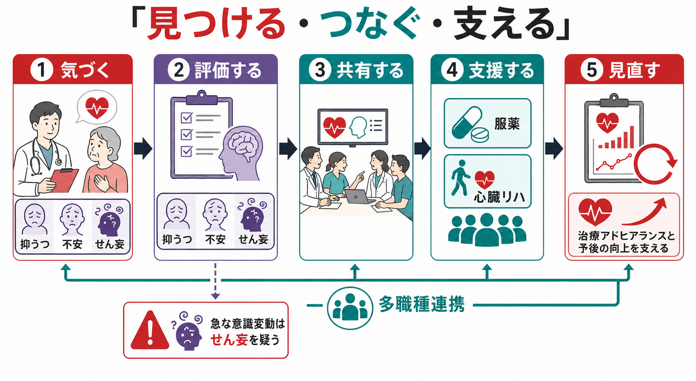

# 心疾患に伴う精神症状とは何か

## 要点

- 心疾患に伴う精神症状では、[[うつ病とは何か|うつ病]]、[[不安症群とは何か|不安]]、[[せん妄とは何か|せん妄]]が特に重要である。
- うつ病は冠動脈疾患患者で頻度が高く、心筋梗塞後や急性冠症候群後の死亡・再入院・QOL低下と関連するため、AHAは冠動脈疾患患者での評価と紹介・治療連携を推奨している[1][2]。
- 不安は胸部症状への過覚醒、再発恐怖、回避行動を通じて生活範囲を狭める。前向き研究のメタ解析では、不安が将来の冠動脈疾患や心臓死リスクと関連した[4]。
- せん妄は急性心不全、ICU、心臓手術後、低酸素、感染、薬剤、睡眠剥奪などで起こりやすく、見逃されやすい低活動型せん妄にも注意する[7][8]。
- 精神症状は単なる「反応」ではなく、服薬、受診、心臓リハビリ、食事・運動、禁煙などの[[アドヒアランスとは何か|治療アドヒアランス]]を介して予後に影響しうる[5][6]。

## この記事で答える問い

この記事では、次の問いに答える。

1. 心疾患では、どのような精神症状が問題になりやすいのか。
2. うつ病・不安・せん妄は、予後や治療アドヒアランスにどう関わるのか。
3. 心臓の病態、身体感覚、行動、医療システムをどのように一体として理解すればよいのか。

## まず結論

心疾患に伴う精神症状は、「心臓病になったから気分が落ち込む」という一方向の説明だけでは不十分である。心疾患は息切れ、胸痛、動悸、疲労、睡眠障害、入院、予後不安を生み、これが抑うつ・不安・せん妄を引き起こす。一方で、抑うつや不安は活動量、食事、禁煙、服薬、受診、心臓リハビリへの参加を低下させ、心血管リスク管理を難しくする[5][6]。

つまり、心疾患と精神症状は[[生物心理社会モデルとは何か|生物心理社会モデル]]で見る必要がある。炎症、自律神経、睡眠、認知、行動、社会的支援、医療アクセスが組み合わさり、予後と生活機能を左右する。

## 背景

心疾患には、冠動脈疾患、心筋梗塞後、狭心症、心不全、不整脈、弁膜症、心臓手術後などが含まれる。これらは生命予後に関わるだけでなく、身体感覚への注意、将来不安、生活制限、仕事や家族役割の変化を通じて精神症状を生じやすくする。

AHAの科学助言は、冠動脈疾患患者ではうつ病の評価、必要時の紹介、治療連携が重要であるとした[1]。その後のAHA声明は、急性冠症候群患者において、うつ病を予後不良のリスク因子として位置づける根拠があると整理している[2]。ESCのポジションペーパーも、うつ病と冠動脈疾患の関連を、神経内分泌、炎症、血小板機能、行動因子を含む多層的な問題として扱っている[3]。

## 基本概念

### うつ病

心疾患に伴ううつ病では、抑うつ気分だけでなく、興味の低下、疲労、睡眠障害、食欲変化、集中困難、罪責感、希死念慮が問題になる。ただし、心不全や心筋梗塞後の疲労・睡眠障害・食欲低下は身体疾患そのものでも起こるため、症状の時間経過、快感消失、認知内容、生活機能、自殺リスクを合わせて評価する。関連する鑑別として、[[身体疾患に伴う抑うつ症状とは何か]]や[[身体疾患による気分障害とは何か]]も参照できる。

### 不安

不安は、胸痛や動悸への過敏なモニタリング、再発・突然死への恐怖、運動や外出の回避、救急受診の反復として現れることがある。前向き研究のメタ解析では、不安が将来の冠動脈疾患発症や心臓死と関連した[4]。鑑別として、パニック発作、全般不安、病気不安、薬剤・カフェイン・甲状腺機能異常などを考える。

### せん妄

せん妄は、急性に出現し変動する注意・意識・認知の障害である。心疾患では、低酸素、循環不全、感染、腎機能障害、電解質異常、睡眠剥奪、鎮静薬・抗コリン薬、ICU環境、術後状態が誘因になる。低活動型では「静かで元気がない」ように見え、うつ病や認知症と誤認されやすい。[[ICUせん妄とは何か]]、[[周術期せん妄とは何か]]、[[せん妄と認知症はどう違うのか]]との接続が重要である。

## 仕組み

心疾患と精神症状をつなぐ経路は、少なくとも4つに分けられる。

| 経路 | 内容 | 臨床的な見え方 |
|---|---|---|
| 生物学的経路 | 炎症、HPA軸、[[自律神経ネットワークは内臓状態をどう制御するのか|自律神経]]、血小板活性、睡眠障害 | 疲労、動悸、睡眠不良、活動耐性低下 |
| 認知・情動経路 | 再発恐怖、身体感覚への過覚醒、破局的解釈 | 胸部不快感への強い不安、救急受診反復 |
| 行動経路 | 活動低下、服薬中断、受診中断、禁煙困難、心臓リハ不参加 | 二次予防が続かない、生活範囲が狭くなる |
| 社会的経路 | 孤立、仕事・役割喪失、経済的不安、家族負担 | QOL低下、支援要請の遅れ、治療中断 |

うつ病と冠動脈疾患の関連では、炎症や自律神経だけでなく、服薬・運動・禁煙・受診といった行動経路が重要である。慢性疾患全体のメタ解析では、うつ病がある患者は服薬非アドヒアランスと関連し、安定冠動脈疾患のメタ解析では良好な服薬アドヒアランスが死亡や心血管入院・心筋梗塞の低下と関連した[5][6]。

## 図解

心疾患に伴う精神症状は、次のように読むと理解しやすい。

1. 心疾患そのものが身体感覚、入院、予後不安、生活制限を生む。
2. その結果として、うつ病、不安、せん妄が生じる。
3. うつ病と不安は活動・受診・服薬・リハビリへの参加を下げる。
4. せん妄は急性期治療を複雑にし、入院期間や機能回復に影響する。
5. 多職種で評価・共有・支援・見直しを行うことで、精神症状と心疾患管理を同時に扱う。

## 臨床・研究との接続

### 評価の入口

臨床では、心疾患の診療中に次の変化を拾う。

- 以前より表情が乏しく、会話やリハビリへの参加が減った。
- 胸痛や動悸への不安が強く、医学的説明後も生活範囲が戻らない。
- 服薬、受診、食事、禁煙、運動の継続が難しくなった。
- 入院中に注意が続かない、夜間に混乱する、日内変動がある。
- 希死念慮、治療拒否、セルフケアの著しい低下がある。

### 支援の方向

支援は、精神症状だけを切り離して扱うよりも、心疾患管理の中に組み込む方が実用的である。たとえば、心理教育、服薬整理、心臓リハビリへの橋渡し、睡眠・疼痛・息切れの調整、家族への説明、身体疾患主治医と精神科・心理職・看護・薬剤師・リハビリ職の[[多職種連携は地域精神医療でなぜ重要なのか|多職種連携]]が含まれる。

せん妄では、原因検索と環境調整が中心になる。NICEは、入院・施設入所者でせん妄リスクを意識し、認知、見当識、脱水、感染、低酸素、疼痛、薬剤、睡眠、感覚障害、移動性などに注意することを推奨している[8]。

### 研究で見るべきアウトカム

研究では、抑うつ・不安の尺度得点だけでなく、死亡、心血管イベント、再入院、服薬アドヒアランス、心臓リハビリ参加、QOL、認知機能、医療利用を同時に見る必要がある。精神症状が直接予後を悪化させるのか、アドヒアランスや社会的支援を介して影響するのかは、研究デザインによって分けて考える。

## よくある誤解

### 「心疾患があるのだから、落ち込むのは当然で治療対象ではない」

病気への自然な反応と、治療対象となるうつ病・不安は連続している。生活機能、治療参加、自殺リスク、睡眠、食欲、集中、回復意欲に影響している場合は、評価と支援の対象になる。

### 「不安は心臓症状を大げさに訴えているだけである」

不安は身体感覚を増幅するが、心疾患の再発や増悪を否定してよいという意味ではない。まず医学的リスクを評価し、そのうえで不安、回避、過覚醒を扱う。

### 「せん妄は高齢者の認知症が進んだだけである」

せん妄は急性・変動性の注意障害で、原因検索と予防・環境調整の対象である。認知症はリスク因子になるが、せん妄そのものを見逃してよい理由にはならない。

### 「精神症状が良くなれば心血管予後も必ず改善する」

抑うつ・不安の改善はQOLや治療参加を助ける可能性があるが、心血管イベントの低下は介入内容、対象、重症度、アドヒアランス、身体疾患治療の質に左右される。予後改善を断定せず、心疾患治療と精神医療を同時に最適化する姿勢が必要である。

## 関連ノート

- [[うつ病とは何か]]
- [[不安症群とは何か]]
- [[せん妄とは何か]]
- [[ICUせん妄とは何か]]
- [[周術期せん妄とは何か]]
- [[アドヒアランスとは何か]]
- [[身体疾患に伴う抑うつ症状とは何か]]
- [[身体疾患に伴う不安症状とは何か]]
- [[身体合併症は精神科診療でなぜ重要なのか]]
- [[生物心理社会モデルとは何か]]

## MOC更新候補

- `content/00_MOC/` 配下の精神医学、リエゾン精神医学、身体疾患と精神症状に関するMOCへ追加候補。
- 並列生成ジョブとの競合を避けるため、本記事作成時点ではMOC本体は更新しない。

## 理解チェック

1. 心疾患に伴ううつ病が、治療アドヒアランスに影響しうる経路を2つ挙げる。
2. 胸痛・動悸を訴える患者で、不安と心疾患増悪をどのような順序で評価するべきか。
3. 低活動型せん妄がうつ病や認知症と誤認されやすい理由を説明する。
4. 心疾患患者の精神症状を、多職種連携の中で扱う利点を述べる。

## 未解決問題

- 抑うつ・不安への介入が、どの患者群で心血管イベント低下まで結びつくのかは、まだ一貫した結論が必要である。
- 心不全、不整脈、弁膜症、補助人工心臓、移植医療など、心疾患の種類ごとの精神症状プロファイルはさらに整理が必要である。
- デジタルヘルスや遠隔心臓リハビリが、抑うつ・不安・服薬アドヒアランスをどう改善するかは今後の研究課題である。

## 参考文献

[1] Lichtman JH, Bigger JT Jr, Blumenthal JA, et al. Depression and coronary heart disease: recommendations for screening, referral, and treatment: a science advisory from the American Heart Association. *Circulation*. 2008;118(17):1768-1775. https://doi.org/10.1161/CIRCULATIONAHA.108.190769

[2] Lichtman JH, Froelicher ES, Blumenthal JA, et al. Depression as a risk factor for poor prognosis among patients with acute coronary syndrome: systematic review and recommendations. *Circulation*. 2014;129(12):1350-1369. https://doi.org/10.1161/CIR.0000000000000019

[3] Vaccarino V, Badimon L, Bremner JD, et al. Depression and coronary heart disease: 2018 position paper of the ESC working group on coronary pathophysiology and microcirculation. *European Heart Journal*. 2020;41(17):1687-1696. https://doi.org/10.1093/eurheartj/ehy913

[4] Roest AM, Martens EJ, de Jonge P, Denollet J. Anxiety and risk of incident coronary heart disease: a meta-analysis. *Journal of the American College of Cardiology*. 2010;56(1):38-46. https://doi.org/10.1016/j.jacc.2010.03.034

[5] Grenard JL, Munjas BA, Adams JL, et al. Depression and medication adherence in the treatment of chronic diseases in the United States: a meta-analysis. *Journal of General Internal Medicine*. 2011;26(10):1175-1182. https://doi.org/10.1007/s11606-011-1704-y

[6] Du L, Cheng Z, Zhang Y, Li Y, Mei D. The impact of medication adherence on clinical outcomes of coronary artery disease: a meta-analysis. *European Journal of Preventive Cardiology*. 2017;24(9):962-970. https://doi.org/10.1177/2047487317695628

[7] Lin L, Zhang X, Xu S, et al. Outcomes of postoperative delirium in patients undergoing cardiac surgery: a systematic review and meta-analysis. *Frontiers in Cardiovascular Medicine*. 2022;9:884144. https://doi.org/10.3389/fcvm.2022.884144

[8] National Institute for Health and Care Excellence. *Delirium: prevention, diagnosis and management in hospital and long-term care*. NICE Clinical Guideline CG103. Updated 2023. https://www.nice.org.uk/guidance/CG103
