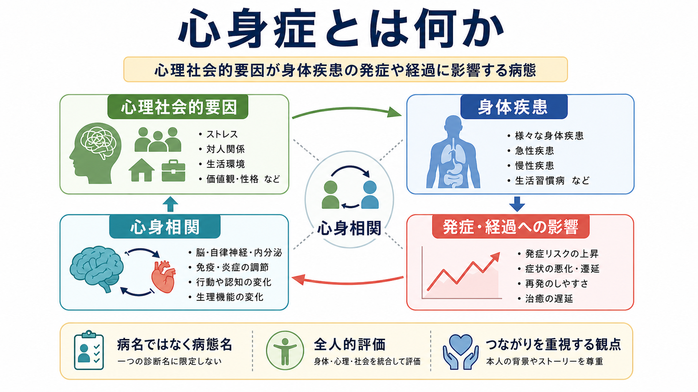
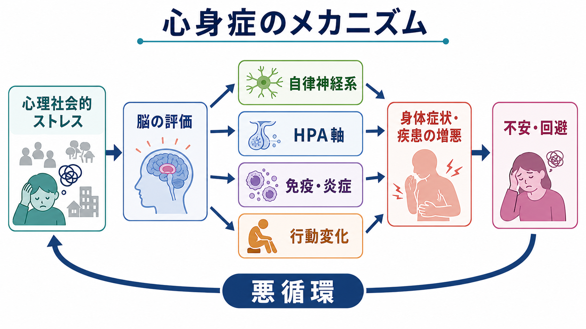
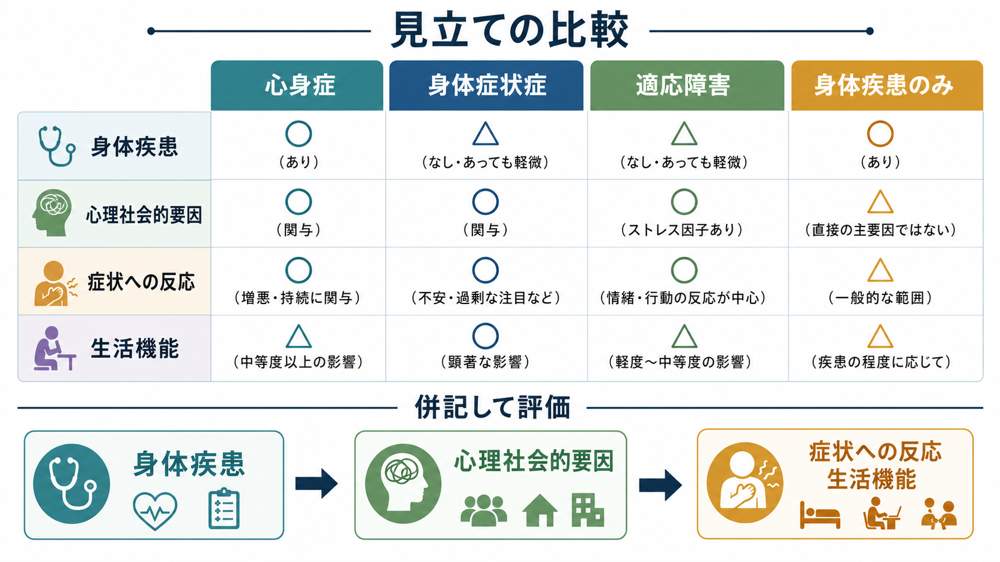

# 心身症とは何か

## 要点

- 心身症は、心理社会的要因が身体疾患の発症や経過に密接に関与し、器質的または機能的障害が認められる「病態名」であり、単一の独立した病名ではない[1][2]。
- 中心にあるのは「気のせいか、本物の病気か」という二分法ではなく、身体疾患、ストレス、情動、認知、行動、生活環境が相互に影響する生物心理社会モデル的な見立てである[3]。
- 現代の分類では、ICD-11の「他に分類される障害または疾患に影響する心理的・行動的要因」や、DSM-5-TRの「他の医学的疾患に影響する心理的要因」と重なる臨床的発想をもつ[4][5]。
- メカニズムとしては、心理社会的ストレスが脳の評価、自律神経系、[[HPA軸は精神疾患にどう関わるのか|HPA軸]]、免疫・炎症、睡眠や服薬行動などを介して身体疾患の経過を変える[6][7]。
- 教育・研究上は有用な概念だが、個別診断や治療指示は医療者による身体評価と心理社会的評価を統合して行う必要がある。

## この記事で答える問い

1. 心身症は、身体疾患、精神疾患、[[身体症状症とは何か]]とどう違うのか。
2. 心理社会的要因は、どのような経路で身体疾患の発症や経過に関わるのか。
3. 臨床と研究では、心身症をどのような視点で評価すればよいのか。

## まず結論

心身症とは、「心理的問題が身体症状に化けたもの」ではない。定義上は、まず身体疾患があり、その発症、増悪、遷延、治療反応、再発しやすさなどに心理社会的要因が密接に関与する病態を指す[1][2]。したがって、胃潰瘍、気管支喘息、高血圧、過敏性腸症候群、頭痛、慢性疼痛などの一部が、経過のなかで心身症として理解されうる。

重要なのは、心身症が「身体か心理か」を分けるラベルではない点である。身体疾患は身体疾患として評価し、同時に、ストレス、対人関係、生活リズム、情動、コーピング、受診行動、服薬行動、睡眠、活動量を評価する。ここで心理社会的要因は、原因のすべてではなく、発症準備因子、誘発因子、持続因子、増悪因子の一部として扱われる。

## 背景

日本の心身医学では、心身症は「身体疾患のなかで、その発症や経過に心理社会的因子が密接に関与し、器質的ないし機能的障害の認められる病態」と定義されることが多い[1][2]。この定義は、心身症を精神疾患名としてではなく、身体疾患の経過を理解するための臨床概念として位置づける。

この発想は、Engelが提案した生物心理社会モデルとも接続する。生物医学モデルだけでは、疾患の発症機序や検査所見を説明できても、症状の意味づけ、生活機能、受診行動、治療継続、家族や職場環境の影響を十分に扱いにくい。生物心理社会モデルは、身体過程、心理過程、社会環境を同じ臨床地図のなかで評価する枠組みを与える[3]。

一方で、心身症という語は誤解されやすい。「精神的なものだから身体疾患ではない」「検査で異常がなければ心身症」「本人の性格の問題」といった使い方は不適切である。心身症は、身体疾患の存在と心身相関の両方を見落とさないための概念であり、身体診療を省略するための言葉ではない。

## 基本概念

### 病名ではなく病態名

心身症は、糖尿病や気管支喘息のような単一疾患名ではなく、身体疾患のなかで心理社会的因子が経過に深く関与している状態を示す病態名である[1][2]。同じ「高血圧」でも、ストレス、睡眠不足、過労、服薬中断、対人葛藤、怒りの調節困難が血圧変動や受診行動に強く関わる場合と、そうでない場合がある。前者では「高血圧症（心身症）」のように、身体疾患名と心身医学的見立てを併記する発想になる。

### 身体症状症との違い

[[身体症状症とは何か]]では、身体症状そのものに加えて、症状への過度な思考、感情、行動が中心になる。身体疾患がある場合もない場合もありうる。これに対して心身症では、身体疾患の発症や経過に心理社会的要因がどう影響しているかが焦点になる。両者は重なりうるが、評価の主語が異なる。

### 適応障害やうつ病との違い

[[適応障害とは何か]]や[[うつ病とは何か]]では、心理的苦痛や気分症状が主たる臨床問題になる。心身症では、精神症状があっても、それだけで心身症とは呼ばない。たとえば、うつ病に伴う食欲低下、倦怠感、疼痛はうつ病の身体症状として理解される。一方、うつ病や不安が身体疾患の治療継続、活動量、睡眠、炎症、血圧、疼痛の悪循環に関与する場合には、身体疾患側の見立てとして心身医学的評価が必要になる。

## 仕組み

心身症の仕組みは、単一の「ストレスホルモン」で説明できるものではない。心理社会的ストレスは、脳が状況をどう評価するかによって、生理反応と行動反応に変換される。脅威、喪失、不公平、過重負荷、孤立、予測不能性が高い状況では、交感神経活動、HPA軸、睡眠覚醒、免疫・炎症反応、痛みの処理、消化管運動、内分泌代謝が変化しうる[6][7]。

### 自律神経系

自律神経系は、心拍、血圧、発汗、呼吸、消化管運動、内臓感覚を調整する。急性ストレスでは、交感神経優位の反応が適応的に働くことがある。しかし、過覚醒が長引いたり、休息に戻る力が弱まったりすると、動悸、息苦しさ、胃腸症状、疼痛、睡眠障害などの増悪因子になりうる。

### HPA軸とアロスタティック負荷

HPA軸は、ストレスに対する内分泌応答の中心経路である。短期的な応答は環境への適応に役立つが、反復するストレス、慢性ストレス、回復不足が続くと、複数の身体システムに負荷が蓄積する。この蓄積はアロスタティック負荷と呼ばれ、神経内分泌、交感神経、免疫、代謝、循環器系をまたぐ長期的な健康リスクを考える枠組みになる[6]。

### 免疫・炎症

心理社会的ストレスや否定的情動は、免疫機能や炎症過程と相互作用する。精神神経免疫学の研究では、ストレスが感染への感受性、創傷治癒、炎症性疾患、循環器疾患などに関わる経路が検討されてきた[7][8]。ただし、個別疾患での因果関係は一様ではなく、ストレスだけで疾患を説明することはできない。

### 行動と生活リズム

心身症を考えるうえで、行動は生理反応と同じくらい重要である。ストレスが強いと、睡眠不足、過食・拒食、飲酒・喫煙、運動不足、受診回避、服薬中断、過剰な確認行動、活動回避が起こりやすくなる。これらは身体疾患のリスクや経過を変え、さらに症状不安を強める。[[慢性疼痛と精神疾患はどう関係するのか]]で扱うように、痛み、不安、睡眠、活動回避、機能低下は相互に悪循環を作りやすい。

## 図解

心身症の見立てでは、疾患名を一つに決めるだけでなく、身体疾患、心理社会的要因、症状への反応、生活機能を分けて評価する。これは「身体疾患か精神疾患か」を競わせる作業ではなく、併記して評価する作業である。

| 観点 | 心身症 | 身体症状症 | 適応障害 | 身体疾患のみ |
|---|---|---|---|---|
| 身体疾患 | あり | ある場合もない場合もある | ある場合もない場合もある | あり |
| 主な焦点 | 身体疾患の発症・経過への心理社会的関与 | 身体症状への過度な思考・感情・行動 | ストレス因への情緒・行動反応 | 身体病態の評価と管理 |
| 心理社会的要因 | 発症、増悪、遷延、治療反応に関与 | 症状反応や生活機能に関与 | 発症契機として明確 | 一般的背景因子として評価 |
| 臨床上の注意 | 身体評価を省略しない | 「原因不明」と同義にしない | 身体疾患の見逃しに注意 | 心理社会面をゼロと決めつけない |

## 臨床・研究との接続

臨床では、心身症を疑う前に、急性疾患、器質疾患、薬剤・物質、内分泌疾患、神経疾患、感染症などを必要に応じて評価する。たとえば[[内分泌疾患に伴う精神症状とは何か]]や[[甲状腺機能亢進症に伴う精神症状とは何か]]のように、身体疾患が気分、不安、睡眠、認知に影響することもある。心身症の評価は、身体疾患を除外した後に残る「心理の問題」ではなく、身体疾患評価と同時に行う補助線である。

DSM-5-TRの「他の医学的疾患に影響する心理的要因」では、心理的または行動的要因が医学的疾患の経過や転帰に悪影響を与える場合が対象になる[4]。ICD-11でも、心理的・行動的要因が、他章に分類される疾患の発現、治療、経過に悪影響を与える場合に併記する枠組みがある[5]。これらは日本語の心身症と完全に同一ではないが、身体疾患と心理社会的要因を併記して理解するという点で近い。

研究では、心身症は一枚岩のカテゴリーではなく、複数の研究課題に分解される。たとえば、ストレス曝露、情動調節、内受容感覚、疼痛予測、睡眠、炎症マーカー、自律神経指標、服薬アドヒアランス、医療利用、生活機能を測定し、どの因子がどの疾患のどの時点に影響するかを検討する必要がある。

## よくある誤解

### 「心身症は気のせいである」

誤りである。心身症は、身体疾患の存在を前提に、その経過に心理社会的因子が関与する病態を扱う。症状が主観的に経験されるからといって、症状が虚偽だという意味にはならない。

### 「検査で異常がない症状は心身症である」

これも不正確である。検査で説明しにくい症状は、[[身体症状症とは何か]]、機能性身体症候群、神経疾患、内分泌疾患、薬剤性、睡眠障害、生活環境など、複数の可能性を含む。心身症は「原因不明」の置き換え語ではない。

### 「心身症は精神科だけの問題である」

心身症は、内科、心療内科、精神科、産婦人科、小児科、皮膚科、神経内科、リハビリテーションなどにまたがる。精神科的評価が必要なことはあるが、身体疾患の管理と心理社会的支援を統合することが本質である。

### 「ストレスをなくせば治る」

ストレス軽減は有用な場合があるが、心身症は身体疾患、生活習慣、環境、行動、認知、医療体制が絡む。目標は、ストレスをゼロにすることではなく、身体疾患を適切に評価し、増悪因子と維持因子を具体化し、生活機能と治療継続を支えることである。

## 関連ノート

- [[身体症状症とは何か]]
- [[身体症状症とうつ病はどう関係するのか]]
- [[慢性疼痛と精神疾患はどう関係するのか]]
- [[適応障害とは何か]]
- [[うつ病とは何か]]
- [[不安症群とは何か]]
- [[HPA軸は精神疾患にどう関わるのか]]
- [[自律神経ネットワークは内臓状態をどう制御するのか]]

## 理解チェック

1. 心身症が「独立した病名」ではなく「病態名」とされる理由は何か。
2. 心身症と身体症状症では、評価の焦点がどのように異なるか。
3. 心理社会的ストレスは、自律神経系、HPA軸、免疫・炎症、行動変化を通じてどのように身体疾患の経過に関わりうるか。
4. 「身体疾患か心理的問題か」という二分法が、なぜ心身症の理解を妨げるのか。

## 参考文献

[1] 日本女性心身医学会. 心身症. https://www.jspog.com/general/details_51.html

[2] 東邦大学医療センター大森病院 心療内科. 心身症. https://www.lab.toho-u.ac.jp/med/mind/patient/disease/psd.html

[3] Engel GL. The need for a new medical model: a challenge for biomedicine. *Science*. 1977;196(4286):129-136. https://doi.org/10.1126/science.847460

[4] Merck Manual Professional Edition. Psychological Factors Affecting Other Medical Conditions. Reviewed/Revised Jul 2024. https://www.merckmanuals.com/professional/psychiatric-disorders/somatic-symptom-and-related-disorders/psychological-factors-affecting-other-medical-conditions

[5] World Health Organization. ICD-11 MMS. 6E40 Psychological or behavioural factors affecting disorders or diseases classified elsewhere. https://icd.who.int/browse/2026-01/mms/en#523677473

[6] McEwen BS. Stress, adaptation, and disease: Allostasis and allostatic load. *Annals of the New York Academy of Sciences*. 1998;840:33-44. https://doi.org/10.1111/j.1749-6632.1998.tb09546.x

[7] Fava GA, Sonino N. Psychosomatic medicine. *International Journal of Clinical Practice*. 2010;64(8):1155-1161. https://doi.org/10.1111/j.1742-1241.2009.02266.x

[8] Kiecolt-Glaser JK, McGuire L, Robles TF, Glaser R. Emotions, morbidity, and mortality: new perspectives from psychoneuroimmunology. *Annual Review of Psychology*. 2002;53:83-107. https://doi.org/10.1146/annurev.psych.53.100901.135217

## 未解決問題

- 心身症という日本語臨床概念と、ICD-11/DSM-5-TR上の心理的・行動的要因カテゴリーを、研究データ上どの程度対応づけられるか。
- 疾患ごとに、ストレス、自律神経、HPA軸、炎症、睡眠、行動変化のどの経路が主要な維持因子になるか。
- 心理社会的支援を、身体疾患管理、リハビリテーション、薬物療法、生活習慣支援とどう統合すると効果が最大化するか。

## MOC更新候補

- `content/00_MOC/` の精神医学、心身医学、ストレス関連疾患、身体症状関連のMOCに追加候補。
- 並列ジョブとの競合を避けるため、本ジョブではMOCファイルの直接更新は行わない。
