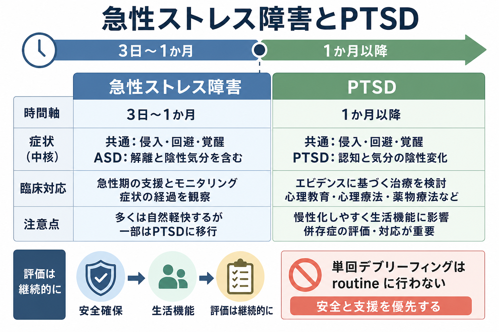

# 急性ストレス障害とは何か

## 要点

- 急性ストレス障害（acute stress disorder: ASD）は、生命の危険、重傷、性的暴力などの外傷的出来事の後、3日から1か月の範囲で強いストレス症状が続き、苦痛や生活機能の障害を伴う状態である[1]。
- 症状は、侵入症状、陰性気分、解離症状、回避症状、覚醒亢進症状にまたがる。DSM-5-TRでは、この5領域に含まれる14症状のうち9症状以上が診断の目安になる[1]。
- [[PTSDでは恐怖記憶ネットワークに何が起きているのか|PTSD]]との最大の違いは時間軸で、ASDは外傷後3日から1か月、PTSDは1か月を超えて症状が持続すると評価される[1][2]。
- ASDはPTSDのリスクを示すことがあるが、ASDがあれば必ずPTSDになるわけではなく、ASDがなくても後にPTSDを発症する人がいる[2][3]。
- 初期対応では、安全確保、身体的・社会的ニーズの評価、心理的応急処置に基づく支援、継続的評価が重要で、外傷体験を一度に詳しく語らせる単回デブリーフィングは routine に行わない[4][5]。

## この記事で答える問い

このノートは、急性ストレス障害を「外傷後の早期反応」として理解するために、次の問いに答える。

1. ASDは、通常の急性ストレス反応やPTSDとどう違うのか。
2. 症状はなぜ侵入、回避、覚醒亢進、解離としてまとまって現れるのか。
3. 臨床・研究では、ASDをどのように評価し、どの点に注意して支援するのか。

## まず結論

急性ストレス障害は、「外傷体験の直後に不安定になること」そのものではない。外傷後の強い反応は多くの人に起こり、自然に軽快することも多い。ASDという診断概念が問題にするのは、外傷後3日から1か月の範囲で、侵入記憶、回避、過覚醒、陰性気分、解離などがまとまって出現し、本人の苦痛や生活機能に明確な影響を与えている場合である[1][2]。

したがって、ASDを理解する鍵は「早期に決めつけること」ではなく、「時間軸を持って観察すること」にある。外傷後1か月以内はASDとして評価し、1か月を超えて再体験、回避、脅威感、認知と気分の陰性変化が続く場合にはPTSDを評価する[1][2]。臨床的には、症状の有無だけでなく、安全、睡眠、身体疾患、頭部外傷、物質使用、抑うつ、自殺リスク、生活機能、支援資源を同時に確認する必要がある[6]。

## 背景

外傷後の早期反応には、恐怖、涙もろさ、不眠、悪夢、ぼんやりする感じ、出来事を避けたい感覚、過度の警戒などが含まれる。これらは、脳と身体が危険から身を守るために高い警戒状態へ移行した結果として理解できる面がある。たとえば、[[扁桃体過活動は不安症やPTSDにどう関わるのか|扁桃体]]を中心とした脅威検出、ノルアドレナリン系による覚醒、記憶の断片化、回避行動は、短期的には危険から距離を取る反応として機能することがある[3]。

しかし、この反応が生活の広い場面に固定化すると、回復を助ける経験まで避けられ、外傷記憶が「過去の出来事」として再評価されにくくなる。ASDは、そのような早期の高負荷状態を記述し、PTSDへ移行する可能性のある人を見逃さないために作られた診断概念である[3]。

## 基本概念

ASDの診断では、まず外傷的出来事への曝露が前提になる。これは、本人が直接経験した場合、目撃した場合、近親者や親しい友人に生じた暴力的・偶発的出来事を知った場合、または職務などで外傷的詳細に反復曝露された場合を含む[1]。

そのうえで、症状は次の5領域に整理される。

| 領域 | 代表例 | 臨床的な見方 |
|---|---|---|
| 侵入症状 | 望まない記憶、悪夢、フラッシュバック、手がかりへの強い苦痛 | 記憶が「過去」として処理されず、現在の脅威のように再体験される |
| 陰性気分 | 喜び、安心、愛情などの陽性感情を感じにくい | 抑うつ症状や喪失反応との鑑別も必要 |
| 解離症状 | 現実感の変化、ぼんやりする、重要部分を思い出せない | [[解離とは何か|解離]]は防御的反応にもなりうるが、機能障害が鍵になる |
| 回避症状 | 記憶・感情・場所・人・会話を避ける | 短期的には苦痛を下げるが、長期化すると再評価を妨げる |
| 覚醒亢進 | 不眠、易怒性、過警戒、集中困難、驚愕反応 | [[不安症群とは何か|不安症]]、疼痛、物質、頭部外傷との鑑別が重要 |

DSM-5-TRでは、これら5領域の症状が合計9個以上あり、3日から1か月持続し、著しい苦痛または機能障害を伴い、物質や他の医学的状態、短期精神病性障害などでよりよく説明されないことが求められる[1]。

## 仕組み

ASDの症状は、「壊れた反応」ではなく、危険への防御反応が強く、広く、長く残った状態として理解すると見通しがよい。

外傷体験の直後、脳は危険を素早く検出し、身体を逃走・闘争・凍りつきに近い状態へ準備する。[[ノルアドレナリンは覚醒とストレスにどう関わるのか|ノルアドレナリン]]や自律神経の変化は、眠りにくさ、動悸、過警戒、集中困難として現れることがある。外傷記憶は、通常の出来事の記憶のように時間・場所・文脈へ統合されず、感覚断片や身体反応として侵入的に再活性化されることがある[3]。

回避は、この侵入と過覚醒を短期的に弱めるために働く。思い出す場所に行かない、関連する会話を避ける、感情を切り離すといった反応は、苦痛を下げる即効性を持つ。しかし、回避が固定化すると、「今は安全である」「記憶は過去の出来事である」という再学習の機会が減る。解離も同様に、圧倒的な苦痛から距離を取る反応として理解できるが、強く長引くと現実感、身体感覚、自己感の回復を妨げる[1][3]。

## 図解

上の1枚目は、ASDとPTSDを時間軸で整理している。ASDは「3日から1か月」の診断概念であり、1か月を超える場合はPTSDを含めた再評価が必要になる。症状は重なるが、ASDでは解離症状が診断症状群に含まれ、PTSDでは認知と気分の陰性変化が中核症状群として整理される点が異なる[1][2]。

2枚目は、外傷記憶、脅威検出、自律神経、侵入、回避、解離の循環を示している。この図の中心は、「症状は本人の弱さや意図的な反応ではなく、防御反応が過剰に持続している状態として理解できる」という点である。

## 臨床・研究との接続

臨床では、ASDを見つけること自体よりも、外傷後早期のニーズを層別化することが重要である。直後には、住居、身体治療、睡眠、家族・職場・学校への連絡、法的・社会的支援など、心理療法以前の課題が前面に出ることが多い。WHOは、最近外傷に曝露され急性の苦痛を示す人に対して、心理的応急処置の原則に基づく支援を考慮することを推奨している[7]。

専門的介入では、すべての人に即時の外傷焦点化治療を行うのではなく、症状の重さ、生活機能、本人の希望、リスク、支援環境を確認しながら、能動的モニタリングやトラウマ焦点化CBTを検討する。NICEは、PTSD予防・治療として心理学的デブリーフィングを提供しないよう勧め、子ども・若者のASDまたは臨床的に重要なPTSD症状では、1か月以内に能動的モニタリングまたは個別トラウマ焦点化CBTを考慮するとしている[4]。VA/DoDの2023年ガイドラインも、ASDとPTSDの評価・管理をエビデンスに基づく意思決定、機能評価、共有意思決定の枠組みで扱っている[6]。

研究上は、ASDはPTSDの予測因子として注目されてきたが、予測性能には限界がある。DSM-5に向けたレビューでは、ASDは外傷後早期の苦痛を記述する概念として有用だが、PTSDを発症する人を完全に拾い上げるものではないと整理されている[3]。したがって、ASDの有無だけで将来を断定せず、症状の軌跡を継続的に見ることが重要である。

## よくある誤解

**誤解1: 外傷後に動揺したら、すぐ急性ストレス障害である。**  
外傷後の動揺、不眠、涙もろさ、警戒は珍しくない。ASDでは、少なくとも3日以上症状が続き、症状数、苦痛、機能障害、鑑別を含めて評価する[1]。

**誤解2: ASDは必ずPTSDに進む。**  
ASDはPTSDリスクと関連するが、ASDから回復する人もいる。一方で、ASDの診断基準を満たさない人が後にPTSDを発症することもある[2][3]。

**誤解3: 早く詳しく話せば、回復が早まる。**  
外傷体験を一度に詳しく語らせる単回デブリーフィングは、PTSD予防として支持されていない。Cochraneレビューでは、単回デブリーフィングはPTSDや苦痛の予防に有効とはいえず、場合によって有害の可能性も示された[5]。初期対応では、安全、選択権、実際的支援、必要時の専門的評価が優先される。

**誤解4: 解離があるなら、記憶は信用できない。**  
解離は、現実感や自己感、記憶の連続性が一時的に弱まる体験であり、記憶の真偽を単純に決める指標ではない。臨床では、事実認定よりも苦痛、機能障害、安全、現在の支援ニーズを評価する。

## 関連ノート

- [[PTSDでは恐怖記憶ネットワークに何が起きているのか]]
- [[扁桃体過活動は不安症やPTSDにどう関わるのか]]
- [[解離とは何か]]
- [[解離症状は脳ネットワークでどう説明できるのか]]
- [[トラウマ歴はどのように聞くべきか]]
- [[不安症群とは何か]]

## MOC更新候補

- `content/00_MOC/` 配下の精神医学・トラウマ関連症のMOCに、後続の統合ジョブで `[[急性ストレス障害とは何か]]` を追加する候補。
- PTSD、解離、トラウマ面接、ストレス脆弱性モデルを束ねる索引がある場合、本ノートを「外傷後早期反応」の入口として配置する候補。

## 理解チェック

1. ASDとPTSDを分ける最も実用的な時間軸は何か。
2. ASDの5つの症状領域を挙げ、それぞれ1つずつ具体例を説明できるか。
3. 回避や解離は、なぜ短期的には防御反応でありながら、長引くと回復を妨げうるのか。
4. 単回デブリーフィングを routine に行わない理由を、エビデンスの観点から説明できるか。
5. 外傷後早期の支援で、心理療法以外に確認すべき安全・生活・身体面の項目は何か。

## 未解決問題

- ASDの診断基準は早期苦痛を記述するには有用だが、PTSD発症を高精度に予測する単独指標ではない。症状、外傷種別、既往歴、社会的支援、身体損傷、睡眠、疼痛などを組み合わせた予測モデルが必要である。
- 外傷後1か月以内の介入は、自然回復を妨げず、必要な人に十分な支援を届けるバランスが難しい。誰に、どの時点で、どの強度のトラウマ焦点化介入を行うべきかは、今後も検討が必要である。
- 文化、年齢、発達段階、職業的外傷曝露、災害・戦争・性暴力などの外傷種別によって、ASDの表れ方と支援ニーズは異なる可能性がある。

## 参考文献

[1] American Psychiatric Association. (2022). *Diagnostic and Statistical Manual of Mental Disorders, Fifth Edition, Text Revision (DSM-5-TR)*. American Psychiatric Association Publishing. https://doi.org/10.1176/appi.books.9780890425787

[2] National Center for PTSD. (2026). *Acute Stress Disorder*. U.S. Department of Veterans Affairs. https://www.ptsd.va.gov/understand/related/acute_stress.asp

[3] Bryant, R. A., Friedman, M. J., Spiegel, D., Ursano, R., & Strain, J. (2011). A review of acute stress disorder in DSM-5. *Depression and Anxiety, 28*(9), 802-817. https://doi.org/10.1002/da.20737

[4] National Institute for Health and Care Excellence. (2018; reviewed 2025). *Post-traumatic stress disorder: NICE guideline NG116*. https://www.nice.org.uk/guidance/ng116/chapter/1-Recommendations

[5] Rose, S. C., Bisson, J., Churchill, R., & Wessely, S. (2002). Psychological debriefing for preventing post traumatic stress disorder (PTSD). *Cochrane Database of Systematic Reviews*, CD000560. https://doi.org/10.1002/14651858.CD000560

[6] Schnurr, P. P., Hamblen, J. L., Wolf, J., Coller, R., Collie, C., Fuller, M. A., Holtzheimer, P. E., Kelly, U., Lang, A. J., McGraw, K., Morganstein, J. C., Norman, S. B., Papke, K., Petrakis, I., Riggs, D., Sall, J. A., Shiner, B., Wiechers, I., & Kelber, M. S. (2024). The management of posttraumatic stress disorder and acute stress disorder: Synopsis of the 2023 U.S. Department of Veterans Affairs and U.S. Department of Defense Clinical Practice Guideline. *Annals of Internal Medicine*. https://doi.org/10.7326/M23-2757

[7] World Health Organization. (2012). *Support based on the psychological first aid principles in people recently exposed to a traumatic event*. WHO mhGAP Evidence Centre. https://www.who.int/teams/mental-health-and-substance-use/treatment-care/mental-health-gap-action-programme/evidence-centre/other-significant-emotional-and-medical-unexplained-somatic-complaints/support-based-on-the-psychological-first-aid-principles-in-people-recently-exposed-to-a-traumatic-event
