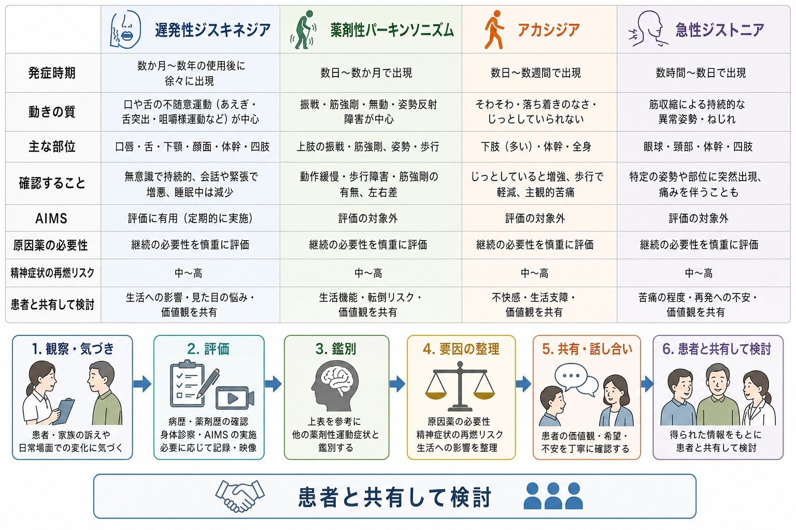

# 急性一過性精神病性障害とは何か

## 要点

- 急性一過性精神病性障害 acute and transient psychotic disorder: ATPD は、急に精神病症状が出現し、比較的短期間で軽快する経過を特徴とする診断概念である[1][5]。
- 中核は「急な発症」と「一過性の経過」だが、初診時点で確定しきれる診断ではなく、経過観察のなかで統合失調症、双極症、うつ病性障害、物質・身体疾患に診断が変わることがある[5][6]。
- 統合失調症との違いは、症状の種類だけではなく、発症速度、持続期間、前駆期、陰性症状、認知機能障害、生活機能低下、寛解後の残遺症状を合わせて見る点にある[2][3]。
- DSM-5-TR の短期精神病性障害 brief psychotic disorder は、1日以上1か月未満の精神病症状と病前機能への回復を重視する。ATPD と重なるが、分類体系と期間設定は同一ではない[2]。
- 本記事は教育・研究目的の整理であり、個別の診断や治療方針を示すものではない。

## この記事で答える問い

1. 急性一過性精神病性障害とはどのような診断概念か。
2. 統合失調症、短期精神病性障害、気分障害、物質・身体疾患とは何が違うのか。
3. なぜ「すぐ良くなったから問題ない」とも「精神病症状があるから統合失調症」とも言えないのか。
4. 臨床・研究では、どのように経過観察と診断の見直しを考えるのか。

## まず結論

急性一過性精神病性障害は、「急に起こり、短い期間で軽快する精神病性エピソード」を表すための診断枠である。[[幻覚とは何か|幻覚]]、妄想、まとまりのない発話、興奮、混乱、行動のまとまりにくさなどが急に出現することがあるが、重要なのは症状リストだけではない。急性発症、症状像の変動、短期間の寛解、病前機能への回復、身体疾患・物質・気分エピソードの除外、そしてその後の再発や診断変更の有無が診断の重心になる[1][2][5]。

一方で、ATPD は「良性で心配不要な精神病」ではない。メタ分析では、短期精神病エピソード群は寛解後の初回統合失調症より長期予後が良い傾向を示すが、再発や診断変更は少なくない[4]。したがって臨床的には、急性期の安全確保と治療、身体・物質・気分障害の評価、寛解後の生活機能の確認、数か月から年単位のフォローアップをセットで考える。

## 背景

精神病症状は、[[精神疾患とは何か|精神疾患]]だけでなく、せん妄、てんかん、自己免疫性脳炎、内分泌疾患、薬剤、物質使用、睡眠不足、重いストレス反応、気分エピソードなどでも生じうる。したがって、急に幻覚や妄想が出た場面で最初に必要なのは、診断名を急いで固定することではなく、[[精神状態診察MSEとは何か|精神状態診察]]、身体評価、物質・薬剤歴、睡眠、気分症状、意識・注意の変動、家族や周囲から見た時間経過を統合することである[7][8]。

ATPD のような概念が必要になるのは、精神病性障害のなかに、統合失調症のような比較的持続的・機能低下を伴いやすい経過とは異なり、急に始まり、短い期間で大きく改善する群があるからである。ICD-10 では ATPD が F23 として導入され、急性または急激な精神病症状の発症と、数か月以内の完全寛解が重視された[5]。ICD-11 でも 6A23 として急性一過性精神病性障害が位置づけられている[1]。

ただし、この診断群は歴史的に「反応性精神病」「非定型精神病」「周期性精神病」などと重なりながら議論されてきた。分類名があるからといって、単一の病因や単一の脳メカニズムが確立しているわけではない。むしろ ATPD は、急性発症・短期寛解という経過特徴でまとめられた臨床的な作業仮説に近い。

## 基本概念

### 何が「急性」なのか

「急性」とは、数か月から年単位で徐々に悪化するのではなく、短い時間幅で明らかな精神病水準の症状に至ることを指す。ICD-10 ATPD の研究では、精神病症状が完成するまでの期間が短いことが中心的特徴として扱われてきた[5]。臨床的には、本人の訴えだけでなく、家族・同僚・支援者が見た変化、睡眠、行動、発話、金銭・対人トラブル、危険行動の時間経過を確認する。

### 何が「一過性」なのか

「一過性」とは、症状が短期間で軽快し、病前の生活機能にかなり戻ることを意味する。DSM-5-TR の短期精神病性障害では、精神病症状が1日以上1か月未満で、最終的に病前機能へ戻ることが重視される[2]。ATPD では ICD 系の期間設定と下位分類の考え方が関わるため DSM の短期精神病性障害と完全には一致しないが、両者は「短い精神病エピソード」という臨床問題を共有している[4]。

### 統合失調症と何が違うのか

統合失調症でも幻覚、妄想、まとまりのない発話、まとまりのない行動、陰性症状、認知機能障害が問題になる。MSD Manual は、統合失調症では精神病症状に加えて、陰性症状、認知機能障害、職業・社会機能の障害が重要であり、DSM-5-TR では持続期間や機能低下が診断上の軸になると整理している[3]。つまり違いは「幻覚や妄想があるか」ではなく、「どのくらい急に始まったか」「どのくらい続いたか」「寛解後にどれほど戻るか」「陰性症状や[[認知機能障害とは何か|認知機能障害]]が持続するか」である。

| 鑑別の軸 | 急性一過性精神病性障害 | 統合失調症 |
|---|---|---|
| 発症速度 | 急性・急激な発症が中心 | 前駆期を伴うことが多いが、急性発症もありうる |
| 経過 | 短期間で大きく軽快しうる | 6か月以上の持続、再燃、機能低下が問題になりやすい |
| 症状像 | 変動しやすい精神病症状、混乱、興奮を伴うことがある | 陽性症状に加え、陰性症状・認知機能障害・生活機能障害が重要 |
| 診断の確定 | 経過観察で見直されることがある | 症状、持続期間、機能低下、除外診断を統合して判断 |

## 仕組み

ATPD の単一メカニズムは確立していない。現時点では、脆弱性、ストレス、睡眠・覚醒、物質使用、気分状態、身体要因、社会的孤立、トラウマ、文化的文脈が重なって急性の精神病症状が生じると考える方が安全である。統合失調症の研究で語られる神経発達、ドパミン、グルタミン酸、ストレス感受性などは参考になるが、ATPD にそのまま当てはめることはできない。

臨床的に有用なのは、「急性の脳・心理・社会システムの破綻」として見ることである。強いストレスや睡眠遮断が続くと、注意、覚醒、脅威検出、意味づけ、現実検証が不安定になる。そこに遺伝的・発達的脆弱性、過去の精神症状、物質使用、気分エピソード、身体疾患が重なると、幻覚・妄想・混乱・興奮として表面化しうる。急性期には安全確保と環境調整、必要に応じた薬物療法や入院、身体疾患の除外が重要になる[7][8]。

このモデルは説明のための枠組みであり、「ストレスが原因なら本人の対処が悪い」という意味ではない。精神病症状は本人の意思で直接制御できるものではなく、医学的・心理社会的評価と支援が必要な状態である。

## 図解

3枚目の図は、鑑別の考え方をまとめたものである。急性発症の精神病症状では、ATPD だけでなく、[[せん妄とは何か|せん妄]]、物質・薬剤性精神病性障害、てんかんや内分泌疾患などの身体疾患、双極症やうつ病性障害の精神病症状、統合失調症スペクトラムを同時に考える。特に意識・注意の変動、発熱、脱水、薬剤変更、アルコール離脱、神経症状がある場合は、精神科診断以前に身体的緊急性を評価する必要がある。

## 臨床・研究との接続

### 初診時診断は仮説である

ATPD は、初診時に「短期間で完全に軽快する」とまだ分からない場面で使われることがある。そのため診断は本質的に暫定性を含む。Singh らの初回精神病コホート研究では、ATPD は統合失調症より転帰が良く、気分精神病に近い転帰を示した一方、診断安定性には限界があった[5]。近年の記録研究でも、6か月から1年で ATPD 診断が統合失調症や双極性障害に変わる例が報告されている[6]。

### 予後は比較的良くても、再発リスクは残る

Fusar-Poli らのメタ分析では、ATPD、短期精神病性障害、短期限定精神病症状などの「短期精神病エピソード」は、寛解後の初回統合失調症より長期の精神病再発リスクが低い一方、一定の再発リスクを持つことが示された[4]。これは「統合失調症より予後が良い傾向」と「再発や診断変更がないわけではない」という二つの事実を同時に意味する。

### 早期介入の文脈で見る

NICE の成人精神病・統合失調症ガイドラインは、初回精神病では年齢や未治療期間にかかわらず早期介入サービスへアクセスできること、うつ・不安・物質使用・トラウマ反応などの併存状態を評価すること、薬物療法と心理社会的介入を組み合わせて検討することを推奨している[8]。ATPD でも、短期で軽快したかどうかだけでなく、危険行動、自殺リスク、家族の負担、再発兆候、就労・学業・対人機能の回復を見ていく必要がある。

## よくある誤解

### 誤解1: 急に発症した精神病なら統合失調症ではない

違う。統合失調症にも急性増悪や急性発症に見える例はある。診断では発症速度だけでなく、持続期間、機能低下、陰性症状、認知機能、再発、家族歴、物質使用、身体疾患を合わせて判断する[3]。

### 誤解2: 短期間で良くなれば治療やフォローは不要である

これも危険である。短期精神病エピソードは予後が比較的良い群を含むが、再発や診断変更が起こりうる[4][6]。寛解後にも睡眠、ストレス、物質使用、気分症状、社会機能、服薬副作用、再発サインを確認する必要がある。

### 誤解3: ストレスがきっかけなら精神疾患ではない

ストレス因子があっても、精神病症状が現れて本人や周囲の安全・生活機能に影響するなら、臨床的評価の対象になる。ストレスは誘因であって、本人の弱さや責任を意味しない。

### 誤解4: ATPD と短期精神病性障害は同じである

重なる部分は大きいが、同じではない。DSM の短期精神病性障害は1日以上1か月未満と病前機能への回復を明確に置く[2]。ATPD は ICD 系の分類であり、急性発症、症状像、経過の扱いが異なる。研究ではまとめて「brief psychotic episodes」として扱われることもあるが、分類体系の違いを残して読む必要がある[4]。

## 関連ノート

- [[DSMとICDは何が違うのか]]
- [[精神科診断は何のためにあるのか]]
- [[鑑別診断とは何か]]
- [[精神状態診察MSEとは何か]]
- [[MSEで知覚異常をどう聞くか]]
- [[幻覚とは何か]]
- [[せん妄とは何か]]
- [[認知機能障害とは何か]]
- [[ドパミン仮説は統合失調症をどこまで説明できるのか]]

MOC更新候補: バッチ統合時に `content/00_MOC/` 配下の精神医学、総論・診断・面接、疾患・症候群、精神病性障害に関する MOC があれば本記事へのリンク追加を検討する。

## 理解チェック

1. 急性一過性精神病性障害で、症状の種類だけでなく経過が重要になるのはなぜか。
2. 統合失調症との鑑別で、持続期間、陰性症状、認知機能、生活機能を確認する理由は何か。
3. 短期間で寛解した後にも、再発や診断変更を見越してフォローする必要があるのはなぜか。
4. せん妄、物質・薬剤、身体疾患、気分障害を除外せずに ATPD と判断すると、どのようなリスクがあるか。

## 参考文献

[1] World Health Organization. (2026). *ICD-11 for Mortality and Morbidity Statistics: Acute and transient psychotic disorder, 6A23*. https://icd.who.int/browse/2026-01/mms/en#284410555

[2] Merck Manual Professional Edition. (2025). *Brief Psychotic Disorder*. https://www.merckmanuals.com/professional/psychiatric-disorders/schizophrenia-and-related-disorders/brief-psychotic-disorder

[3] MSD Manual Professional Edition. (2026). *Schizophrenia*. https://www.msdmanuals.com/professional/psychiatric-disorders/schizophrenia-and-related-disorders/schizophrenia

[4] Fusar-Poli, P., Cappucciati, M., Bonoldi, I., Hui, L. M. C., Rutigliano, G., Stahl, D. R., Borgwardt, S., Politi, P., Mishara, A. L., Lawrie, S. M., Carpenter, W. T. Jr., & McGuire, P. (2016). Prognosis of brief psychotic episodes: A meta-analysis. *JAMA Psychiatry, 73*(3), 211-220. https://doi.org/10.1001/jamapsychiatry.2015.2313

[5] Singh, S. P., Burns, T., Amin, S., Jones, P. B., & Harrison, G. (2004). Acute and transient psychotic disorders: Precursors, epidemiology, course and outcome. *British Journal of Psychiatry, 185*, 452-459. https://doi.org/10.1192/bjp.185.6.452

[6] Kathfar, P., Jain, P., Rastogi, D., & Niranjan, V. (2025). Diagnostic stability of acute and transient psychotic disorders at a tertiary care center: A retrospective record-based study. *Cureus, 17*(1), e77112. https://doi.org/10.7759/cureus.77112

[7] Rutigliano, G., Merlino, S., Minichino, A., Patel, R., Davies, C., Oliver, D., De Micheli, A., McGuire, P., & Fusar-Poli, P. (2018). Long term outcomes of acute and transient psychotic disorders: The missed opportunity of preventive interventions. *European Psychiatry, 52*, 126-133. https://doi.org/10.1016/j.eurpsy.2018.05.004

[8] National Institute for Health and Care Excellence. (2014). *Psychosis and schizophrenia in adults: Prevention and management* (NICE Clinical Guideline CG178). https://www.nice.org.uk/guidance/cg178

## 未解決問題

- ATPD は単一の疾患単位なのか、複数の経過型を一時的にまとめた分類なのか。
- 急性発症・早期寛解・ストレス因子・症状の多形性のうち、長期転帰を最もよく予測する要因はどれか。
- 初回精神病サービスでは、短期で寛解した人にどの程度の期間・強度のフォローアップを行うのが最も有益か。
- ICD と DSM の短期精神病概念を、研究・臨床でどこまで共通化できるか。
