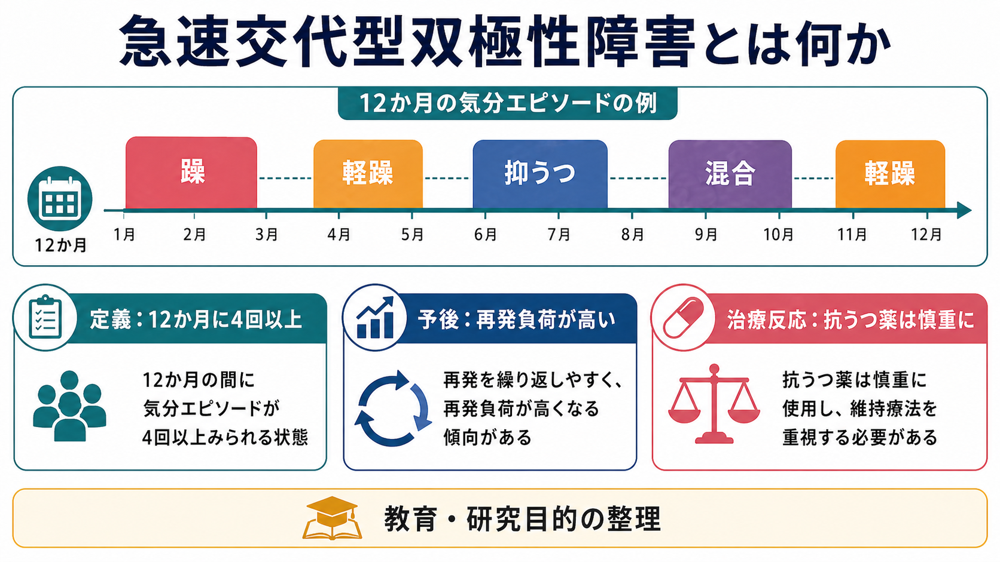
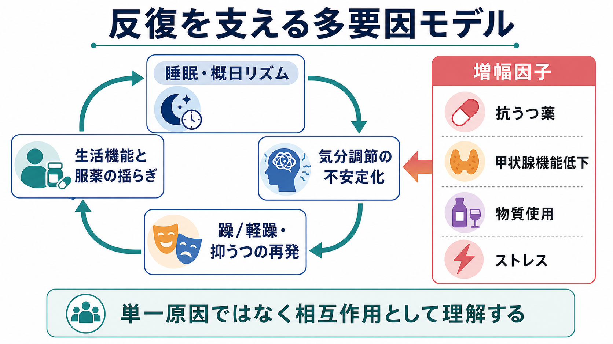
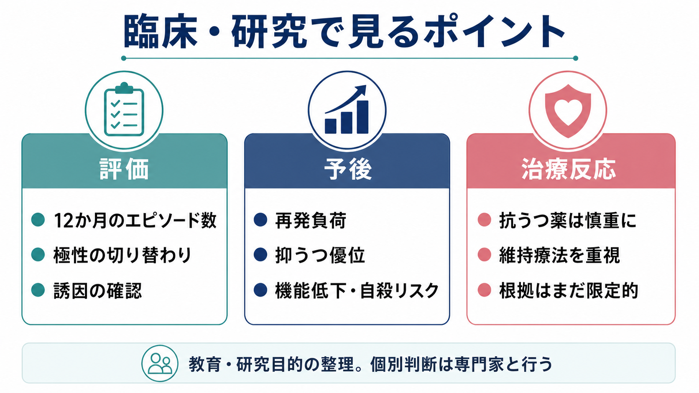

# 急速交代型双極性障害とは何か

## 要点

- 急速交代型双極性障害は、双極性障害の「別疾患」ではなく、躁病、軽躁病、抑うつ、混合性の気分エピソードが短期間に反復する経過指定子として理解される。DSM-5系の定義では、12か月間に4回以上の明確な気分エピソードがある状態を指す[1][2]。
- 急速交代は、再発負荷、抑うつ優位、混合特徴、物質使用、身体合併症、希死念慮・自殺関連リスク、心理社会的機能低下と結びつきやすい[2][3]。したがって「気分の波が速い」だけでなく、予後と治療反応を左右する臨床的な標識である。
- 治療では、甲状腺機能低下、抗うつ薬、刺激薬、物質使用、睡眠・概日リズムの乱れなど、周期を増幅しうる要因を評価することが重要になる[4][5]。これは個別治療指示ではなく、教育・研究目的の整理である。
- 急速交代型だけに特異的な最適治療戦略は、まだ十分に確立していない。2022年の系統的レビュー/メタ分析では、多くの薬剤研究がある一方で、研究数・異質性・バイアスリスクの制約が大きいとされる[2]。

## この記事で答える問い

1. 急速交代型双極性障害は、通常の双極性障害と何が違うのか。
2. なぜ短期間にエピソードが反復しやすいと考えられているのか。
3. 予後や治療反応を考えるとき、どの点に注意すべきか。
4. 抗うつ薬、睡眠、甲状腺機能、物質使用はどのように関係するのか。

## まず結論

急速交代型双極性障害は、「気分が数時間ごとに揺れる」という意味ではない。診断上は、一定の持続期間と症状基準を満たす躁病、軽躁病、抑うつ、混合性のエピソードが、12か月に4回以上みられる経過を指す[1][2]。日内変動、情動不安定性、パーソナリティ特性、環境反応性の気分変化とは区別して考える必要がある。

臨床的に重要なのは、急速交代が「回数の多さ」だけでなく、治療反応の不安定さ、再発負荷、抑うつの長期化、機能低下、[[希死念慮とは何か|希死念慮]]や自殺リスク評価の必要性を示す点である[2][3]。したがって評価では、過去12か月の気分エピソードの数、各エピソードの持続期間、寛解期間、極性の切り替わり、服薬歴、抗うつ薬や刺激薬の使用、物質使用、睡眠・生活リズム、甲状腺機能を合わせて見る。

## 背景

双極性障害は、躁病・軽躁病と抑うつエピソードを反復しうる気分障害である。関連する神経科学的説明は [[双極性障害は情動ネットワークの異常として説明できるのか]] で扱われるが、臨床経過としては「どの極性のエピソードが、どの頻度で、どれだけ持続し、どれだけ機能を損なうか」が重要になる。

急速交代という概念は、この「経過の速さ」に注目する。治療研究のレビューでは、急速交代型の人は非急速交代型に比べ、エピソード負荷が大きく、抑うつ・混合特徴・物質使用・身体合併症・心理社会的機能低下を伴いやすいと整理されている[2][3]。2003年のメタ分析も、急速交代を相対的な治療抵抗性と関連する臨床群として扱っている[7]。

ただし、急速交代は固定した体質名ではない。同じ人でも、ある時期には急速交代を満たし、別の時期には満たさないことがある。したがって「急速交代型の人」とラベル化するより、「この12か月、あるいはこの治療経過で急速交代のパターンが生じている」と記述するほうが、臨床・研究の両方で慎重である。

## 基本概念

### 定義

DSM-5系の定義では、急速交代は双極I型障害・双極II型障害などに付く経過指定子であり、過去12か月に4回以上の気分エピソードがある場合に用いられる。エピソードには、躁病、軽躁病、抑うつが含まれ、エピソード同士は部分寛解・完全寛解、または反対極性への切り替わりによって区切られる[1][2]。

ここでいう「エピソード」は、単なる気分の瞬間的変化ではない。たとえば、[[うつ病とは何か|抑うつ]]エピソードには持続期間、症状数、機能障害、鑑別診断が関わる。軽躁病エピソードも、通常の活発さや一時的な機嫌の良さとは異なり、活動性・睡眠欲求・思考速度・衝動性などの変化が一定期間まとまって現れる。

### 急速交代と似ているが異なるもの

急速交代は、以下と混同されやすい。

| 概念 | 急速交代との違い |
|---|---|
| 日内変動 | 1日の中で気分が変わる現象で、気分エピソードの回数とは同じではない。 |
| 情動不安定性 | 対人関係、ストレス、疲労などに反応して感情が揺れる現象で、エピソード基準を満たすとは限らない。 |
| 気分循環性障害 | 軽躁症状と抑うつ症状が慢性的に揺れるが、典型的な躁病・大うつ病エピソードとは別に評価される。 |
| 混合特徴 | 躁的症状と抑うつ症状が同時期に重なる状態で、急速交代とは別の指定子として扱われる。 |

この区別は治療反応の評価にも関わる。たとえば「毎日気分が変わる」と訴える人でも、実際には睡眠不足、[[不眠とは何か|不眠]]、不安、物質使用、身体疾患、薬剤の影響、生活リズムの乱れが主な要因かもしれない。急速交代かどうかを判断するには、気分表、家族・支援者からの補足情報、過去の治療歴、寛解期間の確認が必要になる[5]。

## 仕組み

急速交代の仕組みは、単一の原因で説明できない。研究・ガイドラインで繰り返し重視されるのは、気分調節の不安定性に、睡眠・概日リズム、薬剤、内分泌、物質使用、心理社会的ストレスが重なり、エピソードの閾値を下げる可能性である[4][5]。

### 睡眠・概日リズム

双極性障害では、睡眠時間の短縮、夜更かし、交代勤務、社会的リズムの乱れが、躁・軽躁・抑うつエピソードのきっかけになることがある。急速交代では、エピソードが反復するほど生活リズムが崩れ、生活リズムの崩れが次のエピソードを誘発する、という循環が生じやすい。これは [[不眠とは何か]] とも接続する論点である。

### 抗うつ薬と周期加速

抗うつ薬は双極性うつ病で慎重に扱われる。CANMAT/ISBDガイドラインは、抗うつ薬を双極I型うつ病の単独療法として用いないこと、抗うつ薬誘発性の躁転・軽躁転、混合特徴、最近の急速交代がある場合には避けるか慎重に使うことを勧めている[4]。急速交代の文脈では、抗うつ薬が一部の患者で周期加速や気分不安定化と関連する可能性がある。

STEP-BDのランダム化臨床試験の二次解析では、標準的な気分安定薬を併用していても、抗うつ薬を継続した急速交代群で、非急速交代群より総気分エピソードと抑うつエピソードが多く、寛解時間が短かった[6]。ただし、これはすべての人に抗うつ薬が禁忌だという単純な結論ではない。重要なのは、双極性障害では抗うつ薬の利益と気分不安定化リスクを分けて評価する必要がある、という点である。

### 甲状腺機能、物質使用、身体合併症

CANMAT/ISBDは、急速交代では甲状腺機能低下、抗うつ薬、物質使用が関連しうるため、甲状腺機能の評価、抗うつ薬・刺激薬・乱用薬物などの見直しが重要だと述べている[4]。NICEも、双極性障害の評価では身体合併症、薬剤、副作用、物質使用、心理社会的ストレス、生活変化を含めて評価することを推奨している[5]。

物質使用は、躁的な高揚、睡眠不足、衝動性、抑うつの悪化と絡みやすい。特にアルコール、覚醒剤、カンナビス、過量のカフェインなどは、睡眠・報酬系・衝動性に影響し、気分エピソードの評価を難しくする。物質が主因の場合には、双極性障害そのものの急速交代ではなく、物質・薬剤誘発性の気分症状として検討する必要もある。

## 図解

上の2枚は、急速交代型双極性障害を「12か月のエピソード数」と「多要因の反復ループ」から整理した図である。3枚目は、臨床・研究で観察するポイントを、評価、予後、治療反応の3軸に分けている。

図はあくまで教育用の概念整理である。実際の臨床判断では、気分エピソードの診断、身体疾患、薬剤、生活リズム、本人の希望、既往歴、安全性を合わせて評価する。

## 臨床・研究との接続

### 評価では「12か月の地図」を作る

急速交代の評価では、まず過去12か月の気分エピソードを時系列に並べる。各エピソードについて、開始時期、終了時期、躁病・軽躁病・抑うつ・混合特徴の別、寛解期間、入院や休職の有無、薬剤変更、睡眠変化、物質使用、ライフイベントを記録する。

NICEは、双極性障害が疑われる場合、気分の詳細な病歴、過活動や脱抑制、エピソード間症状、誘因、再発パターン、家族歴、社会・個人機能、身体合併症、治療歴を評価することを推奨している[5]。急速交代では、この推奨が特に重要になる。

### 予後では「抑うつ負荷」と「機能低下」を見る

急速交代は躁が頻回に出る状態と思われがちだが、実際には抑うつエピソードや混合特徴の負荷が問題になることが多い。2023年のメタレビューは、急速交代が双極性障害患者の相当な割合にみられ、より大きな病勢負荷や不良な転帰と関連するとまとめている[3]。

予後を考えるときは、躁・軽躁の回数だけでなく、抑うつ期間、残遺症状、就労・学業・家事の障害、対人関係、睡眠、身体疾患、希死念慮を合わせて見る必要がある。[[希死念慮とは何か]] は、急速交代の評価で見落としてはいけない関連ノートである。

### 治療反応では「特効薬探し」より「不安定化因子の整理」が重要

急速交代型の治療研究は、双極性障害一般の治療研究よりも難しい。対象者の基準、現在の気分状態、併用薬、研究期間、アウトカムがばらつきやすいからである。2022年の系統的レビュー/メタ分析では、30研究・2266名の急速交代型参加者が検討されたが、十分に研究された介入は限られ、最適な治療戦略は未確立と結論づけられている[2]。

CANMAT/ISBDは、急速交代期の双極性うつ病に特定の薬剤が優越する十分な根拠はなく、急性期・維持期の有効性に基づき治療選択を行うと整理している[4]。そのうえで、抗うつ薬、刺激薬、乱用薬物、甲状腺機能低下などの不安定化因子を見直すことが強調される[4]。

## よくある誤解

### 「数時間ごとに気分が変われば急速交代である」

違う。急速交代は、診断基準を満たす気分エピソードが12か月に4回以上あるという経過指定である[1][2]。数時間単位の気分変動は、日内変動、不安、睡眠不足、対人ストレス、情動不安定性、物質使用、身体状態などとして別に評価する必要がある。

### 「急速交代型は双極性障害より重い別疾患である」

急速交代型は、双極性障害に付く経過指定子であり、別疾患名ではない。ただし、再発負荷や治療反応の観点では臨床的に重要である。つまり、診断分類上は「経過の特徴」だが、臨床判断では軽視できない。

### 「抗うつ薬は常に悪い」

単純化しすぎである。双極性障害における抗うつ薬は、躁転、混合化、周期加速のリスクが問題になるため、単独療法や急速交代の文脈では特に慎重に扱われる[4][6]。しかし、実際の判断は双極I型かII型か、過去の反応、混合特徴、併用薬、安全性、本人の希望によって異なる。

### 「気分安定薬を使えば必ず急速交代は止まる」

これも単純化である。急速交代型を対象にした治療研究は限定的で、特定の薬剤がすべての人に一貫して有効とは言いにくい[2]。治療反応は、薬剤だけでなく、睡眠、物質使用、身体疾患、服薬継続、心理社会的支援、再発早期サインへの対応にも左右される。

## 関連ノート

- [[双極性障害は情動ネットワークの異常として説明できるのか]]
- [[うつ病とは何か]]
- [[不眠とは何か]]
- [[希死念慮とは何か]]
- [[物質誘発性精神病とは何か]]
- [[セロトニン仮説はうつ病をどこまで説明できるのか]]

MOC更新候補: `content/00_MOC/` 配下の精神医学、気分障害、神経科学と精神疾患に関するMOCへ、本記事へのリンクを追加する。

今後の作成候補:

- 双極性障害とは何か
- 双極II型障害とは何か
- 混合特徴を伴う気分エピソードとは何か
- 気分安定薬とは何か
- 双極性障害における抗うつ薬のリスクとは何か
- 概日リズムと双極性障害はどう関係するのか

## 理解チェック

1. 急速交代型双極性障害のDSM-5系の基本定義は何か。
2. 急速交代を、日内変動や情動不安定性と区別する理由は何か。
3. 急速交代の評価で、甲状腺機能、抗うつ薬、物質使用、睡眠を確認するのはなぜか。
4. 急速交代型の治療研究で「最適戦略は未確立」とされる理由は何か。
5. 抗うつ薬について、「常に悪い」でも「常に安全」でもないと考える理由は何か。

## 未解決問題

- 急速交代型を、持続的な情動不安定性、混合状態、超短周期の気分変動とどのように標準化して区別するか。
- 急速交代型のサブグループごとに、どの維持療法・心理社会的介入・睡眠介入が最も有効か。
- 抗うつ薬関連の周期加速を、事前に予測できる臨床指標やバイオマーカーがあるか。
- 睡眠・概日リズムの安定化が、急速交代の再発負荷をどの程度下げるか。
- 双極I型と双極II型で、急速交代の意味と治療反応はどの程度異なるか。

## 参考文献

[1] American Psychiatric Association. (2022). *Diagnostic and Statistical Manual of Mental Disorders, Fifth Edition, Text Revision (DSM-5-TR).* American Psychiatric Association Publishing. https://doi.org/10.1176/appi.books.9780890425787

[2] Strawbridge, R., Kurana, S., Kerr-Gaffney, J., Jauhar, S., Kaufman, K. R., Yalin, N., & Young, A. H. (2022). A systematic review and meta-analysis of treatments for rapid cycling bipolar disorder. *Acta Psychiatrica Scandinavica, 146*(4), 290-311. https://doi.org/10.1111/acps.13471

[3] Miola, A., Fountoulakis, K. N., Baldessarini, R. J., Veldic, M., Solmi, M., Rasgon, N., Ozerdem, A., Perugi, G., Frye, M. A., & Preti, A. (2023). Prevalence and outcomes of rapid cycling bipolar disorder: Mixed method systematic meta-review. *Journal of Psychiatric Research, 164*, 404-415. https://doi.org/10.1016/j.jpsychires.2023.06.021

[4] Yatham, L. N., Kennedy, S. H., Parikh, S. V., et al. (2018). Canadian Network for Mood and Anxiety Treatments (CANMAT) and International Society for Bipolar Disorders (ISBD) 2018 guidelines for the management of patients with bipolar disorder. *Bipolar Disorders, 20*(2), 97-170. https://doi.org/10.1111/bdi.12609

[5] National Institute for Health and Care Excellence. (2025). *Bipolar disorder: assessment and management* (NICE Clinical Guideline CG185). https://www.nice.org.uk/guidance/cg185

[6] El-Mallakh, R. S., Vohringer, P. A., Ostacher, M. M., Baldassano, C. F., Holtzman, N. S., Whitham, E. A., Thommi, S. B., Goodwin, F. K., & Ghaemi, S. N. (2015). Antidepressants worsen rapid-cycling course in bipolar depression: A STEP-BD randomized clinical trial. *Journal of Affective Disorders, 184*, 318-321. https://doi.org/10.1016/j.jad.2015.04.054

[7] Kupka, R. W., Luckenbaugh, D. A., Post, R. M., Leverich, G. S., & Nolen, W. A. (2003). Rapid and non-rapid cycling bipolar disorder: A meta-analysis of clinical studies. *Journal of Clinical Psychiatry, 64*(12), 1483-1494. https://doi.org/10.4088/JCP.v64n1213
