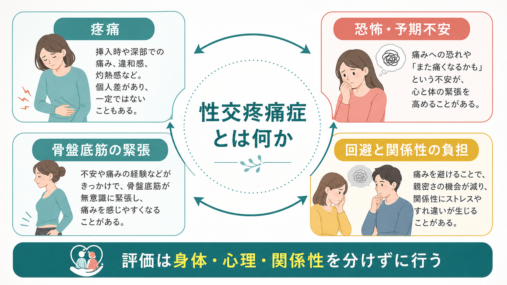
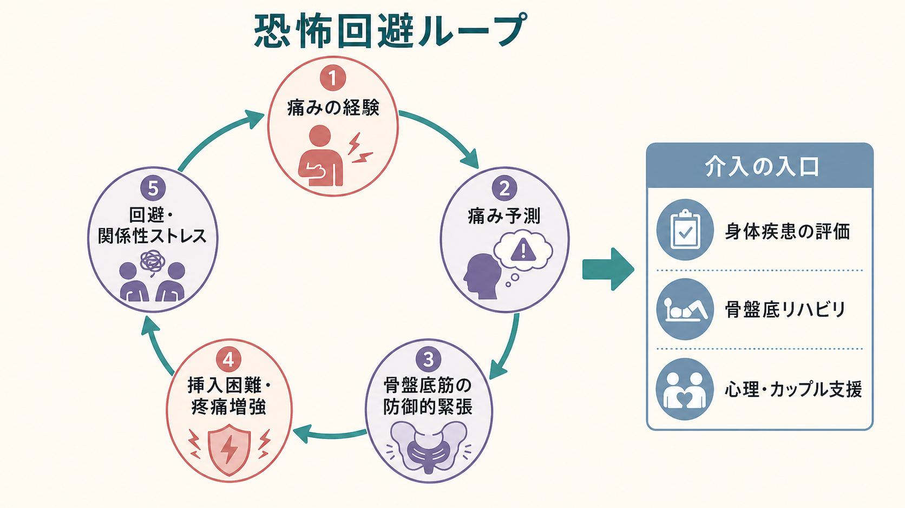
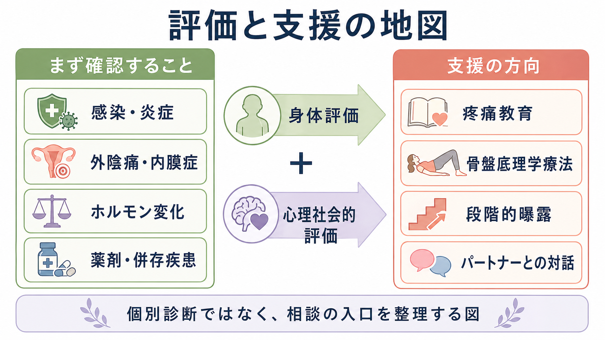

# 性交疼痛症とは何か

> このノートは教育・研究目的の整理であり、個別の診断や治療指示ではない。性交時・挿入時の痛み、出血、感染を疑う症状、強い恐怖や回避が続く場合は、婦人科、泌尿器科、疼痛医療、性の健康に詳しい専門職などへの相談が必要になる。

## 要点

- 性交疼痛症は、性交や挿入に関連する痛みだけでなく、痛みへの恐怖、骨盤底筋の防御的緊張、回避、関係性の負担を含む状態として理解される。
- DSM-5-TRでは、性器骨盤痛・挿入障害（Genito-Pelvic Pain/Penetration Disorder: GPPPD）として、疼痛、恐怖・不安、骨盤底筋の緊張、挿入困難が6か月以上持続し、苦痛を伴う場合が整理されている[1]。
- ただし「痛みがあるから心理的問題である」という意味ではない。感染、炎症、外陰痛、子宮内膜症、ホルモン変化、薬剤、神経障害、骨盤底筋機能などの身体要因を評価する必要がある[2][3]。
- 慢性化すると、[[予期不安とは何か|予期不安]]、回避、関係性ストレスが痛みを増幅する恐怖回避ループを作りうる[4][5]。

## この記事で答える問い

- 「性交疼痛症」と「性交時の一時的な痛み」は何が違うのか。
- 身体の痛み、恐怖、骨盤底筋の緊張、関係性はどうつながるのか。
- 精神医学・心理学の記事として扱うとき、どこまでが医学的鑑別で、どこからが心理社会的支援なのか。

## まず結論

性交疼痛症は、単に「性交が痛い」という症状名ではなく、痛みと挿入困難が性機能、自己像、パートナーとの親密さ、妊娠希望、医療受診へのためらいに影響する臨床問題である。GPPPDの診断枠では、痛みそのもの、挿入への恐怖や不安、骨盤底筋の緊張、挿入困難が同じ枠組みにまとめられる[1]。

重要なのは、心理的説明と身体的説明を競合させないことである。痛みは実在する経験であり、身体疾患や局所の炎症があればそれを評価する。同時に、痛みの予測、注意、回避、関係性のすれ違いは、痛みの持続や性機能の低下に関わるため、[[疼痛と精神疾患は脳内でどうつながるのか|疼痛と精神疾患]]や[[疼痛症状は精神科でどう評価するか|疼痛症状の評価]]と接続して理解する必要がある[4][8]。

## 背景

性交時の痛みは珍しい訴えではない。Cleveland Clinicの患者向け解説では、性交痛は外陰部、腟入口、腟内、子宮・骨盤部、骨盤底筋など複数の場所に生じうると説明され、情緒的苦痛や親密さの喪失、関係性の緊張にもつながるとされる[2]。人口ベース研究でも、GPPPDに相当する痛みや恐怖は一定の割合で報告され、うつ、不安、性機能、関係性要因との関連が検討されている[6][7]。

一方で、性交疼痛症は「性の問題」としてだけ扱うと狭すぎる。EAUの慢性骨盤痛ガイドラインは、性交痛を「挿入を伴う性行為に関連して骨盤内に知覚される痛み」と定義し、機序を特定する語ではないとする。慢性骨盤痛は、認知、行動、性機能、情動、下部尿路、腸、骨盤底、婦人科的機能と結びつくことが多い[8]。

## 基本概念

### 1. 症状としての性交痛

性交痛は、入口部痛、深部痛、特定の姿勢での痛み、性交後に続く痛みなどに分けて記述できる。原因としては、潤滑不足、感染、炎症、皮膚疾患、外陰痛、子宮内膜症、骨盤底筋機能障害、閉経関連の泌尿生殖器症候群、薬剤、手術・出産後の変化、トラウマ関連反応などがありうる[2][3]。

したがって、性交痛をただちに「心理的」と結論づけるのは誤りである。まず、痛みの場所、開始時期、持続時間、誘因、出血や分泌物、月経周期との関係、薬剤、既往、出産・手術歴、性暴力や強い恐怖の有無を、本人の同意と安全を確保しながら確認する必要がある[3][8]。

### 2. 診断枠としてのGPPPD

DSM-5-TRのGPPPDでは、腟性交または挿入の困難、性器骨盤痛、痛みへの著しい恐怖・不安、骨盤底筋の著しい緊張のいずれかが持続・反復し、少なくとも6か月続き、本人に臨床的苦痛をもたらすことが診断上の中心になる[1]。この枠組みは、従来分かれていた性交疼痛、腟けいれん、挿入困難を、痛み・恐怖・筋緊張の連続体として見やすくする。

ただし、GPPPDは「身体疾患を調べなくてよい」という意味ではない。Merck Manualは、診断には症状と骨盤診察が関わり、外陰部、腟前庭、骨盤底筋、膀胱、子宮・卵巣などを確認して、身体的異常や深部痛の原因を検討すると説明している[1]。

### 3. 関係性の問題としての側面

性交疼痛症は、本人だけでなくパートナーとの相互作用にも影響する。痛みを避けることは合理的な自己防衛だが、説明されないまま続くと「拒絶された」「期待に応えられない」「また痛くなる」というすれ違いを生みやすい。これが性行為の回避、親密さの減少、自己評価の低下、[[不安症群とは何か|不安]]や抑うつの増悪につながることがある[2][4]。

## 仕組み

### 恐怖回避ループ

痛みを経験すると、次の挿入や接触を予測した時点で身体が防御態勢に入りやすくなる。注意は痛みに向き、骨盤底筋は無意識に緊張し、潤滑や性的興奮は低下しやすい。その結果、挿入困難や疼痛増強が生じ、さらに「やはり痛い」という学習が強まる。この流れは、慢性疼痛でよく知られる恐怖回避モデルと近い[4][5]。

このループでは、原因を一つに決めるより、維持因子を分けて見るほうが臨床的に有用である。

| 維持因子 | 例 | 評価の視点 |
|---|---|---|
| 末梢の疼痛入力 | 炎症、外陰痛、萎縮、瘢痕、内膜症 | 身体診察、必要な検査、既往 |
| 筋緊張 | 骨盤底筋過活動、圧痛、挿入時の防御反応 | 骨盤底機能、理学療法評価 |
| 予測と注意 | 「また痛む」という予期不安、過覚醒 | [[予期不安とは何か|予期不安]]、痛み関連恐怖 |
| 回避と関係性 | 性行為回避、説明困難、親密さの低下 | コミュニケーション、安全、同意 |
| 併存症 | [[PTSDとは何か|PTSD]]、抑うつ、不安、[[身体症状症とは何か|身体症状症]]との鑑別 | 併存評価、トラウマインフォームドな面接 |

### 骨盤底筋の過活動

骨盤底筋は、排尿・排便・性反応・姿勢支持に関わる。痛みや恐怖が続くと、骨盤底筋が防御的に収縮し、接触や挿入でさらに痛みが出やすくなる。EAUガイドラインは、慢性骨盤痛では骨盤底筋過活動や筋膜トリガーポイントを探すこと、心理的機序と中枢神経系の役割も理解した専門的理学療法を検討することを述べている[8]。

この説明は「筋肉を緩めれば必ず治る」という単純化ではない。炎症、神経痛、ホルモン変化、外陰痛、トラウマ、パートナーとの安全感などが同時に関わるため、身体評価と心理社会的評価を並行して行う必要がある。

## 図解

この図の中心は、評価を「身体」か「心理」かに分けすぎないことである。感染や炎症、外陰痛、子宮内膜症、ホルモン変化、薬剤、併存疾患を確認しつつ、痛み関連恐怖、回避、パートナーとの対話、同意、安全感を同時に扱う。

## 臨床・研究との接続

### 臨床評価

臨床では、痛みの局在を入口部・深部・広範囲に分け、皮膚・粘膜・感染・炎症・骨盤内疾患・骨盤底筋・薬剤・ホルモン状態を確認する[2][3]。ACOGは持続性外陰痛について、詳細な病歴、性歴、既往、綿棒テスト、感染の除外、骨盤筋過活動や筋膜性要因の評価を挙げ、身体面と情緒面を含む個別化された多職種アプローチを推奨している[3]。

精神科・心理職が関わる場合も、身体疾患の評価を置き換えるのではなく、痛みの意味づけ、回避、恐怖、トラウマ、関係性、抑うつ・不安、睡眠、薬剤影響を整理する役割が中心になる。痛みが実在することを前提に、説明可能な要因と未確定な要因を分けることが、羞恥や自己責任化を減らす。

### 支援の方向

支援は原因に応じて異なる。身体疾患があればその治療が優先され、骨盤底筋過活動が強ければ骨盤底理学療法やリラクセーション、痛みへの恐怖が強ければ認知行動療法的な疼痛教育や段階的曝露、関係性のすれ違いが中心ならカップル支援や性カウンセリングが検討される[1][3][4]。

「段階的曝露」は無理に性交を試すことではない。安全、同意、本人のペースを守りながら、痛み予測と回避のループを小さくほどく考え方である。性暴力や強制の文脈がある場合は、通常の性機能支援よりも安全確保とトラウマインフォームドな支援が優先される。

### 研究上の論点

GPPPD研究は、診断枠の統合により、性交疼痛、腟けいれん、外陰痛、骨盤底筋緊張、恐怖回避を同じモデルで扱いやすくした[4][5]。一方で、対象集団、年齢、文化、関係性、性的少数者、男性やトランスジェンダーの性交痛、慢性骨盤痛との重なりはまだ十分に整理されていない。大学生サンプルや地域サンプルの研究は有用だが、一般化には注意が必要である[6][7]。

## よくある誤解

### 誤解1: 「痛いのは気のせい」

痛みは主観的経験だが、主観的だから実在しないわけではない。慢性骨盤痛ガイドラインも、心理的苦痛が痛みの訴えを「非現実」にする証拠はないと整理している[8]。痛みを信じることと、身体・心理・関係性の複数因子を評価することは両立する。

### 誤解2: 「我慢して慣れればよい」

我慢は恐怖回避ループを強めることがある。痛みを伴う経験が反復すると、次回の予測不安、筋緊張、回避が増え、性機能と関係性の負担が大きくなりうる[4][5]。

### 誤解3: 「パートナーへの愛情が足りない」

性交疼痛症は愛情や意志の弱さでは説明できない。痛み、恐怖、筋緊張、身体疾患、ホルモン変化、過去の経験、関係性の安全感が絡む。パートナーに必要なのは説得ではなく、同意、ペースの尊重、非挿入の親密さ、必要時の受診支援である。

### 誤解4: 「精神科の話なら婦人科は不要」

逆である。性交疼痛症を適切に扱うには、婦人科・泌尿器科・疼痛医療・理学療法・心理支援が相補的に関わることが多い[1][3][8]。精神科・心理学は、身体評価を省略するためではなく、痛みの慢性化と生活・関係性への影響を扱うために重要になる。

## 関連ノート

- [[疼痛と精神疾患は脳内でどうつながるのか]]
- [[疼痛症状は精神科でどう評価するか]]
- [[予期不安とは何か]]
- [[不安症群とは何か]]
- [[PTSDとは何か]]
- [[身体症状症とは何か]]

## MOC更新候補

- `content/00_MOC/` 配下の精神医学、性機能、疼痛、臨床心理学に関するMOCへ追加候補。
- 並列生成ジョブとの競合を避けるため、このタスクではMOC本体は更新しない。

## 理解チェック

1. 性交疼痛症を「身体か心理か」の二分法で理解すると、どのような見落としが起こるか。
2. 恐怖回避ループでは、痛みの経験、予期不安、骨盤底筋緊張、回避はどの順に強まりうるか。
3. 性交疼痛症の支援で、パートナーとの対話や同意が重要になるのはなぜか。

## 限界と未解決問題

- GPPPDの診断枠は統合的だが、外陰痛、深部痛、骨盤底筋過活動、トラウマ関連反応、関係性要因をどの程度同じ治療モデルで扱えるかは未解決である。
- 性交痛研究は女性・異性愛・腟性交中心のサンプルに偏りやすく、男性、性的少数者、トランスジェンダー、非挿入中心の性行動を含む研究が不足している。
- 骨盤底理学療法、認知行動療法、カップル支援、薬物療法、身体疾患治療をどの順序・組み合わせで行うとよいかは、個別性が大きく、さらなる比較研究が必要である。

## 参考文献

[1] Merck Manual Professional Edition. *Genito-Pelvic Pain/Penetration Disorder*. Reviewed/Revised Jul 2023. https://www.merckmanuals.com/professional/gynecology-and-obstetrics/female-sexual-function-and-dysfunction/genito-pelvic-pain-penetration-disorder

[2] Cleveland Clinic. *Dyspareunia (Painful Intercourse): Causes & Treatment*. Last updated 2024-07-25. https://my.clevelandclinic.org/health/diseases/12325-dyspareunia-painful-intercourse

[3] American College of Obstetricians and Gynecologists. *Persistent Vulvar Pain*. Committee Opinion No. 673, 2016. https://www.acog.org/clinical/clinical-guidance/committee-opinion/articles/2016/09/persistent-vulvar-pain

[4] Dias-Amaral A, Marques-Pinto A. Female Genito-Pelvic Pain/Penetration Disorder: Review of the Related Factors and Overall Approach. *Rev Bras Ginecol Obstet*. 2018;40(12):787-793. https://doi.org/10.1055/s-0038-1675805

[5] Lahaie MA, Amsel R, Khalifé S, Boyer S, Faaborg-Andersen M, Binik YM. Can Fear, Pain, and Muscle Tension Discriminate Vaginismus from Dyspareunia/Provoked Vestibulodynia? *Archives of Sexual Behavior*. 2015;44(6):1537-1550. https://doi.org/10.1007/s10508-014-0430-z

[6] Alizadeh A, Farnam F, Raisi F, Parsaeian M. Prevalence of and Risk Factors for Genito-Pelvic Pain/Penetration Disorder: A Population-Based Study of Iranian Women. *The Journal of Sexual Medicine*. 2019;16(7):1068-1077. https://doi.org/10.1016/j.jsxm.2019.04.019

[7] Zarski AC, Baumeister H, Kählke F. DSM-5 genito-pelvic pain/penetration disorder: Prevalence, comorbidities, and associated factors in university students. *International Journal of Clinical and Health Psychology*. 2025;25(1):100529. https://doi.org/10.1016/j.ijchp.2024.100529

[8] European Association of Urology. *EAU Guidelines on Chronic Pelvic Pain*. 2025 edition. https://uroweb.org/guidelines/chronic-pelvic-pain
