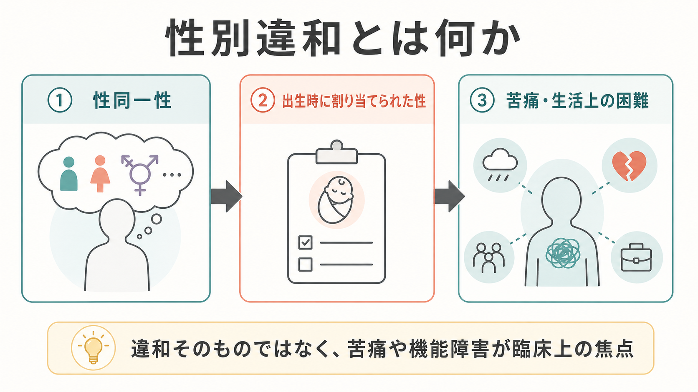
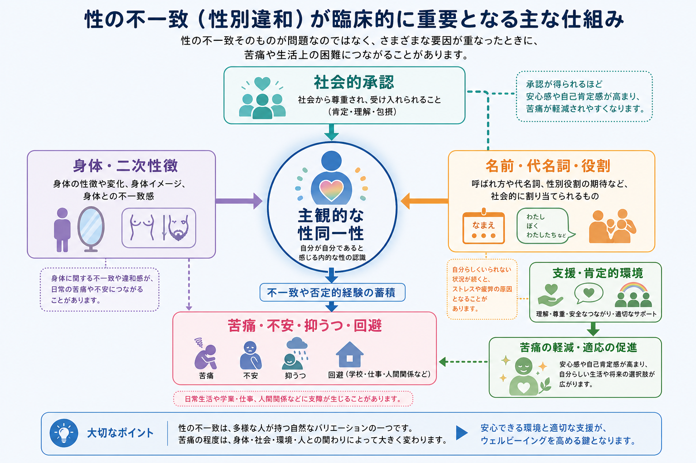
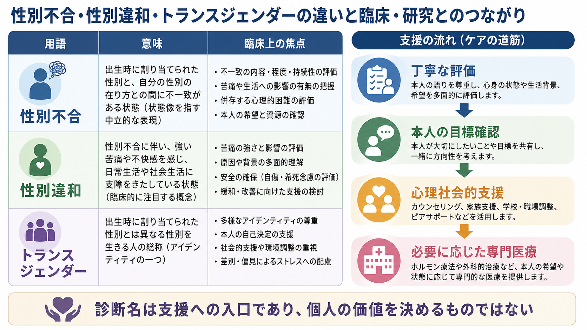

# 性別違和とは何か

## 要点

- 性別違和とは、本人が経験し表現する性同一性と、出生時に割り当てられた性との不一致に関連して、臨床的に意味のある苦痛や生活上の困難が生じている状態を指す[1]。
- 重要なのは「トランスジェンダーであること」や「性別不合そのもの」を病理化しない点である。DSM-5-TR の性別違和は苦痛と機能障害に焦点を置き、ICD-11 の性別不合は精神疾患章ではなく「性の健康に関連する状態」に置かれている[1][2]。
- 苦痛は、身体への違和、名前・代名詞・扱われ方とのズレ、差別やスティグマ、家族・学校・職場での不承認、医療アクセスの困難などによって強まったり弱まったりする[2][3][6]。
- 臨床評価では、本人の語り、苦痛の内容、安全性、併存する[[うつ病とは何か|うつ病]]・[[不安症群とは何か|不安症]]、支援資源、本人が望む支援を丁寧に確認する[3][4]。
- 本稿は教育・研究目的の概説であり、個別の診断、治療適応、医療介入の指示を行うものではない。

## この記事で答える問い

1. 性別違和と、性別不合・トランスジェンダー・性表現はどう違うのか。
2. DSM-5-TR と ICD-11 では、どこに焦点の違いがあるのか。
3. 苦痛はどのような仕組みで生じ、何が支援の対象になるのか。
4. 臨床・研究では、どのような評価と配慮が必要なのか。

## まず結論

性別違和を理解する鍵は、「性の多様性」と「苦痛・機能障害」を分けて考えることである。出生時に割り当てられた性と本人の性同一性が異なること自体は、病気でも、精神疾患でもない。臨床上の焦点になるのは、その不一致が身体、対人関係、社会的扱われ方、将来への不安、差別や孤立と結びつき、本人の生活や安全を脅かしている場合である[1][2]。

そのため、評価は「本人の性同一性が正しいか」を外から判定する作業ではない。本人が何に苦痛を感じ、どの環境なら安全でいられ、どの支援が本人の目標と安全性に合うのかを整理する作業である。この姿勢は、[[DSMとICDは何が違うのか|DSMとICD]] の分類上の違い、[[スティグマとは何か|スティグマ]]、[[偏見と差別は何が違うのか|偏見と差別]]、[[身体イメージとは何か|身体イメージ]]の理解とも接続する。

## 背景

かつて性同一性に関する診断名は、「性同一性障害」など、本人の性のあり方そのものを障害として読ませやすい名称で扱われてきた。DSM-5 以降の gender dysphoria は、不一致そのものではなく、それに伴う苦痛を中心に据える方向へ変わった。APA は、性別不適合それ自体は精神疾患ではなく、臨床的に重要なのはそれに関連した苦痛であると説明している[1]。

ICD-11 ではさらに、gender incongruence が精神疾患の章から外され、「性の健康に関連する状態」の章に置かれた。WHO は、この変更を、トランス関連・ジェンダー多様なアイデンティティを精神的不健康として扱うことによるスティグマを減らしつつ、必要な医療や保険アクセスを確保するための分類上の工夫として説明している[2]。

一方で、診断名をなくせば問題がすべて解決するわけではない。診断分類は医療アクセス、研究、保険制度、学校・職場の合理的配慮に関わる。したがって現在の課題は、本人の存在を病理化せず、必要な支援への入口として診断概念をどう使うかにある。

## 基本概念

### 性同一性、割り当てられた性、性表現

性同一性とは、自分をどのような性として経験しているかという内的感覚である。出生時に割り当てられた性は、出生時の身体的特徴などに基づいて社会的・医療的に割り当てられる分類である。性表現は、服装、髪型、話し方、ふるまい、名前、代名詞など、社会の中で性別化されて受け取られる表現を指す。

これらは関連するが、同じものではない。たとえば、性表現が既存のジェンダー規範と異なることだけで、性別違和や性別不合と判断することはできない。ICD-11 も、ジェンダーに関する行動や好みだけでは診断の根拠にならないと明記している[2]。

### DSM-5-TR の「性別違和」

DSM-5-TR の性別違和では、青年・成人の場合、経験・表現される性と割り当てられた性の顕著な不一致が少なくとも6か月続き、複数の特徴を伴い、さらに臨床的に意味のある苦痛または社会・職業・その他の重要領域での機能障害があることが中心になる[1]。特徴には、一次・二次性徴との不一致、身体的特徴をなくしたい・変えたい欲求、異なる性として扱われたい欲求、異なる性の典型的感情や反応をもつという確信などが含まれる[1]。

ここで中心にあるのは、性同一性ではなく苦痛と機能障害である。したがって、出生時に割り当てられた性と異なる性同一性をもっていても、本人が苦痛や生活上の困難を感じていなければ、DSM 上の性別違和とは限らない。

### ICD-11 の「性別不合」

ICD-11 の gender incongruence は、経験される性と割り当てられた性との顕著で持続的な不一致として定義される。青年・成人では、経験される性として生活し受け入れられたい、必要に応じて身体を経験される性に近づけたい、という希望を伴うことが多い。ただし、思春期前には青年・成人の診断は割り当てられない[2]。

DSM と ICD の違いは、分類の目的にも関係する。DSM は精神科診断の臨床・研究基準として苦痛と機能障害を強調しやすい。一方、ICD-11 は国際的な健康分類として、脱病理化と医療アクセスの両立を意識している。

## 仕組み

性別違和の苦痛は、単一の原因から直線的に生じるものではない。少なくとも、身体との不一致、社会的扱われ方、少数者ストレス、支援資源の有無を分けて考えると理解しやすい。

第一に、身体と自己理解の不一致がある。二次性徴、声、体毛、胸部、体格、生殖器、月経などが、自分の性同一性と合わないものとして経験されると、身体への強い違和、回避、自己注目、[[身体イメージとは何か|身体イメージ]]の苦痛につながることがある。

第二に、社会的に扱われる性との不一致がある。名前、代名詞、制服、トイレ、更衣室、学校・職場での呼ばれ方、家族の理解などが本人の性同一性と合わないと、日常生活の反復的な場面そのものが苦痛の手がかりになる。

第三に、少数者ストレスがある。差別、拒絶、暴力への不安、自己隠蔽、内在化されたスティグマは、[[不安とは何か|不安]]、[[うつ病とは何か|抑うつ]]、孤立、物質使用、自傷・自殺念慮などのリスクと関係しうる[5][6][8]。これは「性同一性が原因で精神症状が生じる」という単純な話ではなく、社会的ストレスと安全な支援の欠如が心理的負荷を増やすという理解である。

## 図解

1枚目の図は、性別違和を「性同一性」「出生時に割り当てられた性」「苦痛・生活上の困難」の関係として整理している。強調点は、不一致そのものではなく、苦痛や機能障害が臨床上の焦点になるという点である。

2枚目の図は、苦痛のメカニズムを、身体・二次性徴、社会的承認、名前・代名詞・役割、支援環境の相互作用として示している。支援の対象は、本人の性同一性を変えることではなく、安全な環境、尊重される呼称、心理社会的支援、必要に応じた専門医療を整えることである。

3枚目の図は、性別不合、性別違和、トランスジェンダーの違いと、臨床・研究とのつながりを比較している。診断名は支援への入口であり、個人の価値を決めるものではない。

## 臨床・研究との接続

### 面接で確認すること

臨床面接では、本人の言葉を尊重しながら、次の点を確認する。

| 見る領域 | 確認する内容 | 注意点 |
|---|---|---|
| 性同一性と性表現 | 本人が自分の性をどう理解し、どの名前・代名詞・表現を望むか | 外見や家族の説明だけで判断しない |
| 苦痛の内容 | 身体への違和、呼ばれ方への苦痛、孤立、将来不安 | 「性同一性が問題」と短絡しない |
| 機能障害 | 学校、仕事、対人関係、睡眠、食事、外出、自己ケア | 環境要因による制限も見る |
| 安全性 | 自傷、希死念慮、暴力被害、家庭内リスク | 必要時は安全確保を優先する |
| 併存症状 | 不安、抑うつ、トラウマ、発達特性、摂食、物質使用 | 併存症状を理由に性同一性を否定しない |
| 支援希望 | 社会的移行、心理支援、医療相談、家族・学校・職場調整 | 本人の目標と意思決定を中心に置く |

WPATH Standards of Care Version 8 は、トランスジェンダー・ジェンダー多様な人々へのケアについて、本人の目標、十分な情報提供、継続的な意思決定参加、家族・学校・職場などの環境への働きかけを重視している[3]。Endocrine Society の臨床ガイドラインも、ホルモン療法などを検討する場合には、診断基準、メンタルヘルス、身体医療、継続的ケアに精通した多職種チームの重要性を述べている[4]。

ただし、支援は医療的移行だけを意味しない。名前や代名詞の尊重、安全に話せる場、家族への心理教育、学校・職場での調整、法的手続きの情報提供、ピアサポートへの接続も重要な支援である[3]。

### 研究上の注意

研究では、「性別違和」「性別不合」「トランスジェンダー」「ノンバイナリー」「ジェンダー多様性」を混同しないことが重要である。対象をどう定義するかによって、サンプル、アウトカム、解釈が大きく変わる。

メンタルヘルス研究では、性別違和そのものと、差別・拒絶・医療アクセス困難などによる二次的負荷を分けて扱う必要がある。Lancet のレビューは、トランスジェンダー集団でメンタルヘルス上の困難や物質使用、感染症リスクなどが高く報告される一方、代表性のあるサンプルや縦断研究が限られることを指摘している[5]。

若年者については、支援と医療介入の効果・リスク・可逆性・発達段階を慎重に評価する必要がある。Tordoff らの前向きコホート研究では、ジェンダー肯定的ケアを受ける若者のうち、思春期ブロッカーまたは性別肯定ホルモンを開始した群で、1年間の中等度以上の抑うつや自傷・自殺念慮のオッズが低いことが報告された[7]。ただしこれは観察研究であり、個別の適応判断を置き換えるものではない。

## よくある誤解

**誤解1: 性別違和は「トランスジェンダーであること」の診断である。**  
違う。トランスジェンダーであること自体は精神疾患ではない。DSM-5-TR の性別違和は、不一致に伴う臨床的に意味のある苦痛または機能障害に焦点を置く[1]。

**誤解2: 性別違和は本人の思い込みを修正すればよい。**  
違う。本人の性同一性を否定したり変えようとしたりする介入は、支援ではなく有害になりうる。支援の焦点は、本人の安全、自己理解、意思決定、環境調整、必要な医療・心理社会的支援である[3]。

**誤解3: 苦痛はすべて身体への違和から生じる。**  
身体への違和は重要な要素だが、呼称、扱われ方、孤立、差別、家族・学校・職場環境、医療アクセスによっても苦痛は大きく変わる[2][6][8]。

**誤解4: 併存する不安や抑うつがあれば、性別違和の訴えは信頼できない。**  
併存症状は評価と支援の対象だが、それだけで本人の性同一性を否定する根拠にはならない。むしろ、不安や抑うつがスティグマ、孤立、身体違和、環境不適合の結果として強まっていないかを検討する必要がある。

**誤解5: 支援とは必ず医療的移行を進めることである。**  
支援は、社会的、心理的、法的、医療的な複数の領域を含む。どの支援を選ぶかは、本人の目標、発達段階、リスク、利益、利用可能な資源によって異なる[3][4]。

## 関連ノート

- [[DSMとICDは何が違うのか]]
- [[うつ病とは何か]]
- [[不安症群とは何か]]
- [[不安とは何か]]
- [[身体イメージとは何か]]
- [[スティグマとは何か]]
- [[偏見と差別は何が違うのか]]
- [[自殺念慮と自殺企図は何が違うのか]]

### 関連ノート候補

- LGBTQ関連メンタルヘルスとは何か
- ジェンダー肯定的ケアとは何か
- マイノリティ・ストレスとは何か
- 性別不合とは何か
- 性同一性とは何か

### MOC更新候補

- `content/00_MOC/` 配下の精神医学・疾患/症候群系 MOC
- ジェンダー、スティグマ、身体性、臨床評価に関する MOC

## 理解チェック

1. 性別違和と、ジェンダー多様性そのものは、どの点で区別されるか。
2. DSM-5-TR の性別違和と ICD-11 の性別不合は、分類上どのように異なるか。
3. 苦痛を強める環境要因には、どのようなものがあるか。
4. 面接で、本人の性同一性を尊重しながら安全性を評価するには、何を確認すべきか。
5. 「医療的移行を望まない人には支援が不要である」という考えは、なぜ不十分か。

## 参考文献

[1] American Psychiatric Association. What is Gender Dysphoria? Psychiatry.org. https://www.psychiatry.org/patients-families/gender-dysphoria/what-is-gender-dysphoria

[2] World Health Organization. Gender incongruence and transgender health in the ICD. https://www.who.int/standards/classifications/frequently-asked-questions/gender-incongruence-and-transgender-health-in-the-icd

[3] Coleman E, Radix AE, Bouman WP, et al. Standards of Care for the Health of Transgender and Gender Diverse People, Version 8. *International Journal of Transgender Health*. 2022;23(Suppl 1):S1-S259. https://doi.org/10.1080/26895269.2022.2100644

[4] Hembree WC, Cohen-Kettenis PT, Gooren L, et al. Endocrine Treatment of Gender-Dysphoric/Gender-Incongruent Persons: An Endocrine Society Clinical Practice Guideline. *The Journal of Clinical Endocrinology & Metabolism*. 2017;102(11):3869-3903. https://doi.org/10.1210/jc.2017-01658

[5] Reisner SL, Poteat T, Keatley J, et al. Global health burden and needs of transgender populations: a review. *The Lancet*. 2016;388(10042):412-436. https://doi.org/10.1016/S0140-6736(16)00684-X

[6] Hendricks ML, Testa RJ. A conceptual framework for clinical work with transgender and gender nonconforming clients: An adaptation of the Minority Stress Model. *Professional Psychology: Research and Practice*. 2012;43(5):460-467. https://doi.org/10.1037/a0029597

[7] Tordoff DM, Wanta JW, Collin A, Stepney C, Inwards-Breland DJ, Ahrens K. Mental Health Outcomes in Transgender and Nonbinary Youths Receiving Gender-Affirming Care. *JAMA Network Open*. 2022;5(2):e220978. https://doi.org/10.1001/jamanetworkopen.2022.0978

[8] Wilson LC, Newins AR, Kassing F, Casanova T. Gender Minority Stress and Resilience Measure: A Meta-Analysis of the Associations with Mental Health in Transgender and Gender Diverse Individuals. *Trauma, Violence, & Abuse*. 2024;25(3). https://doi.org/10.1177/15248380231218288

## 未解決問題

- 性別違和の長期経過は、個人差、社会環境、家族支援、医療アクセスによって大きく変わるため、単一の発達経路として説明しにくい。
- 若年者支援では、本人の苦痛軽減、発達的変化、家族・学校環境、医療介入の可逆性・不可逆性をどう統合して意思決定するかが重要な論点である。
- 研究では、性別違和、性別不合、トランスジェンダー、ノンバイナリー、ジェンダー多様性を操作的にどう区別するかが、結果の解釈に大きく影響する。

## 更新ログ

- 2026-04-28: 指定保存先に記事を作成。DSM-5-TR、ICD-11、WPATH SOC8、Endocrine Society guideline、少数者ストレス、若年者メンタルヘルス研究をもとに整理。
