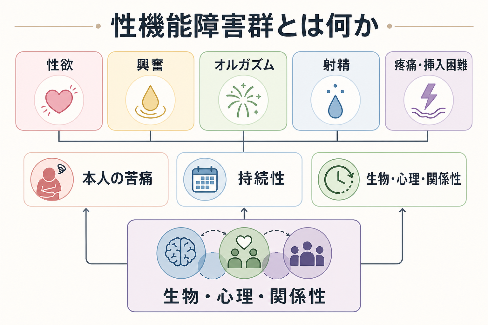
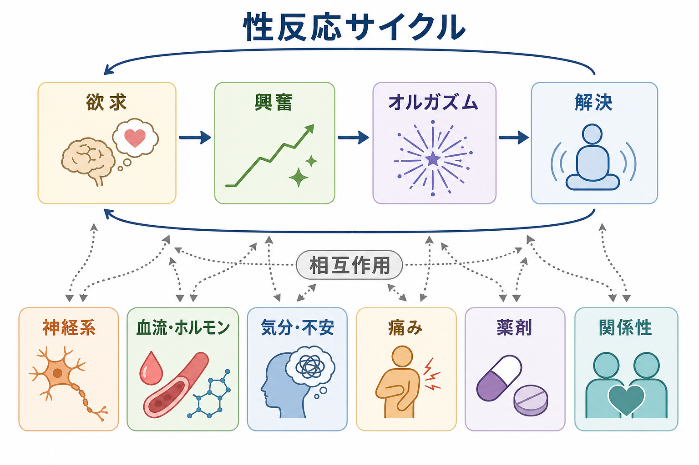
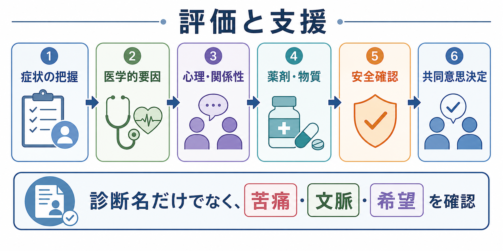

# 性機能障害群とは何か

## 要点

- 性機能障害群は、性欲、興奮、オルガズム、射精、疼痛・挿入困難など、性反応や性活動の複数の段階で生じる困難をまとめる臨床カテゴリーである[1][2]。
- 診断で重要なのは、単に「性反応が少ない」「性交が難しい」という事実ではなく、本人に臨床的に意味のある苦痛があり、持続し、医学的要因・薬剤・心理的要因・関係性・文化的背景を含めて評価されることである[1][2]。
- 性機能は神経系、血流、ホルモン、痛み、気分、不安、薬剤、関係性が相互作用するため、単一原因だけで説明しにくい[3][4]。
- 臨床では、羞恥やスティグマにより自発的に相談されにくいため、敬意ある聞き方と、本人の希望に沿った共同意思決定が重要になる[6][7]。

## この記事で答える問い

1. 性機能障害群は、どのような症状領域を含むのか。
2. 「正常な個人差」と「障害」はどこで区別されるのか。
3. 性反応サイクルと、生物・心理・関係性の要因はどう関わるのか。
4. 臨床や研究では、何を評価し、どのような誤解を避けるべきか。

## まず結論

性機能障害群は、性に関する「能力不足」や「性格の問題」ではない。性欲が低い、興奮しにくい、オルガズムに達しにくい、射精のタイミングが著しく早い・遅い、性活動に痛みや恐怖が伴うといった困難が、本人に苦痛をもたらし、生活や関係性に影響するときに臨床的な評価対象となる[1][2]。

ただし、性反応には大きな個人差がある。性的活動を望まないこと、頻度が少ないこと、特定の相手や状況で反応が変わることは、それだけでは障害を意味しない。診断や支援では、本人の価値観、同意、関係性、安全性、身体疾患、薬剤、精神症状、文化的背景を同時に見る必要がある[3][6]。

## 背景

DSM-5-TRでは、性機能障害群は主に女性の性関心・興奮障害、女性オルガズム障害、性器骨盤痛・挿入障害、男性の低活動性性欲障害、勃起障害、早漏、遅漏、物質・医薬品誘発性性機能障害などとして整理される[1]。ICD-11では、性機能障害は「性健康に関連する状態」の章に置かれ、低活動性性欲機能不全、性興奮機能不全、オルガズム機能不全、射精機能不全などが含まれる[2]。

この配置は、性の問題を精神疾患だけに閉じ込めないために重要である。性機能には、神経、血管、内分泌、骨盤底、疼痛、薬剤、抑うつや不安、トラウマ、関係性、社会文化的規範が関わる。したがって、[[DSMとICDは何が違うのか]]や[[精神科診断における除外診断とは何か]]で扱うように、診断分類は実体そのものではなく、評価と支援を整理するための道具として使う必要がある。

## 基本概念

### 性反応のどの段階に困難があるか

性反応は、古典的には欲求、興奮、オルガズム、解決という段階で説明される。ただし実際の性反応は直線的ではなく、欲求が最初にある場合も、親密さや刺激の後に欲求が高まる場合もある[3]。そのため、どの段階が「欠けているか」だけでなく、本人が何を困っているのかを丁寧に確認する。

| 領域 | 典型的な困難 | 評価で見る点 |
|---|---|---|
| 性欲・関心 | 性的関心や性的思考が著しく低い | 本人の苦痛、関係性、抑うつ、疲労、薬剤、文化的背景 |
| 興奮 | 主観的興奮、潤滑、勃起などが十分に生じない | 血流、神経、ホルモン、痛み、不安、刺激条件 |
| オルガズム | 遅い、得られない、強度が低い | 刺激の十分性、薬剤、神経障害、心理的制止 |
| 射精 | 早い、遅い、射精しない、逆行性射精 | 射精とオルガズムの区別、薬剤、神経、泌尿器疾患 |
| 疼痛・挿入困難 | 挿入時痛、骨盤底緊張、恐怖・回避 | 婦人科・泌尿器科疾患、外傷歴、痛みの学習、関係性 |

### 苦痛と文脈が診断の中心になる

DSM-5-TRでもICD-11でも、多くの性機能障害では持続性と苦痛が重視される[1][2]。たとえば、性欲が低いこと自体は病気ではない。本人がそれを問題と感じていない、または同意と満足のある関係性のなかで困っていないなら、臨床的障害とは限らない。

反対に、頻度や検査値だけでは軽く見える問題でも、本人に強い苦痛、回避、関係性の緊張、自己評価の低下がある場合は評価対象になる。ここでは[[身体症状症とは何か]]と同様に、「症状が実在するかどうか」を疑う姿勢ではなく、症状経験と苦痛がどのように維持されているかを見る姿勢が重要である。

## 仕組み

### 生物心理社会モデル

性機能障害群は、生物・心理・社会関係の重なりとして理解すると見通しがよい。女性の性機能に関するレビューでは、身体的要因、心理的要因、社会文化的要因、対人関係要因を同時に考慮する生物心理社会的アプローチが、研究と臨床の両方で必要だとされる[6]。

生物学的には、血流、末梢神経、自律神経、性ホルモン、疼痛、睡眠、慢性疾患が関わる。心理的には、[[うつ病とは何か]]、[[不安症群とは何か]]、羞恥、パフォーマンス不安、身体イメージ、過去のつらい体験が関わる。社会的には、相手とのコミュニケーション、同意、安全性、役割期待、文化的規範が影響する。

### 性反応サイクルと調整因子

興奮や勃起は、心理的刺激と身体刺激、脳、脊髄、自律神経、血管反応の連携で生じる。男性の勃起では、神経性の一酸化窒素放出、血管平滑筋の弛緩、海綿体への血液流入と静脈流出の制限が重要である[4]。射精は、射出と放出の過程を含み、オルガズムとは重なりやすいが同一ではない[4][8]。

女性の性反応では、主観的な興奮、性器の血流変化、潤滑、痛み、親密さ、関係性の質が密接に関わる[3]。疼痛があると興奮や欲求が二次的に低下し、興奮が低いと潤滑不足や痛みが悪化することもある。したがって、症状領域はしばしば重なり合う。

### 薬剤・物質と精神症状

抗うつ薬、抗精神病薬、降圧薬、ホルモン関連薬、アルコールやその他の物質は、性欲、興奮、オルガズム、射精に影響しうる[4][7]。特にSSRIなどの抗うつ薬に関連する性機能障害は、本人が自発的に言い出しにくく、治療継続やQOLにも関わるため、臨床側から丁寧に確認する必要がある[7]。

一方で、薬剤だけに原因を固定するのも危険である。[[大うつ病性障害とは何か]]、[[PTSDとは何か]]、[[物質使用障害とは何か]]、慢性疼痛、内分泌疾患、循環器疾患、パートナー関係の葛藤が同時に関わることがある。

## 図解

上の2枚の図は、性機能障害群を「症状名の一覧」としてではなく、本人の苦痛、性反応サイクル、調整因子の重なりとして読むための地図である。3枚目は、臨床・研究で何を順に確認するかを示す。

図を読むときの要点は、診断名が最初に来るのではなく、本人の語り、安全性、医学的要因、心理・関係性、薬剤・物質、希望を並行して確認することである。これは[[精神科診断面接で尺度をどう使うか]]にも通じる。尺度は有用だが、尺度だけで診断や支援方針が決まるわけではない。

## 臨床・研究との接続

### 評価

評価では、症状の種類、持続期間、頻度、発症時期、生涯性か獲得性か、全般性か状況依存性か、本人の苦痛、相手との関係、安全性、同意、身体疾患、薬剤・物質、精神症状を確認する[1][2][5]。疼痛や挿入困難では、必要に応じて婦人科・泌尿器科・骨盤底理学療法などとの連携が必要になる。

質問は、侵襲的に詰問するのではなく、「性に関する副作用や困りごとは治療中によく起こるので、確認してもよいですか」のように、話してよい場を作ることが重要である。これは、本人が恥ずかしさや罪悪感を抱きやすいテーマであるほど、臨床者側の通常業務として扱う意味が大きい。

### 支援

支援は原因を一つに決めて終わるものではない。身体疾患の治療、薬剤調整、疼痛への対応、心理教育、認知行動療法、カップル・関係性への支援、骨盤底への介入、性医学的治療などが、状況に応じて組み合わされる[5][6][7][8]。この記事は教育・研究目的の概説であり、個別の診断や治療指示ではない。症状が強い、痛みがある、安全性に不安がある、薬剤との関連が疑われる場合は、医療専門職に相談することが望ましい。

### 研究

研究上の難しさは、性機能が自己報告、関係性、文化、年齢、健康状態に強く左右される点にある。性反応の「標準」を狭く設定しすぎると、個人差を病理化する危険がある。一方で、本人の苦痛を軽視すると、治療可能な医学的・心理的要因を見落とす。したがって、研究では症状だけでなく、苦痛、満足、関係性、同意、QOLを含めたアウトカムが重要になる[6]。

## よくある誤解

**誤解1: 性機能障害はすべて心理的な問題である。**  
実際には、血管、神経、ホルモン、疼痛、薬剤、慢性疾患が関わることが多い[3][4]。心理的要因が関わる場合でも、それは「気の持ちよう」という意味ではない。

**誤解2: 性欲が低いことは必ず障害である。**  
本人が苦痛を感じていない場合や、生活・関係性上の問題になっていない場合、それだけで障害とは言えない[1][2]。

**誤解3: 性機能障害は年齢のせいなので相談しても意味がない。**  
加齢や更年期は関係しうるが、痛み、薬剤、抑うつ、不安、関係性、身体疾患など介入可能な要因もある[6][7]。

**誤解4: 診断名がつけば治療法も一つに決まる。**  
同じ診断名でも、背景にある要因は異なる。診断名は入口であり、支援では本人の希望と文脈を合わせて考える。

## 関連ノート

- [[DSMとICDは何が違うのか]]
- [[精神科診断における除外診断とは何か]]
- [[精神科診断面接で尺度をどう使うか]]
- [[うつ病とは何か]]
- [[大うつ病性障害とは何か]]
- [[不安症群とは何か]]
- [[PTSDとは何か]]
- [[身体症状症とは何か]]
- [[物質使用障害とは何か]]

MOC更新候補: `content/00_MOC/MOC｜精神医学.md` または診断・疾患系MOCがあれば、バッチ統合時に本記事を追加する。

## 理解チェック

1. 性欲が低いことと、性機能障害として評価されることは何が違うか。
2. 性反応サイクルを直線的に見すぎると、どのような誤解が生じるか。
3. 薬剤性の性機能障害を考えるとき、薬剤以外に何を確認する必要があるか。
4. 疼痛・挿入困難がある場合、性欲や興奮の問題とどのように相互作用しうるか。

## 参考文献

[1] American Psychiatric Association. (2022). *Diagnostic and Statistical Manual of Mental Disorders, Fifth Edition, Text Revision (DSM-5-TR).* American Psychiatric Association Publishing. https://doi.org/10.1176/appi.books.9780890425787

[2] World Health Organization. (2026). *ICD-11 for Mortality and Morbidity Statistics: Sexual dysfunctions.* https://icd.who.int/browse/2026-01/mms/en

[3] Conn, A., Hodges, K. R., & Goje, O. (2026). Overview of Female Sexual Function and Dysfunction. *Merck Manual Professional Edition.* https://www.merckmanuals.com/en-ca/professional/gynecology-and-obstetrics/female-sexual-function-and-dysfunction/overview-of-female-sexual-function-and-dysfunction

[4] Jimbo, M., & Gomella, L. G. (2024). Overview of Male Sexual Function and Dysfunction. *Merck Manual Professional Edition.* https://www.merckmanuals.com/professional/genitourinary-disorders/male-sexual-function-and-dysfunction/overview-of-male-sexual-function-and-dysfunction

[5] American College of Obstetricians and Gynecologists. (2019, reaffirmed 2025). Female Sexual Dysfunction. *ACOG Practice Bulletin No. 213.* https://www.acog.org/clinical/clinical-guidance/practice-bulletin/articles/2019/07/female-sexual-dysfunction

[6] Thomas, H. N., & Thurston, R. C. (2016). A biopsychosocial approach to women’s sexual function and dysfunction at midlife: A narrative review. *Maturitas, 87*, 49-60. https://doi.org/10.1016/j.maturitas.2016.02.009

[7] Montejo, A. L., Prieto, N., de Alarcón, R., Casado-Espada, N., de la Iglesia, J., & Montejo, L. (2019). Management Strategies for Antidepressant-Related Sexual Dysfunction: A Clinical Approach. *Journal of Clinical Medicine, 8*(10), 1640. https://doi.org/10.3390/jcm8101640

[8] Shindel, A. W., Althof, S. E., Carrier, S., et al. (2022). Disorders of Ejaculation: An AUA/SMSNA Guideline. *The Journal of Urology.* https://www.auanet.org/guidelines-and-quality/guidelines/disorders-of-ejaculation

## 未解決問題

- DSMとICDの分類差が、日本語圏の臨床記録や研究アウトカムにどの程度影響するか。
- 性的少数者、高齢者、慢性疾患をもつ人、薬物療法中の人に適した評価尺度と支援モデルをどう整えるか。
- 性機能の改善だけでなく、苦痛、同意、安全性、関係満足、QOLをどう同時に測定するか。
