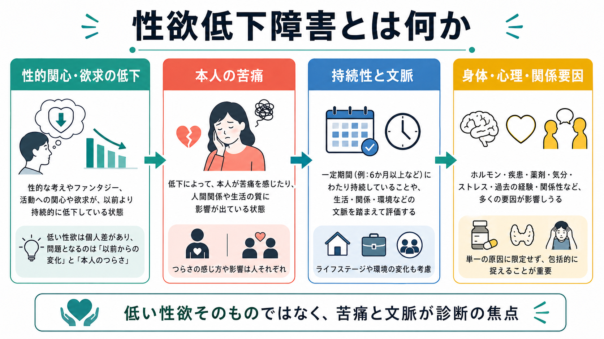
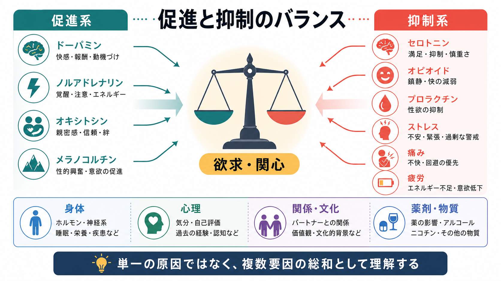
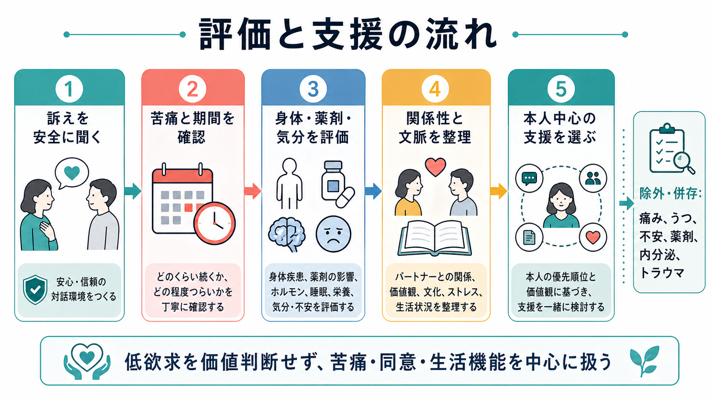

# 性欲低下障害とは何か

## 要点

- 性欲低下障害は、性的関心・欲求・性的な思考や空想の低下が、本人に臨床的に意味のある苦痛をもたらす状態を指す。
- 重要なのは「性欲が平均より低いこと」ではなく、以前からの変化、本人の困りごと、期間、文脈、身体疾患・薬剤・気分症状・関係性の影響を含めた評価である[1][2]。
- DSM-5-TRでは女性では「女性の性的関心・興奮障害」、男性では「男性の低活動性性欲障害」として扱われ、ICD-11では「Hypoactive sexual desire dysfunction」として、持続性・状況依存性・生涯性/獲得性などを区別できる[1][2][3]。
- 神経心理学的には、性的欲求は単一の「性欲中枢」ではなく、報酬、注意、ストレス、痛み、気分、身体状態、関係性、文化的意味づけが重なって生じる[4][5]。

## この記事で答える問い

1. 性欲低下障害は、単なる「性欲が低い状態」と何が違うのか。
2. DSMやICDでは、どのように整理されているのか。
3. どのような身体・心理・関係・薬剤要因が関わりうるのか。
4. 臨床や研究では、どのような点を評価すべきなのか。

## まず結論

性欲低下障害は、性の頻度や欲求の強さを外から規範化して判断する概念ではない。焦点は、性的関心や欲求の低下が持続し、本人が苦痛を感じ、生活・関係・自己評価に影響しているかどうかにある[1][2]。したがって、低い性欲をただ「正常/異常」に分類するのではなく、[[うつ病とは何か]]、[[不安症群とは何か]]、[[PTSDとは何か]]、[[物質使用障害とは何か]]、[[内分泌疾患に伴う精神症状とは何か]]、睡眠、疼痛、薬剤、関係性、文化的背景を含めて、広く文脈化する必要がある。

## 背景

性的欲求には個人差が大きい。年齢、関係性、生活負荷、身体疾患、薬剤、宗教・文化的規範、過去の経験、トラウマ、妊娠・出産・更年期、睡眠や疲労によっても変化する。そのため、低い性欲そのものを病理化すると、無性愛、性的関心の個人差、ライフステージに伴う自然な変化まで「障害」と誤認してしまう危険がある。

一方で、性的欲求の低下が本人にとってつらく、親密さ、自己理解、パートナー関係、生活の質に影響している場合には、臨床的な評価と支援の対象になる。米国のPRESIDE研究では、性的欲求の低下を訴える女性は少なくないが、苦痛を伴う低欲求として把握される割合はその一部であり、「低欲求」と「低欲求による苦痛」を分ける必要が示された[6]。

## 基本概念

### ICD-11での位置づけ

ICD-11のHypoactive sexual desire dysfunctionは、性的活動への欲求や動機づけの欠如または著しい低下として整理される。そこには、自発的な欲求、刺激に反応して生じる欲求、開始後に欲求を保つ力の低下が含まれ、少なくとも数か月にわたり反復的または持続的にみられ、臨床的に意味のある苦痛を伴うことが重視される[1]。ICD-11では、生涯性か獲得性か、全般性か状況性かを区別できるため、発症時期と場面依存性を評価しやすい。

### DSM-5-TRでの位置づけ

DSM-5-TRでは、女性では性欲と興奮の問題が「女性の性的関心・興奮障害」として統合的に扱われる。診断では、性的活動への関心、性的思考や空想、開始や反応性、快感、刺激への反応、性器・非性器感覚などの低下が一定数以上みられ、6か月以上続き、本人に有意な苦痛をもたらすことが求められる[2]。男性では、性的思考・空想や性的活動への欲求が持続的または反復的に乏しく、それが苦痛を伴う状態として、男性の低活動性性欲障害が議論されてきた[3]。

この違いは、女性と男性で欲求・興奮・身体反応の関係が固定的に異なるという単純な話ではない。むしろ、分類体系が「欲求」「興奮」「苦痛」「文脈」をどう切り分けるかの違いであり、実際の評価では性別二分法だけに頼らない慎重さが必要である。

## 仕組み

性的欲求は、促進系と抑制系のバランスとして理解すると見通しがよい。促進側には報酬予測、快感、注意、親密さ、身体的な安全感が関わる。神経伝達・ホルモン系としては、ドーパミン、ノルアドレナリン、オキシトシン、メラノコルチン系などが欲求や動機づけに関与すると考えられている[4][5]。

抑制側には、ストレス、痛み、疲労、抑うつ、不安、恥、罪悪感、関係葛藤、過去のトラウマ、薬剤や物質の影響が入る。たとえばSSRIなど一部の抗うつ薬、オピオイド、抗てんかん薬、β遮断薬、過量飲酒は性的欲求に影響しうる[2]。また、内分泌疾患、閉経関連変化、慢性疼痛、睡眠不足、身体イメージの低下も、性的欲求の抑制要因になりうる。

このモデルの利点は、「原因はホルモンか、心理か、関係性か」という二者択一を避けられる点にある。性欲低下障害では、身体、心理、関係・文化、薬剤・物質が同時に影響することが多い。したがって、ひとつの検査値やひとつの出来事だけで説明しきろうとすると、本人の経験を狭く見積もることになる。

## 図解

評価の入口では、本人が安心して話せる環境をつくることが重要である。性の話題は羞恥、罪悪感、過去の被害経験、パートナーからの圧力と結びつきやすいため、同意、安全、本人の希望を確認しながら進める必要がある[7]。

評価では、少なくとも次の軸を分けて考える。

| 評価軸 | 確認すること | 注意点 |
|---|---|---|
| 変化 | 生涯にわたり低いのか、ある時点から低下したのか | 個人差や無性愛を病理化しない |
| 場面 | 全般的か、特定の相手・状況に限るのか | 関係性、同意、安全感を確認する |
| 苦痛 | 本人がどのようなつらさを感じているか | パートナーや社会規範だけを基準にしない |
| 身体 | 疾患、疼痛、睡眠、疲労、ホルモン変化 | 必要に応じて身体医学的評価へ接続する |
| 心理 | [[大うつ病性障害とは何か]]、不安、トラウマ、自己評価 | 性欲低下を単独の症状として切り離しすぎない |
| 薬剤・物質 | 抗うつ薬、オピオイド、抗てんかん薬、飲酒など | 自己判断で中止せず主治医と相談する |

## 臨床・研究との接続

ISSWSHのケアプロセスは、HSDDを評価するときに、欲求低下の訴えを聞くだけでなく、医学的・心理社会的背景、苦痛、関係性、薬剤、併存症、治療希望を統合することを強調している[7]。これは、性欲低下障害を「個人の意欲不足」や「パートナー関係の問題」だけに還元しないために重要である。

治療研究では、心理教育、性療法、カップルへの介入、気分症状や疼痛の治療、薬剤調整、ホルモン療法や特定薬剤などが検討されてきた。ただし、どの介入が適切かは、性別、閉経状態、身体疾患、薬剤、本人の希望、リスク、利用可能性によって異なる。テストステロン療法については、閉経後女性のHSDDに対するエビデンスを中心に合意声明や実践ガイドラインがあるが、適応、製剤、モニタリング、安全性について慎重な管理が必要である[8]。本記事は教育・研究目的の整理であり、個別の診断や治療指示ではない。

## よくある誤解

### 誤解1：性欲が低ければ障害である

性欲の強さには大きな個人差がある。本人が苦痛を感じておらず、同意と安全が保たれ、生活上の困難もない場合、低い性欲をただちに障害と呼ぶべきではない[1][2]。

### 誤解2：ホルモンだけを測れば原因がわかる

ホルモンは一部の要因になりうるが、性欲は報酬、注意、身体状態、痛み、気分、関係性、文化的意味づけの相互作用として生じる。検査値だけで本人の経験を説明しきることはできない[4][5]。

### 誤解3：パートナーが困っていれば診断できる

臨床的な焦点は本人の苦痛である。パートナーの不満や社会的規範だけを根拠に「障害」と決めると、本人の同意や安全が見えなくなる。

### 誤解4：薬を使えばすぐ解決する

薬物療法が検討される場合もあるが、性欲低下障害では身体、心理、関係性、薬剤、生活環境を含む評価が先に必要である。薬剤変更や治療選択は、主治医や専門家と相談して行う。

## 関連ノート

- [[うつ病とは何か]]
- [[大うつ病性障害とは何か]]
- [[不安症群とは何か]]
- [[PTSDとは何か]]
- [[物質使用障害とは何か]]
- [[内分泌疾患に伴う精神症状とは何か]]
- [[不眠障害とは何か]]
- [[月経前不快気分障害とは何か]]

## MOC更新候補

- `content/00_MOC/` 配下の精神医学・性の健康・臨床心理関連MOCに、この記事へのリンクを追加する候補。
- 並列ジョブとの競合を避けるため、本タスクではMOC本体は更新しない。

## 理解チェック

1. 性欲低下障害で「低い性欲そのもの」より重視される条件は何か。
2. ICD-11で、生涯性/獲得性、全般性/状況性を区別することにはどのような意味があるか。
3. 性欲低下に関わる促進系と抑制系の例を、それぞれ2つ以上挙げられるか。
4. 薬剤・身体疾患・気分症状・関係性を同時に評価する必要があるのはなぜか。

## 未解決問題

- 性欲低下障害の診断基準は、文化差、性別多様性、無性愛スペクトラム、関係形式の多様性をどこまで適切に扱えているか。
- 欲求、興奮、親密さ、同意、安全感を、臨床研究でどのように測定すればよいか。
- 薬物療法、心理社会的介入、関係性への介入を、どのように個別化すべきか。

## 参考文献

[1] World Health Organization / ICD-11 MMS. HA00 Hypoactive sexual desire dysfunction. https://icd.who.int/browse/2025-01/mms/en および ICD-11 MMS rendering: https://www.findacode.com/icd-11/code-1189253773.html

[2] Conn A, Hodges KR. Sexual Interest/Arousal Disorder. *Merck Manual Professional Edition*. Reviewed/Revised Jul 2023, Modified Jan 2026. https://www.merckmanuals.com/professional/gynecology-and-obstetrics/female-sexual-function-and-dysfunction/sexual-interest-arousal-disorder

[3] Brotto LA. The DSM diagnostic criteria for Hypoactive Sexual Desire Disorder in men. *Journal of Sexual Medicine*. 2010;7(6):2015-2030. https://doi.org/10.1111/j.1743-6109.2010.01860.x

[4] Pettigrew J, Novick AM. Hypoactive Sexual Desire Disorder in Women: Physiology, Assessment, Diagnosis, and Treatment. *Journal of Midwifery & Women's Health*. 2021;66(6):740-748. https://doi.org/10.1111/jmwh.13283

[5] Kingsberg SA, Woodard T. Female sexual dysfunction: focus on low desire. *Obstetrics and Gynecology*. 2015;125(2):477-486. https://doi.org/10.1097/AOG.0000000000000620

[6] Shifren JL, Monz BU, Russo PA, Segreti A, Johannes CB. Sexual problems and distress in United States women: prevalence and correlates. *Obstetrics and Gynecology*. 2008;112(5):970-978. https://doi.org/10.1097/AOG.0b013e3181898cdb

[7] Clayton AH, Goldstein I, Kim NN, et al. The International Society for the Study of Women's Sexual Health Process of Care for Management of Hypoactive Sexual Desire Disorder in Women. *Mayo Clinic Proceedings*. 2018;93(4):467-487. https://doi.org/10.1016/j.mayocp.2017.11.002

[8] Parish SJ, Simon JA, Davis SR, et al. International Society for the Study of Women's Sexual Health Clinical Practice Guideline for the Use of Systemic Testosterone for Hypoactive Sexual Desire Disorder in Women. *Journal of Women's Health*. 2021;30(4):474-491. https://doi.org/10.1089/jwh.2020.8878
