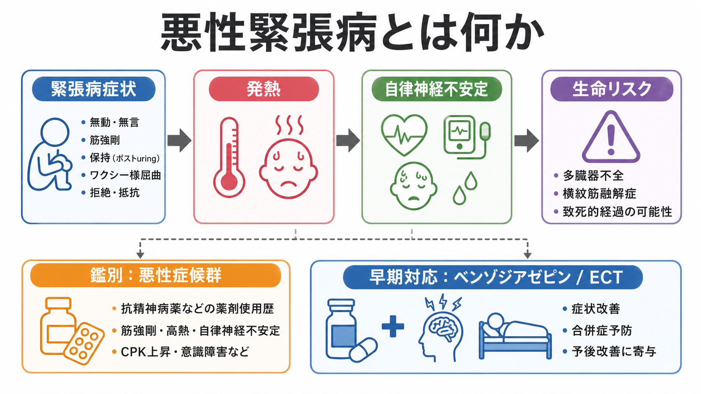
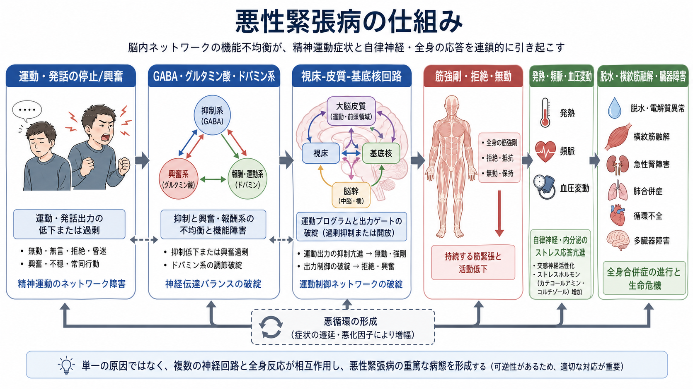
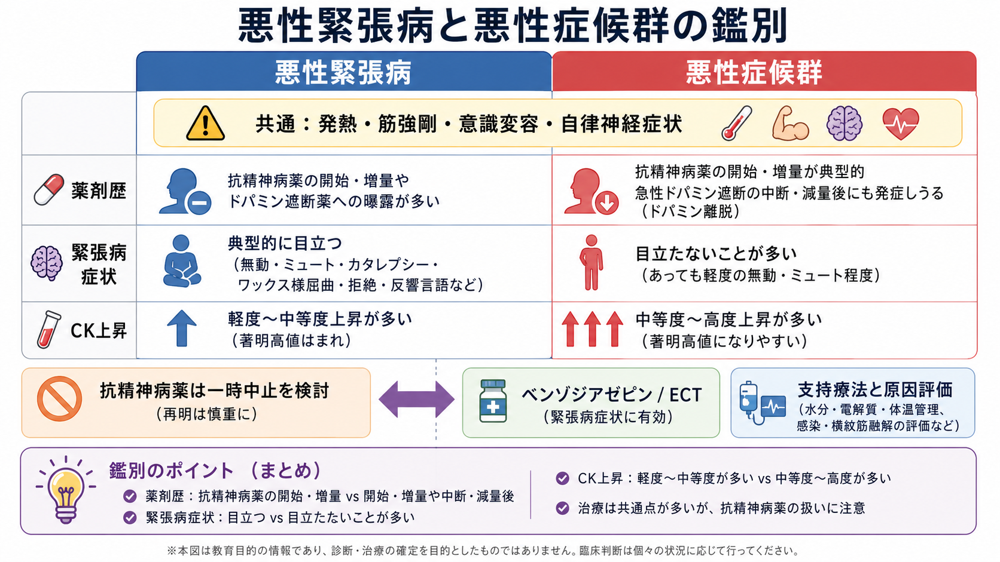

# 悪性緊張病とは何か

## 要点

- 悪性緊張病は、[[カタトニアとは何か|カタトニア]]に発熱、自律神経不安定、意識変容、筋強剛、脱水、横紋筋融解などが重なり、生命に関わりうる重症型である[1][2]。
- 緊張病は、DSM-5-TR や ICD-11 では統合失調症だけに限定されない横断的な精神運動症候群として扱われる。ICD-11 では独立した診断カテゴリとして整理され、少なくとも 3 つの緊張病特徴を確認する考え方が採用されている[3][4]。
- 悪性緊張病と[[悪性症候群ではどのような症状が出るのか|悪性症候群]]は、発熱、筋強剛、意識変容、自律神経症状、CK 上昇などを共有するため、薬剤歴、緊張病症状の先行、筋強剛の質、検査所見、時間経過を組み合わせて考える[1][5]。
- 治療の中心は、身体合併症への支持療法、原因検索、ベンゾジアゼピン、必要時の電気けいれん療法 ECT である。抗精神病薬は悪化や悪性症候群との重なりを招くことがあるため、急性期には慎重に扱う[1][2][6]。
- 本稿は教育・研究目的の整理であり、個別症例の診断や治療指示ではない。発熱と意識変容、強い筋強剛、摂食・飲水不能、自律神経不安定がある場合は、救急・身体診療を含む専門的評価が必要になる。

## この記事で答える問い

1. 悪性緊張病は、通常の緊張病と何が違うのか。
2. 発熱、自律神経症状、筋強剛、意識変容はどのように結びつくのか。
3. 悪性症候群と何が似ていて、どこで見分けるのか。
4. 臨床では何を急いで評価し、どのような治療原理で考えるのか。

## まず結論

悪性緊張病は、単に「カタトニアが強い状態」ではなく、精神運動症状と全身生理の破綻が同時に進む緊急状態である。中核には、昏迷、無言、拒絶、姿勢保持、蝋屈、常同、興奮などの緊張病症状があり、そこに高体温、頻脈、血圧変動、発汗、脱水、筋強剛、意識変容、横紋筋融解、腎障害などが加わる[1][2]。

最も重要な実践的ポイントは、悪性緊張病と悪性症候群を「どちらか一方だけ」と早く決めつけないことである。悪性症候群は、抗精神病薬などのドパミン遮断薬の開始・増量、またはドパミン作動薬の中断・減量と関連して起こることが多く、発熱、鉛管様筋強剛、意識変容、自律神経不安定、CK 上昇を示す[5]。一方、悪性緊張病では、薬剤暴露なしに緊張病症状が先行し、行動変化や精神病性興奮から昏迷へ移る経過をとることがある[1][5]。

ただし両者は重なり合う。悪性緊張病の患者に抗精神病薬が投与されると、悪性症候群様の病態が誘発・増悪することがある。したがって、急性期には身体管理、原因検索、緊張病への治療反応、薬剤歴を並行して確認する必要がある[1][6]。

## 背景

緊張病は、かつて統合失調症の一型として理解されやすかった。しかし現在は、気分症、精神病性障害、発達症、神経疾患、自己免疫性脳炎、代謝性疾患、薬剤・物質関連状態、集中治療後の状態など、多様な背景で起こりうる精神運動症候群として扱われる[2][3]。この見方は、[[統合失調症とは何か|統合失調症]]だけに診断を閉じないために重要である。

ICD-11 では、緊張病は独立した診断カテゴリとして整理され、別の精神疾患に伴う緊張病、物質・薬剤誘発性緊張病、身体疾患に伴う二次性緊張病、特定不能の緊張病が区別される[4]。DSM-5-TR でも、緊張病は複数の精神疾患や医学的状態にまたがる指定子・診断として扱われる[3]。

悪性緊張病は、その中でも発熱と自律神経不安定を伴う重症型である。BAP 2023 ガイドラインは、緊張病を軽症から悪性までの連続体として捉え、悪性緊張病を高体温と自律神経機能障害を含む重症状態として整理している[1]。歴史的には「致死性緊張病」「lethal catatonia」と呼ばれ、抗精神病薬の普及以前から、強い興奮、昏迷、発熱、循環虚脱、昏睡、死亡に至る症例が記載されてきた[1]。

## 基本概念

### 緊張病症状が土台にある

悪性緊張病を理解するには、まず緊張病症状を確認する必要がある。代表的な症状には、昏迷、無言、拒絶、姿勢保持、蝋屈、常同、反響言語、反響動作、目的のはっきりしない興奮などがある[1][3]。これらは、単なる「動かない」「話さない」ではなく、運動開始、運動停止、姿勢制御、他者からの刺激への反応がまとまって変化する状態である。

悪性緊張病では、こうした精神運動症状に全身症状が加わる。見落としやすいのは、興奮型から昏迷型へ、あるいは活動低下と興奮が交互に現れる場合である。たとえば、強い興奮、睡眠不良、拒食・拒水、脱水が続き、その後に無言・無動・筋強剛・発熱が目立つ経過は、悪性緊張病を考える入口になる。

### 「悪性」とは何を指すのか

ここでの「悪性」は腫瘍の悪性ではなく、生命リスクを伴う急性・重症の臨床経過を指す。具体的には、次のような全身合併症が問題になる。

| 領域 | 代表的な所見 | なぜ重要か |
|---|---|---|
| 体温・自律神経 | 発熱、頻脈、血圧変動、発汗、頻呼吸 | 循環不全、脱水、代謝負荷につながる |
| 筋・腎 | 筋強剛、CK 上昇、横紋筋融解、腎障害 | 長時間の筋緊張や興奮で臓器障害が進む |
| 意識・認知 | 意識変容、せん妄との重なり | 感染、脳炎、中毒、代謝異常も同時に除外する必要がある |
| 栄養・水分 | 拒食、拒水、脱水、電解質異常 | 身体状態をさらに悪化させる |
| 呼吸・循環 | 肺炎、塞栓、循環不全 | 臥床、嚥下障害、脱水、興奮がリスクになる |

このため、悪性緊張病は精神科だけで完結する病態ではない。救急、内科、神経内科、集中治療、麻酔科、精神科が同時に関わることがある[2][6]。

## 仕組み

悪性緊張病の病態は、単一の神経伝達物質だけでは説明できない。現在のレビューでは、GABA、グルタミン酸、ドパミン、前頭前野、視床、基底核、運動制御ネットワーク、自律神経・内分泌ストレス応答が複合的に関与すると考えられている[2][7]。

### 精神運動ネットワークの破綻

緊張病では、運動を始める、止める、切り替える、他者の刺激に反応するという制御が不安定になる。前頭前野、補足運動野、基底核、視床を含むネットワークは、運動出力だけでなく、意思決定、動機づけ、注意、情動とも結びついている。このため、無動と興奮、拒絶と反響現象、姿勢保持と常同運動が、同じ患者の中で入れ替わって現れることがある[2][7]。

GABA 系の機能低下、グルタミン酸系の過活動、ドパミン系の調節異常は、緊張病の説明仮説として繰り返し議論されている[2][7]。ベンゾジアゼピンへの反応性は GABA 系の関与を示唆するが、それだけで病態全体を説明できるわけではない。悪性化では、精神運動症状が持続し、脱水、発熱、筋強剛、感染、薬剤、身体疾患が相互に増幅する。

### 自律神経・内分泌ストレス応答

悪性緊張病で生命リスクが高まる理由は、精神運動症状だけでなく、全身の生理反応が巻き込まれるからである。持続する興奮や筋緊張、拒食・拒水、睡眠障害は、交感神経活動、体温調節、水分・電解質、筋代謝に負荷をかける。発熱や頻脈、血圧変動がある場合、感染症、自己免疫性脳炎、甲状腺疾患、中毒、離脱、悪性症候群、セロトニン症候群、熱中症なども同時に評価する必要がある[1][5][6]。

### 悪循環として見る

悪性緊張病は、次のような悪循環として理解しやすい。

1. 緊張病症状により、摂食・飲水・睡眠・活動が崩れる。
2. 脱水、電解質異常、筋緊張、感染リスク、身体疲弊が進む。
3. 発熱、自律神経不安定、意識変容、CK 上昇が目立つ。
4. 身体状態の悪化が、さらに緊張病症状やせん妄を増幅する。

この悪循環を断つには、緊張病への治療だけでなく、身体管理と原因評価が同時に必要になる。

## 図解

3 枚目は、悪性緊張病と悪性症候群の鑑別をまとめた図である。両者は発熱、筋強剛、意識変容、自律神経症状を共有するため、「薬剤歴があるから悪性症候群」「緊張病症状があるから悪性緊張病」と単純に分けるのではなく、時間経過と臨床像を合わせて判断する。

## 臨床・研究との接続

### 悪性症候群との鑑別

悪性症候群は、抗精神病薬などのドパミン遮断薬への曝露、またはパーキンソン病治療薬などのドパミン作動薬の急な中断と関連して起こる生命に関わる薬剤性症候群である。典型的には、発熱、強い筋強剛、意識変容、自律神経不安定、CK 上昇、白血球増多などを示す[5][8]。

悪性緊張病との鑑別では、次の点を確認する。

| 観点 | 悪性緊張病で重視する所見 | 悪性症候群で重視する所見 |
|---|---|---|
| 先行経過 | 緊張病症状、精神病性興奮、拒食・拒水、無言、姿勢保持などが先行 | 抗精神病薬の開始・増量、注射製剤、ドパミン作動薬の中断・減量 |
| 筋強剛 | 姿勢保持、蝋屈、拒絶、断続的な筋緊張が目立つことがある | 鉛管様の全身性筋強剛が目立ちやすい |
| 検査 | CK 上昇はありうるが、経過や筋活動に依存する | CK 高値、白血球増多、横紋筋融解が目立つことがある |
| 治療反応 | ベンゾジアゼピンや ECT への反応が重要 | 原因薬剤中止、支持療法、場合によりドパミン作動薬・筋弛緩薬が検討される |
| 注意点 | 抗精神病薬で悪化することがある | 緊張病が背景にあると両者が重なる |

Berman のレビューは、NMS の鑑別として感染、中毒、熱中症、セロトニン症候群、悪性高熱、離脱、非けいれん性てんかん重積、致死性緊張病などを挙げ、NMS と致死性緊張病の区別が難しいことを強調している[5]。したがって、実践では「鑑別診断とは何か」を固定ラベルの当てはめではなく、危険な代替診断を同時に潰していく過程として理解する必要がある。

### 評価の入口

緊張病が疑われる場合、観察と尺度化が重要になる。Bush-Francis Catatonia Rating Scale などの尺度は、緊張病症状を標準化して評価する代表的な手段として、研究・臨床で広く使われている[1]。ただし、悪性緊張病では尺度だけでは足りない。体温、脈拍、血圧、酸素化、摂食・飲水、尿量、CK、腎機能、電解質、炎症反応、感染評価、薬剤歴、物質使用、神経学的所見、脳炎やてんかんの可能性を同時に見る。

### 治療原理

BAP ガイドラインと近年のレビューでは、緊張病治療の柱としてベンゾジアゼピンと ECT が繰り返し挙げられている[1][2][6]。悪性緊張病では、身体合併症のリスクが高いため、早期に支持療法と ECT 適応を検討することがある[1][6]。ここでいう支持療法には、補液、電解質補正、体温管理、栄養、血栓予防、嚥下・誤嚥対策、感染評価、横紋筋融解・腎障害への対応などが含まれる。

抗精神病薬は、背景に精神病症状がある場合でも急性期には慎重に扱う。緊張病そのものを悪化させる可能性、悪性症候群を誘発・増悪する可能性、鑑別を難しくする可能性があるからである[1][4][6]。一方で、病態が安定した後に、背景疾患に応じて抗精神病薬を再検討する場面はありうる。その判断は、急性期の生命リスクを超えた後に、専門家が慎重に行うべきものである。

### 研究上の論点

悪性緊張病の研究は、ランダム化比較試験が少なく、症例集積、観察研究、レビュー、専門家合意に依存する部分が大きい[1][6]。その理由は、頻度が低く、重症で、背景疾患が多様で、倫理的にも標準化研究が難しいからである。

今後の課題は、緊張病の早期検出、悪性化リスクの予測、悪性症候群との境界、自己免疫性脳炎や感染症との関係、ECT へのアクセス、ICU での評価、薬剤再開のタイミングなどである。[[脳ネットワークの破綻は精神疾患をどう説明するのか|脳ネットワーク]]、[[GABAは脳で何をしているのか|GABA]]、[[ドパミンは報酬だけの物質なのか|ドパミン]]、[[自律神経ネットワークは内臓状態をどう制御するのか|自律神経ネットワーク]]をつなぐ研究が、単なる症候記述を超えた理解に役立つ可能性がある。

## よくある誤解

### 「悪性緊張病は統合失調症の重症型である」

誤りである。緊張病は統合失調症だけでなく、気分症、身体疾患、神経疾患、薬剤・物質関連状態など多様な背景で起こりうる[3][4]。悪性緊張病も、統合失調症に限定されない。

### 「発熱と筋強剛があれば悪性症候群で決まり」

危険な単純化である。悪性症候群は重要な鑑別だが、悪性緊張病、セロトニン症候群、感染症、脳炎、熱中症、悪性高熱、てんかん重積、離脱なども考える必要がある[5][8]。薬剤歴があっても、背景に緊張病がある場合は両者が重なりうる。

### 「緊張病なら抗精神病薬で落ち着かせればよい」

急性の悪性緊張病では、抗精神病薬が悪化や悪性症候群様病態につながる可能性があるため、安易な使用は避けるべきとされる[1][6]。興奮が目立つ場合でも、緊張病か、せん妄か、中毒か、薬剤性症候群かを評価する必要がある。

### 「ロラゼパムに反応すれば安全」

ベンゾジアゼピンへの反応は重要な手がかりだが、悪性緊張病では身体合併症が同時に進みうる。反応があっても、脱水、横紋筋融解、腎障害、感染、血栓、栄養、嚥下、ECT 適応を含めて評価を続ける必要がある[1][2]。

## 関連ノート

- [[カタトニアとは何か]]
- [[悪性症候群ではどのような症状が出るのか]]
- [[統合失調症とは何か]]
- [[せん妄とは何か]]
- [[身体合併症は精神科診療でなぜ重要なのか]]
- [[鑑別診断とは何か]]
- [[GABAは脳で何をしているのか]]
- [[グルタミン酸は脳で何をしているのか]]
- [[ドパミンは報酬だけの物質なのか]]
- [[自律神経ネットワークは内臓状態をどう制御するのか]]

MOC 更新候補: `content/00_MOC/` 配下の精神医学、症候学、救急・身体合併症関連 MOC。並列ジョブとの競合を避けるため、本稿では MOC 本体は更新しない。

今後の作成候補: 「ECTとは何か」「ロラゼパムチャレンジとは何か」「BFCRSとは何か」「セロトニン症候群と悪性症候群はどう違うのか」「自己免疫性脳炎と緊張病はどう関係するのか」。

## 理解チェック

1. 悪性緊張病を、通常の緊張病から区別して考える理由は何か。
2. 悪性緊張病と悪性症候群に共通する所見を 4 つ挙げよ。
3. 悪性症候群を疑ううえで、薬剤歴のどの点を確認する必要があるか。
4. 悪性緊張病で、身体管理と原因検索を同時に行う必要があるのはなぜか。
5. 抗精神病薬を急性期に慎重に扱う理由を説明せよ。

## 参考文献

[1] Rogers, J. P., Oldham, M. A., Fricchione, G., et al. (2023). Evidence-based consensus guidelines for the management of catatonia: Recommendations from the British Association for Psychopharmacology. *Journal of Psychopharmacology, 37*(4), 327-369. https://doi.org/10.1177/02698811231158232

[2] Hirjak, D., Rogers, J. P., Wolf, R. C., et al. (2024). Catatonia. *Nature Reviews Disease Primers, 10*, 49. https://doi.org/10.1038/s41572-024-00534-w

[3] Wilson, J. E., Oldham, M. A., Francis, A., et al. (2025). Catatonia: American Psychiatric Association Resource Document. *Journal of the Academy of Consultation-Liaison Psychiatry, 66*(4), 277-299. https://doi.org/10.1016/j.jaclp.2025.05.001

[4] Rogers, J. P., Wilson, J. E., & Oldham, M. A. (2025). Catatonia in ICD-11. *BMC Psychiatry, 25*, 405. https://doi.org/10.1186/s12888-025-06857-6

[5] Berman, B. D. (2011). Neuroleptic malignant syndrome: A review for neurohospitalists. *The Neurohospitalist, 1*(1), 41-47. https://doi.org/10.1177/1941875210386491

[6] Connell, J., Oldham, M., Pandharipande, P., et al. (2023). Malignant catatonia: A review for the intensivist. *Journal of Intensive Care Medicine, 38*(2), 137-150. https://doi.org/10.1177/08850666221114303

[7] Walther, S., Stegmayer, K., Wilson, J. E., & Heckers, S. (2019). Structure and neural mechanisms of catatonia. *The Lancet Psychiatry, 6*(7), 610-619. https://doi.org/10.1016/S2215-0366(18)30474-7

[8] Pelonero, A. L., Levenson, J. L., & Pandurangi, A. K. (1998). Neuroleptic malignant syndrome: A review. *Psychiatric Services, 49*(9), 1163-1172. https://doi.org/10.1176/ps.49.9.1163

## 未解決問題

- 悪性緊張病と悪性症候群は、どこまで別個の疾患単位で、どこから共通の最終経路をもつ症候群として扱うべきか。
- 緊張病の悪性化を予測する臨床指標、検査所見、神経生理指標は何か。
- ICU や一般病棟で、せん妄と緊張病を同時に評価する実用的な手順をどう標準化できるか。
- ECT へのアクセスが限られる環境で、悪性緊張病の転帰をどのように改善できるか。
