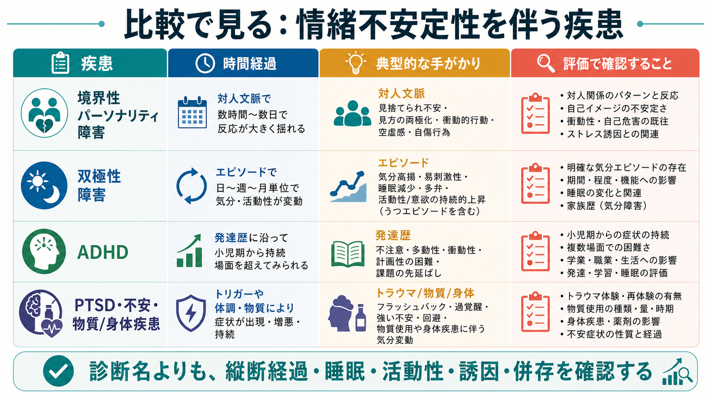
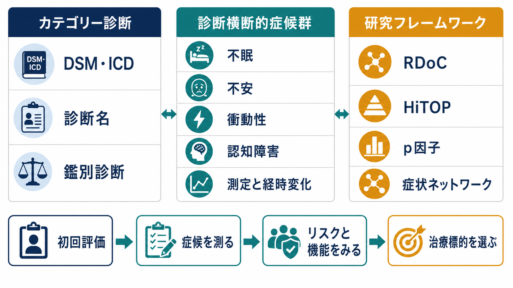

# 情緒不安定性を伴う疾患には何があるのか

## 要点

- 情緒不安定性は診断名ではなく、怒り、不安、落ち込み、焦燥、衝動性などが変動しやすいという横断的な症候である。
- 比較の中心は「どの感情か」よりも、**何をきっかけに、どのくらい続き、睡眠・活動性・対人関係・発達歴とどう結びつくか**である。
- 代表的には[[境界性パーソナリティ障害とは何か|境界性パーソナリティ障害]]、[[双極性障害とは何か|双極性障害]]、[[ADHDとは何か|ADHD]]、[[PTSDとは何か|PTSD]]、[[不安症群とは何か|不安症群]]、[[物質使用障害とは何か|物質使用障害]]、[[身体疾患による気分障害とは何か|身体疾患による気分障害]]などで問題になる。
- 本記事は教育・研究目的の整理であり、個別の診断や治療方針を決めるものではない。

## この記事で答える問い

1. 情緒不安定性を伴う疾患には何があるのか。
2. 境界性パーソナリティ障害、双極性障害、ADHDは何が似ていて、何が違うのか。
3. 臨床・研究では、どの軸で情緒不安定性を整理すると誤解が減るのか。

## まず結論

情緒不安定性を見たときに、最初から「境界性か、双極性か、ADHDか」と一つの診断名に急ぐと混乱しやすい。実用的には、次の4軸で整理する。

| 軸 | 見ること | 典型的に役立つ区別 |
|---|---|---|
| 時間スケール | 数分から数時間か、数日から数週間か、発達早期から持続するか | 境界性パーソナリティ障害、双極性障害、ADHDの区別 |
| 誘因 | 対人ストレス、報酬遅延、睡眠変化、物質、身体疾患など | 反応性か、エピソード性か、二次性か |
| 随伴所見 | 睡眠欲求、活動性、発話量、注意、衝動性、解離、過覚醒 | 双極性障害、ADHD、PTSDなどの見分け |
| 縦断経過 | 小児期からの持続、反復エピソード、外傷後の変化、物質使用との時間関係 | 診断名よりも経過の再構成 |

## 背景

情緒不安定性は、多くの精神疾患でみられる。境界性パーソナリティ障害では対人関係、見捨てられ不安、自己像の揺れ、自傷・衝動性と結びつきやすい[1]。双極性障害では、気分だけでなく睡眠欲求、活動性、発話、思考速度、リスク行動がまとまって変化するエピソードとして現れやすい[2]。ADHDでは、不注意・多動性・衝動性に加えて、感情調節困難が生活機能に影響することがある[3][4]。

このため、情緒不安定性は「疾患特異的な症状」というより、複数の病態にまたがる症候として扱う方がよい。研究上も、診断カテゴリーだけでなく、衝動性、不安、睡眠、報酬感受性、対人感受性といった次元を測る発想が重要になる[8]。

## 基本概念

### 情緒不安定性

ここでは、情緒不安定性を「感情反応の強さ、変化の速さ、持続時間、回復のしにくさが生活機能に影響する状態」と広く定義する。怒りや悲しみだけでなく、不安、焦燥、空虚感、過覚醒、過活動、衝動性を含めて見る。

### 境界性パーソナリティ障害

境界性パーソナリティ障害では、情緒不安定性は対人関係や自己像の揺れと結びつきやすい。見捨てられ不安、急な理想化と失望、強い怒り、空虚感、自傷・自殺関連行動が同時に問題になることがある[1]。変動は数分から数時間、あるいは数日単位で、対人ストレスに反応して目立つことが多い。

### 双極性障害

双極性障害では、気分変化は「エピソード」としてまとまって現れる。躁病・軽躁病では、睡眠欲求の低下、活動性の上昇、多弁、観念奔逸、誇大性、リスク行動などが組み合わさる[2]。単に気分が変わりやすいだけでなく、普段の本人から見て質的に異なる状態が日単位から週単位で続く点が重要である。

### ADHD

ADHDでは、発達早期から続く不注意、多動性、衝動性が複数場面で機能障害をもたらす[3]。感情調節困難は公式診断基準の中核症状だけでは説明しきれないが、実行機能、報酬遅延への弱さ、衝動的反応、課題切り替えの難しさと結びついて臨床上重要になる[4]。

### PTSD、不安、物質、身体疾患

PTSDでは、外傷後の侵入症状、回避、認知・気分の陰性変化、過覚醒が情緒不安定性として見えることがある[7]。不安症、うつ病、物質使用、薬剤、内分泌・神経疾患なども、焦燥、怒りっぽさ、涙もろさ、睡眠障害、注意低下を伴うことがある。したがって、情緒不安定性を見たら精神疾患名だけでなく、身体・薬剤・物質・睡眠・生活リズムも確認する。

## 仕組み

情緒不安定性を整理する最も重要な仕組みは、**時間スケールの違い**である。

境界性パーソナリティ障害では、対人ストレス、拒絶感、見捨てられ不安が急な情動反応を引き起こしやすい。双極性障害では、気分、睡眠、活動性、認知速度、リスク行動がまとまって変化し、エピソードとして経過する。ADHDでは、感情反応の強さが、発達早期から続く注意制御・実行機能・衝動性の文脈で理解される。

この違いは、次のように言い換えられる。

| 疾患・状態 | 情緒不安定性の典型的な形 | 確認したいこと |
|---|---|---|
| 境界性パーソナリティ障害 | 対人文脈で急に強く揺れる | 見捨てられ不安、自己像、対人パターン、自傷・衝動性 |
| 双極性障害 | 日単位から週単位の気分エピソード | 睡眠欲求、活動性、発話量、リスク行動、家族歴 |
| ADHD | 発達早期から続く衝動性・感情調節困難 | 小児期からの経過、複数場面、注意・実行機能、報酬遅延 |
| PTSD | 外傷記憶や過覚醒に関連する揺れ | 侵入症状、回避、過覚醒、解離、トラウマ関連手がかり |
| 物質・薬剤・身体疾患 | 使用、離脱、身体状態に連動する変動 | 物質使用歴、薬剤、睡眠、内分泌・神経・全身疾患 |

## 図解

下の図は、鑑別でよく使う軸をまとめた補助図である。図中の分類は学習用の整理であり、実際には併存や重なりがありうる。

## 臨床・研究との接続

臨床では、情緒不安定性を訴える人に対して「どの診断名か」を単発面接で決めるより、縦断経過を再構成することが重要である。本人の語り、家族や周囲からの情報、睡眠・活動量・物質使用・服薬・身体疾患の変化を合わせて見る。境界性パーソナリティ障害と双極性障害の鑑別では、短い反応性の揺れと、睡眠・活動性を伴うエピソード性の変化を区別することが中心になる[5][6]。

研究では、診断カテゴリーだけでなく、感情反応性、衝動性、報酬遅延、睡眠、対人感受性、外傷関連過覚醒などを次元として測ることが有用である。これは、[[パーソナリティ障害と双極性障害はどう鑑別するのか]]、[[ADHDと双極性障害はどう鑑別するのか]]、[[パーソナリティ障害と発達特性はどう鑑別するのか]]のような鑑別記事とも接続する。

## よくある誤解

### 誤解1: 気分が変わりやすいなら双極性障害である

違う。双極性障害では、気分だけでなく睡眠欲求、活動性、発話量、思考速度、リスク行動がまとまって変化するエピソード性が重要である[2]。数分から数時間の反応性の揺れだけでは、双極性障害とは判断できない。

### 誤解2: 怒りっぽいなら境界性パーソナリティ障害である

違う。怒りや衝動性は、ADHD、PTSD、不安症、うつ病、物質使用、身体疾患でも起こりうる。境界性パーソナリティ障害を考える場合も、対人関係、自己像、見捨てられ不安、慢性的空虚感、自傷・自己破壊的行動を含めて評価する[1]。

### 誤解3: ADHDは注意の問題だけで、感情とは関係しない

違う。ADHDの中核は不注意・多動性・衝動性だが、感情調節困難は生活機能や併存症に大きく関わることがある[4]。ただし、ADHDの感情の揺れを双極性障害の気分エピソードと同一視しないことが重要である。

### 誤解4: 併存を考えると診断が曖昧になるだけである

併存を考えることは、むしろ安全性と支援設計に役立つ。たとえばADHDと双極性障害、境界性パーソナリティ特性とPTSD、物質使用と不安症は併存しうる。診断名を一つに絞るより、現在のリスク、睡眠、衝動性、対人危機、物質使用、身体疾患を分けて見る方が実践的である。

## 関連ノート

- [[境界性パーソナリティ障害とは何か]]
- [[双極性障害とは何か]]
- [[双極I型障害とは何か]]
- [[双極II型障害とは何か]]
- [[ADHDとは何か]]
- [[ADHDと双極性障害はどう鑑別するのか]]
- [[パーソナリティ障害と双極性障害はどう鑑別するのか]]
- [[パーソナリティ障害と発達特性はどう鑑別するのか]]
- [[PTSDとは何か]]
- [[複雑性PTSDとは何か]]
- [[物質使用障害とは何か]]
- [[身体疾患による気分障害とは何か]]

### MOC更新候補

- [[MOC｜精神医学]]
- [[MOC｜症候学]]
- [[MOC｜総論・診断・面接]]
- [[MOC｜神経科学と精神疾患]]

## 理解チェック

1. 情緒不安定性を見たとき、時間スケールを確認する理由は何か。
2. 境界性パーソナリティ障害と双極性障害を区別するうえで、睡眠・活動性はどのように役立つか。
3. ADHDの感情調節困難を、双極性障害の軽躁エピソードと混同しないために何を聞くべきか。
4. PTSD、物質使用、身体疾患が情緒不安定性として見える場合、どのような経過情報が必要か。

## 未解決問題

- 情緒不安定性を、診断カテゴリーを超えた次元として測る尺度を、臨床現場でどこまで使えるか。
- スマートフォン、睡眠計、活動量計などの縦断データは、境界性パーソナリティ障害、双極性障害、ADHDの鑑別精度をどの程度高めるか。
- 併存例では、どの症候を優先して介入することが長期予後や自傷リスクの低下に最も寄与するか。

## 参考文献

[1] National Institute for Health and Care Excellence. (2009). *Borderline personality disorder: recognition and management* (Clinical guideline CG78). https://www.nice.org.uk/guidance/cg78

[2] National Institute for Health and Care Excellence. (2025). *Bipolar disorder: assessment and management* (Clinical guideline CG185). https://www.nice.org.uk/guidance/cg185

[3] National Institute of Mental Health. (2025). *Attention-Deficit/Hyperactivity Disorder*. https://www.nimh.nih.gov/health/topics/attention-deficit-hyperactivity-disorder-adhd

[4] Faraone, S. V., Rostain, A. L., Blader, J., Busch, B., Childress, A. C., Connor, D. F., & Newcorn, J. H. (2019). Practitioner Review: Emotional dysregulation in attention-deficit/hyperactivity disorder. *Journal of Child Psychology and Psychiatry*, 60(2), 133-150. https://doi.org/10.1111/jcpp.12899

[5] Sanches, M. (2019). The limits between bipolar disorder and borderline personality disorder: A review of the evidence. *Diseases*, 7(3), 49. https://doi.org/10.3390/diseases7030049

[6] Bayes, A. J., McClure, G., Fletcher, K., Román Ruiz del Moral, Y. E., Hadzi-Pavlovic, D., Stevenson, J. L., Manicavasagar, V., & Parker, G. B. (2016). Differentiating the bipolar disorders from borderline personality disorder. *Acta Psychiatrica Scandinavica*, 133(3), 187-195. https://doi.org/10.1111/acps.12509

[7] National Institute for Health and Care Excellence. (2018, updated). *Post-traumatic stress disorder* (NICE guideline NG116). https://www.nice.org.uk/guidance/ng116

[8] Kotov, R., Krueger, R. F., Watson, D., Achenbach, T. M., Althoff, R. R., Bagby, R. M., Brown, T. A., Carpenter, W. T., Caspi, A., Clark, L. A., Eaton, N. R., Forbes, M. K., Forbush, K. T., Goldberg, D., Hasin, D., Hyman, S. E., Ivanova, M. Y., Lynam, D. R., Markon, K., Miller, J. D., Moffitt, T. E., Morey, L. C., Mullins-Sweatt, S. N., Ormel, J., Patrick, C. J., Regier, D. A., Rescorla, L., Ruggero, C. J., Samuel, D. B., Sellbom, M., Simms, L. J., Skodol, A. E., Slade, T., South, S. C., Tackett, J. L., Waldman, I. D., Waszczuk, M. A., Widiger, T. A., Wright, A. G. C., & Zimmerman, M. (2017). The Hierarchical Taxonomy of Psychopathology (HiTOP): A dimensional alternative to traditional nosologies. *Journal of Abnormal Psychology*, 126(4), 454-477. https://doi.org/10.1037/abn0000258
