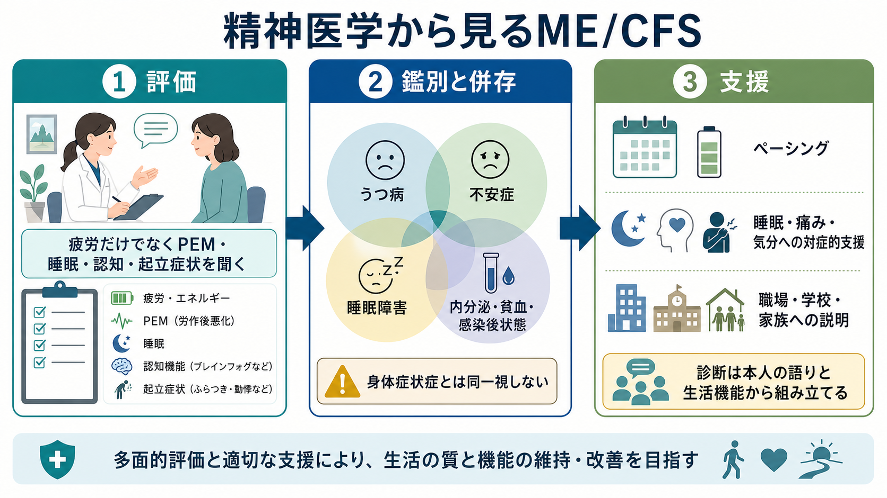
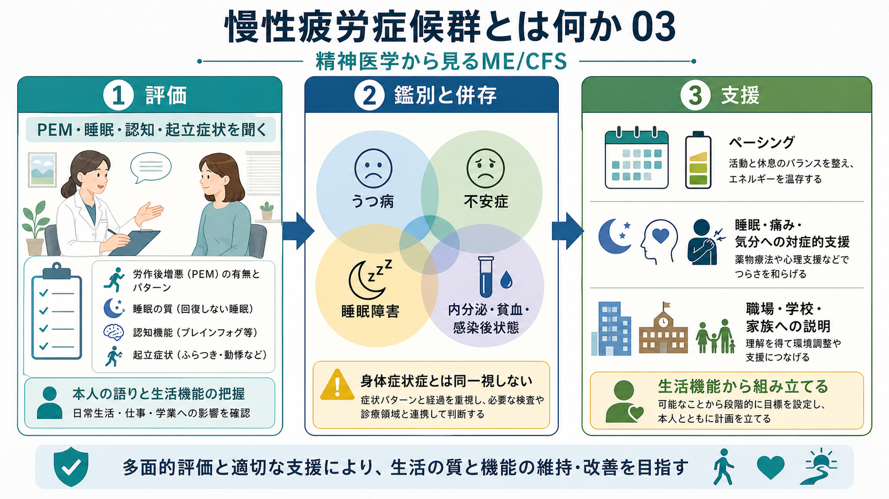

# 慢性疲労症候群とは何か

## 要点

- 慢性疲労症候群、または筋痛性脳脊髄炎・慢性疲労症候群（ME/CFS）は、単なる疲れや意欲低下ではなく、活動後に症状が悪化する労作後増悪（post-exertional malaise: PEM）、回復しない睡眠、認知症状、起立不耐などを中核とする慢性の多系統疾患である [1][2]。
- 精神医学では、[[うつ病とは何か]]、[[不安症群とは何か]]、[[不眠障害とは何か]]、[[身体症状症とは何か]]との鑑別と併存評価が重要になる。ただし、ME/CFSを「心理的原因だけの病態」と同一視してはならない [3][4]。
- 現時点で単一の確定的バイオマーカーや根治治療はない。支援の中心は、症状パターンの把握、エネルギー管理、ペーシング、睡眠・痛み・気分症状への対症的支援、学校・職場・家族への説明である [3][4]。

## この記事で答える問い

- 慢性疲労症候群は、通常の疲労やうつ病と何が違うのか。
- PEM、睡眠障害、認知症状、起立不耐はどのように評価するのか。
- 精神医学はME/CFSをどのように理解し、どこまで支援できるのか。

## まず結論

ME/CFSの核は「疲れている」ことではなく、「以前なら問題なかった身体的・認知的・情動的負荷のあとに、遅れて全身症状が増悪し、回復に長くかかる」という反応性の変化である。診断では、6か月以上の活動能力低下と深い疲労、PEM、回復しない睡眠に加えて、認知機能障害または起立不耐を確認する枠組みが広く用いられる [1][2]。

精神医学的には、ME/CFSをうつ病や身体症状症に還元しないことが出発点になる。一方で、慢性疾患としての苦痛、社会的孤立、睡眠障害、疼痛、不安、抑うつ、休職・不登校、スティグマは実際に起こりうるため、[[精神疾患と睡眠障害はどう関係するのか]]や[[精神疾患と社会機能障害はどう関係するのか]]の観点から多面的に評価する。

## 背景

ME/CFSは、感染後に発症することが多いとされるが、感染だけで説明されるわけではない。CDCは、ME/CFSを複数の臓器系に影響する慢性疾患として説明し、SARS-CoV-2感染後の長期症状との重なりにも注意を促している [1]。米国Institute of Medicine（現National Academy of Medicine）の報告書は、ME/CFSが重大な機能障害をもたらしうる疾患である一方、長く診断されず、医療者の理解不足にさらされやすいことを強調した [2]。

精神医学にとって重要なのは、ME/CFSが「精神疾患か身体疾患か」という二分法にうまく収まらない点である。症状は身体・認知・自律神経・睡眠・情動にまたがる。したがって、[[生物心理社会モデルとは何か]]のように、生物学的脆弱性、生活機能、本人の意味づけ、社会的支援を同時に扱う視点が役立つ。

## 基本概念

### 中核症状

IOM/CDCの診断枠組みでは、次の症状が中心になる [1][2]。

| 領域 | 見るポイント |
|---|---|
| 活動能力低下と疲労 | 6か月以上続き、発症前の生活・学業・仕事の水準から明らかに低下しているか |
| PEM | 身体活動、認知負荷、感情的負荷、感覚刺激のあとに、12-48時間遅れて増悪することがあるか |
| 回復しない睡眠 | 睡眠時間を確保しても疲労感や身体不調が回復しないか |
| 認知症状 | 注意、情報処理速度、記憶、言語化、作業持続が悪化するか |
| 起立不耐 | 立位・座位でめまい、動悸、頭痛、吐き気、思考困難が悪化し、臥位で軽くなるか |

この症状セットは、[[認知機能障害とは何か]]、[[過眠障害とは何か]]、[[概日リズム睡眠覚醒障害とは何か]]と重なる部分を持つが、PEMの有無と時間経過が鑑別の鍵になる。

### 精神医学的評価で確認すること

精神科面接では、疲労の強さだけでなく、発症前後の生活機能、誘因、活動後の遅発性悪化、回復時間、睡眠の質、疼痛、起立症状、認知症状、薬剤・物質使用、身体疾患、気分症状を時系列で整理する。特に、[[身体疾患による気分障害とは何か]]、[[甲状腺機能低下症に伴う精神症状とは何か]]、[[薬剤性うつ症状とは何か]]など、見逃すと介入可能な状態を除外する。

## 仕組み

ME/CFSの病態は確定していないが、近年の研究では、免疫調節、自律神経、神経内分泌、代謝、脳ネットワーク、血管調節などの相互作用として捉える見方が強い [5][6]。単一の「疲労中枢」や「気の持ちよう」で説明するより、複数の制御系がずれ、活動負荷に対する回復力が低下していると考える方が臨床像に合う。

2024年のNIH深層表現型研究は、感染後ME/CFSの少数例を厳密に評価し、努力選好、統合的脳領域、自律神経機能、免疫プロファイル、代謝経路の差異を報告した。ただし、探索的研究であり、個々の患者の診断に使える単一検査を提示したものではない [6]。

### 図解案：仮説的メカニズム

画像生成時に並列ジョブ由来の混線があり、ME/CFSのメカニズム図として採用できる画像は得られなかったため、存在しない画像リンクは挿入しない。作成するなら、次の日本語インフォグラフィックが適している。

> 「慢性疲労症候群とは何か 02」をタイトルに、感染・ストレスなどの契機、免疫調節の変化、自律神経の不安定化、脳の覚醒・統合ネットワーク、エネルギー利用の制限、労作後増悪（PEM）を左から右へ並べ、睡眠・痛み・認知症状との悪循環をフィードバック矢印で示す。注記として「研究途上」「単一原因ではなく複数系の相互作用」を入れる。

## 図解

2枚の画像はいずれも、ME/CFSを「疲労だけ」ではなく、PEM・睡眠・認知・起立症状・生活機能・併存症・支援環境の組み合わせとして見るための補助図である。

## 臨床・研究との接続

### 鑑別診断

ME/CFSに似た訴えは多くの疾患で生じる。貧血、甲状腺疾患、睡眠時無呼吸、感染症、自己免疫疾患、薬剤副作用、物質使用、悪性腫瘍、神経疾患、内分泌疾患は、病歴・身体診察・必要な検査で確認する。精神医学領域では、[[大うつ病性障害とは何か]]、[[双極性障害とは何か]]、[[不安症群とは何か]]、[[身体症状症とは何か]]、[[詐病とは何か]]との鑑別が問題になりやすい。

ただし、鑑別とは「どれか一つに決めつける」ことではない。ME/CFSにうつ病や不安症が併存することもあり、うつ病があってもPEMや起立不耐の評価を省略してよい理由にはならない [4]。

### 支援と治療

NICEは、ME/CFSを治す目的の一般的な運動療法や、固定的に活動量を増やす段階的運動療法を提供しないよう推奨している [3]。支援の軸は、本人の現在のエネルギー限界を把握し、その範囲内で活動と休息を調整するペーシングである。CBTは、ME/CFSを治す治療としてではなく、慢性疾患とともに生活する苦痛や困難を扱う支援として、本人が希望する場合に位置づけられる [3]。

精神科では、睡眠、痛み、不安、抑うつ、希死念慮、家族葛藤、職場・学校での理解不足を評価する。これはME/CFSを精神疾患に還元するためではなく、生活機能を守るためである。[[慢性疼痛と精神疾患はどう関係するのか]]、[[精神疾患と社会機能障害はどう関係するのか]]、[[職場メンタルヘルスで多い疾患には何があるのか]]の視点が役に立つ。

## よくある誤解

### 「疲れているだけ」ではない

ME/CFSでは、休めば回復する通常の疲労ではなく、軽い活動や認知負荷のあとに症状が崩れ、回復に時間がかかるPEMが重要である [1]。

### 「うつ病と同じ」ではない

うつ病では抑うつ気分、興味・喜びの低下、罪責感、希死念慮、精神運動制止などが中心になる。ME/CFSでは、活動後の遅発性悪化、起立不耐、回復しない睡眠、認知負荷への脆弱性が前景化することがある。両者は併存しうるが、同一ではない。

### 「運動すれば治る」ではない

不活動による体力低下は評価対象だが、ME/CFSを単純な脱条件づけとして扱い、活動量を固定的に増やすと、PEMや再燃を招く可能性がある [3]。活動は、本人の限界を超えない範囲で、症状の変動に応じて調整する。

## 関連ノート

- [[うつ病とは何か]]
- [[大うつ病性障害とは何か]]
- [[不安症群とは何か]]
- [[不眠障害とは何か]]
- [[過眠障害とは何か]]
- [[概日リズム睡眠覚醒障害とは何か]]
- [[身体症状症とは何か]]
- [[身体疾患による気分障害とは何か]]
- [[認知機能障害とは何か]]
- [[精神疾患と睡眠障害はどう関係するのか]]
- [[慢性疼痛と精神疾患はどう関係するのか]]
- [[生物心理社会モデルとは何か]]

## MOC更新候補

- `content/00_MOC/` 配下の精神医学・睡眠・身体症状・臨床評価系MOCに、バッチ統合時に追加候補。
- 並列ジョブとの競合を避けるため、このタスクではMOC本体は更新しない。

## 理解チェック

1. ME/CFSを通常の疲労やうつ病から区別するとき、PEMのどのような時間経過を確認するべきか。
2. ME/CFSの評価で、睡眠、認知症状、起立不耐を聞く理由は何か。
3. CBTや運動を、ME/CFSの「治療」として単純に説明してはいけない理由は何か。

## 未解決問題

- ME/CFSを個別診断できる信頼性の高いバイオマーカーはまだ確立していない。
- 感染後ME/CFS、Long COVID、線維筋痛症、起立性調節障害、睡眠障害、気分症状の境界は、研究上も臨床上も整理が続いている。
- どの患者にどの支援が有効かを予測する層別化研究が不足している。

## 参考文献

[1] Centers for Disease Control and Prevention. (2024). *Clinical Overview of ME/CFS* / *IOM 2015 Diagnostic Criteria*. https://www.cdc.gov/me-cfs/hcp/clinical-overview/index.html ; https://www.cdc.gov/me-cfs/hcp/diagnosis/iom-2015-diagnostic-criteria-1.html

[2] Institute of Medicine. (2015). *Beyond Myalgic Encephalomyelitis/Chronic Fatigue Syndrome: Redefining an Illness*. National Academies Press. https://doi.org/10.17226/19012

[3] National Institute for Health and Care Excellence. (2021). *Myalgic encephalomyelitis (or encephalopathy)/chronic fatigue syndrome: diagnosis and management* (NICE Guideline NG206). https://www.nice.org.uk/guidance/ng206

[4] Bateman, L., Bested, A. C., Bonilla, H. F., et al. (2021). Myalgic Encephalomyelitis/Chronic Fatigue Syndrome: Essentials of Diagnosis and Management. *Mayo Clinic Proceedings, 96*(11), 2861-2878. https://doi.org/10.1016/j.mayocp.2021.07.004

[5] Komaroff, A. L., & Lipkin, W. I. (2021). Insights from myalgic encephalomyelitis/chronic fatigue syndrome may help unravel the pathogenesis of postacute COVID-19 syndrome. *Trends in Molecular Medicine, 27*(9), 895-906. https://doi.org/10.1016/j.molmed.2021.06.002

[6] Walitt, B., Singh, K., LaMunion, S. R., et al. (2024). Deep phenotyping of post-infectious myalgic encephalomyelitis/chronic fatigue syndrome. *Nature Communications, 15*, 907. https://doi.org/10.1038/s41467-024-45107-3
