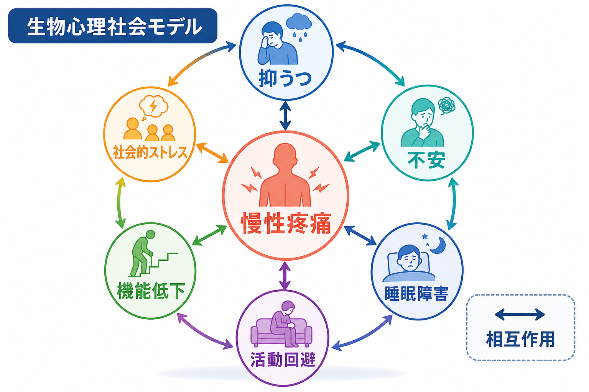
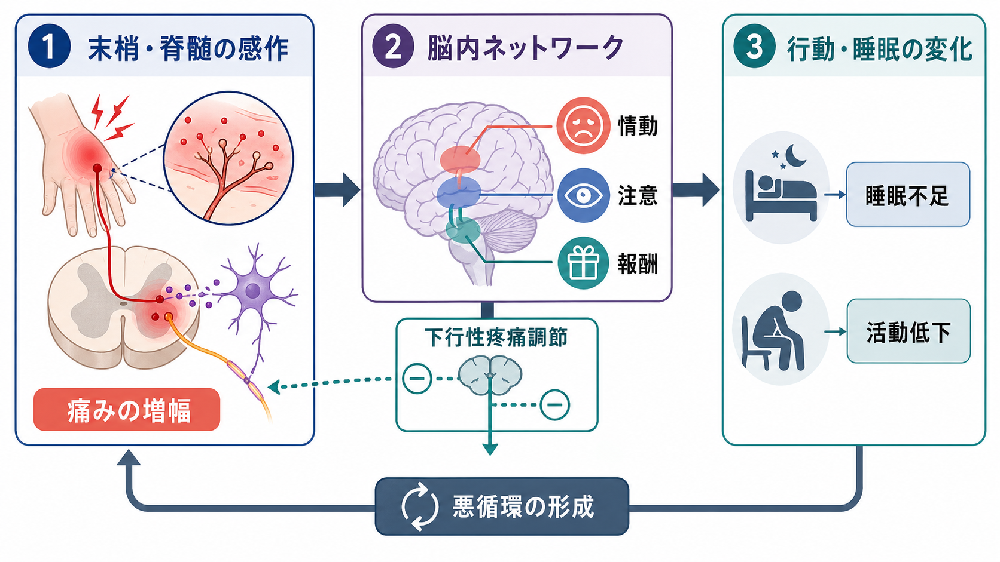
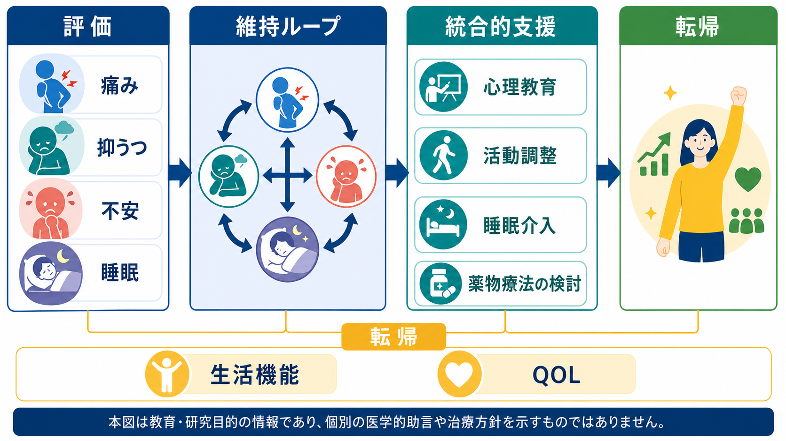

# 慢性疼痛と精神疾患はどう関係するのか

## 要点

- 慢性疼痛は「3か月を超えて持続または反復する痛み」と整理され、ICD-11 では慢性一次性疼痛と慢性二次性疼痛を区別する枠組みが導入された[1]。
- 慢性疼痛では[[うつ病とは何か|抑うつ]]と[[不安症群とは何か|不安]]が高頻度に併存し、2025年のメタ解析では成人慢性疼痛サンプルにおける抑うつのプール有病率は39.3%、不安は40.2%と推定された[2]。
- 痛み、抑うつ、不安、[[不眠障害とは何か|不眠]]は、単純な「原因と結果」ではなく、注意、情動、睡眠、活動回避、社会的ストレスを介して互いに維持し合う。
- 臨床的には「痛みだけ」「気分だけ」「睡眠だけ」を別々に見るより、生活機能と維持ループを同時に評価するほうが理解しやすい[3]。

## この記事で答える問い

慢性疼痛と精神疾患の関係を考えるとき、よくある問いは「精神的な問題が痛みを作っているのか」「痛みが長引いた結果として抑うつや不安が出るのか」という二択である。しかし実際には、慢性疼痛は末梢・脊髄・脳・行動・環境が重なった状態であり、精神症状はその一部として痛みの強さ、つらさ、意味づけ、生活障害を変える。

この記事では、痛み・抑うつ・不安・睡眠障害の相互作用を、[[疼痛と精神疾患は脳内でどうつながるのか]]、[[疼痛症状は精神科でどう評価するか]]、[[身体症状症とは何か]]と接続しながら整理する。

## まず結論

慢性疼痛と精神疾患は、「心因性か身体性か」という線引きではなく、痛覚処理と情動調節が同じ脳内ネットワークに乗っていることから理解するのがよい。痛みは侵害受容だけで決まらず、注意、予測、恐怖、睡眠不足、報酬低下、炎症、ストレス反応によって増幅される。反対に、長く続く痛みは活動範囲を狭め、睡眠を妨げ、抑うつや不安を強める。

したがって、慢性疼痛の精神医学的理解は「痛みは本物か」という問いではなく、「どのループが痛みと生活障害を維持しているか」という問いに置き換える必要がある。

## 背景

ICD-11 の慢性疼痛分類は、慢性疼痛を単なる症状ではなく、一次性疼痛では疾患そのものとして扱えるようにした点が重要である。慢性一次性疼痛は、明確な基礎疾患だけでは痛みや障害を十分に説明できず、強い苦痛や機能障害を伴う痛みとして整理される[1]。これは「異常が見つからないから心理的」という意味ではない。むしろ、組織損傷、神経系の感作、情動、睡眠、生活機能を同じ評価枠に置くための分類である。

慢性疼痛の人では、抑うつや不安が一般人口より多い。大規模な系統的レビューとメタ解析では、慢性疼痛をもつ成人において抑うつと不安がそれぞれ約4割にみられ、線維筋痛症などの広範な痛みを伴う状態で特に高い傾向が示された[2]。この数字は、慢性疼痛の診療や研究で精神症状のスクリーニングを周辺的な作業として扱えないことを示している。

## 基本概念

### 慢性疼痛

慢性疼痛は、通常の治癒過程を超えて続く、または再発する痛みである。期間としては3か月超が一般的な基準になる[1]。慢性二次性疼痛ではがん、神経障害、術後・外傷後、内臓疾患、筋骨格疾患などの基礎病態が主な説明になる。一方、慢性一次性疼痛では、痛みそのものと生活障害が中心問題になる。

### 抑うつ

慢性疼痛に伴う抑うつは、単なる「落ち込み」ではなく、意欲低下、楽しみの低下、疲労、睡眠障害、集中困難、将来への悲観を通じて痛みの対処資源を減らす。抑うつが強いほど、同じ痛みでも回復可能性を低く見積もりやすく、活動量が落ち、痛みの経験がより支配的になりやすい。

### 不安

不安は、痛みを「危険信号」として解釈しやすくする。特に痛みに関連した恐怖、破局的思考、身体感覚への過覚醒は、回避行動を増やす。恐怖回避モデルでは、痛みへの恐怖が活動回避、廃用、機能低下を介して障害を維持すると考える[4]。

### 睡眠障害

[[睡眠障害とは何か|睡眠障害]]は慢性疼痛で非常に多い。睡眠不足は痛み閾値、情動調節、注意制御を悪化させ、翌日の痛みを強める。慢性疼痛と睡眠障害の関係は双方向的だが、近年のレビューでは、睡眠障害のほうが痛みを予測する方向が比較的強い可能性が示されている[5]。

## 仕組み

### 1. 感作により痛みの信号が増幅される

慢性疼痛では、末梢神経や脊髄、脳内の疼痛処理系が過敏になることがある。中心性感作は、通常なら弱い入力や非侵害刺激でも痛みとして処理されやすくなる状態であり、アロディニアや痛覚過敏の理解に役立つ[6]。ただし、感作は慢性疼痛のすべてを説明する単一原因ではなく、痛みの増幅を説明する重要な機構の一つである。

### 2. 脳内ネットワークが痛みの意味を変える

痛みは一次体性感覚野だけでなく、島皮質、前帯状皮質、前頭前野、扁桃体、視床、報酬系などのネットワークで処理される。これらの領域は感覚、注意、情動、動機づけに関わるため、抑うつや不安があると痛みの「強さ」だけでなく「つらさ」や「避けたさ」も変わる[7]。

下行性疼痛調節系も重要である。中脳水道周囲灰白質や延髄吻側腹内側部などを含む経路は、脊髄レベルの痛覚入力を抑制も促進もできる[7]。ストレス、予期不安、睡眠不足、抑うつは、この調節のバランスを痛み促進側に傾ける可能性がある。

### 3. ストレス・炎症・報酬低下が重なる

慢性疼痛と抑うつには、[[HPA軸は精神疾患にどう関わるのか|HPA軸]]、炎症性サイトカイン、モノアミン系、報酬系の変化など、重なり合う機構がある。疼痛と抑うつの併存を扱ったレビューでは、前頭前野、前帯状皮質、扁桃体、海馬、報酬系、脳幹モノアミン系、炎症反応が共通の候補として挙げられている[8]。これは[[炎症仮説はうつ病をどう説明するのか]]や[[報酬系の異常はうつ病をどう説明するのか]]とも接続する。

### 4. 回避と睡眠不足が生活機能を下げる

痛みが強いと、動くこと、働くこと、人に会うこと、眠ることが難しくなる。短期的な休息や回避は保護的な場合もあるが、長期化すると体力低下、孤立、気分低下、睡眠リズムの乱れを招き、痛みへの注意がさらに増える。このループは、痛みが改善しない理由を「意志の弱さ」に帰すのではなく、行動・情動・身体の相互強化として理解するために重要である[4]。

## 図解

次の図は、臨床・研究で評価すべき領域をまとめたものである。慢性疼痛の支援では、痛みの部位や強度だけでなく、抑うつ、不安、睡眠、生活機能、QOLを同時に追う必要がある。

## 臨床・研究との接続

NICE の慢性疼痛ガイドラインは、慢性疼痛の評価で、痛みの原因だけでなく、痛みが生活にどう影響し、生活が痛みにどう影響しているかを含む本人中心の評価を推奨している[3]。慢性一次性疼痛では、運動、心理療法、鍼、抗うつ薬の検討などが扱われるが、ここでの抗うつ薬は「抑うつがあるから痛い」という意味ではなく、痛み、睡眠、心理的苦痛、QOLに作用しうる薬理学的選択肢として位置づけられている[3]。

精神科・心療内科・疼痛診療の接点では、次のような見立てが有用である。

| 見る領域 | 評価の問い | 関連する維持ループ |
|---|---|---|
| 痛み | 部位、強度、持続、誘因、緩和因子は何か | 感作、炎症、活動回避 |
| 抑うつ | 意欲、楽しみ、疲労、悲観はどう変化したか | 活動低下、報酬低下、孤立 |
| 不安 | 痛みをどの程度危険と感じるか | 過覚醒、破局化、回避 |
| 睡眠 | 入眠、中途覚醒、熟眠感、日中眠気はどうか | 睡眠不足、痛覚過敏、情動調節低下 |
| 生活機能 | 仕事、家事、対人関係、運動はどう変わったか | 廃用、自己効力感低下 |

研究では、痛み強度だけをアウトカムにすると、重要な変化を見落とすことがある。慢性疼痛では、痛みが少し残っていても睡眠、活動、抑うつ、不安、生活機能が改善することが臨床的に大きな意味をもつ。逆に、痛みの数値が少し下がっても、恐怖回避や睡眠障害が残れば再燃しやすい。

## よくある誤解

### 「精神疾患がある痛みは気のせいである」

誤りである。抑うつや不安は痛みの訴えを「偽物」にするのではなく、痛み処理、注意、情動、睡眠、行動を通じて痛み体験を変える。痛みは主観的経験だが、主観的であることは非現実的であることを意味しない。

### 「画像や検査で異常がなければ、治療対象ではない」

誤りである。慢性一次性疼痛の枠組みは、明確な組織損傷だけでは説明しにくい痛みを、苦痛と機能障害を含めて評価するためのものである[1]。ただし、新しい神経症状、発熱、体重減少、がんの既往などの警告徴候があれば、身体疾患の評価は優先される。

### 「痛みをなくしてから気分や睡眠を扱うべきである」

一部の急性痛ではそうした順序が自然な場合もある。しかし慢性疼痛では、睡眠障害や活動回避が痛みを維持していることが多いため、痛みの消失を待たずに睡眠、活動、心理教育、対人支援を並行して扱うほうが合理的である[3][5]。

## 関連ノート

- [[疼痛と精神疾患は脳内でどうつながるのか]]
- [[疼痛症状は精神科でどう評価するか]]
- [[うつ病とは何か]]
- [[不安症群とは何か]]
- [[不眠障害とは何か]]
- [[睡眠障害とは何か]]
- [[身体症状症とは何か]]
- [[身体症状症は脳の予測処理で説明できるのか]]
- [[HPA軸は精神疾患にどう関わるのか]]
- [[炎症仮説はうつ病をどう説明するのか]]
- [[心理教育とは何か]]

## MOC更新候補

- `content/00_MOC/MOC｜神経科学と精神疾患.md`
- `content/00_MOC/MOC｜意識・自己・身体性.md`
- 精神医学の疾患・症候群系 MOC があれば、本記事を慢性疼痛、身体症状、うつ病、不安症、睡眠障害の交差項目として追加する。

## 理解チェック

1. 慢性疼痛と抑うつ・不安の関係を「心因性か身体性か」の二択で考えると、何を見落とすか。
2. 睡眠障害が慢性疼痛を悪化させうる経路を、痛覚、情動、注意の3点から説明できるか。
3. 恐怖回避モデルでは、痛みへの恐怖がどのように生活機能低下へつながるか。
4. 慢性疼痛の評価で、痛み強度以外に測るべき領域を3つ挙げられるか。

## 未解決問題

- 抑うつ、不安、睡眠障害のうち、どの因子を先に改善すると慢性疼痛アウトカムが最も変わるのかは、痛みの種類や患者群によって異なる。
- 中心性感作、炎症、下行性疼痛調節、報酬系異常を個人ごとにどう測り、治療選択に結びつけるかは発展途上である。
- 慢性一次性疼痛の分類は有用だが、身体疾患の見落としを避けつつ過剰検査も避ける評価戦略が必要である。

## 参考文献

[1] Treede, R.-D., Rief, W., Barke, A., et al. (2019). Chronic pain as a symptom or a disease: the IASP Classification of Chronic Pain for the International Classification of Diseases (ICD-11). *Pain*, 160(1), 19-27. https://doi.org/10.1097/j.pain.0000000000001384

[2] Aaron, R. V., Ravyts, S. G., Carnahan, N. D., et al. (2025). Prevalence of Depression and Anxiety Among Adults With Chronic Pain: A Systematic Review and Meta-Analysis. *JAMA Network Open*. https://jamanetwork.com/journals/jamanetworkopen/fullarticle/2831134

[3] National Institute for Health and Care Excellence. (2021). *Chronic pain (primary and secondary) in over 16s: assessment of all chronic pain and management of chronic primary pain* (NICE guideline NG193). https://www.nice.org.uk/guidance/ng193

[4] Zale, E. L., & Ditre, J. W. (2015). Pain-Related Fear, Disability, and the Fear-Avoidance Model of Chronic Pain. *Current Opinion in Psychology*, 5, 24-30. https://doi.org/10.1016/j.copsyc.2015.03.014

[5] Jain, S. V., Panjeton, G. D., & Chaves Martins, Y. (2024). Relationship Between Sleep Disturbances and Chronic Pain: A Narrative Review. *Clinical Practice*, 14(6), 2650-2660. https://doi.org/10.3390/clinpract14060209

[6] Curatolo, M. (2024). Central Sensitization and Pain: Pathophysiologic and Clinical Insights. *Current Neuropharmacology*, 22(1), 15-22. https://doi.org/10.2174/1570159X20666221012112725

[7] Ossipov, M. H., Morimura, K., & Porreca, F. (2014). Descending pain modulation and chronification of pain. *Current Opinion in Supportive and Palliative Care*, 8(2), 143-151. https://pmc.ncbi.nlm.nih.gov/articles/PMC4301419/

[8] Fasick, V., Spengler, R. N., Samankan, S., Nader, N. D., & Ignatowski, T. A. (2020). Neuroinflammation, Pain and Depression: An Overview of the Main Findings. *Frontiers in Psychology*, 11, 1825. https://doi.org/10.3389/fpsyg.2020.01825
