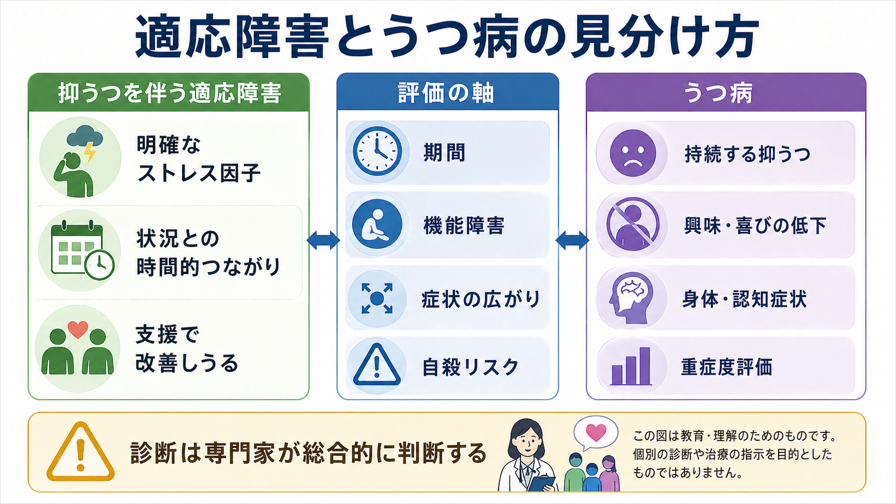
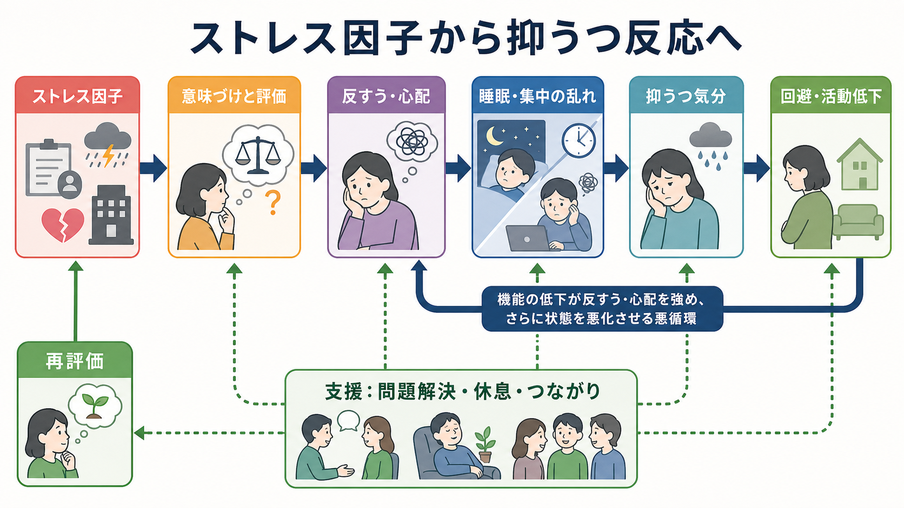

# 抑うつを伴う適応障害とは何か

## 要点

- 抑うつを伴う適応障害は、明確な心理社会的ストレス因子に続いて、悲しみ、涙もろさ、希望のなさ、興味の低下に近い状態が目立つ反応である。
- DSM-5-TR ではストレス因子への曝露後3か月以内に症状が出現し、ストレス因子やその結果が終わった後も6か月を超えて持続しないことが重要な目安になる[1]。
- ICD-11 では、ストレス因子へのとらわれと、生活上の適応困難が中核に置かれる[2]。
- [[うつ病とは何か]]との違いは「気分が落ち込むかどうか」だけではなく、症状の数、持続、広がり、機能障害、ストレス因子との時間的つながり、安全リスクを合わせて評価する点にある[3]。
- 「軽い病名」とは限らない。強い苦痛、学業・仕事・家庭機能の低下、自殺念慮や自殺企図のリスクを伴うことがある[1][4]。

## この記事で答える問い

1. 抑うつを伴う適応障害は、単なる落ち込みや[[うつ病とは何か]]と何が違うのか。
2. ストレス因子、反すう、生活機能低下はどのようにつながるのか。
3. 臨床・研究では、どこまでが確立した知見で、どこからが慎重に扱うべき点なのか。

## まず結論

抑うつを伴う適応障害は、「ストレスがあったから落ち込んでいる」という日常語だけでは捉えきれない。診断概念としては、明確なストレス因子への反応が、本人の生活機能や苦痛の水準を臨床的に問題となる程度まで悪化させている状態を指す[1][2]。

一方で、[[うつ病とは何か]]は、抑うつ気分または興味・喜びの低下を核に、睡眠、食欲、疲労、罪責感、集中困難、自殺念慮などの症状が同じ2週間以上の期間に一定数そろうかどうかが中心になる[3]。適応障害では、ストレス因子との時間的関係と、そのストレス因子へのとらわれ、適応の破綻が前面に出る。

## 背景

適応障害は、外来・リエゾン精神医学・産業保健・学校臨床などでよく使われる診断名である。ただし、その使われ方には幅があり、「うつ病ほどではないが困っている状態」という曖昧なラベルとして使われる危険も指摘されてきた[1][6]。

DSM-5-TR では、適応障害はトラウマ・ストレス因関連障害群に置かれ、ストレス因子への反応であることが強調される[1]。ICD-11 では、単に症状があるだけでなく、ストレス因子やその結果について考え続けてしまう「とらわれ」と、生活領域での「適応困難」が中核として整理されている[2][5]。

## 基本概念

### 定義の中心

抑うつを伴う適応障害では、次の3点を分けて考えると理解しやすい。

| 評価軸 | 見ること | うつ病との関係 |
|---|---|---|
| ストレス因子 | 失職、異動、離別、病気、介護、対人葛藤などの明確な出来事や持続的負荷 | うつ病もストレスで誘発されうるため、ストレス因子の有無だけでは区別できない |
| 時間的つながり | DSM-5-TR では曝露後3か月以内の発症、ストレス因子終結後6か月以内の収束が目安 | 長期化・広範化する場合は[[持続性抑うつ障害とは何か]]やうつ病も検討される |
| 症状と機能 | 悲しみ、涙もろさ、希望のなさ、集中困難、仕事・学業・家庭機能の低下 | 主要うつ病エピソードの症状数・持続・重症度を満たすかが鑑別の焦点になる |

### 「抑うつ気分を伴う」とは何か

「抑うつを伴う」とは、適応障害の中でも気分の落ち込みが目立つ臨床像を指す。悲しみ、涙もろさ、希望のなさ、意欲低下、楽しめなさに近い訴えが出るが、それが必ずしも主要うつ病エピソードを意味するわけではない[1][3]。

重要なのは、症状名だけで決めないことである。たとえば「眠れない」「集中できない」「食欲が落ちた」という症状は、適応障害、うつ病、[[双極性障害とは何か]]、身体疾患、物質・薬剤の影響、喪失反応などでも起こりうる[3]。

## 仕組み

適応障害の仕組みは、単純な「ストレス量が多いから症状が出る」という直線モデルだけでは足りない。むしろ、ストレス因子に対する意味づけ、反すう、回避、睡眠の乱れ、活動低下が互いに強め合う過程として捉えるとわかりやすい。

### 1. ストレス因子が「生活の予測可能性」を崩す

失職、異動、離婚、病気、家族介護、職場や学校の対人葛藤などは、日常の予定、役割、自己評価、将来予測をまとめて揺さぶる。ICD-11 が重視する「とらわれ」は、ストレス因子そのものやその結果について、過剰な心配、繰り返しの考え込み、意味づけの固定化として現れる[2][5]。

### 2. 反すうと回避が症状を維持する

「なぜこうなったのか」「自分が悪かったのではないか」「もう取り返しがつかない」という反すうは、一時的には問題を理解しようとする試みでもある。しかし、睡眠を妨げ、活動量を下げ、人との接触を減らすと、気分を回復させる機会も減ってしまう。ここで、[[ストレス脆弱性モデルとは何か]]や[[素因ストレスモデルとは何か]]で扱うような個人の脆弱性と環境負荷の相互作用が重要になる。

### 3. 安全評価は最初から必要である

適応障害は「軽症」と見なされやすいが、自殺念慮や自殺企図のリスクは無視できない。リエゾン精神医学領域の研究では、適応障害と診断された人にも自殺関連行動がみられることが報告されている[4]。したがって、臨床的には[[自殺念慮と自殺企図は何が違うのか]]や[[自殺リスク評価では何を聞くべきか]]に相当する安全評価を、診断名の軽重に関係なく行う必要がある。

## 図解

上の2枚の図は、診断そのものを代替するものではない。1枚目は「適応障害とうつ病をどの評価軸で見分けるか」を示す概念図であり、2枚目は「ストレス因子から抑うつ反応が維持される流れ」を示す機序図である。

図で強調したい点は、次の3つである。

- 適応障害では、明確なストレス因子と症状の時間的つながりを丁寧に見る。
- うつ病との鑑別では、抑うつ気分だけでなく、興味・喜びの低下、身体症状、認知症状、2週間以上の持続、機能障害を合わせて見る[3]。
- 安全評価と支援の開始は、診断名が確定してからではなく、苦痛や機能低下が明らかな時点で必要になる。

## 臨床・研究との接続

### 評価の実務

評価では、少なくとも次の情報を分けて聞く。

| 領域 | 具体的に確認すること |
|---|---|
| ストレス因子 | 何が、いつ、どの程度続いているか。単発か、複数か、慢性的か |
| 症状 | 抑うつ気分、涙もろさ、希望のなさ、不安、怒り、睡眠、食欲、集中、身体症状 |
| 機能 | 仕事、学業、家事、対人関係、セルフケアがどれくらい落ちているか |
| 鑑別 | うつ病、[[双極II型障害とは何か]]、[[PTSDでは恐怖記憶ネットワークに何が起きているのか]]、物質・薬剤、身体疾患、喪失反応 |
| 安全 | 自殺念慮、自傷、衝動性、飲酒・薬物、孤立、保護因子 |

### 支援の方向

支援は、個別の診断や治療指示ではなく、研究・教育上は次のように整理できる。

- ストレス因子を特定し、変えられる問題と変えにくい問題を分ける。
- 睡眠、食事、活動、対人接触など、回復を支える日課を保つ。
- 職場・学校・家庭での負荷調整や社会的支援を検討する。
- 認知行動療法、支持的精神療法、対人関係療法、家族支援などの心理社会的介入が検討されるが、適応障害に特化した治療エビデンスはまだ限定的である[1][7]。
- 薬物療法は、最終診断がうつ病や不安症である場合には別のエビデンス体系があるが、適応障害そのものへの薬物療法の根拠は限られる[1][7]。

### 予後

適応障害はしばしば短期的で可逆的な反応として説明される。ただし、成人の予後に関するシステマティックレビューでは、一定の人では数か月から数年後にも診断が持続したり、別の精神疾患診断へ移行したりする可能性が示されている[8]。したがって、「ストレスがなくなれば必ずすぐ治る」とは言えない。

## よくある誤解

### 誤解1: 適応障害は「甘え」である

適応障害は、本人の性格の弱さを説明する言葉ではない。臨床概念としては、ストレス因子に対する反応が、苦痛や機能障害として臨床的に問題となる水準に達している状態である[1][2]。

### 誤解2: うつ病ではないなら安全である

うつ病の診断基準を満たさないことは、安全を意味しない。急性のストレス反応では、衝動性、孤立、飲酒、睡眠不足、将来への絶望が重なるとリスクが高まることがある[4]。

### 誤解3: ストレス因子があるなら適応障害である

ストレス因子は、[[うつ病とは何か]]、[[双極性障害とは何か]]、PTSD、身体疾患に伴う抑うつなどの誘因にもなりうる。したがって、ストレス因子があることは適応障害を支持する情報ではあるが、それだけでは診断を確定しない[1][3]。

### 誤解4: 抗うつ薬を使うかどうかが診断の分かれ目である

診断と治療選択は別の問題である。適応障害では心理社会的支援や環境調整が中心に置かれやすいが、併存するうつ病、不安症、睡眠障害、身体疾患、リスクの高さによって臨床判断は変わる[1][7]。

## 関連ノート

- [[うつ病とは何か]]
- [[持続性抑うつ障害とは何か]]
- [[非定型うつ病とは何か]]
- [[双極II型障害とは何か]]
- [[双極性障害とは何か]]
- [[ストレス脆弱性モデルとは何か]]
- [[素因ストレスモデルとは何か]]
- [[自殺念慮と自殺企図は何が違うのか]]
- [[自殺リスク評価では何を聞くべきか]]
- [[PTSDでは恐怖記憶ネットワークに何が起きているのか]]

### MOC更新候補

- `content/00_MOC/` 配下の精神医学・気分障害・ストレス関連障害系 MOC があれば、本記事へのリンクを追加する候補になる。
- 並列生成ジョブとの競合を避けるため、このタスクでは MOC 本体は更新しない。

## 理解チェック

1. 抑うつを伴う適応障害で、ストレス因子との時間的関係を確認するのはなぜか。
2. 「うつ病ではない」と判断するために、抑うつ気分以外にどの症状や機能障害を見る必要があるか。
3. 適応障害を軽症と決めつけることが、なぜ安全評価の見落としにつながりうるか。
4. 支援では、本人の考え方だけでなく、環境調整や社会的支援をなぜ同時に扱う必要があるか。

## 未解決問題

- 適応障害は臨床で頻繁に使われる一方、診断境界が広く、研究対象の均質性を保ちにくい。
- 抑うつを伴う適応障害からうつ病へ移行する予測因子は、まだ十分に確立していない。
- 心理療法・薬物療法・職場や学校での環境調整を、どの順序・強度で組み合わせるべきかについて、質の高い比較研究は限られている[7][8]。

## 参考文献

[1] Barnhill, J. W. (2026). *Adjustment Disorders*. Merck Manual Professional Edition. https://www.merckmanuals.com/professional/psychiatric-disorders/anxiety-and-trauma-and-stressor-related-disorders/adjustment-disorders

[2] World Health Organization. (2024). *ICD-11 for Mortality and Morbidity Statistics: 6B43 Adjustment disorder*. https://icd.who.int/browse/2024-01/mms/en#264310751

[3] Coryell, W. (2026). *Depressive Disorders*. Merck Manual Professional Edition. https://www.merckmanuals.com/professional/psychiatric-disorders/mood-disorders/depressive-disorders

[4] Casey, P., Jabbar, F., O'Leary, E., & Doherty, A. M. (2015). Suicidal behaviours in adjustment disorder and depressive episode. *Journal of Affective Disorders, 174*, 441-446. https://doi.org/10.1016/j.jad.2014.12.003

[5] Shevlin, M., Hyland, P., Ben-Ezra, M., Karatzias, T., Cloitre, M., Vallières, F., Bachem, R., & Maercker, A. (2020). Measuring ICD-11 adjustment disorder: The development and initial validation of the International Adjustment Disorder Questionnaire. *Acta Psychiatrica Scandinavica, 141*(3), 265-274. https://doi.org/10.1111/acps.13126

[6] Baumeister, H., Maercker, A., & Casey, P. (2009). Adjustment disorder with depressed mood: A critique of its DSM-IV and ICD-10 conceptualisations and recommendations for the future. *Psychopathology, 42*(3), 139-147. https://doi.org/10.1159/000207455

[7] O'Donnell, M. L., Metcalf, O., Watson, L., Phelps, A., & Varker, T. (2018). A systematic review of psychological and pharmacological treatments for adjustment disorder in adults. *Journal of Traumatic Stress, 31*(3), 321-331. https://doi.org/10.1002/jts.22295

[8] Morgan, M. A., Kelber, M. S., Bellanti, D. M., Beech, E. H., Boyd, C., Galloway, L., Ojha, S., Garvey Wilson, A. L., Otto, J., & Belsher, B. E. (2022). Outcomes and prognosis of adjustment disorder in adults: A systematic review. *Journal of Psychiatric Research, 156*, 498-510. https://doi.org/10.1016/j.jpsychires.2022.10.052
