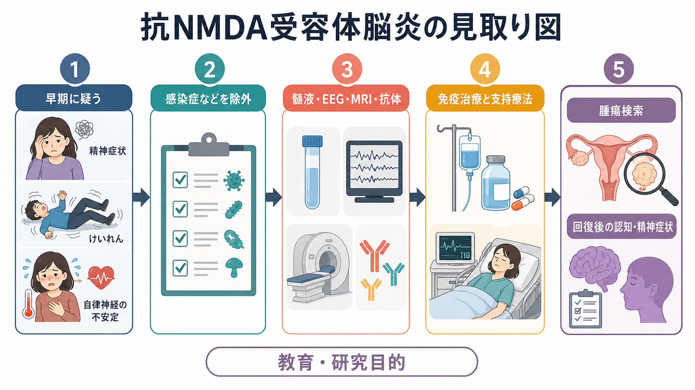
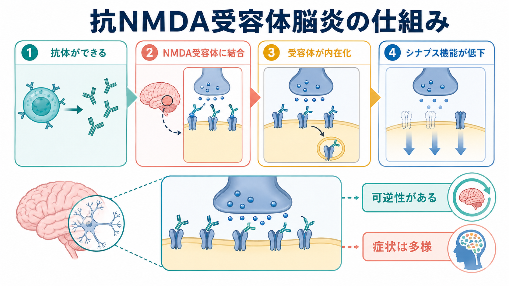

# 抗NMDA受容体脳炎とは何か

## 要点

- 抗NMDA受容体脳炎は、主にNMDA受容体GluN1サブユニットに対するIgG抗体が関与する[[自己免疫性脳炎に伴う精神症状とは何か|自己免疫性脳炎]]である[1][2]。
- 精神症状、けいれん、不随意運動、意識障害、自律神経症状、中枢性低換気などが時間経過の中で重なりうるため、初期には[[統合失調症とは何か|統合失調症]]、[[せん妄とは何か|せん妄]]、薬剤性・感染性・代謝性疾患との鑑別が重要になる[2][3]。
- 抗体はNMDA受容体を架橋し、シナプス表面から内在化させることで、[[シナプスとは何か|シナプス]]機能と[[グルタミン酸は脳で何をしているのか|グルタミン酸]]伝達を変化させると考えられている[5][6]。
- 診断では、臨床症候、髄液、脳波、MRI、抗体検査、感染症・腫瘍・代謝性疾患の除外を組み合わせる。抗体検査だけを単独で読まないことが重要である[3][8]。
- 早期の免疫治療、腫瘍がある場合の治療、集中治療を含む支持療法が転帰に関係する。ただし本稿は教育・研究目的の整理であり、個別の診断や治療指示ではない[4][7][8]。

## この記事で答える問い

1. 抗NMDA受容体脳炎は、なぜ精神医学と神経内科の境界で重要なのか。
2. どのような症状の組み合わせから疑うのか。
3. 抗体がNMDA受容体に作用すると、なぜ多彩な精神・神経症状が起こりうるのか。
4. 臨床では、検査、鑑別、治療、回復後の支援をどのように接続して考えるのか。

## まず結論

抗NMDA受容体脳炎は、「精神症状を呈する脳炎」であると同時に、「脳の免疫異常が精神症状として前景化しうる」ことを示す代表的疾患である。急性・亜急性に精神症状が目立つだけなら一次性精神疾患も鑑別に入るが、けいれん、意識水準の変動、[[カタトニアとは何か|カタトニア]]様の運動異常、不随意運動、自律神経不安定、発熱、髄液異常、脳波異常などが重なる場合、身体疾患としての脳炎を見逃さない視点が必要になる[2][3]。

この疾患の重要性は、発症時には重篤でも、免疫治療・腫瘍治療・支持療法・リハビリテーションによって回復しうる点にある[4][8]。したがって、精神科的な観察と神経内科的な評価を分けるのではなく、症状の時間経過、身体所見、検査、生活機能を同じ地図の上で読む必要がある。

## 背景

抗NMDA受容体脳炎は、卵巣奇形腫を伴う若年女性の傍腫瘍性脳炎として報告され、その後、腫瘍を伴わない例、男性、小児、高齢者にもみられることが明らかになった[1][2]。現在では自己免疫性脳炎の代表的病型の一つとして扱われ、精神症状で発症・紹介されることが少なくない。

典型的には、発熱、頭痛、倦怠感などの前駆症状の後に、不安、焦燥、幻覚、妄想、まとまりにくい言動、睡眠障害などが出現し、その後、けいれん、記憶障害、意識障害、不随意運動、口部ジスキネジア、自律神経不安定、低換気などが続くことがある[2][5]。ただし全例がこの順序をたどるわけではなく、小児では運動異常や行動変化、高齢者では鑑別疾患の広さが前景に出る。

## 基本概念

### NMDA受容体

NMDA受容体は、[[グルタミン酸は脳で何をしているのか|グルタミン酸]]作動性シナプスで働く受容体であり、カルシウム流入、シナプス可塑性、記憶学習、興奮・抑制バランスに関わる。[[Hebb則とは何か|Hebb則]]や長期増強を理解するうえでも重要な受容体である。

### 抗NMDA受容体抗体

抗NMDA受容体脳炎で重視されるのは、神経細胞表面のNMDA受容体GluN1サブユニットを認識するIgG抗体である[2][5]。抗体の存在は診断上重要だが、検査結果は検体の種類、測定法、臨床像との整合性によって解釈する必要がある。特に脳炎を疑う文脈では、血清だけでなく髄液での評価が重視される[3][8]。

### 自己免疫性脳炎

自己免疫性脳炎は、感染症そのものではなく、免疫反応が神経機能を障害することで脳炎様の症状を起こす疾患群である。抗NMDA受容体脳炎では、神経細胞表面抗原に対する抗体が関与するため、治療可能性と可逆性を考えやすい一方、急性期には重症化しうる[4][6]。

## 仕組み

抗NMDA受容体抗体は、受容体に結合して受容体を架橋し、シナプス表面から細胞内へ取り込ませると考えられている[5][6]。この過程は神経細胞の広範な壊死というより、表面受容体密度とシナプス機能の変化として理解される。そのため、免疫反応が制御されれば機能回復が起こりうるという見方につながる。

NMDA受容体機能の低下は、記憶、知覚、情動制御、運動制御、覚醒、自律神経調節などの複数のネットワークに影響しうる。ここから、精神症状だけでなく、けいれん、[[高次脳機能障害とは何か|認知機能障害]]、不随意運動、意識障害、自律神経症状が同じ疾患過程の中で現れることが説明しやすくなる[2][6]。

## 図解

上の2枚の図は、臨床的な見取り図と、抗体によるシナプス機能変化を分けて示したものである。1枚目は「早期に疑う」「感染症などを除外する」「髄液・脳波・MRI・抗体を組み合わせる」「免疫治療・支持療法・腫瘍検索・回復後フォローを考える」という臨床の流れを示す。2枚目は「抗体産生」「NMDA受容体への結合」「受容体内在化」「シナプス機能低下」という仮説的機序を示す。

画像生成では3枚目も試みたが、並列生成の影響で別記事用の図が混入したため、存在しないリンクや不適切な図は本文に挿入しなかった。必要なら次の図解案を追加候補にできる。

**図解案: 鑑別とフォローアップの比較表**

日本語インフォグラフィック。タイトルは「抗NMDA受容体脳炎で見る鑑別と回復後フォロー」。左に「一次性精神疾患としても見える所見」、中央に「脳炎を疑う手がかり」、右に「回復後に評価すること」を置く。用語は「急性・亜急性発症」「けいれん」「意識変動」「自律神経不安定」「髄液・EEG異常」「認知機能」「精神症状」「生活機能」。教育・研究目的であることを下部に小さく明記する。

## 臨床・研究との接続

### 疑う場面

精神症状が急性・亜急性に出現し、発熱、けいれん、意識水準の変動、記憶障害、運動異常、自律神経症状、抗精神病薬への過敏な反応、髄液異常、脳波異常などを伴う場合、抗NMDA受容体脳炎を含む自己免疫性脳炎を鑑別に入れる[3][8]。これは、精神症状を「身体疾患か精神疾患か」の二分法で分けるのではなく、時間経過と多系統の症状を統合して読む作業である。

### 検査

検査は一つで完結しない。髄液検査では細胞数増多や蛋白変化、オリゴクローナルバンドなどが参考になりうる。脳波ではびまん性徐波やてんかん性活動がみられ、抗NMDA受容体脳炎では extreme delta brush と呼ばれる特徴的パターンが報告されているが、常に出るわけではない[2][5]。MRIは正常または非特異的なこともあるため、正常MRIだけで否定しない。

### 治療と支持療法

治療は、感染症などの除外・管理を行いながら、ステロイド、免疫グロブリン、血漿交換、リツキシマブ、シクロホスファミドなどの免疫治療、腫瘍がある場合の治療、けいれん・自律神経症状・低換気への集中治療的支持を組み合わせる形で整理されている[4][7][8]。大規模コホートでは、早期治療や腫瘍治療が良好な転帰と関連し、多くの患者が時間をかけて改善する一方、死亡や再発も報告されている[4]。

### 回復後

急性期を越えた後も、記憶、注意、実行機能、疲労、睡眠、抑うつ、不安、精神病症状、学業・就労・家族関係の変化を評価する必要がある。回復は「意識が戻ったら終わり」ではなく、[[高次脳機能障害とは何か|認知機能]]と生活機能の再構築を含む過程である。

## よくある誤解

### 誤解1: 精神症状で始まるなら精神疾患である

抗NMDA受容体脳炎では、初期に不安、焦燥、幻覚、妄想、まとまりにくい言動が目立つことがある[2][5]。精神症状の存在は精神科評価を不要にするものではないが、同時に脳炎の可能性を除外するものでもない。

### 誤解2: 抗体が陽性なら、それだけで診断できる

抗体検査は重要だが、診断は臨床症候、髄液、脳波、画像、感染症・代謝性・薬剤性疾患の除外と合わせて行う[3][8]。検査単独の陽性・陰性を、臨床像から切り離して読むと誤解が生じる。

### 誤解3: MRIが正常なら脳炎ではない

抗NMDA受容体脳炎ではMRIが正常または非特異的なことがある[2][5]。MRIが重要でないという意味ではなく、MRIだけで判断しないという意味である。

### 誤解4: 回復すれば精神・認知面の支援は不要である

急性期症状が改善しても、認知機能、疲労、気分、不安、社会復帰上の困難が残ることがある。回復後フォローでは、神経学的評価と精神医学的評価を接続して、学業・就労・家族支援まで含めて考える必要がある。

## 関連ノート

- [[自己免疫性脳炎に伴う精神症状とは何か]]
- [[統合失調症とは何か]]
- [[せん妄とは何か]]
- [[カタトニアとは何か]]
- [[グルタミン酸は脳で何をしているのか]]
- [[シナプスとは何か]]
- [[Hebb則とは何か]]
- [[高次脳機能障害とは何か]]

### MOC更新候補

- `content/00_MOC/` 以下の精神医学、神経科学、自己免疫性脳炎、神経免疫、精神症状の鑑別に関するMOCに追加候補。
- 並列ジョブとの衝突を避けるため、本稿ではMOCファイル自体は更新しない。

### 関連ノート候補

- 抗LGI1脳炎とは何か
- 自己免疫性脳炎の診断基準とは何か
- extreme delta brushとは何か
- 卵巣奇形腫と自己免疫性脳炎はどう関係するのか

## 理解チェック

1. 抗NMDA受容体脳炎で、精神症状だけでなく神経症状・自律神経症状を同時に見る必要があるのはなぜか。
2. 抗体検査を、臨床症候や髄液・脳波所見から切り離して解釈すると、どのような誤解が起こりうるか。
3. NMDA受容体の内在化という機序は、なぜ「可逆性がありうる」という見方につながるのか。
4. 回復後フォローで、認知機能や生活機能を評価する意味は何か。

## 未解決問題

- 抗体価、髄液炎症、神経回路変化、精神症状の重症度をどの程度対応づけられるのか。
- どの患者が長期の認知・精神症状を残しやすいのか。
- 一次性精神疾患との境界で、どの検査・臨床指標をどの順序で使うと過不足の少ない評価になるのか。
- 回復後のリハビリテーション、心理社会的支援、家族支援をどのように標準化できるのか。

## 参考文献

[1] Dalmau, J., Tüzün, E., Wu, H. Y., Masjuan, J., Rossi, J. E., Voloschin, A., et al. (2007). Paraneoplastic anti-N-methyl-D-aspartate receptor encephalitis associated with ovarian teratoma. *Annals of Neurology*, 61(1), 25-36. https://doi.org/10.1002/ana.21050

[2] Dalmau, J., Gleichman, A. J., Hughes, E. G., Rossi, J. E., Peng, X., Lai, M., et al. (2008). Anti-NMDA-receptor encephalitis: case series and analysis of the effects of antibodies. *The Lancet Neurology*, 7(12), 1091-1098. https://doi.org/10.1016/S1474-4422(08)70224-2

[3] Graus, F., Titulaer, M. J., Balu, R., Benseler, S., Bien, C. G., Cellucci, T., et al. (2016). A clinical approach to diagnosis of autoimmune encephalitis. *The Lancet Neurology*, 15(4), 391-404. https://doi.org/10.1016/S1474-4422(15)00401-9

[4] Titulaer, M. J., McCracken, L., Gabilondo, I., Armangué, T., Glaser, C., Iizuka, T., et al. (2013). Treatment and prognostic factors for long-term outcome in patients with anti-NMDA receptor encephalitis: an observational cohort study. *The Lancet Neurology*, 12(2), 157-165. https://doi.org/10.1016/S1474-4422(12)70310-1

[5] Dalmau, J., Lancaster, E., Martinez-Hernandez, E., Rosenfeld, M. R., & Balice-Gordon, R. (2011). Clinical experience and laboratory investigations in patients with anti-NMDAR encephalitis. *The Lancet Neurology*, 10(1), 63-74. https://doi.org/10.1016/S1474-4422(10)70253-2

[6] Dalmau, J., Armangué, T., Planagumà, J., Radosevic, M., Mannara, F., Leypoldt, F., et al. (2019). An update on anti-NMDA receptor encephalitis for neurologists and psychiatrists: mechanisms and models. *The Lancet Neurology*, 18(11), 1045-1057. https://doi.org/10.1016/S1474-4422(19)30244-3

[7] Nosadini, M., Thomas, T., Eyre, M., Anlar, B., Armangue, T., Benseler, S. M., et al. (2021). International consensus recommendations for the treatment of pediatric NMDAR antibody encephalitis. *Neurology: Neuroimmunology & Neuroinflammation*, 8(5), e1052. https://doi.org/10.1212/NXI.0000000000001052

[8] Abboud, H., Probasco, J. C., Irani, S., Ances, B., Benavides, D. R., Bradshaw, M., et al. (2021). Autoimmune encephalitis: proposed best practice recommendations for diagnosis and acute management. *Journal of Neurology, Neurosurgery & Psychiatry*, 92(7), 757-768. https://doi.org/10.1136/jnnp-2020-325300
