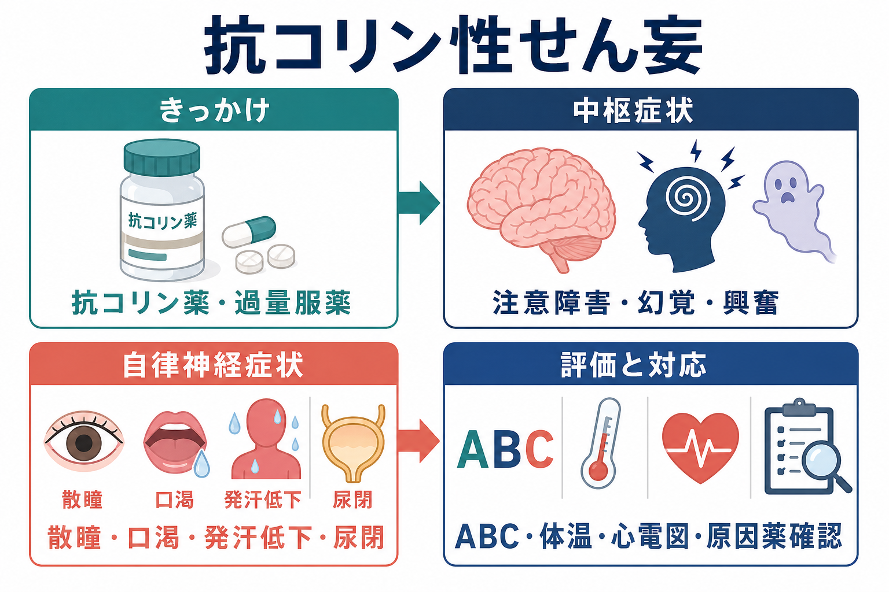
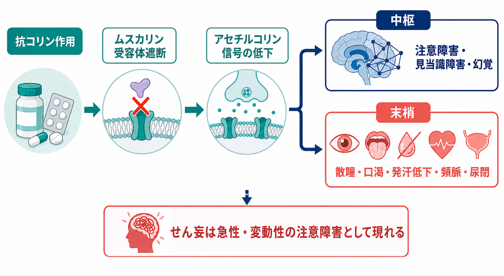
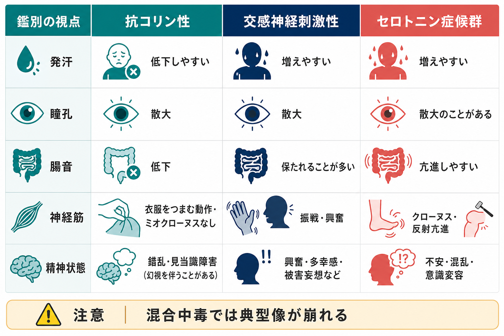

# 抗コリン性せん妄とは何か

## 要点

- 抗コリン性せん妄は、アセチルコリンのムスカリン受容体作用が中枢・末梢で遮断され、急性に[[せん妄とは何か|せん妄]]、幻覚、興奮、散瞳、口渇、発汗低下、頻脈、尿閉などがまとまって現れる状態である[1][2]。
- 原因は、抗ヒスタミン薬、三環系抗うつ薬、抗精神病薬、抗パーキンソン病薬、鎮痙薬、散瞳薬、植物アルカロイド、過量服薬、複数薬剤の抗コリン負荷などである[1][4]。
- 「せん妄」なので中心は幻覚そのものではなく、急性・変動性の[[注意障害とは何か|注意障害]]、見当識障害、覚醒水準の揺れである[3]。
- 典型像は有用だが、混合中毒、併用薬、高齢、認知症、脱水、感染では崩れやすい。臨床ではまず生命危機、低血糖、低酸素、感染、頭部疾患、他の中毒を並行して考える。
- このノートは教育・研究目的の整理であり、個別の診断や治療指示ではない。疑われる場合は救急・中毒診療として扱う。

## この記事で答える問い

1. 抗コリン性せん妄は、通常のせん妄や一次性精神病と何が違うのか。
2. なぜ「ムスカリン受容体遮断」が幻覚・興奮と、口渇・散瞳・尿閉を同時に起こすのか。
3. 臨床や研究では、どのように抗コリン負荷、過量服薬、鑑別診断を考えるべきか。

## まず結論

抗コリン性せん妄は、「抗コリン薬で幻覚が出る」という単純な話ではない。中枢ではアセチルコリン信号が弱まり、注意・覚醒・記憶の統合が不安定になる。末梢では副交感神経系のムスカリン作用が遮断され、散瞳、口渇、腸蠕動低下、発汗低下、頻脈、尿閉が出る。したがって、精神症状と身体徴候を一緒に読むことが重要である[1][2]。

## 背景

せん妄は、数時間から数日の単位で出現し、日内・時間内に変動する注意と認知の障害である。NICE のせん妄ガイドラインは、急な集中困難、反応の遅さ、混乱、幻覚、落ち着きのなさ、睡眠変化、社会的行動の変化をせん妄の指標として観察し、4AT、CAM-ICU、ICDSC などの評価につなげることを推奨している[3]。

抗コリン性せん妄は、この[[意識障害とは何か|意識障害]]・注意障害の背景に「抗コリン作用」が強く関与する場合を指す。薬剤性の精神症状としては[[薬剤性精神症状とは何か]]や[[薬剤性精神病とは何か]]と接続するが、抗コリン性せん妄では末梢自律神経徴候が重要な手がかりになる。

原因薬としてよく問題になるのは、ジフェンヒドラミンなどの第一世代抗ヒスタミン薬、三環系抗うつ薬、クロザピンや低力価抗精神病薬、一部の抗パーキンソン病薬、過活動膀胱薬、鎮痙薬、スコポラミン、アトロピン、ベラドンナ・チョウセンアサガオなどの植物である[1][2]。高齢者では単回の過量服薬だけでなく、日常処方の積み重ねとしての抗コリン負荷も問題になる[4][5]。

## 基本概念

### 抗コリン作用

ここでいう「抗コリン作用」は、多くの場合、アセチルコリンがムスカリン受容体に結合する働きを妨げる抗ムスカリン作用を指す。ニコチン受容体が主に神経筋接合部などで重要なのに対し、ムスカリン受容体は中枢神経、自律神経系、眼、唾液腺、汗腺、消化管、膀胱などに分布する[2]。

### せん妄としての見方

抗コリン性せん妄では、幻視や興奮が目立つことがある。しかし、診断的により重要なのは、注意が保てない、話が追えない、時間や場所の見当識が揺れる、夜間に悪化する、状態が短時間で変動する、というせん妄の構造である[3]。幻覚の内容だけで[[幻覚とは何か|幻覚]]性障害や統合失調症圏と短絡しない。

### 典型的な身体徴候

古典的には、皮膚紅潮、乾燥、散瞳、発熱、錯乱、尿閉、腸音低下、頻脈がまとまって語られる[1][2]。特に「汗が少ないのに熱い」「口腔内が乾く」「瞳孔が大きい」「尿が出ない」「腸音が弱い」という組み合わせは、交感神経刺激薬やセロトニン症候群との鑑別に役立つ。

## 仕組み

中枢神経では、アセチルコリンは注意、覚醒、記憶、感覚入力の選択に関わる。[[アセチルコリンは注意や記憶にどう関わるのか|アセチルコリン系]]の信号が急に弱まると、外界刺激を安定して選択し、文脈に合わせて解釈する働きが崩れやすくなる。これが注意障害、見当識障害、幻覚、錯乱、興奮として現れる[2]。

末梢では、ムスカリン受容体遮断が副交感神経系の出力を弱める。瞳孔括約筋の働きが落ちると散瞳、唾液分泌が減ると口渇、汗腺のコリン作動性調節が落ちると発汗低下、消化管運動が落ちると便秘・腸音低下、膀胱排尿筋の働きが弱まると尿閉が出る[2]。頻脈は迷走神経性の心拍抑制が弱まることと関係する。

重要なのは、中枢症状と末梢症状が必ず同じ強さで出るわけではない点である。薬剤の脂溶性、血液脳関門通過性、服薬量、併用薬、年齢、腎機能・肝機能、認知症や脳疾患の有無によって、せん妄が前景に出る場合も、末梢徴候が目立つ場合もある[1][4]。

## 図解

| 視点 | 抗コリン性せん妄で見ること | 読み方 |
|---|---|---|
| 時間経過 | 急性発症、数時間から数日の変化、日内変動 | せん妄の基本構造を見る |
| 薬剤歴 | 抗ヒスタミン薬、三環系抗うつ薬、抗精神病薬、抗パーキンソン病薬、鎮痙薬、過活動膀胱薬、貼付薬、OTC薬 | 過量服薬だけでなく併用・増量・中止も確認 |
| 中枢症状 | 注意障害、見当識障害、幻視、興奮、衣服や寝具をつまむ動作 | 一次性精神病よりも変動性と身体徴候を重視 |
| 末梢症状 | 散瞳、口渇、皮膚乾燥、発汗低下、頻脈、尿閉、腸音低下 | 交感神経刺激性・セロトニン症候群との鑑別点 |
| 安全評価 | ABC、体温、血糖、酸素化、心電図、外傷、併用中毒 | [[精神科救急では何を優先するべきか|精神科救急]]では診断名より安全を先に見る |

## 臨床・研究との接続

臨床では、抗コリン性せん妄を疑っても、まず[[器質性精神障害を見逃さないためには何を見るべきか|器質性要因]]を同時に評価する。低血糖、低酸素、敗血症、頭蓋内疾患、アルコール離脱、鎮静薬離脱、セロトニン症候群、交感神経刺激薬中毒、三環系抗うつ薬中毒、熱中症などは、症状が重なりうる[1]。特に[[セロトニン症候群ではどのような症状が出るのか|セロトニン症候群]]では発汗、腸音亢進、クローヌス、反射亢進が手がかりになりやすい。

対応の基本は、原因薬・併用薬の確認、バイタルと体温管理、心電図、低血糖や併用中毒の除外、静かな環境、脱水や尿閉への注意である。抗コリン中毒は臨床診断であり、検査値だけで確定するものではない[1][2]。興奮への薬物対応やフィゾスチグミンの使用は、適応、禁忌、心電図所見、混合中毒の可能性、蘇生体制を含めて中毒診療の文脈で判断される[6][7]。

研究では、抗コリン負荷を点数化する複数の尺度が使われる。2024年の前向きコホート研究に基づく系統的レビュー・メタ解析では、高齢入院患者において、せん妄群は非せん妄群より抗コリン薬物負荷スコアが高かった。ただし差の大きさは小さく、尺度や集団による違いもあるため、抗コリン負荷だけでせん妄を説明しきれるわけではない[5]。

AGS Beers Criteria 2023 は、高齢者で第一世代抗ヒスタミン薬など強い抗コリン作用をもつ薬剤を避けること、抗コリン薬の累積曝露が転倒、せん妄、認知症リスクと関連すること、薬剤レビューで総抗コリン負荷を考えることを強調している[4]。これは[[認知症とは何か|認知症]]や[[アルツハイマー型認知症とは何か|アルツハイマー型認知症]]の診療とも接続する。

## よくある誤解

### 「幻覚があれば抗コリン性せん妄である」

違う。幻覚はせん妄、薬剤性精神病、統合失調症圏、認知症、てんかん、睡眠関連現象、物質使用、離脱などで起こりうる。抗コリン性せん妄では、急性・変動性の注意障害と末梢抗コリン徴候を合わせて読む。

### 「抗コリン性なら必ず皮膚が熱く乾いている」

典型像としては有用だが、実際には混合中毒、環境温、輸液、発汗を増やす別の薬剤、感染、身体疾患で崩れる。典型像に合わないから否定、典型像に合うから確定、のどちらも危険である。

### 「高齢者では少量なら問題にならない」

高齢者では薬物動態・薬力学の変化、認知症、脱水、腎機能低下、多剤併用が重なりやすい。単剤の量だけでなく、総抗コリン負荷として見る必要がある[4][5]。

### 「フィゾスチグミンは常に使うべき、または常に避けるべき」

どちらも単純化しすぎである。総説や後ろ向き研究では、適切に選ばれた抗コリン性せん妄で有効性と一定の安全性が示される一方、発作、徐脈、伝導障害、混合中毒などへの注意が必要である[6][7]。実際の使用は専門的な中毒診療の判断に属する。

## 関連ノート

- [[せん妄とは何か]]
- [[意識障害とは何か]]
- [[注意障害とは何か]]
- [[幻覚とは何か]]
- [[アセチルコリンは注意や記憶にどう関わるのか]]
- [[薬剤性精神症状とは何か]]
- [[薬剤性精神病とは何か]]
- [[精神科救急では何を優先するべきか]]
- [[器質性精神障害を見逃さないためには何を見るべきか]]
- [[鑑別診断とは何か]]
- [[セロトニン症候群ではどのような症状が出るのか]]

## 理解チェック

1. 抗コリン性せん妄で「幻覚」よりも先に確認すべき、せん妄の中核症状は何か。
2. 散瞳、口渇、発汗低下、尿閉は、ムスカリン受容体遮断からどのように説明できるか。
3. 交感神経刺激性中毒やセロトニン症候群と比べるとき、発汗、腸音、神経筋所見のどこを見るか。
4. 高齢者で「過量服薬ではない」のに抗コリン性せん妄が起こりうる理由は何か。

## 関連ノート候補

- 抗コリン負荷とは何か
- トキシドロームとは何か
- 第一世代抗ヒスタミン薬とせん妄の関係
- フィゾスチグミンは抗コリン性せん妄にどう使われるのか

## MOC更新候補

- `content/00_MOC/MOC｜精神医学.md`
- `content/00_MOC/MOC｜症候学.md`
- `content/00_MOC/MOC｜臨床実践・治療.md`

## 未解決問題

- 抗コリン負荷スコアは尺度間で差があり、どの尺度がどの臨床集団で最も予測的かは十分に統一されていない。
- せん妄の発症には抗コリン作用だけでなく、炎症、睡眠障害、疼痛、低酸素、脱水、環境変化、認知症脆弱性が絡む。抗コリン作用を単独原因としてどこまで切り出せるかは研究上の課題である。
- フィゾスチグミン、リバスチグミン、鎮静薬、非薬物的環境調整を、どの重症度・どの混合中毒リスクでどう使い分けるかには、さらに質の高い比較研究が必要である[6][7]。

## 参考文献

[1] Broderick ED, Metheny H, Crosby B. Anticholinergic Toxicity. *StatPearls*. Updated 2023 Apr 30. https://www.ncbi.nlm.nih.gov/books/NBK534798/

[2] Migirov A, Datta AR. Physiology, Anticholinergic Reaction. *StatPearls*. Updated 2023 Jul 31. https://www.ncbi.nlm.nih.gov/books/NBK546589/

[3] National Institute for Health and Care Excellence. *Delirium: prevention, diagnosis and management in hospital and long-term care*. NICE Clinical Guideline No. 103. 2023. https://www.ncbi.nlm.nih.gov/books/NBK553009/

[4] 2023 American Geriatrics Society Beers Criteria Update Expert Panel. American Geriatrics Society 2023 updated AGS Beers Criteria for potentially inappropriate medication use in older adults. *J Am Geriatr Soc*. 2023;71(7):2052-2081. https://doi.org/10.1111/jgs.18372

[5] Ieong C, Chen T, Chen S, et al. Differences of anticholinergic drug burden between older hospitalized patients with and without delirium: a systematic review and meta-analysis based on prospective cohort studies. *BMC Geriatrics*. 2024;24:599. https://doi.org/10.1186/s12877-024-05197-6

[6] Dawson AH, Buckley NA. Pharmacological management of anticholinergic delirium - theory, evidence and practice. *Br J Clin Pharmacol*. 2016;81(3):516-524. https://doi.org/10.1111/bcp.12839

[7] Arens AM, Shah K, Al-Abri S, Olson KR, Kearney T. Safety and effectiveness of physostigmine: a 10-year retrospective review. *Clinical Toxicology*. 2018;56(2):101-107. https://doi.org/10.1080/15563650.2017.1342828
