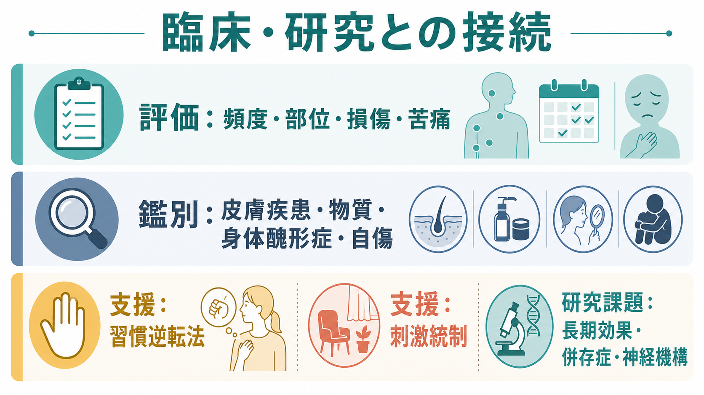
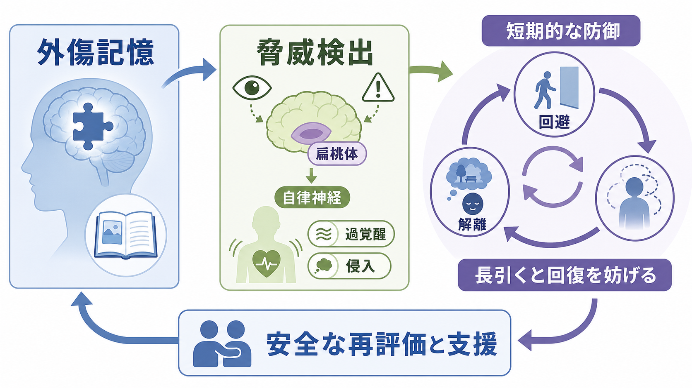
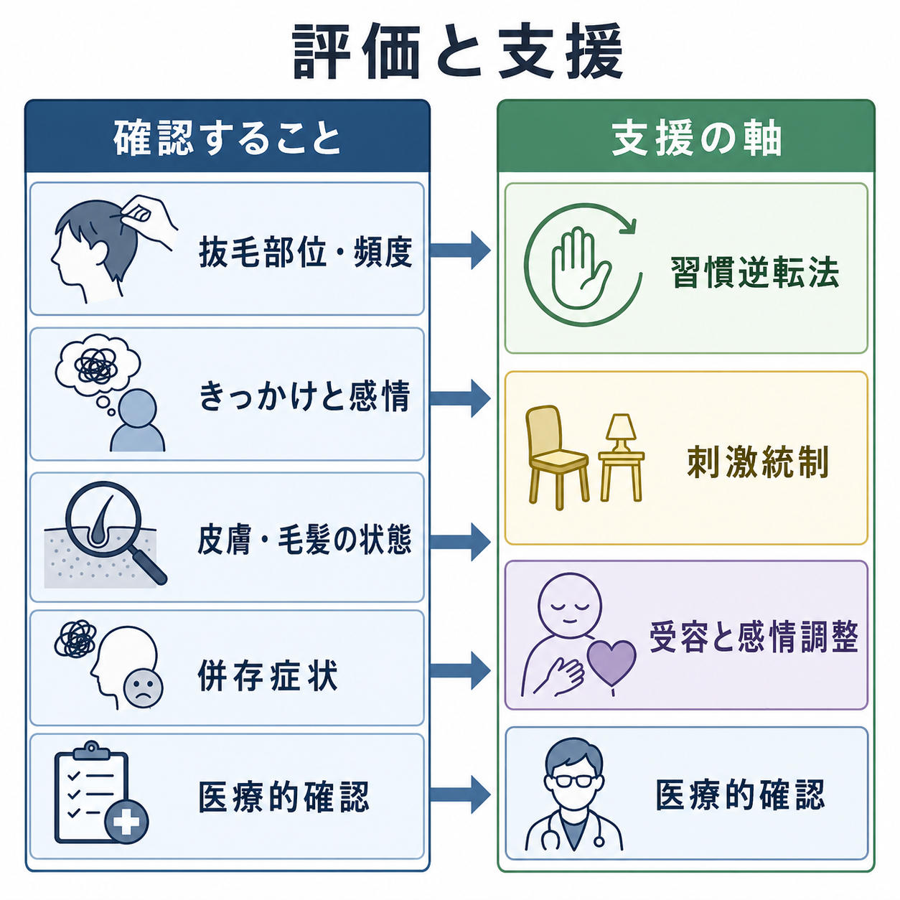

# 抜毛症とは何か

## 要点

- 抜毛症は、自分の毛を反復的に抜き、その結果として毛髪喪失、苦痛、生活上の支障が生じる状態である。
- DSM-5-TR では強迫症および関連症群、ICD-11 では身体集中反復行動症群の一つとして位置づけられる[1][2]。
- 抜毛の直前に緊張・違和感が高まり、抜いた直後に安堵や快感が生じることがある。ただし、この体験はすべての人に必須ではない[3]。
- 中核的には「悪い癖」ではなく、感覚、情動、注意、習慣学習、回避・安堵が結びついた反復行動として理解する。
- 支援では、気づきの訓練、代替行動、刺激統制を含む習慣逆転法が中心的なエビデンスをもつ[4][5]。

## この記事で答える問い

この記事では、抜毛症を「毛を抜く行動」だけでなく、「なぜその行動が続くのか」という機能から整理する。特に、緊張・不快感が抜毛によって一時的に下がると、行動が短期的には役立ってしまい、長期的には毛髪喪失、回避、恥、自己評価の低下につながる、という循環に注目する。

## まず結論

抜毛症とは、反復的な抜毛が本人の意思だけでは止めにくくなり、毛髪喪失や生活上の支障を伴う状態である。DSM-5-TR の診断基準では、反復的な抜毛、抜毛を減らそうとする試み、臨床的に意味のある苦痛または機能障害、医学的疾患や他の精神疾患ではよりよく説明されないことが重視される[1]。ICD-11 でも、抜毛が身体集中反復行動の一型として整理され、頭髪、眉毛、まつ毛など毛が生える部位で起こりうるとされる[2]。

重要なのは、抜毛症を「単なる意志の弱さ」と見ないことである。抜毛は、緊張、不快な身体感覚、退屈、不安、怒り、考えごと、特定の毛の触感などをきっかけに起こり、抜いた直後の安堵や快感によって強化されることがある[6]。そのため支援では、叱責や根性論よりも、行動の前後関係を観察し、抜毛が起きにくい条件を作り、代替行動を練習することが重要になる。

## 背景

抜毛症は、医学史上は古くから記述されてきたが、DSM-III-R 以降に精神医学的診断として整理され、DSM-5 以降は強迫症および関連症群に含められている[6]。ただし、強迫症と完全に同じ仕組みで説明できるわけではない。強迫症では侵入思考や強迫観念への反応として儀式行為が起こることが多いのに対し、抜毛症では身体感覚、触覚的な違和感、退屈、情動の高まり、半自動的な手の動きが目立つことがある[6]。

有病率の推定には研究間のばらつきがあるが、DSM 基準を満たす抜毛症は人口の約 1% 程度、より広い抜毛行動はそれより高頻度にみられるとするメタ分析がある[7]。発症は小児期から青年期に多く、症状は軽快と増悪を繰り返しながら慢性化することがある[6]。

関連して理解したい領域には、[[うつ病とは何か]]、不安症、強迫症、身体集中反復行動、皮膚科的脱毛症がある。抜毛症では抑うつや不安が併存することもあるが、気分症状があるから抜毛症ではない、あるいは抜毛があるから必ず重い精神疾患である、とはいえない。

## 基本概念

### 何が「症状」になるのか

抜毛症で問題になるのは、毛を触ることや一時的に数本抜くことではない。反復的な抜毛があり、本人が減らそうとしても難しく、毛髪喪失、苦痛、社会・学業・職業・家庭生活への支障につながるときに、臨床的な評価対象になる[1][2]。

抜毛部位は頭髪に限られない。眉毛、まつ毛、ひげ、体毛など、毛が生える部位で起こりうる[2][6]。抜いた毛を観察する、根元を確認する、口に入れる、飲み込むといった関連行動を伴うこともある。毛を飲み込む場合は、まれに胃腸内の毛塊など身体的リスクが問題になるため、医療的確認が必要になる[6]。

### 意識的な抜毛と自動的な抜毛

抜毛には、大きく分けて「焦点化された抜毛」と「自動的な抜毛」がある。焦点化された抜毛では、特定の毛を探す、違和感のある毛を選ぶ、緊張を下げるために抜く、といった目的性が比較的はっきりしている。自動的な抜毛では、読書、スマートフォン、学習、動画視聴、考えごとの最中に、気づかないうちに手が毛に伸びる[6]。

この違いは支援に直結する。焦点化された抜毛では、感情や身体感覚への対処を増やす必要がある。自動的な抜毛では、手の位置、鏡、ピンセット、寝室や机など、環境と動作の連鎖に介入する必要がある。

## 仕組み

抜毛症の仕組みは、単一の原因ではなく、複数の層で考えると理解しやすい。

第一に、抜毛は短期的な情動調整として働くことがある。緊張、むずむず感、退屈、不安、いらだちが高まったとき、抜毛によって一時的な安堵や快感が起こる。この安堵が強化子になり、次に似た状況が来たときにも同じ行動が出やすくなる。これは「負の強化」の典型であり、不快感を下げる行動ほど残りやすい[3][6]。

第二に、習慣学習として固定される。抜毛の前には、手を頭に近づける、毛を探す、毛の質感を確認する、抜く、確認する、隠す、という一連の行動連鎖がある。繰り返されるほど、この連鎖は意識的判断を経ずに起こりやすくなる。

第三に、回避と恥の循環が加わる。毛髪喪失を隠すために外出、対人場面、美容室、写真撮影を避けると、短期的には不安が下がる。しかし長期的には生活範囲が狭まり、自己批判や孤立が強まり、抜毛の引き金が増えることがある。

## 図解

上の図は、抜毛症を「きっかけ、緊張、抜毛、安堵、行動の残りやすさ」という循環として示している。ここで大切なのは、抜毛が本人にとって短期的には何らかの機能を持っている点である。したがって、支援では「抜かないで」と言うだけでは足りない。

行動療法では、まず抜毛の直前に起こる状況、感覚、姿勢、手の動きを観察する。次に、抜毛と両立しない代替行動を入れる。たとえば、手を握る、手元に別の物を持つ、腕を下ろす、髪に触りにくい姿勢を作る、鏡やピンセットとの距離を調整する、といった方法である。これらは本人の努力を増やすというより、行動が起こる条件そのものを変える介入である。

## 臨床・研究との接続

### 評価

評価では、抜毛の有無だけでなく、部位、頻度、時間帯、状況、情動、身体感覚、道具の使用、抜いた毛をどう扱うか、皮膚や毛髪の状態、生活支障を確認する。皮膚科的疾患、薬剤・物質、身体醜形症的な外見へのとらわれ、精神病症状に基づく抜毛、発達早期からの常同運動などとの鑑別も必要になる[1][2]。

医療・心理支援の文脈では、抜毛を本人の人格や道徳の問題として扱わない。教育・研究目的の整理としては、抜毛症は「行動の反復性」「制御困難」「苦痛・機能障害」「鑑別」の四点から評価すると見通しがよい。

### 支援

心理療法では、習慣逆転法を含む行動療法が最も一貫したエビデンスをもつ。2014 年のメタ分析では行動療法が大きな効果を示し、2020 年の更新メタ分析でも、習慣逆転法の要素を含む行動療法が最も強い根拠をもつ介入として示された[4][5]。

薬物療法については、N-アセチルシステイン、クロミプラミン、オランザピンなどで有効性を示した試験がある一方、研究数やサンプルサイズ、年齢層、再発予防の検討には限界がある[5][8]。したがって、薬物を「標準的に誰にでも効く解決策」として説明するのは避け、症状の重さ、併存症、身体的リスク、本人の希望を踏まえて専門家が検討するものとして位置づける。

## よくある誤解

### 「ただの癖」ではない

抜毛症は習慣的な動作を含むが、苦痛や生活支障を伴う場合は臨床的な問題になる。癖という言葉だけで説明すると、本人が「やめられない自分が悪い」と受け取りやすく、支援につながりにくい。

### 「緊張緩和がなければ抜毛症ではない」わけではない

かつての診断枠組みでは、抜毛前の緊張や抜毛後の快感・安堵が強調された。しかし DSM-5 に向けた検討では、こうした体験は多くの人にみられる一方で普遍的ではないため、必須基準からは外された[3]。緊張緩和は重要な理解枠組みだが、診断の絶対条件ではない。

### 「強迫症と同じ治療でよい」とは限らない

抜毛症は DSM-5-TR では強迫症および関連症群に含まれるが、強迫症と同じ介入だけで考えるとずれることがある。抜毛症では、習慣逆転法、刺激統制、感情調整、受容に基づく介入が重視される[4][6]。

### 「見た目の問題だけ」ではない

毛髪喪失は外見上の問題として現れるが、その背景には緊張調整、自己批判、回避、対人不安、身体的合併症の可能性がある。見た目だけを直すのではなく、抜毛が起こる条件と、その後の生活支障を一緒に見る必要がある。

## 関連ノート

- [[うつ病とは何か]]：抜毛症に併存しうる抑うつ、自己批判、活動低下を理解するための関連ノート。
- [[気分障害における自殺リスクとは何か]]：羞恥、孤立、併存する気分症状が強い場合に参照したい関連ノート。
- [[統合失調症とは何か]]：妄想や幻聴に反応した抜毛との鑑別を考えるときの関連ノート。
- 今後の作成候補：強迫症とは何か、身体集中反復行動とは何か、皮膚むしり症とは何か、習慣逆転法とは何か、身体醜形症とは何か。

## 理解チェック

1. 抜毛症では、どのような条件がそろうと臨床的な評価対象になるか。
2. 抜毛前の緊張や抜毛後の安堵は、なぜ行動を残りやすくするのか。
3. 焦点化された抜毛と自動的な抜毛では、支援の焦点がどう変わるか。
4. 抜毛症を「強迫症と同じ」と考えすぎると、どのような見落としが起こりうるか。
5. 習慣逆転法では、本人の意志力ではなく何を変えようとするのか。

## 未解決問題

- 抜毛症の神経生物学的機序は、前頭線条体系、習慣学習、報酬処理、感覚処理の関与が示唆されるが、決定的なモデルはまだ確立していない。
- 小児・青年、成人、併存症をもつ人で、どの介入要素がどの程度有効かはさらに検討が必要である。
- 薬物療法は有望な候補がある一方、第一選択として広く確立した薬剤はなく、長期効果や再発予防の研究が不足している。
- 日本語圏での疫学、受診行動、スティグマ、学校・職場での支援に関する研究蓄積が必要である。

## 参考文献

[1] American Psychiatric Association. (2022). *Diagnostic and Statistical Manual of Mental Disorders, Fifth Edition, Text Revision (DSM-5-TR).* American Psychiatric Association Publishing. https://doi.org/10.1176/appi.books.9780890425787

[2] World Health Organization. (2026). *ICD-11 for Mortality and Morbidity Statistics: 6B25.0 Trichotillomania.* https://icd.who.int/browse/latest-release/mms/en#1253999657

[3] Lochner, C., Grant, J. E., Odlaug, B. L., Woods, D. W., Keuthen, N. J., & Stein, D. J. (2012). DSM-5 field survey: Hair-pulling disorder (trichotillomania). *Depression and Anxiety, 29*(12), 1025-1031. https://doi.org/10.1002/da.22011

[4] McGuire, J. F., Ung, D., Selles, R. R., Rahman, O., Lewin, A. B., Murphy, T. K., & Storch, E. A. (2014). Treating trichotillomania: A meta-analysis of treatment effects and moderators for behavior therapy and serotonin reuptake inhibitors. *Journal of Psychiatric Research, 58*, 76-83. https://doi.org/10.1016/j.jpsychires.2014.07.015

[5] Farhat, L. C., Olfson, E., Nasir, M., Levine, J. L. S., Li, F., Miguel, E. C., & Bloch, M. H. (2020). Pharmacological and behavioral treatment for trichotillomania: An updated systematic review with meta-analysis. *Depression and Anxiety, 37*(8), 715-727. https://doi.org/10.1002/da.23028

[6] Grant, J. E., & Chamberlain, S. R. (2016). Trichotillomania. *American Journal of Psychiatry, 173*(9), 868-874. https://doi.org/10.1176/appi.ajp.2016.15111432

[7] Thomson, H. A., Farhat, L. C., Olfson, E., Levine, J. L. S., & Bloch, M. H. (2022). Prevalence and gender distribution of trichotillomania: A systematic review and meta-analysis. *Journal of Psychiatric Research, 153*, 73-81. https://doi.org/10.1016/j.jpsychires.2022.06.058

[8] Hoffman, J., Williams, T., Rothbart, R., Ipser, J. C., Fineberg, N., Chamberlain, S. R., & Stein, D. J. (2021). Pharmacotherapy for trichotillomania. *Cochrane Database of Systematic Reviews, 2021*(9), CD007662. https://doi.org/10.1002/14651858.CD007662.pub3
